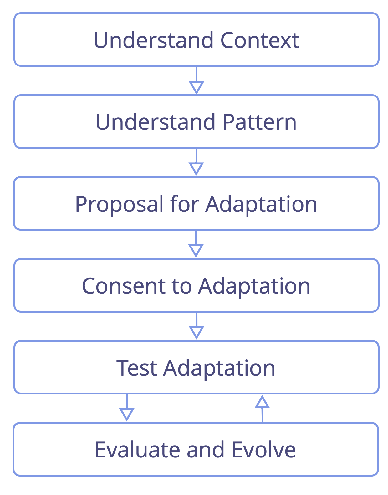

<strong>Anpassa och utveckla mönstren i S3 så att de passar de speciella förhållandena.</strong>

Säkra att alla som påverkas:

- förstår varför en ändring av mönstret behövs (eller är bra)
- är närvarande eller representerade när beslutet om hur ett mönster skall ändras
- använder principer från S3 som riktlinjer för anpassningen

Genomför experiment med anpassningarna tillräckligt länge för att upptäcka fördelar och eventuella fallgropar.

Dela värdefulla anpassningar med S3-gemenskapen.

<a href="bringing-in-s3.html" title="Upp: Börja använda S3">▲</a> <a href="create-a-pull-system-for-organizational-change.html" title="Läs vidare: Skapa ett flödebaserat system för organisatorisk förändring">▶ Läs vidare: Skapa ett flödebaserat system för organisatorisk förändring</a>

