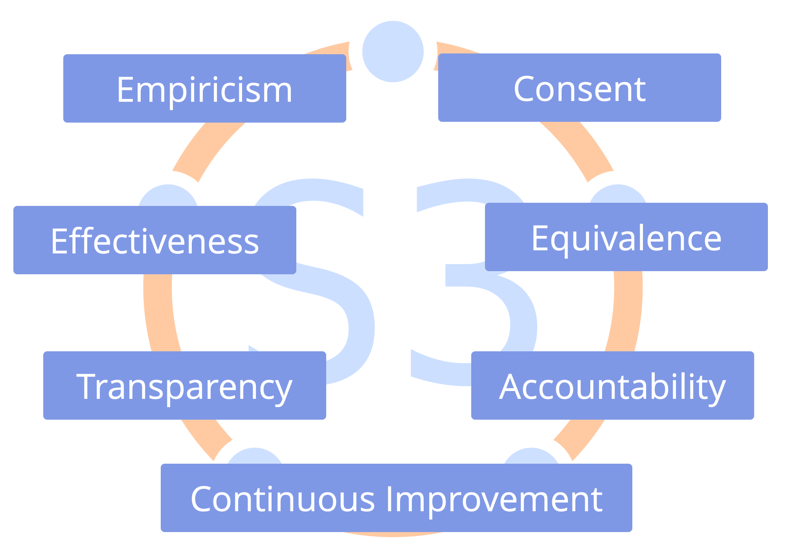

<strong>Ensa samarbetsformerna med De Sju Principerna.</strong>

Att anta De Sju Principerna minskar behovet av uttryckliga överenskommelser, och vägleder anpassningen av S3-mönster för att passa organisationens situation.

En organisations värderingar måste omfatta De Sju Principerna.

<a href="artful-participation.html" title="Tillbaka till: Skickligt deltagande">◀</a> <a href="enablers-of-collaboration.html" title="Upp: Främja samarbete">▲</a> <a href="agree-on-values.html" title="Läs vidare: Enas om värderingar">▶ Läs vidare: Enas om värderingar</a>

