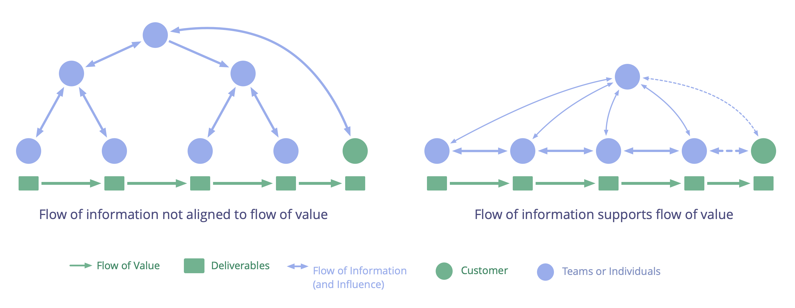

För att stödja ett kontinuerligt värdeflöde, flytta beslutsfattandet nära där värdet skapas, och anpassa informationsflödet efter det.

**Värdeflöde:** Leverabler som rör sig genom en organisation mot kunder eller andra intressenter.

Sträva efter, och upprätthåll, ensade flöden genom att ständigt utveckla och förädla organisationens samlade <a href="glossary.html#entry-agreement" class="glossary-tooltip" data-toggle="tooltip" title="Överenskommelse: En överenskommen inriktning, process, förhållningssätt eller policy som skapats för att vägleda värdeflödet.">överenskommelser</a>:

-   Säkra att alla beslut som påverkar värdeflödet faktiskt stöder värdeflödet.
-   Möjliggör att personer med relevant kompetens och kunskap kan påverka beslut.
-   Gör all användbar information tillgänglig.
-   Sikta på snabbare återkoppling för att förstärka lärandet.

När beslut tas nära där värde skapas, och informationsflödet stödjer det kontinuerliga och stadiga flödet av värde, minskar risken för spill och slöseri.

