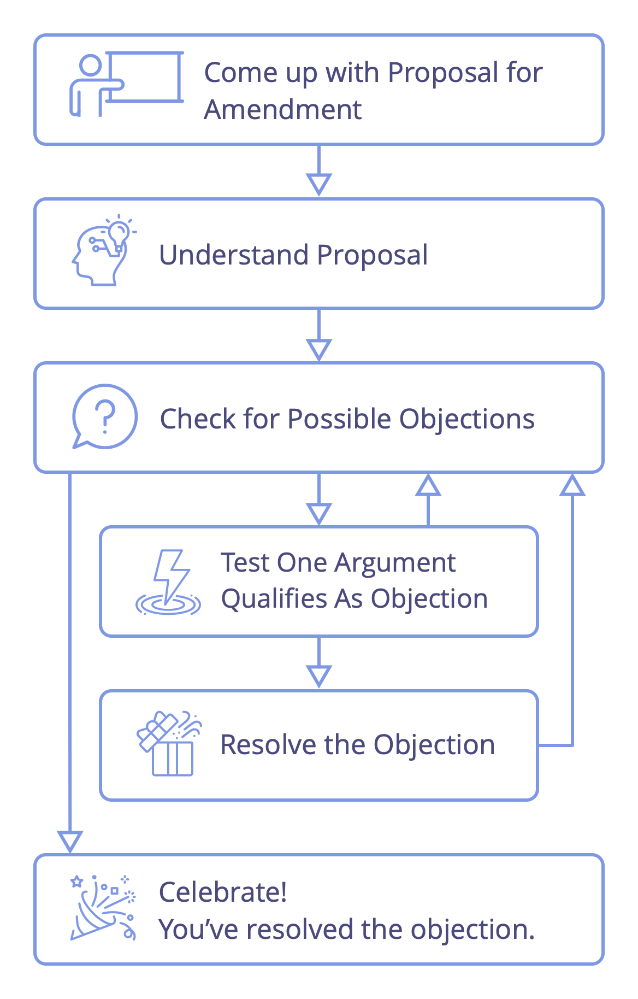
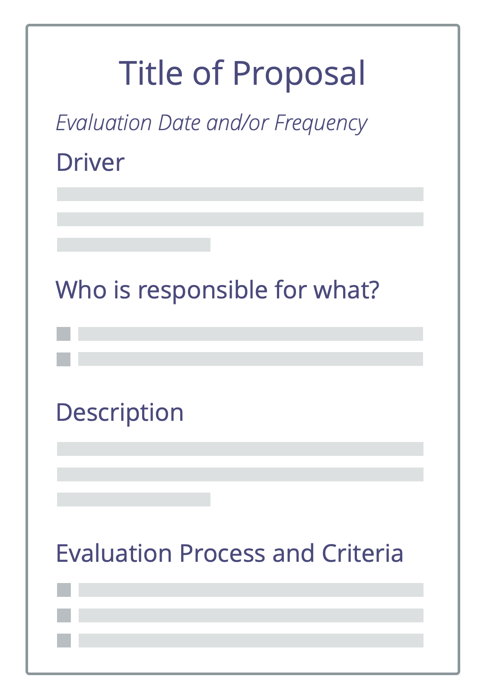
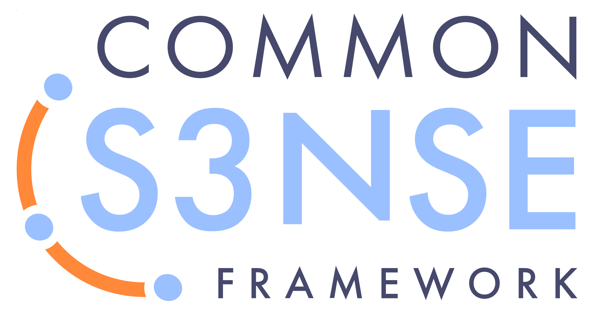
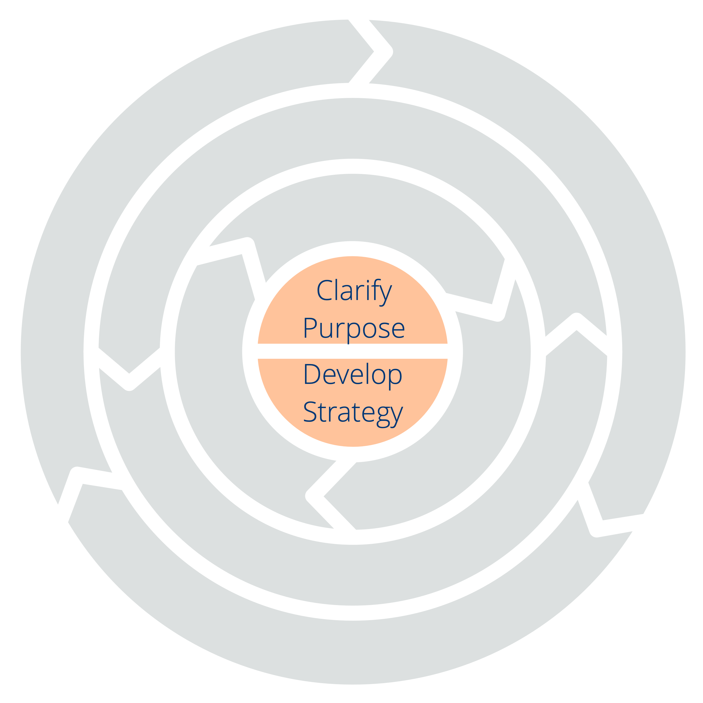
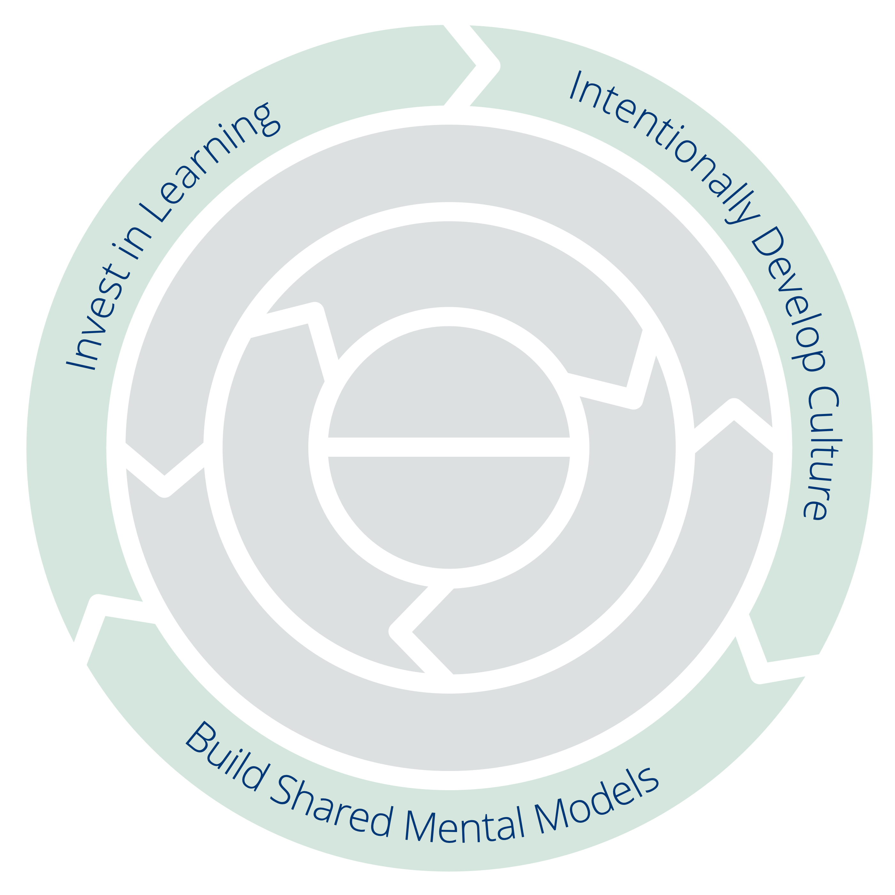
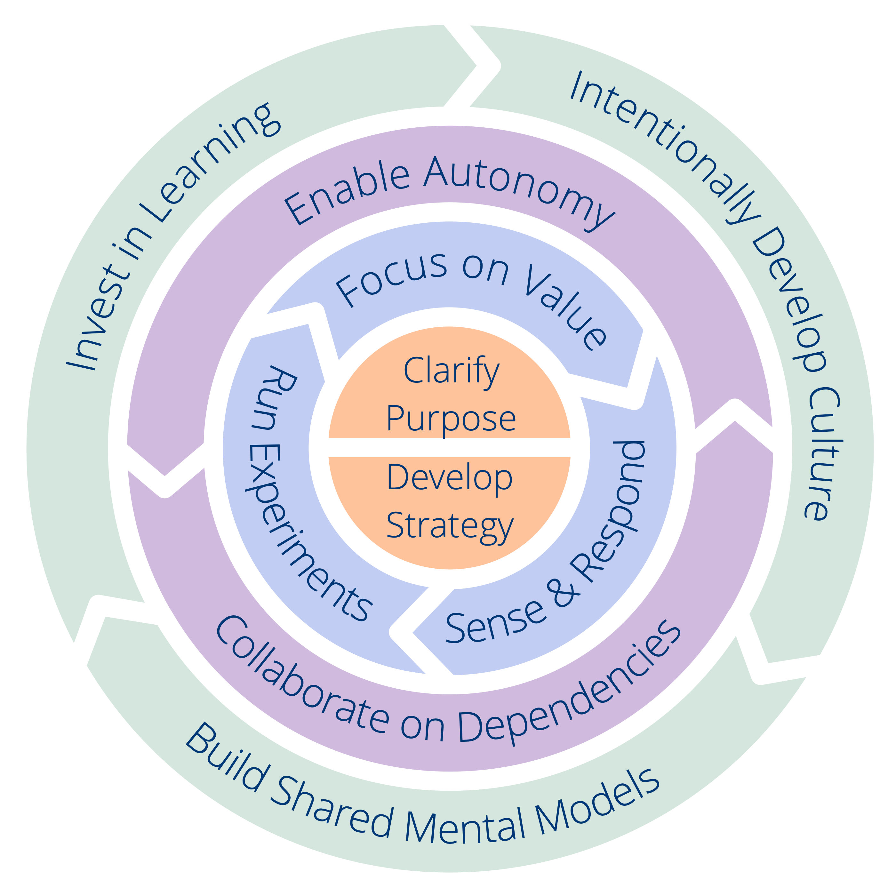

## Vad är Sociokrati 3.0?

Sociokrati 3.0 — också kallat "S3" — är en <a href="#" class="tooltip" title="Social Technology: Social technology is any process, technique, method, skill or any other approach that people can use to influence social systems — organizations, societies, communities etc. — to support achieving shared objectives and guide meaningful interaction and exchange.">social teknologi</a> för att utveckla lättrörliga och motståndskraftiga organisationer i alla storlekar, från små nystartade företag till stora internationella nätverk och samarbeten mellan många myndigheter.

Denna praktiska guide innehåller en omfattande samling av beprövade och testade **koncept, principer och metoder för att förbättra prestanda, engagemang och välbefinnande** i organisationer.

Sedan starten 2015 har mönster från S3 hjälpt människor i en rad olika organisatoriska sammanhang att få ut det bästa av samarbete. Från nystartade företag till små och medelstora företag, stora internationella organisationer, investerarfinansierade och ideella organisationer, familjer och samhällen.

Att använda S3 kan **hjälpa dig att uppnå dina mål** och framgångsrikt navigera i komplexa omständigheter. Du kan göra ändringar ett steg i taget, **utan att behöva en plötslig, radikal, omorganisation** eller planera ett långsiktigt förändringsinitiativ:

-   Börja helt enkelt med att identifiera de områden där det finns störst behov och välj en eller flera metoder eller riktlinjer som hjälper.
-   Gå fram i egen takt och utveckla färdigheter och kompetenser på vägen.

**Oavsett din position i organisationen** finns det många beprövade idéer som är relevanta och användbara för dig.

**Sociocracy 3.0 är gratis och helt fritt att använda**, och licensierat under Creative Commons Free Culture License.

### Hur kan Sociocracy 3.0 hjälpa?

S3 är en transformationsteknik för både individer och hela organisationer som hjälper till att förstå hur man kan möta organisationens största utmaningar, dra nytta av de möjligheter man står inför och lösa de mest svårlösta problemen.

Sociokrati 3.0 är utformad för att vara flexibel och stöder experimenterande och lärande. Man kan använda det som behövs, anpassa saker för att passa sammanhanget och berika den befintliga strategin.

S3 integrerar grundläggande koncept och metoder som finns i agila metoder, lean management, Kanban (och KMM), Design Thinking, Teal Organizations och familjen av sociokrati-baserade styrningsmetoder (SCM/Dynamic Governance, Holacracy® etc.). Den kompleterar och är kompatibel med alla ramverk ur Agile och Lean, inklusive men inte begränsat till Scrum och dess olika ramverk för skalning.

### Ett mönsterbaserat tillvägagångssätt för organisatorisk förändring

S3 erbjuder ett mönsterbaserat tillvägagångssätt för organisatorisk förändring.

Ett **mönster** är en process, praxis eller riktlinje som fungerar som en mall för att framgångsrikt agera på en viss typ av utmaning eller möjlighet. S3-mönster upptäcks genom att observera människor som arbetar tillsammans i olika organisationer för att lösa problem och agera på de möjligheter de möter. När man upptäcker att det invanda sättet att göra saker inte ger förväntat eller önskat resultat kan man ofta hitta S3-mönster hjälper.

Mönster är modulära och anpassningsbara, kan användas självständigt, och är ömsesidigt förstärkande och kompletterar varandra när de används i kombination. S3-mönster kan förfinas och anpassas för att möta organisationens specifika behov.

I den här guiden grupperas mönstren efter ämne i tio kategorier för att lättare kunna identifiera vilka som är mest relevanta:

- Samskapande och utveckling
- Kollegial utveckling
- Möjliggörare för samarbete
- Bygga organisationer
- Föra in S3
- Definiera överenskommelser
- Fokuserade interaktioner
- Mötespraxis
- Organisera arbete
- Organisationsstruktur

Genom att tillhandahålla en meny med mönster att välja mellan efter behov, uppmuntrar S3 ett organiskt, **stegvist förhållningssätt till förändring utan en enorm initial investering**. Det möter människor där de är och hjälper dem att röra sig framåt och börja använda mönster i sin egen takt och enligt sitt unika sammanhang.

### Vad finns i den här guiden?

Denna praktiska guidebok innehåller:

-   Användbara koncept som hjälper dig **att förstå din organisation** och kommunicera precist om vilka förändringar som behövs.
-   En **organisk, iterativ strategi för att förändra** som möter människor där de är, hjälper dem att gå framåt i sin egen takt och utifrån deras unika sammanhang och behov.
-   **Sju kärnprinciper** för smidigt och sociokratiskt samarbete
-   En sammanhängande samling av **70+ metoder och riktlinjer** för att hjälpa dig att navigera i komplexa miljöer och förbättra samarbete:
    -   **Enkla, faciliterade format** som stöder team i att utnyttja gruppens kollektiva intelligens för att stegvis omforma tillgänglig information till en kontinuerlig förbättring av arbetsprocesser, produkter, tjänster och förmågor.
    -   **Gruppmetoder** som hjälper organisationer att använda begåvning som redan finns, genom att **personer stödjer varandra** i att bygga färdigheter, ansvarstagande och engagemang.
    -   Enkla **verktyg för att förtydliga vem som gör vad** som frigör människor att bestämma och agera självständigt så mycket som möjligt, inom tydligt definierade begränsningar som möjliggör experiment och utveckling.
    -   Mönster för att **odla organisationsstrukturer bortom hierarkier** till flexibla, decentraliserade nätverk där informationsflödet och påverkan direkt stöder skapandet av värde.
-   **Common Sense Framework**, ett verktyg för att förstå team och organisationer och inse hur man kommer igång med S3.
-   En **begreppslista** med förklaringar till alla termer som används inom S3.

Denna praktiska guide till Sociokrati 3.0 är skriven och publicerad av de tre medutvecklarna av Sociokrati 3.0.

Trogen tankesättet bakom S3, kommer denna bok alltid att vara ett pågående arbete som växer och förändras när vi lär oss av människor som experimenterar med S3 i organisationer runt om i världen. Sedan vi började för 5 år sedan har vi släppt flera uppdateringar per år och vi kommer att fortsätta göra det under de kommande åren.

Även om flera avsnitt i denna bok är korta och kanske inte färdigformulerade, så har innehåll och förklaringar har varit tillräckligt för många människor att komma igång med S3 och uppnå positiva förändringar i sina organisationer. Vi hoppas att du också kommer att tycka att det är användbart.

### Inspiration och historia bakom Sociokrati 3.0

Den bokstavliga innebörden av termen **sociokrati** är "kamraternas styre": *socio* - från latinets *socius* - som betyder "följeslagare", eller "vän", och suffixet *-cracy* - från den forntida grekiskans κρα<unk> τος (kra<unk> tos) - som betyder "makt" eller "styre".

Ordet sociokrati kan spåras tillbaka till 1851, när **Auguste Comte** föreslog att man skulle tillämpa ett vetenskapligt förhållningssätt till samhället: stater skulle styras av en grupp forskare som är experter på samhället (som han kallade "sociologer"). Enligt hans uppfattning skulle denna framtid, även om den ännu inte är genomförbar, vara oundviklig.

Några decennier senare använde **Lester Frank Ward** ordet sociokrati för att beskriva hur människor kunde styra baserat på sina relationer med varandra. I stället för att ha sociologer i centrum, ville han ge mer makt och ansvar till individen, han föreställde sig sociologer i en roll som forskare och konsulter.

År 1926 grundade den holländska reformisten och kväkaren **Kees Boeke**en internatskola baserad på principen om samtycke. Personal och studenter behandlades som likvärdiga deltagare i den strukturella styrningen av skolan, alla beslut var tvungna att vara acceptabla för alla. Han byggde denna version av sociokrati på kväkarnas principer och praxis, och beskrev sociokrati som en demokratiutveckling i sin essä "Demokrati som den kan vara" från 1945.

**Gerard Endenburg**, också en kväkare och en elev i Boekes skola, ville tillämpa sociokrati i sin familjs företag, Endenburg Elektrotechniek. Han skapade och utvecklade *Den Sociokratiska Cirkelmetoden (SCM)* (som senare blev "Sociocratic Method"), där han integrerade Boekes form av sociokrati med ingenjörskonst och cybernetik. 1978 grundade Endenburg Sociocratisch Centrum i Utrecht (som nu är Sociocratic Center i Rotterdam) som ett sätt att främja sociokrati i och utanför Nederländerna. Sedan 1994 är organisationer i Nederländerna som använder SCM undantagna från det rättsliga kravet att ha ett arbetarråd.

Under slutet av 1990-talet och början av 2000-talet stötte flera icke-holländsktalande på sociokratin, men det var inte förrän 2007 då **Sharon Villines och John Buck** släppte sin bok, "We the People", som sociokrati blev allmänt tillgänglig för den engelsktalande världen, och har därifrån börjat sprida sig till flera andra språk.

Sociokrati har visat sig vara kraftfullt för många organisationer och samhällen runt om i världen, men har ännu inte tagit fart fullt ut.

År 2014 samlades **James Priest och Bernhard Bockelbrink** för att tillsammans skapa en samling utbildningsresurser baserade på idéer från sociokrati, agilt och Lean under Creative Commons licensiering. De upptäckte att organisationer av alla storlekar behöver en flexibel meny av metoder och strukturer – lämpliga för deras specifika sammanhang – som gör det möjligt att utveckla ett socialt och agilt tänkesätt för att uppnå större effektivitet, samordning, tillfredsställelse och välbefinnande. Den första versionen av **Sociokrati 3.0.** lanserades i mars 2015.

**Liliana David** anslöt sig till teamet strax efter. Tillsammans arbetar de regelbundet för att göra S3 tillgängligt och tillämpligt för så många organisationer som möjligt, och tillhandahåller resurser under **Creative Commons Free Culture License** för människor som vill lära sig, tillämpa och berätta för andra om Sociokrati 3.0.

#### Sociokrati 3.0 - Rörelsen

Då intresse för Sociocracy 3.0. växer finns det en snabbt växande gemenskap av människor från en mängd olika bakgrunder - banbrytande konsulter, coacher, utbildande facilitatorer, och personer som tillämpar S3 i sina olika sammanhang — som delar uppskattning för transformationspotentialen i Sociocracy 3.0 som kan hjälpa organisationer och deras medlemmar att blomstra. Många är vänliga nog att gärna ägna en del av sin tid åt att experimentera med och dela med sig om S3, och en del samarbetar också för att lära av varandra och dokumentera erfarenheter för att vägleda den pågående utvecklingen och förfiningen av ramverket och dess olika tillämpningar.

### Why "3.0"?

Sociokrati som en form av styrning har funnits sedan 1851. Därefter har den utvecklats och anpassats av många olika personer och organisationer, bland annat Gerard Endenburg, The Sociocracy Group (TSG) och Brian Robertson (HolacracyOne).

Men utanför Nederländerna har sociokratin fram till nyligen varit i stort sett okänd.

Vi älskar sociokrati eftersom vi ser organisationer och deras medlemmar trivas när de använder delar av det för att berika eller förändra det de gör idag.

Vi älskar också Agile, Lean, Kanban, Core Protocol, icke-våldsligt språk och många andra idéer också. Vi tror att världen kommer att bli en bättre plats när allt fler organisationer lär sig att utnyttka det överflöd av fantastiska metoder som växer fram i världen idag, och lär sig att kombinera dem med det de redan kan.

Därför bestämde vi oss för att ägna en del av vår tid åt att utveckla och utveckla sociokratin, integrera den med många av dessa andra potenta idéer, för att göra den tillgänglig och tillämplig för så många organisationer som möjligt.

För detta ändamål inser vi värdet av en stark identitet, ett radikalt annorlunda sätt att sprida information, och att anpassa *Sociocratic Circle Organization Metod* för att förbättra dess tillämpbarhet.

#### Namnet

Namnet "*Sociokrati 3.0*" visar både på respekt för härstamningen och ett betydande steg framåt.

Det bidrar också till att undvika uppfattningen av vi förvanskar *Sociocratic Circle Organization Method* (SCM) så som den marknadsförs av The Sociocracy Group.

#### Ny modell för spridning

*Sociokrati 3.0* använder en icke-centraliserad modell för distribution. Detta är ett paradigmskifte i hur sociokrati kan föras ut till människor och organisationer, och en som många människor redan är vana vid.

Vi stöder "viral" spridning genom två viktiga strategier:

* **Sociokrati 3.0 är öppet:** Vi vill uppmuntra tillväxten av ett levande ekosystem av tillämpningar och smaker av sociokrati där människor delar och diskuterar sina insikter och de anpassningar de gör utifrån sitt specifika sammanhang. Därför lägger Sociokrati 3.0 tonvikten på att kommunicera de bakomliggande principerna och uppmanar uttryckligen alla människor att kreativt blanda, utöka och anpassa saker efter deras behov.
* **Sociokrati 3.0 är gratis:** För att förenkla för människor och organisationer att börja nyttja Sociokrati 3.0 tillhandahåller vi gratis material under *Creative Commons Free Culture License* för att alla skall kunna lära sig, praktisera och lära ut *Sociokrati 3.0*. Vem som helst får använda materialet utan uttryckligt tillstånd, även i kommersiella sammanhang, eller som grund för att skapa nytt material, så länge de delar dessa under samma licens. Vi förväntar oss och stödjer andra organisationer, konsulter, coacher, utbildare och utbildare att följa vårt exempel och göra sitt material tillgängligt också.

#### Utvecklingen av den sociokratiska cirkelorganisations-metoden

Vi känner att vi behöver vara tydliga med att Sociocracy 3.0 inte är specifikt inriktad på den existerande gemenskapen av människor som använder *Sociocratic Circle Organization Method*, eller mot The Sociocracy Group (TSG). *Sociocratic Circle Organization Method* (SCM) är redan väl utvecklad och många människor verkar vara mestadels nöjda med den.

Men våra personliga erfarenheter är att även för de organisationer som har hört talas om sociokrati finns det många hinder för att komma igång. Med *Sociocracy 3.0* försöker vi aktivt arbeta för att adressera och minimera de saker som står i vägen.

##### Minska risk och motstånd

*Sociocracy 3.0* möter organisationer där dom är och dem med på en resa av ständiga förbättringar. Det innebär ingen radikal förändring eller omorganisation. *Sociokrati 3.0* innehåller en samling oberoende och principiella mönster som en organisation kan utnyttja för att bli mer effektiv. Alla mönster bygger på en uppsättning grundläggande principer, och kan lätt anpassas till sammanhanget.

##### Att skifta fokus från mål (eller syfte) till behov

*Sociokrati 3.0* flyttar en organisations primära fokus från vision, uppdrag, mål eller syfte, mot källan till motivation, och anpassar organisationen till att upptäcka och ta itu med vad den behöver.  Organisationer som redan är behovsstyrda, värdedrivna eller kundcentrerade, finner detta naturligt att anamma.

##### Kondenserad till det väsentliga

Om man jämför verkar *Sociocratic Circle Organization Method* stor och omfattande. By focusing on the essentials only, *Sociocracy 3.0* offers a lightweight approach to adapt and build on as necessary.

Detta betyder inte att det är helt enkelt, att välja att börja med mönster från *Sociokrati 3.0s* kräver en investering i lärande och omtänk. Det är därför det är viktigt att börja med bara det som behövs, det är ingen idé att ändra på saker som redan är tillräckligt bra.

##### Integration med Agile och Lean

*Sociocratic Circle Organization Method* innehåller inget stöd för den operationella verksamheten eller för hur man skapar en kultur av nära samarbete. Många organisationer använder redan eller är intresserade av Lean och agilt tänkande för den operationella verksamheten och samarbete. Vi är övertygade om att det är bra, så *Sociokrati 3.0* är utformat för att lätt anammas i organisationer med Lean och/eller agilt som ambition eller arbetssätt.

##### Ett nytt sätt att utveckla organisationsstrukturer

Organisationsstrukturen enligt *Sociocratic Circle Organization Metod* modelleras efter en strikt hierarki av domäner. Vi ser allt fler miljöer av samarbete mellan flera intressenter och därmed ett ökat behov av ett bredare utbud av mönster för organisationsstrukturer. Organisationsstrukturen utvecklas naturligt när informationsflödet och inflytandet i en organisation stegvis anpassas till värdeflödet. *Sociokrati 3.0* möjliggör en mängd olika strukturella mönster som kan kombineras för att utveckla strukturen efter behov och på ett flexibelt sätt.

## De Sju Principerna

Sociocracy 3.0 is built on seven foundational principles which enable sociocratic and agile collaboration. Eftersom de sju principerna återspeglas i alla mönster, är det viktigt att förstå dessa principer för att införa, och av största vikt när man anpassar, mönster från Sociokrati 3.0.

Att utöva Sociokrati 3.0 hjälper människor att uppskatta det väsentliga värde som dessa principer ger – både för individer och organisationer – och stödjer deras integration i organisationskulturen.

**The Principle of Effectiveness:** Devote time only to what brings you closer toward achieving your objectives.

**The Principle of Consent:** Raise, seek out and resolve objections to decisions and actions.

**The Principle of Empiricism:** Test all assumptions you rely on, through experiments and continuous revision.

**The Principle of Continuous Improvement:** Change incrementally to accommodate steady empirical learning.

**The Principle of Equivalence:** Involve people in making and evolving decisions that affect them.

**The Principle of Transparency:** Record all information that is valuable for the organization, and make it accessible to everyone, unless there is a reason for confidentiality.

**The Principle of Accountability:** Respond when something is needed, do what you agreed to do, and take ownership for the course of the organization.

## Nyckelbegrepp för att förstå organisationer

Det här avsnittet beskriver följande nyckelbegrepp:

- Drivkraft
- Domän
- Överenskommelse
- Invändning
- Strukturell styrning och operationell verksamhet

Här beskrivs också hur dessa begrepp förhåller sig till värde (och spill), delegering (och ansvarsskyldighet), självorganisering, självstyre och halv-autonomi.

När man förstår dessa begrepp, ger det ett gemensamt språk för att tydligt beskriva vad som händer i organisationen. Detta bidrar till att öka den delade förståelsen och möjliggör en konstruktiv dialog om vad som behöver göras.

Slå upp begrepp du inte kan förklara i begreppslistan i slutet.

### Drivkrafter

_A **driver** is a person’s or a group's motive for responding to a specific situation._

Drivkrafter:

- kan användas för att härleda mål, målsättningar, uppdrag, vision, syfte
- kan ändras över tid

#### Drivkrafter, värde och spill

_**Value** is the importance, worth or usefulness of something in relation to a driver._

_**Waste** is anything unnecessary for — or standing in the way of — a (more) effective response to a driver._

Genom att anamma begreppen värde och spill, kan många metoder och idéer från **lean production** och **lean software development** användas av organisationer som börjar använda mönster från S3:

- värdeströmskartläggning
- olika strategier för att eliminera spill
- Kanban-metoden

### Domän

_A **domain** is a distinct area of influence, activity and decision making within an organization._

För att bättre utnyttja den begränsade mängd tid, energi och resurser som finns, fördela arbetetet mellan personer i organisationen genom att skapa roller eller forma team, enheter eller avdelningar. Samtidigt kommer dom att, explicit eller implicit, definiera domäner - distinkta områden med ansvar och självbestämmande. Alla domäner existerar inom den övergripande domänen för en organisation och kan överlappa och/eller vara helt inneslutna inom andra domäner.

Varje roll eller grupps syfte är att bidra till det övergripande syftet med organisationen genom att ta hand om ett specifikt organisatoriskt behov. Otillräckligt definierade domäner leder typiskt till att intressenter har olika antaganden om ansvarsområden och autonomi. Som en följd av detta uppstår brister i både samarbete och arbetsfördelning på grund av att man missar beroenden, gör dubbelt arbete eller att inget arbete utförs alls.

Förtydliga och utveckla domäner/0> gör kontraktet mellan *delegatorn* (som delegerar ansvar för en domän) och *delegaten* (den som domänen är delegerad till) uttrycklig, vilket gör det möjligt för alla att lära sig om vad som fungerar och vad som inte fungerar, och att förstå vem som är ansvarig för vad. En tydlig domänbeskrivning med en rimlig detaljrikedom är en nödvändig förutsättning för att människor framgångsrikt ska kunna utvärdera och kontinuerligt förbättra sitt arbete.
 

#### Utvärdera och utveckla domäner regelbundet

Människors förståelse för sin organisation är alltid begränsad och miljön förändras alltid. Därför är det viktigt att delegatorn, delegaten och andra relevanta intressenter regelbundet tar sig tid att utvärdera och utveckla både utformningen av domänen och hur människor ansvarar för den allt eftersom deras förståelse av domänen fördjupas.

Människor kan ansvara för en domän på ett bra sätt på det sätt som domänen är utformad, men utformningen av den kan vara primitiv eller bristfällig. Å andra sidan, även om utformningen av en domän är dålig i den första iterationen, genom denna process kommer den att förbättras med tiden.

#### Delegerat ansvar för domäner

_Delegation is the grant of authority by one party (the _delegator_) to another (the _delegatee_) to account for a domain (i.e. to do certain things and/or to make certain decisions),for which the delegator maintains overall accountability._

Ansvaret för domäner är delegerat till grupper eller individer, som sedan agerar inom de definierade avgränsningarna avseende självständighet och påverkan.

När en domän delegeras till en grupp människor blir de ett <a href="#" class="tooltip" title="Team: A group of people collaborating toward a shared driver (or objective). Typically a team is part of an organization, or it is formed as a collaboration of several organizations.">team</a>, när det delegeras till en individ blir den en <a href="#" class="tooltip" title="Role Keeper: An individual taking responsibility for a role.">rollinnehavare</a>.

Delegaten(erna) kan göra det som de tror kommer att hjälpa dem att uppnå sitt syfte, om det inte är utanför domänen för organisationen, explicit förbjudet, de bryter mot någon annans (explicita) domän, eller hindrar andra människor att bidra till organisationen på något annat sätt.

**Obs:** *Saker som är förbjudna inkluderar uttryckliga begränsningar som anges i domänbeskrivningen, andra överenskommelser delegaten(s) måste hålla, såväl som rättsliga och regulatoriska krav.*

<a href="#" class="tooltip" title="Delegator: An individual or group delegating responsibility for a domain to other(s).">Delegatorn</a> har fortfarande det övergripande ansvaret för domänen, allokerar **resurser** och definierar ofta:

- **organisatoriska behov** domänen är utformad för att agera på
- **huvudsakligt ansvar** (viktiga resultat och leverabler, eventuella kritiska risker att hantera, annat viktigt arbete och vilket beslutsfattande som delegerats)
- **begränsningar i autonomi och inflytande** för dem som domänen är delegerad till (delegaterna), vanligtvis i förhållande till organisationen själv (beroenden, delegatorns medverkan, rapportering etc.)

#### Drivkrafter och domäner

Det är också möjligt att förstå en domän i förhållande till organisatoriska drivkrafter:

- domänens **primära drivkraft** - den huvudsakliga drivkraften delegaten/delegaterna svarar på
- den uppsättning av sekundära drivkrafter organisationen kan dra nytta av att ta itu med samtidigt som man agerar på den primära drivkraften, vilket inkluderar: 
    - **nyckelansvar** (alla drivkrafter som följer direkt från domänens primära drivkraft)
    - **beroenden** och **externa begränsningar** (drivkrafter relaterade till andra domäner eller till miljön utanför organisationen) som begränsar delegaternas autonomi

### Invändningar

_An **objection** is an argument relating to a (proposed) agreement or activity that reveals unintended consequences you’d rather avoid, or that demonstrates worthwhile ways to improve._

Invändningar avslöjar information om (potentiella) **oavsiktliga konsekvenser**, eller om **värdefulla sätt att förbättra**.

Tänk på att undanhållna invändningar kan påverka personers, teams eller hela organisationens möjligheter att uppnå sina mål negativt.

Det är varje individs ansvar i en organisation att uttrycka sina potentiella invändningar mot förslag, beslut, befintliga <a href="#" class="tooltip" title="Överenskommelse: An agreed upon guideline, process, protocol or policy designed to guide the flow of value.">överenskommelser</a> eller aktiviteter.

De som ansvarar för en aktivitet eller (föreslaget) avtal, är ansvariga för att *överväga argument och ta itu med invändningar* som gjorts, det att bidrar till att uppnå organisationens mål.

När du utforskar potentiella invändningar, beakta:

- varför den <a href="#" class="tooltip" title="Avsedd effekt: The expected result of an agreement, action, project or strategy.">avsedda effekten</a> inte skulle uppnås (fullständigt): **verkan**
- varför det skulle vara slösaktigt att fortsätta som föreslagits (eller tidigare överenskommits): **ansträngning**
- negativa konsekvenser som något skulle kunna ha någon annanstans (i samma <a href="#" class="tooltip" title="Domän: A distinct area of influence, activity and decision making within an organization.">domän</a>, i den vidare organisationen, eller bortom): **biverkningar**

Den information som kommer fram vid invändningar kan användas för att förbättra:

-   pågående och planerade åtgärder
-   hur människor verkställer beslut
-   befintliga överenskommelser
-   förslag
-   delad förståelse för drivkrafter

Skapa en kultur där människor känner sig bekväma att visa på  *potentiella* invändningar när som helst, så att de utan oro kan fatta beslut som är *tillräckligt bra för tillfället och tillräckligt säkra för att prova*. Detta uppmuntrar till att utveckla en vana att prova i stället för att försöka förutse och redogöra för alla möjligheter i förväg.

Utnyttja en mångfald av perspektiv och var öppen för att utmana ditt eget, för att upptäcka när och vad som kan förändras, dra fördel av snabbare cykler, genomföra experiment och lära av resultaten på vägen.

#### Oro

**Alla argument som förs fram är inte invändningar. Skilj mellan invändningar, som alltid avslöjar användbar information, och andra argument som endast bygger på antaganden, personliga preferenser eller åsikter.**

_A **concern** is an assumption – or opinion – that doing something (even in the absence of objections) might stand in the way of (more) effective response to an organizational driver._

I _samtyckesbeslut_ kan oro indikera olika sätt att förfina överenskommelser (inklusive utvärderingskriterier och utvärderingsfrekvens). Ta upp din oro om du tycker att det är värdefullt att överväga den, och registrera åtminstone den tillsammans med överenskommelsen, och övervaka resultaten över tid.

Om du är osäker på om du har en invändning eller en oro, var proaktiv och fråga andra för att se vad de anser. (Se också _Kontrollera om argument är invändningar_).

### Överenskommelser

_An **agreement** is an agreed upon guideline, process, protocol or policy designed to guide the flow of value._

Samsyn om riktlinjer om varför, hur och när man ska agera, och vad som särskilt krävs, möjliggör ett effektivt samarbete.

Överenskommelser skapas som ett sätt att agera på <a href="#" class="tooltip" title="Organizational Driver: A driver is a person’s or a group&#x27;s motive for responding to a specific situation. A driver is considered an **organizational driver** if responding to it would help the organization generate value, eliminate waste or avoid unintended consequences.">organisatoriska drivkrafter</a>, ska **utvärderas regelbundet**, och förfinas vid behov.

**Övergripande redovisningsansvar** för överenskommelser ligger hos de människor som gör dem.

En överenskommelse kan innehålla **delegering av särskilda ansvarsområden** till personer eller grupper.

### Strukturell styrning och operationell verksamhet

S3 strävar efter att möjliggöra produktivitet genom att låta människor att göra och bestämma så mycket som möjligt för sig själva, samtidigt som man säkerställer samstämmighet i samverkan för en framgångsrik och effektiv organisation.

Större självständighet för individer och team kräver tydliga överenskommelser (dvs. riktlinjer och begränsningar) som möjliggör ett smidigt samarbete mellan dessa team och personer, och som stöder uppnåendet av både långsiktiga och kortsiktiga mål. Regelbunden och återkommande granskning och successiv utveckling av överenskommelser säkrar att de förblir lämpliga för ändamålet.

Medan ett beslut med kortsiktig och liten påverkan kan lätt ändras spontant, tjänar överenskommelser med större påverkan och som begränsar människors beteende och aktivitet, ofta på ett större deltagande och en tydlig _beslutsprocess_.

Such agreements need to be documented, both to remember them and to support effective _review_, and to be communicated to people affected (who are ideally also _involved in the creation and evolution_ of those agreements).

Därför är det värdefullt att skilja mellan två kategorier av aktiviteter i en organisation, en av dem kallar vi strukturell styrning och den andra operationell verksamhet:

_**Governance** in an organization (or a domain within it) is the process of setting objectives and making and evolving decisions that guide people towards achieving those objectives._

_**Operations** is doing the work and organizing day-to-day activities within the constraints defined through governance._

För varje domän i en organisation finns det ett *strukturellt styrande organ*: personer med mandat att ingå och utveckla överenskommelser som styr hur de människor som utför arbetet inom området skapar värde.

Det finns många sätt att fördela arbete och strukturell styrning. Ibland är det strukturellt styrande organet en enda person, t.ex. när det gäller en teamledare, och ibland är det en grupp människor, t.ex. – i en cirkel där alla cirkelmedlemmar delar ansvaret för den strukturella styrningen inom domänens begränsningar.

**Beslut om strukturell styrning** sätter begränsningar och vägleder framtida beslut i den operationella verksamheten.

Detta inkluderar:

- definiera domäner
- delegera inflytande till människor
- allokera resurser och kapacitet
- beskriva leverabler och prioritera leverans.

Beslut om strukturell styrning kan fattas när som helst och var som helst, inte bara vid ett specifikt möte, även om ett _återkommande möte där man ingår och förfinar överenskommelser_ ofta är en bra idé.

#### Relaterade begrepp

**Självstyrning:** People governing themselves within the constraints of a domain.

**Halv-autonomi:** The autonomy of people to decide for themselves how to create value, limited by the constraints of their domain, and by objections brought by the delegator, representatives, or others.

**Självorganisation:** Any activity or process through which people organize work. Self-organization happens within the constraints of a domain, but without the direct influence of  external agents. In any organization or team, self-organization co-exists with external influence (e.g. external objections or governance decisions that affect the domain).

Beroende på de begränsningar som delegatorn har satt upp har team mer eller mindre frihet att bedriva strukturell styrning och bestämma hur de organiserar sin operationella verksamhet, och är därför mer eller mindre självstyrande och självorganiserande.

## The Patterns

S3 erbjuder ett mönsterbaserat tillvägagångssätt för organisatorisk förändring.

_A **pattern** is a process, practice or guideline that serves as a template for successfully responding to a specific kind of challenge or opportunity._

Mönster är modulära och anpassningsbara, kan användas självständigt, och är ömsesidigt förstärkande och kompletterar varandra när de används i kombination. S3-mönster kan förfinas och anpassas för att möta organisationens specifika behov.

I den här guiden grupperas mönstren efter ämne i tio kategorier för att lättare kunna identifiera vilka som är mest relevanta:

- [Co-Creation and Evolution](co-creation-and-evolution.html)
- [Kollegial utveckling](peer-development.html)
- [Enablers of Collaboration](enablers-of-collaboration.html)
- [Bygga organisationer](building-organizations.html)
- [Bringing in S3](bringing-in-s3.html)
- [Definiera avtal](defining-agreements.html)
- [Fokuserade interaktioner](focused-interactions.html)
- [Mötespraxis](meeting-practices.html)
- [Organisera arbete](organizing-work.html)
- [Organisationsstruktur](organizational-structure.html)

### Co-Creation and Evolution

#### Agera på organisatoriska drivkrafter

<strong>Tydliggör organisatoriska drivkrafter (t.ex vad händer och vad behövs i relation till den organisatoriska drivkraften), och agera på lämpligt sätt.</strong>

Att agera på <a href="#" class="tooltip" title="Organizational Driver: A driver is a person’s or a group&#x27;s motive for responding to a specific situation. A driver is considered an **organizational driver** if responding to it would help the organization generate value, eliminate waste or avoid unintended consequences.">organisatoriska drivkrafter</a> innebär bland annat:

- direkta <a href="#" class="tooltip" title="Operations: Doing the work and organizing day-to-day activities within the constraints defined through governance.">åtgärder</a>
- organisera hur arbete kommer att utföras
- fatta beslut om strukturell styrning

Hur man beslutar att agera på en organisatorisk drivkraft bör alltid betraktas som ett experiment som ska utvärderas och förfinas över tid.

##### Kvalificera drivkrafter som organisatoriska drivkrafter

A driver is a person’s or a group's motive for responding to a specific situation. A driver is considered an **organizational driver** if responding to it would help the organization generate value, eliminate waste or avoid unintended consequences.

Ett enkelt sätt att avgöra om en drivkraft faller inom en organisations <a href="#" class="tooltip" title="Domän: A distinct area of influence, activity and decision making within an organization.">domän</a> är genom att kontrollera:

*Skulle det hjälpa organisationen om vi agerar på den här drivkraften? Eller skulle det leda till oönskade konsekvenser om vi inte gör det?*

#### Navigera via spänning

<strong>Var uppmärksam på spänningar som upplevs i organisationen, undersök deras orsak och vidarebefordra alla organisatoriska drivkrafter som upptäcks till personer som är ansvariga för den relevanta domänen.</strong>

En organisations **utmaningar och möjligheter** synliggörs genom att människor blir medvetna om orsakerna till de spänningar de upplever.

**Observera:** I detta sammanhang är en *spänning* en personlig upplevelse: ett symptom på dissonans mellan en persons uppfattning av en situation, och dennes förväntningar (eller preferenser).

För att **upptäcka drivkrafter** undersök vad som stimulerar spänningen och beskriv vad som händer och vad som behövs. En utredning eller diskussion avslöjar ibland missuppfattningar och spänningen försvinner.

#### Beskriv organisatoriska drivkrafter

<strong>Beskriv organisatoriska drivkrafter för att förstå, kommunicera och komma ihåg dem.</strong>

Att beskriva <a href="#" class="tooltip" title="Organizational Driver: A driver is a person’s or a group&#x27;s motive for responding to a specific situation. A driver is considered an **organizational driver** if responding to it would help the organization generate value, eliminate waste or avoid unintended consequences.">drivkrafter</a> kan göras av en grupp eller av en enstaka person. Beroende på deras perspektiv kan de bestämma sig för att beskriva en drivkraft som ett **problem** att lösa eller en **möjlighet** att utnyttja.

Ett enkelt sätt att beskriva en drivkraft är genom att förklara:

- **Vad händer ... :** 
    - **nuvarande situation**
    - **påverkan** som denna situation har på organisationen
- ...och **vad som behövs:** 
    - **behovet** som organisationen har i förhållande till denna situation
    - den **effekt** som ett åtgärdande av behovet kan få

Skapa en kort men allsidig sammanfattning som innehåller precis tillräckligt med information för att tydligt förmedla behovet av en åtgärd eller ett beslut.

Sikta på en eller två meningar, så att informationen är lätt att komma ihåg och bearbeta.

Förutom sammanfattningen kan fler detaljer om drivkraften registreras i loggboken.

##### Exempel:

> *"Köket är i oordning: det finns inga rena koppar, diskbänken är full av tallrikar och det går inte att bara snabbt ta en kopp kaffe och återgå till jobbet. Vi behöver köket i ett användbart skick så att vi kan fokusera på vårt arbete.*

##### 1. Nuvarande situation

> *"Köket är i oordning: det finns inga rena koppar, diskhon är full av tallrikar..."*

Beskriv den nuvarande situationen:

- Fånga kortfattat det väsentliga i det som händer och, om nödvändigt, i vilket sammanhang det inträffar.
- Var objektiv - beskriv observationer och undvik att värdera.

##### 2. Påverkan

> *"...det går inte att bara snabbt ta en fika och återgå till jobbet."*

Förklara hur organisationen påverkas av denna situation:

- Klargör **varför** situationen behöver uppmärksamhet: hur påverkar den organisationen?
- Var tydlig med om effekterna är verkliga eller förväntade.
- Förklara utmaningar, förluster, möjligheter eller vinster.

##### 3. Behov

> *"Vi behöver köket i ett användbart skick..."*

Förklara organisationens <a href="#" class="tooltip" title="Behov: The lack of something wanted or deemed necessary (a requirement).">behov</a> i förhållande till denna situation:

- En **organisations behov** kan vara vad som helst som ett team (eller person) behöver för att på ett effektivt sätt ansvara för en <a href="#" class="tooltip" title="Domän: A distinct area of influence, activity and decision making within an organization.">domän</a>.
- Var tydlig med vems behov det är ("vi behöver", "de behöver", "jag behöver").
- Om det finns oenighet om behovet kan det hjälpa att zooma ut från specifika lösningar och fokusera på vad organisationen saknar i denna situation.

##### 4. Effekt

> *"...så att vi kan fokusera på vårt arbete".*

Beskriv effekten av att ta hand om behovet:

- Förklara den <a href="#" class="tooltip" title="Avsedd effekt: The expected result of an agreement, action, project or strategy.">avsedda effekten</a>, potentiella fördelar eller möjligheter.
- Effekten kan vara uppenbar eller implicit, särskilt när påverkan av den nuvarande situationen redan har beskrivits.

##### Utvärdera drivkrafter

Se till att utvärdera drivkrafterna regelbundet, för att fördjupa förståelsen för vad som händer och behövs.

Värdefulla frågor vid en sådan utvärdering kan vara:

- Är beskrivningen av situationen (fortfarande) korrekt?
- Förknippar vi fortfarande samma behov med situationen?
- Ligger hanteringen av drivkraften fortfarande inom vår domän?
- Är drivkraften fortfarande relevant?

#### Samtyckesbeslut

<strong>En (faciliterad) grupprocess för beslutsfattande: välkomna invändningar, och överväg nyupptäckt information och kunskap för att ytterligare förädla förslag eller befintliga avtal.</strong>

Förslag blir <a href="#" class="tooltip" title="Överenskommelse: An agreed upon guideline, process, protocol or policy designed to guide the flow of value.">överenskommelser</a> när de anses *tillräckligt bra för tillfället och tillräckligt säkra för att provas* fram till nästa utvärdering.

Oupplösta <a href="#" class="tooltip" title="Invändning: An argument relating to a (proposed) agreement or activity that reveals unintended consequences you’d rather avoid, or that demonstrates worthwhile ways to improve.">invändningar</a> hindrar förslag från att bli överenskommelser.

Att undanhålla invändningar kan försvåra uppnåendet av syftet för ett team eller organisation.

##### Underförstådda regler vid samtyckesbeslut

1. I avsaknad av invändningar mot en överenskommelse har jag för avsikt att följa överenskommelsen efter bästa förmåga.
2. Jag kommer att dela invändningar när jag blir medveten om dem.

#### Kontrollera om argument är invändningar

**Utnyttja er begränsade tid och resurser klokt genom att kontrollera att argument kvalificerar som invändningar och agera bara på de som gör det.**

När någon väcker ett argument för att ändra något, kontrollera om argumentet avslöjar vilka oönskade konsekvenser som kommer – eller kan – uppstå om saker lämnas oförändrade, eller om det indikerar ett värdefullt sätt att förbättra hur man gör för att nå målsättningarna.

Utforska och förfina varje argument så som krävs för att identifiera eventuella missuppfattningar eller missförstånd, och för att eliminera aspekter av argumentet som endast bygger på antaganden, en personlig preferens eller åsikt. Om ni är överens om att det som återstår av argumentet kvalificerar sig som en invändning, gå då vidare med att _lösa invändningen_.

För att avgöra om ett argument kan anses vara en invändning, kan en facilitator fråga gruppen:

_"Tycker ni att detta argument kan betraktas som en invändning?"_

Om alla håller med, behandla argumentet som en invändning. Om det finns olika uppfattningar, bjud in till dialog för att se om det kan avslöja en invändning bakom argumentet.

##### Förstå invändningar

Några användbara frågor

-   Hur förhåller sig argumentet till detta specifika förslag eller överenskommelse?
-   Visar argumentet hur en (föreslagen eller pågående) **aktivitet eller överenskommelse**:
    -   förminskar eller förhindrar att man agerar på någon organisatorisk drivkraft?
    -   kan förbättras direkt?
    -   förhindrar eller minskar någons bidrag till att agera på en drivkraft?
    -   strider mot organisationens värderingar?
    -   inte kan anses 'säker nog' att prova?

#### Lös upp invändningar

<strong>Lös upp invändningarna en i taget genom att använda den information de innehåller för att göra ändringar och vidareutveckla förslaget.</strong>

Utgå från det alternativ som verkar mest lovande för att lösa en <a href="#" class="tooltip" title="Invändning: An argument relating to a (proposed) agreement or activity that reveals unintended consequences you’d rather avoid, or that demonstrates worthwhile ways to improve.">invändning</a>, och om det misslyckas, välj helt enkelt ett annat. Varje försök kommer att hjälpa dig att förstå mer av den information som invändningen innehåller, och föra gruppen närmare ett justering som löser upp invändningen.

Ofta kan det vara produktivt att börja med att fråga personen som kommer med invändningen att föreslå en justering av förslaget.

Vanligtvis är det mest effektiva att **ta en invändning i taget**, lösa upp alla invändningar mot en föreslagen justering, för att sedan fortsätta med nästa huvudinvändning.

#### Utvärdera och förädla överenskommelser

<strong>Förädla kontinuerligt existerande överenskommelser, och eliminera spill.</strong>

Regelbunden utvärdering av överenskommelser är en viktig procedur för en lärande organisation:

- anpassa överenskommelser för att passa föränderliga sammanhang
- integrera lärandet för att göra dem mer effektiva

Säkra att alla <a href="#" class="tooltip" title="Överenskommelse: An agreed upon guideline, process, protocol or policy designed to guide the flow of value.">överenskommelser</a> har ett lämpligt datum för utvärdering.

Att utvärdera en överenskommelse kan vara så enkelt som att kontrollera att den fortfarande är relevant, och att inte det finns några invändningar mot att behålla det som det är.

Utvärdering av överenskommelser sker ofta i _möten om strukturell styrning_, men ibland är det bättre att schemalägga särskilda möten för det.

Justera utvärderingsfrekvensen vid behov, och utvärdera tidigt om det behövs.

Delar av detta mönster kan också användas av enstaka personer för att utvärdera beslut de fattar.

##### Kort format

- *Hur har denna överenskommelse hjälpt oss?*
- *Finns det anledning att avsluta denna överenskommelse?*
- *Hur kan denna överenskommelse förbättras?*
- Enas om datum för nästa utvärdering.

##### Längre format

Förberedelser:

- Schemalägg utvärderingen.
- Säkerställ att nödvändig information är tillgänglig.

Uppföljning:

- Enas om datum för nästa utvärdering.
- Dokumentera beslut och uppgifter, och fördela till relevanta personer.
- Överväg effekter på eventuella relaterade överenskommelser.

#### Involvera de som påverkas

<strong>De personer som påverkas skall delta i besluten för att upprätthålla likvärdighet och ansvarskänsla och för att 
öka kunskapen som används vid beslutet.</strong>

För större grupper:

- facilitera en process i flera steg och skapa mindre grupper som väljer delegater
- använd ett online-verktyg och genomför en asynkron, _tidsbegränsad_ process i flera steg

Överväg att inkludera de som berörs även i att utvärdera och förfina beslut.

#### Samskapa förslag

<strong>För samman människor så att de tillsammans kan skapa förslag som svar på organisatoriska drivkrafter: utnyttja kollektiv intelligens, bygga upp en känsla av ägandeskap och öka engagemang och ansvarskänsla.</strong>

Det finns många sätt att skapa förslag tillsammans. De följer vanligtvis ett liknande mönster:

1. Enas om <a href="#" class="tooltip" title="Organizational Driver: A driver is a person’s or a group&#x27;s motive for responding to a specific situation. A driver is considered an **organizational driver** if responding to it would help the organization generate value, eliminate waste or avoid unintended consequences.">drivkraften</a> (eller problemet / tillfället / behovet)
2. Utforska ämnet och förstå begränsningar
3. Generera idéer
4. Formulera ett förslag (ofta gjort av en mindre grupp)

Ett sätt att samskapa förslag är att använda S3s mönster _Förslagsformulering_.

För inspiration till steg 2 och 3, titta på klassiska grupparbetstekniker eller "Design Thinking".

Förutom att göra detta i fysiska möten kan processen anpassas för videomöten. Det går även att använda den asynkront (och under en längre tid) vilket gör det möjligt att inkludera många människor.

#### Förslagsformulering

<strong>En (faciliterad) gruppprocess för att samskapa ett svar på en drivkraft.</strong>

- utnyttjar den kollektiva intelligensen och mångfalden av perspektiv inom en grupp
- involverar personer i samskapandet av överenskommelser
- främjar ansvarstagande och känsla av äganderätt

*Förslagsformulering* kan också användas av en enstaka person.

##### Stegen i förslagsformulering

**Samtycke till drivkraften:** Presentera kort <a href="#" class="tooltip" title="Organizational Driver: A driver is a person’s or a group&#x27;s motive for responding to a specific situation. A driver is considered an **organizational driver** if responding to it would help the organization generate value, eliminate waste or avoid unintended consequences.">drivkraften</a>. *Är denna drivkraft relevant för oss att agera på? Finns det några väsentliga tillägg till drivkraften som har lagts fram?*

**Fördjupa förståelsen av drivkraften:** Uppmuntra väsentliga frågor för att förstå drivkraften i mera detalj.

**Samla in överväganden** relaterade till möjliga lösningar, formulerade som frågor. Frågor avslöjar begränsningar (informationsinsamlingsfrågor) eller möjligheter (generativa frågor).

**Besvara** alla informationsinsamlingsfrågor om möjligt.

**Prioritera** överväganden.

**Samla idéer** som kan vara möjliga komponenter i ett förslag.

**Konstruera ett förslag** som beskriver hur man kan agera på drivkraften utifrån de kreativa idéer och den information som samlats in hittills. Detta görs oftast av en mindre grupp av "formulerare".

##### Att välja formulerare

Överväg:

- vilka borde vara med?
- vilka vill vara med?
- vem mer kan ha värdefulla bidrag?
- expertis, utifrån-perspektiv och inspiration

Det är oftast lämpligt med två eller tre formulerare. Kontrollera eventuella invändningar mot de föreslagna formulerarna.

#### Rollutnämning

<strong>En (faciliterad) gruppprocess för att välja en person för en roll baserat på styrkan i argumenten.</strong>

Istället för att helt enkelt tilldela personer till _roller_, eller göra ett val baserat på majoritet, använd processen för rollutnämning för att:

- utnyttja den kollektiva kunskapen genom att lyssna på och överlägga om argumenten för nomineringarna
- öka ägandeskapet över beslutet
- säkerställa stöd för rollinnehavaren från de påverkade.

En förutsättning för utnämningsprocessen är en _tydlig beskrivning_ av rollens <a href="#" class="tooltip" title="Domän: A distinct area of influence, activity and decision making within an organization.">domän</a>.

##### Rollutnämning - steg

1. **Presentera rollbeskrivningen:** Om möjligt, skicka ut domänbeskrivningen för rollen i förväg.
2. **Registrera nomineringar:** Deltagare skriver sina förslag på papper. Man kan föreslå sig själv, någon annan eller avstå.
3. **Argument för nomineringarna:** Varje person delar med sig av vem de nominerat och varför.
4. **Informationsinsamling:** Deltagarna delar eller begär information som kan stödja gruppen i att göra ett lämpligt val.
5. **Nomineringsändringar:** Kontrollera om någon vill ändra sin nominering på grund av de argument och den information som delats hittills, och lyssna på argumenten för ändringarna.
6. **Föreslå en kandidat** för rollen: Facilitatorn leder processen att identifiera en lämplig kandidat baserat på styrkan i de argument som presenterats, t.ex. genom att: 
    - själv föreslå en kandidat eller fråga en deltagare
    - bjuda in någon eller några kandidater att komma överens om vem som ska föreslås
    - bjuda in till gruppdialog för att uppdaga vem som är den starkaste kandidaten
7. **Kontrollera invändningar:** Be deltagarna (inklusive de föreslagna kandidaterna) att alla samtidigt signalera om de har en <a href="#" class="tooltip" title="Invändning: An argument relating to a (proposed) agreement or activity that reveals unintended consequences you’d rather avoid, or that demonstrates worthwhile ways to improve.">invändning</a>.
8. **Hantera och lös upp invändningar**, börja med eventuella invändningar från den föreslagna kandidaten. _Invändningar kan lösas upp_ på många olika sätt, inklusive att förändra rollens domänbeskrivning eller att föreslå någon annan. När alla invändningar har lösts upp, kontrollera med den (slutligiltigt) nominerade kandidaten att denne accepterar rollen.
9. **Fira:** Bekräfta att en överenskommelse har nåtts och tacka den person som nu kommer att inneha rollen.

För att undvika att påverka andra, avstå från att uttrycka personligt intresse eller personliga åsikter före en utnämning.

Ibland visar en rollutnämning på en brist i kapacitet, relevanta erfarenheter, egenskaper eller förmågor. En grupp kommer då att behöva överväga utomstående kandidater, ompröva prioriteringar eller hitta ett alternativt sätt att hantera domänen.

Detta mönster kan också användas i alla situationer där det finns ett behov av att välja mellan ett antal olika alternativ.

#### Kartläggning av drivkrafter

<strong>Ett workshopformat för stora grupper att samskapa och organisera sig som svar på en komplex situation av betydande omfattning och skala.</strong>

Under workshopen tar intressenterna fullt ansvar för processen från början till slut, då de snabbt går från idé till fullt fungerande samarbete.

Identifiera relevanta intressenter, kartlägga relaterade krav och använd dem för att identifiera arbete som behöver göras och beslut som behöver fattas, distribuera arbetet och definiera en initial struktur för samarbete.

Du kan använda Kartläggning av drivkrafter till att:

- organisera start-ups, 
- kickstarta projekt, 
- tackla stora hinder eller möjligheter, 
- genomföra strategi,
- utveckla organisationsstrukturen för att bättre stötta värdeflödet.

Resultatet av en workshop för kartläggning av drivkrafter är vanligen:

- a distribution of work, categorized in a number of domains, centered around the needs of stakeholders. 
- en skräddarsydd organisationsstruktur som sammanför alla delar, inklusive sammanlänkning av domäner för att hantera beroenden.
- ett första utkast till prioriterade planeringslistor för strukturell styrning och operationell verksamhet för varje identifierad underdomän.
- delegering av inflytande och fördelning av människor till underdomäner genom självutnämnande och nominering.

Även om kartläggning av drivkrafter ofta används för att identifiera och definiera nya domäner, har det också användning vid identifikation och fördelning av drivkrafter för strukturell styrning och operativa verksamhet bland redan existerande domäner i en organisation, t.ex. när ett initiativ ska behandlas av befintliga team i en organisation, eller om ett team tycker att de sitter fast i sin nuvarande struktur och letar efter inspiration för hur man stegvis anpassar den. Arbetsgruppen kan bestämma om det är lämpligt att mappa drivkrafterna till befintliga domäner, räkna ut vilka nya som skulle behöva skapas, eller till och med skapa en ny struktur från grunden.

I ett litet team eller cirkel (max. 6-8 personer), när det inte är prioriterat att fördela arbete, kan teamet använda bara steg 1-5, för att förstå omfattningen och fylla på planeringslistorna för den strukturella styrningen och operationella verksamheten, för att sedan använda förslagsformulering eller någon annan strategi för att identifiera strategi och / eller nästa steg.

Som förberedelse:

- Bjud in personer som kan bidra på ett relevant sätt till projektet. Skicka ut dagordningen för workshopen i förväg. 
- Skicka med den primära drivkraften som ska arbetas med, och om det gäller en eller flera befintliga domäner, domänbeskrivningen för projektet/initiativet i förväg så att människor kan bekanta sig med det. Sikta på att lösa eventuella invändningar före workshopen.
- Deltagarna kan förbereda sig redan innan workshopen genom att tänka igenom och anteckna sina idéer om aktörer och relaterade behov.
- Förbered en plansch med domänbeskrivningen för att kunna presentera den redan i det första steget. Du kommer också att behöva A5-papper och rektangulära postit-lappar, pennor och en bred vägg. 

##### Arbetsflöde för kartläggning av drivkrafter

Följ dom här stegen:

###### 1. Varför är vi här?

*Presentera och säkra samtycke kring den primära drivkraften*

- Presentera den primära dirvkraften för gruppen 
- Samtycke kring drivkraften – *Är detta en tillräckligt tydlig beskivning av drivkraften? Är den relevant för oss att svara på*?
- Förtydliga eventuella begränsningar från delegatorn, t.ex. budget, färdigdatum, förväntningar etc. Om kartläggningen sker inom en existerande domän presentera även domänbeskrivningen. Öppna för ytterligare frågor som kan fördjupa förståelsen för vad som händer och vad som behövs. 
- Beskriv tydligt förväntningarna på deltagarna. T.ex om deltagarna förväntas deltaga under workshoppen eller under hela initiativet, etc.
- Anteckna all relevant information som kommer fram.

###### 2. Vem kommer att påverkas?

*Vem kommer att påverkas när vi svarar på den primära drivkraften? Överväg vem som kan hjälpa / stå i vägen / tjäna / förlora eller skadas.*

- Sätt upp aktörerna på en tavla t.ex med hjälp av notis-lappar
- Fokusera på faktiska personer som kommer att påverkas av detta initiativ (grupper eller individer), och undvik i detta skede att göra antagande om framtida roller (såsom *projektledare*) eller andra domäner (t.ex *Marknadsavdelningen*).

###### 3. Vad behövs?

*Tänk på de olika aktörerna och beskriv vad som behövs: vad behöver de i förhållande till den primära drivkraften, och vad behöver vi av dem?*

- Skriv varje förslag på en separat klisterlapp ("behovskort")
- Beskriv behovet samt den förväntade effekten av att svara på detta behov
- Använd formatet *"Vi/de behöver … så att …"*
- Skriv aktörens namn i det övre vänstra hörnet av kortet
- Skriv ditt namn i det övre högra hörnet av kortet

###### 4. Identifiera erfarenhet och expertis

*Identifiera dem som har erfarenhet eller expertis att svara på behoven, så att senare, när människor agerar på ett specifikt behov, de vet vem som kan ha värdefulla kommentarer eller idéer.*

- Ta dig tid att bekanta dig med de olika *behovskorten*.
- Skriv ditt namn på de *behovskort* som du har erfarenhet av, eller idéer om hur man skulle kunna åtgärda, så att det går att rådgöra med dig senare i processen. 
- Överväg att lägga till namn på personer som inte är närvarande om du tror att de skulle kunna göra ett värdefullt bidrag.
- Skriv namnet/namnen på dessa personer längst ner på *behovskortet*.
- Att skriva sitt eget namn på ett kort i detta steg innebär inte att du tar ansvar för behovet, bara att du kan, och är villig att, bidra till att hitta en lösning i det senare arbetet.

###### 5. Identifiera domäner

*Gruppera aktörer och/eller behov, i förhållande till relevans, till sammanhängande **domäner** som utgångspunkt för sortering och prioritering av behoven. Överväg hur man optimerar end-to-end-leverans av värde till de olika aktörer som du identifierade i steg 2.*

Sätt att identifiera domäner:

- Gruppera liknande aktörer (aktörs-fokus)
- Grupper liknande behov (behovs-fokus)
- En kombination av båda (av ovanstående) är vanligt

Detta steg är klart när det finns en överenskommelse om en första omgång av fördelat meningsfullt arbete. Kom ihåg att det när som helst går att göra ändringar i de domäner som definierats (under workshoppen eller senare), så målet behöver bara vara något som är tillräckligt bra som en start.n

*En facilitator bör stötta gruppen i självorganisering och vara uppmärksam på personer som inte är fokuserade på konversationen. Process innehåller ofta en fas som kan verkar kaotisk för vissa deltagare, vilket kan få dem att känna sig obekväma. För att testa om ett resultat har uppnåtts, fråga efter invändningar mot att domänerna är tillräckligt bra för tillfället.*

###### 6. Populera & definiera domäner

*Människor organiserar sig i mindre grupper runt de olika domänerna, definierar sedan domänen och ger den ett namn.*

- Bilda små grupper för domänerna enligt erfarenhet och intresse
- Börja grupperna med 1 eller 2 personer som har expertis. Använd informationen på behovskorten 
- Kontrollera att alla domäner har tagits om hand ordentligt 
- I varje grupp: 
    - enas om ett namn för domänen.
    - definiera den primära drivkraften för domänen (och skissa på en kort domänbeskrivning om det hjälper). 
- Slutligen, låt varje grupp kort presentera sin domän, och under dem var uppmärksam på beroenden och eventuella överlapp mellan domänerna.

I denna fas kan några personer vandra mellan domäner tills de hittar en som de känner att de kan bidra till.

###### 7. Refine the Backlogs

*Organize the work that lies ahead in each domain, ensure things are prioritized and described clearly.*

- For each domain, copy the template below to a flip chart
- Sort all remaining needs into the two backlogs on the flip chart: 
    - operations backlog: needs that can be acted
    - governance backlog: needs that would benefit from or necessitate a decision
- Combine and rephrase cards as necessary, so that description on each card is clear. Consult the author of the card when in doubt.
- Prioritize the cards in each board.
- Archive any “needs” cards that appear superfluous.
- Consider the domain and describe and prioritize other needs that may not have been identified.
- Pass on cards that appear to be the accountability of another domain to address.
- Add cards concerning multiple domains to a dedicated backlog to address later.

_As a facilitator of the driver mapping process, provide a space to collect cards concerning multiple domains so that they can be addressed later. _

Regularly pause to share reports between the various domains. Note: Some domains might dissolve, change or merge with others.

###### 8. Koppla ihop domäner

*Create structure to manage dependencies and deal with matters that extend beyond the scope of one domain or concern the wider organization*

- For a new organization or project, consider _Delegate Circles_, _ Service Circles_ or _Double-linking between domains_.
- For an existing organization, also consider connecting to existing domains in the organization.

###### 9. Vad mer?

*Take a moment to check if anything’s missing.*

What else do we need to consider…

- …to run safely?
- …to address the primary driver? 

###### 10. Fira!

*Take a moment to celebrate your achievements in getting your organization or initiative started!*

### Kollegial utveckling

#### Be om hjälp

<strong>A simple protocol for learning, skill sharing, and building connections, with respect for people's agency.</strong>

Ask someone, "*would you be willing to help me with ...*?" The person asked accepts or declines with a simple "*yes*" or "*no*".

- if the request is declined, the person asking accepts the answer without negotiation or inquiry
- if the request is unclear, inquire for more information
- if you accept a request for help, support your peer in the best way you can

#### Kollegial återkoppling

<strong>Invite any member of your organization to give you some constructive feedback on your performance in a role or in a team, about your general participation and contribution, or about any other area you wish to develop.</strong>

Before the invitation, consider who might be able and willing to provide the feedback you seek, and decide on an appropriate duration – 15 or 30 minutes is usually enough.

Schedule the session in advance, so that your peer can prepare for your meeting, and schedule some time for yourself after the session to decide how you will act on the feedback you received.

In the invitation, clarify the topic you want feedback on, and explain that you are looking for both **appreciations** and **actionable improvement suggestions**.

During the session itself, consider:

- taking notes to ensure you can remember the details
- repeating back, feedback you receive in your own words to check for the accuracy of your understanding
- asking clarifying question to better understand feedback if the intended meaning is unclear for you 

Avoid discussing or judging the feedback you receive and remember to thank your peer for taking the time to give you their feedback.

After the session, review your notes and decide for yourself what you will do with the feedback you received. It’s your choice if you want to share your decision with your peer.

#### Kollegial utvärdering

<strong>Support each other to learn and grow in the roles and teams you serve in.</strong>

The role keeper — or team — leads the peer review by setting up the process, and by speaking first in each step.

Ensure you invite people with complementary perspectives to contribute to the review, and a _facilitator_.

For both appreciations and improvement suggestions, ensure you consider the following aspects:

- The **value** the delegatee brought to the organization by accounting for the <a href="#" class="tooltip" title="Domän: A distinct area of influence, activity and decision making within an organization.">domain</a>.
- The role keeper’s or team’s **work processes**, and their **collaboration** with the <a href="#" class="tooltip" title="Delegator: An individual or group delegating responsibility for a domain to other(s).">delegator</a> and with other relevant stakeholders, and – in the case of a team - with each other.
- How well the **delegator** takes care of their responsibilities.
- The **design of the domain** itself (and potentially the design of other related domains).
- The role keeper’s or team’s **competencies and skills** in relation to the domain.
- The **<a href="#" class="tooltip" title="Strategi: A high level approach for how people will create value to successfully account for a domain.">strategy</a>** the role keeper or team follows to account for this domain.

#### Utvecklingsplan

<strong>A plan for how to develop more effective ways of accounting for a domain, agreed between delegator and delegatee.</strong>

The development plan may be created for a person in a role, or for a team (e.g. a department, _circle_ or _open domain_).

Development may happen in the form of refining the _description of the driver_ and the <a href="#" class="tooltip" title="Domän: A distinct area of influence, activity and decision making within an organization.">domain</a>, making amendments to <a href="#" class="tooltip" title="Strategi: A high level approach for how people will create value to successfully account for a domain.">strategy</a>, or new or updated agreements and specific actions to be taken, either within the domain of the delegator, or the domain of the delegatee.

A development plan (and any accompanying recommendations for changes to the descriptions of the domain and the <a href="#" class="tooltip" title="Drivkraft: A person’s or a group&#x27;s motive for responding to a specific situation.">driver</a>) requires consent from both the <a href="#" class="tooltip" title="Delegatee: An individual or group accepting responsibility for a domain delegated to them, becoming a role keeper or a team.">delegatee</a> and the <a href="#" class="tooltip" title="Delegator: An individual or group delegating responsibility for a domain to other(s).">delegator</a>.

### Enablers of Collaboration

#### Skickligt deltagande

<strong>Förbind dig att göra ditt bästa för att agera och interagera på ett sätt som främjar ett effektivt samarbete.</strong>

*"Är mitt beteende i detta ögonblick det bästa jag kan göra för att få detta samarbete att fungera så bra som möjligt?"*

Att delta skickligt kan inkludera att avbryta, invända eller bryta <a href="#" class="tooltip" title="Överenskommelse: An agreed upon guideline, process, protocol or policy designed to guide the flow of value.">överenskommelser</a>.

*Skickligt deltagande* är ett **individuellt åtagande** att:

- aktivt **överväga och följa upp alla överenskommelser** som gjorts, på bästa möjliga sätt, givet omständigheterna
- **utveckla medvetenhet och förståelse** för personers individuella och gemensamma behov
- **utveckla de nödvändiga färdigheterna**
- **stötta andra** att delta på ett skickligt sätt
- ta upp hinder och förbättringsförslag inför varandra vid behov

##### Fördelarna med skickligt deltagande

Skickligt deltagande:

- möjliggör **samskapande och förfining** av överenskommelser
- bidrar till att utveckla bättre team
- bygger eget ansvar, integritet och förtroende
- skapar en kultur av ömsesidigt stöttning och nära samarbete
- ju fler som använder det desto mer kraftfullt är det

##### Skickligt deltagande: Självutvärdering

- Hur kan jag hjälpa mig själv och andra att delta på ett mer skickligt sätt?
- När är mina interaktioner med andra ohjälpsamma eller ineffektiva?
- Vilka överenskommelser har jag svårt att hålla? Vad kan jag göra för att ta itu med detta?
- Vilka färdigheter kan jag utveckla, som skulle hjälpa mig att delta på ett skickligare sätt?
- Vad skulle skickligt deltagande betyda i förhållande till: 
    - mina dagliga aktiviteter?
    - samarbete och interaktion med andra?
    - organisationen? ...våra kunder eller klienter?
    - den vidare omgivningen?

#### Anta De Sju Principerna

<strong>Ensa samarbetsformerna med De Sju Principerna.</strong>

Att anta De Sju Principerna minskar behovet av uttryckliga överenskommelser, och vägleder anpassningen av S3-mönster för att passa organisationens situation.

En organisations värderingar måste omfatta De Sju Principerna.

#### Enas om värderingar

<strong>Utveckla medvetet kulturen i din organisation.</strong>

_**Values** are valued principles that guide behavior. Values define scope for action and ethical constraints._

- varje medlem har med sig sina egna värderingar till en organisation baserat på sina personliga erfarenheter och uppfattningar
- ett team eller en organisation kan **välja att kollektivt anta värderingar** för att vägleda sitt samarbete

Värderingar kan ge vägledning för att avgöra lämpliga åtgärder, även när tydliga <a href="#" class="tooltip" title="Överenskommelse: An agreed upon guideline, process, protocol or policy designed to guide the flow of value.">överenskommelser</a> saknas.

Att kollektivt anta en uppsättning värderingar har stor effekt i en organisation, det:

- minskar risken för **missförstånd**
- hjälper till att **ensa** beslutsfattande och handling
- **lockar nya medlemmar, partners och kunder** som har liknande värderingar som organisationen

De valda värderingarna bildar en överenskommelse som bör utsättas för **regelbundna utvärderingar**.

#### Styrningsfacilitator

<strong>Välj någon för att facilitera möten för strukturell styrning.</strong>

En facilitator för <a href="#" class="tooltip" title="Governance: The process of setting objectives and making and evolving decisions that guide people towards achieving those objectives."> strukturell styrning</a>:

- säkerställer att _möten för strukturell styrning_ fokuserar på rätt saker och utvärderas
- väljs (oftast) av ett <a href="#" class="tooltip" title="Team: A group of people collaborating toward a shared driver (or objective). Typically a team is part of an organization, or it is formed as a collaboration of several organizations.">team</a> bland dess medlemmar (och för en viss period)
- bekantar sig med _planeringslistan för strukturell styrning_
- bjuder ofta in andra att facilitera vissa punkter på dagordningen

Som facilitator för möten för strukturell styrning bör du överväga att lära dig om och använda följande mönster från S3 för att hantera den strukturella styrningen på ett effektivt sätt:

- _Rundor_
- _Förslagsformulering_
- _Consent Decision Making_
- _Rollutnämning_
- _Utvärdera möten_
- _Lös upp invändningar_
- _Kollegial utvärdering_

#### Bryta överenskommelser

<strong>Bryt överenskommelser när det är tydligt att nyttan för organisationen av det är större än kostnaden av att först vänta på en förändring av överenskommelsen och tag ansvar för konsekvenserna.</strong>

Att bryta <a href="#" class="tooltip" title="Överenskommelse: An agreed upon guideline, process, protocol or policy designed to guide the flow of value.">överenskommelser</a> är ibland **nödvändigt** men kan betyda en **kostnad** för organisationen.

Ansvara för att:

- **hantera** störningar
- **följ upp** så snart som möjligt med de påverkade
- **ändra överenskommelsen** istället för att vid upprepade tillfällen tvingas bryta mot den

#### Kontrakt för framgångsrikt samarbete

<strong>Främja framgångsrikt samarbete redan från början och skapa förtroende mellan parterna genom att skapa ömsesidigt fördelaktiga och juridiskt robusta kontrakt.</strong>

Ett **kontrakt** är ett antal löften som två eller flera parter kommer överens om att göra juridiskt bindande, dvs. om dessa löften bryts har den förfördelade parten rätt till rättslig (eller alternativ) kompensation.

Att utveckla en gemensam förståelse för behov och förväntningar är avgörande för ett framgångsrikt samarbete.

Under förhandlingar om, och fastställande av, ett kontrakt, modellera den samarbetskultur du vill uppnå, och bygg en positiv relation med de andra berörda parterna.

Detta mönster avser kontrakt relaterade till samarbete kring alla affärstransaktioner mellan en organisation och andra parter (t.ex. anställda, konsulter, tjänsteleverantörer, aktieägare eller kunder). Det är särskilt relevant för kontrakt som har ett betydande inflytande på framtiden för en organisation eller en av dess partner, såsom:

- anställningskontrakt och kontrakt med externa entreprenörer eller konsulter i _stödjande roller_ (inklusive kontrakt som resulterar i en förändring av ersättning eller insats)
- kontrakt som reglerar samarbete med kunder, leverantörer eller tjänsteleverantörer
- aktieägaravtal

**Observera:** Många överenskommelser om samarbete inom en organisation kräver inga speciella kontrakt, eftersom de redan styrs av eller omfattas av befintliga avtal eller överenskommelser.

##### Framgångskriterier för kontraktsförhandlingar

När du förhandlar ett kontrakt, säkerställ att:

- det finns en gemensam förståelse för orsaken till samarbetet, likväl som för den avsedda effekten och eventuella viktiga begränsningar
- alla parter förstår vad som förväntas av dem
- alla parter som berörs av ett kontrakt är involverade i att skapa kontraktet och ingår det frivilligt
- förväntningarna är realistiska
- kontaktet är fördelaktigt för alla parter
- alla har för avsikt att hålla sig till det kontrakt som ingåtts

Om ett eller flera av dessa kriterier av någon anledning inte kan uppfyllas är det förmodligen klokt att inte gå vidare.

##### Samskapande av kontrakt

Det sätt som ett avtal förhandlas fram kan avsevärt bidra till att bygga förtroende mellan parter. Hantera kontraktsskrivning från utgångspunkten att skapa en överenskommelse mellan parter, inte utifrån att parterna är motståndare: skapa kontraktet tillsammans, skräddarsy det till det specifika sammanhanget och se till att det är juridiskt stabilt.

- Kontraktet bör innehålla alla förväntningar från berörda parter, där varje förväntan förklaras i tillräcklig detalj.
- Använd ett tydligt och enkelt språk som alla parter kan förstå, och var entydig om rättsliga konsekvenser.
- Om du behöver använda specifika tekniska eller juridiska termer som en part kan vara obekant med, förklara dem i en ordlista som medföljer kontraktet.
- Konsultera en advokat som stödjer den kultur du strävar efter och är kompetent inom affärsområdet som är föremål för förhandlingen.

##### Vid samskapande av ett kontrakt:

- se till att alla parter har en delegation som inkluderar representation för alla berörda <a href="#" class="tooltip" title="Domän: A distinct area of influence, activity and decision making within an organization.">domäner</a> (t.ex. inte bara försäljning, men också utveckling / produktion / stöd, etc.)
- beskriv uttryckligen den kultur du vill utveckla, med hänsyn till en gemensam grund och eventuella kulturella skillnader mellan parter
- ange skälen till det föreslagna samarbetet, och var öppen om förväntningar och behov hos alla parter
- lämna ut all relevant information (under NDA om nödvändigt)
- enas först om villkoren för relationen och förväntningarna hos alla parter, och överväg sedan hur du kan göra dem juridiskt robusta
- sammanställa en lista över specifika lagar och regler som kontraktet måste ta hänsyn till
- förhandla i flera steg, detta ger tid att överväga konsekvenser och föreslå ändringar
- gör anteckningar på varje möte för att minska risken för missuppfattningar

##### Stöd samarbetets hela livscykel:

Alla kontrakt kan ändras när som helst, förutsatt att alla parter är överens. Det minskar dock avsevärt risken för senare konflikter om man beaktar samarbetets hela livscykel i kontraktet:

- vidta åtgärder för att framgångsrikt komma igång genom att definiera uppstartsförfaranden
- har en prövotid, där alla parter kan prova på samarbetet, och ett tydligt protokoll för hur varje part kan säga upp kontraktet under provperioden
- definiera och bygg in i avtalet regelbundna utvärderingsmöten där undertecknarna träffas för att dela erfarenheter och lärande och besluta hur avtalet kan ändras för att anpassas till förändrade förhållanden
- inkludera tydliga rutiner för hanteringen av kontraktsöverträdelser
- överväg att tillhandahålla alternativa metoder för tvistlösning, t.ex. medling, förlikning eller skiljeförfarande
- överväg att begränsa avtalet till en viss tid varefter avtalet löper ut och kan förnyas om det krävs

##### Kultur

Varje kontrakt påverkar kulturen i det samarbete som den styr, även när det verkar bara beskriva *vad* som skall levereras:

- skapa avsiktligt den önskade samarbetskulturer genom att inkludera förväntningar på *hur* saker ska göras
- ensa kontraktet med organisationskulturen (hos alla parter) och med juridiska krav
- bygg kontrakt som möjliggör och uppmuntrar ansvarskänsla

Om standardavtal i branschen är föråldrade jämfört med den önskade kulturen, bygg en databas med mallar för kontrakt och klausuler och överväg att dela den med andra, så att det går att utnyttja tidigare erfarenheter när nya kontrakt skapas.

#### Transparent lönesättning

<strong>Skapa en rättvis löneformel och gör den synlig för alla.</strong>

Transparent lönesättning (även kallad "öppen lön") är en teknik för att bestämma varje arbetstagares ersättning enligt en uppsättning regler – *lönesättningen* – i stället för att göra ersättningen föremål för individuella förhandlingar mellan arbetsgivare och arbetstagare. Löneformeln – och ofta även individuell ersättning – är synlig för alla medlemmar i en organisation och ibland även för allmänheten.

En transparent löneformel måste anpassas till en organisations förhållanden och måste uppfattas som tillräckligt rättvis av alla intressenter.

Uppfattningen av rättvisa varierar från person till person och är beroende på sammanhang, så för att skapa en löneformel krävs att man utvecklar en gemensam förståelse för vad som anses vara rättvist.

När man beslutar (eller överenskommer) om en löneformel för en organisation eller institution, bör man beakta:

- vad som skulle vara en lämplig garanterad levnadsnivå
- hur man beräknar ersättning enligt behov, investeringar, produktivitet eller meriter
- hur man fördelar organisationens vinst och täcker förluster i linje med de olika intressenternas förväntningar och behov

Besluta hur ersättning för förändrade roller ska hanteras och _utveckla en strategi_ för hur man går över till nya kontrakt och ersättningsavtal.

#### Stödjande roll

<strong>Tillämpa rollmönstret på externa entreprenörer.</strong>

- Tydliggör och beskriv <a href="#" class="tooltip" title="Organizational Driver: A driver is a person’s or a group&#x27;s motive for responding to a specific situation. A driver is considered an **organizational driver** if responding to it would help the organization generate value, eliminate waste or avoid unintended consequences.">drivkraften</a> för _rollen _.
- Skapa en _domänbeskrivning_.
- Om det är värdefullt, gör en utnämning via utnämningsprocessen,
- Begränsa kontraktets löptid.
- Bygg in regelbundna _kollegiala utvärderingar_.

Yttre entreprenörer samtycker till att ta på sig sin roll.

**See also:** _Contract For Successful Collaboration_

#### Stadgar

Säkerställ att S3:s principer och mönster reflekteras i stadgar efter behov så att <strong>rättslig integritet</strong> och <strong>organisationskultur</strong> skyddas.

Överväg:

- samtycke och likvärdighet i beslutsfattande
- processen för utnämning till ledande roller
- organisationsstruktur, <a href="#" class="tooltip" title="Värderingar: Valued principles that guide behavior. Not to be confused with &quot;value&quot; (singular) in the context of a driver.">värderingar</a> och <a href="#" class="tooltip" title="Principle: A basic idea or rule that guides behavior, or explains or controls how something happens or works.">principer</a>
- inflytande från ägare eller aktieägare
- hur vinster och kostnader skall fördelas

### Bygga organisationer

#### Delegera inflytande

<strong>Fördela makten att påverka, för att göra det möjligt för människor att bestämma och agera för sig själva inom definierade begränsningar.</strong>

En <a href="#" class="tooltip" title="Delegator: An individual or group delegating responsibility for a domain to other(s).">delegator</a> kan stödja <a href="#" class="tooltip" title="Delegatee: An individual or group accepting responsibility for a domain delegated to them, becoming a role keeper or a team.">delegater</a> för att leverera värde genom att:

- Tydligt definiera <a href="#" class="tooltip" title="Domän: A distinct area of influence, activity and decision making within an organization.">domäner</a> för autonomi och ansvar
- Säkra att det finns möjligheter till lärande och utveckling
- Ge det stöd som behövs

Justera begränsningar stegvis, med tanke på möjlighet, tillförlitlighet och resultat.

Decentralisera så mycket som möjligt, och behåll bara så mycket inflytande som nödvändigt.

#### Cirkel

_En **cirkel** är ett självstyrande och halv-autonomt team av likvärdiga personer som samarbetar för att hantera en domän._

En cirkel:

- kan vara permanent eller tillfällig
- kan vara <a href="#" class="tooltip" title="Self-Organization: Any activity or process through which people organize work. Self-organization happens within the constraints of a domain, but without the direct influence of  external agents. In any organization or team, self-organization co-exists with external influence (e.g. external objections or governance decisions that affect the domain).">självorganiserande</a>
- ansvarar för sin egen utveckling och sin uppsättning av <a href="#" class="tooltip" title="Överenskommelse: An agreed upon guideline, process, protocol or policy designed to guide the flow of value.">överenskommelser</a>.

- **halv-autonom:**
    
    - En cirkels medlemmar agerar inom begränsningarna i deras <a href="#" class="tooltip" title="Domän: A distinct area of influence, activity and decision making within an organization.">domän</a>.
    - Varje cirkel kan skapa <a href="#" class="tooltip" title="Värde: The importance, worth or usefulness of something in relation to a driver. Also &quot;a principle of some significance that guides behavior&quot; (mostly used as plural, &quot;values&quot;, or &quot;organizational values&quot;).">värde</a> självständigt.
- **självstyrande:** 
    - En cirkels medlemmar bestämmer tillsammans och kontinuerligt vad som behöver göras för att de skall kunna svara upp för sin domän och sätter gränser för hur och när saker ska göras.
- **cirkelmedlemmarnas likvärdighet:** 
    - Alla medlemmar i en cirkel är lika ansvariga för den <a href="#" class="tooltip" title="Governance: The process of setting objectives and making and evolving decisions that guide people towards achieving those objectives.">strukturella styrningen</a> av cirkelns domän.

#### Roll

<strong>Delegera ansvaret för en domän till personer.</strong>

En roll är ett ansvarsområde (en <a href="#" class="tooltip" title="Domän: A distinct area of influence, activity and decision making within an organization.">domän</a>) som <a href="#" class="tooltip" title="Delegation: The grant of authority by one party (the delegator) to another (the delegatee) to account for a domain (i.e. to do certain things and/or to make certain decisions), for which the delegator maintains overall accountability.">delegeras</a> till en person ( **rollinnehavaren**), som har självständighet att bestämma och agera inom domänens begränsningar.

Rollinnehavaren leder arbetet att skapa en <a href="#" class="tooltip" title="Strategi: A high level approach for how people will create value to successfully account for a domain.">strategi</a> för hur hen kommer att redogöra för sin domän. De utvecklar sin strategi i samarbete med <a href="#" class="tooltip" title="Delegator: An individual or group delegating responsibility for a domain to other(s).">delegatorn</a>.

En roll är ett enkelt sätt för en organisation (eller <a href="#" class="tooltip" title="Team: A group of people collaborating toward a shared driver (or objective). Typically a team is part of an organization, or it is formed as a collaboration of several organizations.">team</a>) att delegera återkommande uppgifter eller ett specifikt arbetesområde och beslutsfattande till en av sina medlemmar.

- människor kan ta ansvar för mer än en roll
- istället för att formellt sätta upp ett nytt team är det ibland enklare att bara låta flera personer dela en roll
- rollinnehavare väljs genom samtycke och för en begränsad tid
- kollegor stödjer varandra så att de utvecklas i rollerna de innehar

En rollinnehavare kan upprätthålla en <a href="#" class="tooltip" title="Planeringslista: A list of (often prioritized) uncompleted work items (deliverables), or drivers that need to be addressed.">planeringslista</a> för den strukturella styrningen, och en <a href="#" class="tooltip" title="Loggbok: A (digital) system to store all information relevant for running an organization.">loggbok</a> för att föra anteckningar i och hjälpa dem att utveckla sin strategi för att leverera <a href="#" class="tooltip" title="Värde: The importance, worth or usefulness of something in relation to a driver. Also &quot;a principle of some significance that guides behavior&quot; (mostly used as plural, &quot;values&quot;, or &quot;organizational values&quot;).">värde</a>.

**Observera:** I S3 behandlas riktlinjer, processer eller protokoll skapade av personer som innehar roller också som överenskommelser.

#### Länkning

<strong>Möjliggör flöde av information och inflytande mellan två team.</strong>

Ett team väljer en av sina medlemmar att företräda sina intressen i beslut om den <a href="#" class="tooltip" title="Governance: The process of setting objectives and making and evolving decisions that guide people towards achieving those objectives.">strukturella styrningen</a> av ett annat team.

#### Dubbellänkning

<strong>Möjliggör <em>tvåvägsflöde-</em> av information och inflytande mellan två team.</strong>

Två ömsesidigt beroende team väljer var sin medlem för att representera sina intressen i beslut om den <a href="#" class="tooltip" title="Governance: The process of setting objectives and making and evolving decisions that guide people towards achieving those objectives.">strukturella styrningen</a> av det andra teamet.

Dubbel länkning möjliggör likvärdighet mellan två team och kan användas för att locka ut värdefull information i hierarkiska strukturer.

#### Representant

<strong>Välj en teammedlem som ska delta i beslut kring den strukturella styrningen för ett annat team för att möjliggöra flödet av information och inflytande.</strong>

Representanter (även kallat länkar):

- representera intressena från ett <a href="#" class="tooltip" title="Team: A group of people collaborating toward a shared driver (or objective). Typically a team is part of an organization, or it is formed as a collaboration of several organizations.">team</a> i ett annat team
- väljs för en begränsad tidsperiod
- delta i **strukturella styrningsbeslut** för det team som de länkar med, och kan: 
    - lägga in punkter i dagordningen
    - delta i utformandet av förslag
    - lyfta <a href="#" class="tooltip" title="Invändning: An argument relating to a (proposed) agreement or activity that reveals unintended consequences you’d rather avoid, or that demonstrates worthwhile ways to improve.">invändningar</a> mot förslag och befintliga <a href="#" class="tooltip" title="Överenskommelse: An agreed upon guideline, process, protocol or policy designed to guide the flow of value.">överenskommelser</a>

#### Hjälpande team

<strong>Samla ett team av likvärdiga människor med mandat att agera på en specifik uppsättning behov som definierats av en delegator.</strong>

Ett hjälpande team:

- är ett sätt för en <a href="#" class="tooltip" title="Delegator: An individual or group delegating responsibility for a domain to other(s).">delegator</a> att öka sin kapacitet
- kan vara självorganiserande eller vägledd av en _koordinator_ som utsetts av delegatorn
- styrs av delegatorn
- har med fördel en tydligt definierad <a href="#" class="tooltip" title="Domän: A distinct area of influence, activity and decision making within an organization.">domän</a>

Medlemmar i det hjälpande teamet:

- kan invända mot delegatorns beslut som påverkar dem
- kan lägga till punkter till delegatorns <a href="#" class="tooltip" title="Planeringslista för strukturell styrning: A visible, prioritized list of items (drivers) that are related to governing a domain and require attention.">planeringslista för den strukturella styrningen</a>
- kan bjudas in att välja en _representant_ att delta i strukturella styrningsbeslut av delegatorn

#### Öppen domän

<strong>Avsiktligt skapa ansvar för en domän via inbjudan, snarare än genom utpekning och begäran, så att de inbjudna kan bidra när de kan.</strong>

<a href="#" class="tooltip" title="Delegator: An individual or group delegating responsibility for a domain to other(s).">Delegatorn</a> för den öppna domänen förtydligar:

- den <a href="#" class="tooltip" title="Primary Driver: The primary driver for a domain is the main driver that people who account for that domain respond to.">primära drivkraften</a>, huvudansvar och begränsningar för den öppna domänen
- vem som har bjudits in till att bidra till den öppna domänen
- begränsningar avseende delegatorns deltagande i den öppna domänens <a href="#" class="tooltip" title="Governance: The process of setting objectives and making and evolving decisions that guide people towards achieving those objectives.">strukturella styrning</a>

Beroende på de begränsningar som delegatorn fastställt, kan bidragsgivarna antingen bara <a href="#" class="tooltip" title="Operations: Doing the work and organizing day-to-day activities within the constraints defined through governance.">organisera och utföra arbete</a>, eller även delta i beslut avseende den strukturella styrningen.

En delegator skall säkra att det finns regelbundna återkopplingar för att stödja att arbetet och beslutsfattandet inom ett öppet område har rätt effekter.

#### Öppna system

<strong>Kommunicera medvetet med och lär av andra utanför ditt system.</strong>

Personer, team och hela organisationer kan erkänna ömsesidigt beroende och medvetet bjuda in människor utanför deras eget system för att föra in **kunskap, erfarenhet och inflytande** för att underlätta beslutsfattande och stödja kollektivt lärande.

- **Externa experter** kan erbjuda ett utifrån-perspektiv och ge kunskap, förståelse och kompetens
- **Representatives of affected parties** can inform and influence decision making in ways that benefit overall objectives (see _Involve Those Affected _)

### Bringing in S3

#### Anpassa mönster till sammanhang

<strong>Anpassa och utveckla mönstren i S3 så att de passar de speciella förhållandena.</strong>

Säkra att alla som påverkas:

- förstår varför en ändring av mönstret behövs (eller är bra)
- är närvarande eller representerade när beslutet om hur ett mönster skall ändras
- använder principer från S3 för att göra anpassningen

Genomför experiment med anpassningarna tillräckligt länge för att upptäcka fördelar och eventuella fallgropar.

Dela värdefulla anpassningar med S3-gemenskapen.

#### Skapa ett flödesoptimerat system för organisatorisk förändring

<strong>Skapa en miljö som inbjuder och gör det möjligt för medlemmar i organisationen att driva förändring:</strong>

Ändra saker när det finns ett värde i att göra det.

- Ta in mönster som hjälper till att lösa aktuella och viktiga problem.
- Ha inte sönder sådant som redan fungerar!
- Möt alla där de är...
- ... och låt dom välja sin egen takt.

#### Var förändringen

<strong>Led genom att vara ett exempel.</strong>

Uppför dig och agera på det sätt du vill att andra ska uppföra sig och agera på.

#### Bjud in till förändring

<strong>Klargör argumenten för att förändra och bjud in människor att delta och bidra.</strong>

Att bjuda in till, snarare än att påtvinga, förändring bidrar till att minska motståndet och gör det möjligt för människor att välja själva.

Vid inbjudan:

- var tydlig med argumenten för förändringen
- klargör förväntningar och begränsningar
- undvik tvång eller manipulation
- acceptera eventuell skepticism och tvivel

Bjud in de inblandade och påverkade till regelbunden utvärdering av effekterna av ändringen.

#### Öppen kultur för förändring

<strong>Bjud in alla att skapa och genomföra experiment för att utveckla organisationen.</strong>

- tydliggör <a href="#" class="tooltip" title="Organizational Driver: A driver is a person’s or a group&#x27;s motive for responding to a specific situation. A driver is considered an **organizational driver** if responding to it would help the organization generate value, eliminate waste or avoid unintended consequences.">drivkraften</a> bakom förändringarna
- schemalägga regelbundna öppna diskussioner: 
    - bjud in alla medlemmar att skapa och genomföra experiment
    - definiera begränsningar för experimenten som möjliggör utveckling av <a href="#" class="tooltip" title="Sociocracy: An approach for organizing together where people affected by decisions can influence them on the basis of reasons to do so.">sociokratisk</a> och agilt tänkesätt (t.ex. S3 principer)
    - återkoppla, utvärdera och lär av genomförda experiment i nästkommande öppna diskussion

#### Kontinuerlig förbättring av arbetsprocessen

<strong>Identifiera drivkrafter och etablera ett flödes- och evidensbaserat system för organisatorisk förändring genom att kontinuerligt förbättra och förfina processerna.</strong>

- introducera principen om samtycke och _Navigera via spänning_ för att utveckla processerna i ett team
- överväga att välja en facilitator för att leda en grupps processer, och välja värderingar för att vägleda beteenden
- initiera en process av ständiga förbättringar, t.ex. genom Kanban eller regelbundna _retrospektiv_
- medlemmarna i ett team använder nya mönster från S3 efter behov
- när det är värdefullt, utöka stegvis omfattningen av experiment att omfatta andra grupper
- leta medvetet efter hinder för förändring eller i arbetet

##### Spill och kontinuerlig förbättring

_**Waste** is anything unnecessary for — or standing in the way of — a (more) effective response to a driver._

Spill finns i olika former och på olika nivåer av abstraktion (uppgifter, processer, organisationsstruktur, mentala modeller ...)

En ständigt pågående process för att eliminera olika typer av spill möjliggör en organisations naturliga utveckling mot större effektivitet och anpassning till förändrade sammanhang.

### Definiera avtal

S3 bygger på en hypotesdriven strategi för beslutsfattande.

#### Registrera överenskommelser

**Registrera delarna i överenskommelser som görs, så att de kan återfinnas senare och göra det möjligt att utvärdera effekter och förfina överenskommelsen över tid.**

_An **agreement** is an agreed upon guideline, process, protocol or policy designed to guide the flow of value._

**Observera:** I S3 behandlas riktlinjer, processer eller protokoll skapade av personer som innehar roller också som avtal.

Håll register över överenskommelser uppdaterade, t.ex. i en <a href="#" class="tooltip" title="Loggbok: A (digital) system to store all information relevant for running an organization.">loggbok</a>.

##### Vad skall registeras?

Registrera avtal med tillräcklig detaljrikedom, så att viktig information kan återfinnas senare.

Inkludera åtminstone en sammanfattning av drivkraften, en beskrivning av vad som överenskommits, vem ansvarar för vad, utvärderingskriterier och ett datum för utvärdering.

Beroende på överenskommelsens omfattning och betydelse kan man överväga att inkludera följande:

-   Titel på överenskommelsen
-   _Beskrivning av drivkraften_
-   Datum när överenskommelsen gjordes (och/eller version)
-   Datum när överenskommelsen skall avslutas eller resultatet levereras (om relevant)
-   Utvärderingsdatum (eller -period)
-   Vem är ansvarig för vad?
-   En beskrivning av överenskommelsen, inklusive:
    -   Alla relevanta krav och förväntningar
    -   Åtgärdspunkter
    -   Resurser
    -   Begränsningar
    -   _Avsedda effekter_
    -   _Leverabler_
    -   Motivering
-   _Återkopplingskriterier_ (och potentiell <a href="#" class="tooltip" title="Oro: An assumption – or opinion – that doing something (even in the absence of objections) might stand in the way of (more) effective response to an organizational driver.">oro</a>)
-   Bilaga (vid behov)
    -   Bakgrundsinformation
    -   Tidigare versioner av överenskommelserna
    -   Referenser

#### Förtydliga och utveckla strategi

_A **strategy** is a high level approach for how people will create value to successfully account for a domain._

Det är oftast mer effektivt om ett team eller rollinnehavare leder utvecklingen av sin egen strategi.

En strategi innehåller ofta en beskrivning av den <a href="#" class="tooltip" title="Avsedd effekt: The expected result of an agreement, action, project or strategy.">avsedda effekten</a> av genomförandet av denna strategi.

Eftersom <a href="#" class="tooltip" title="Delegator: An individual or group delegating responsibility for a domain to other(s).">delegatorn</a> delar redovisningsansvar för de <a href="#" class="tooltip" title="Domän: A distinct area of influence, activity and decision making within an organization.">domäner</a> de delegerar, är det värdefullt att de utvärderar en <a href="#" class="tooltip" title="Delegatee: An individual or group accepting responsibility for a domain delegated to them, becoming a role keeper or a team.">delegats</a> strategi, för att se potentiella hinder och föreslå sätt som den kan förbättras på.

En strategi är en överenskommelse mellan delegator(er) och delegat(er) som regelbundet utvärderas och uppdateras vid behov (*byt riktning eller fortsätt*)

Strategier valideras och förfinas genom experimenterande och lärande.

#### Förtydliga och utveckla domäner

En tydlig förståelse över människors ansvar och självbestämmande möjliggör ökad effektivitet, bättre samarbete och lättrörlighet i hela organisationen.

För att bättre utnyttja den begränsade mängd tid, energi och resurser som finns, fördela arbetetet mellan personer i organisationen genom att skapa roller eller forma team, enheter eller avdelningar. I det arbetet definierar de också uttryckligen eller underförstått <a href="#" class="tooltip" title="Domän: A distinct area of influence, activity and decision making within an organization.">domäner</a> - distinkta ansvarsområden och självbestämmande.

Varje roll eller teams uppgift är att bidra till det övergripande syftet med organisationen genom att ta hand om ett specifikt organisatoriskt behov. Otillräckligt definierade domäner leder typiskt till att intressenter har olika antaganden om ansvarsområden och autonomi. Som en följd av detta uppstår brister i både samarbete och arbetsfördelning på grund av att man missar beroenden, gör dubbelt arbete eller att inget arbeta utförs alls.

Förtydligande av domäner gör kontraktet mellan <a href="#" class="tooltip" title="Delegator: An individual or group delegating responsibility for a domain to other(s).">delegator</a> och <a href="#" class="tooltip" title="Delegatee: An individual or group accepting responsibility for a domain delegated to them, becoming a role keeper or a team.">delegater</a> explicit, vilket gör det möjligt för alla att lära sig vad som fungerar och vad som inte fungerar, eftersom alla förstår vem som är ansvarig för vad. En tydlig domänbeskrivning med en rimlig detaljrikedom är en nödvändig förutsättning för att människor framgångsrikt ska kunna utvärdera och kontinuerligt förbättra sitt arbete.

Ett enkelt sätt att stödja intressenter i att utveckla en gemensam förståelse för olika aspekter av en domän är genom att skapa en **domänbeskrivning** som innehåller information om:

-   Primär drivkraft (och/eller syfte)
-   Huvudansvar
-   Beroenden
-   Externa begränsningar
-   Viktiga utmaningar
-   Viktiga leverabler
-   Kompetenser, egenskaper och färdigheter
-   Nyckelresurser
-   Delegatorns ansvar
-   Nyckeltal
-   Utvärdering

Överväg att designa domäner med minsta möjliga, men tillräckliga, begränsningar och välja alltid begränsningar som gör det möjligt för människor att skapa maximalt värde.

Delegaten(erna) kan göra vad de tror kommer att hjälpa dem att uppnå sitt syfte, om det inte är utanför domänen för organisationen, explicit förbjudet, de bryter mot någon annans (explicita) domän, eller hindrar andra människors bidrag till organisationen på något annat sätt. Saker som är förbjudna inkluderar uttryckliga begränsningar som anges i domänbeskrivningen, andra överenskommelser delegaten(s) måste hålla, såväl som rättsliga och regulatoriska krav.

##### När behöver man förtydliga domäner

Överväg att förtydliga en domän när du märker att intressenter har olika antaganden om domänen för en befintlig _roll_, position, team, avdelning, enhet eller till och med för organisationens domän som helhet.

Som delegator, tydliggör varje nytt område som du har för avsikt att delegera.

När man retroaktivt tydliggör domäner som redan har delegerats till människor, kan en delegator få värdefulla insikter genom att bjuda in delegaten(erna) och låta dom beskriva domänen ur deras perspektiv först.

##### Utvärdera och utveckla domäner regelbundet

Människors förståelse för organisationen är begränsad och miljön förändras alltid. Därför är det viktigt att delegatorn, delegaten och andra relevanta intressenter regelbundet tar sig tid att utvärdera och utveckla både utformningen av domänen och hur människor ansvarar för den allt eftersom deras förståelse av domänen fördjupas.

Ofta kan människor ansvara väl för en domän på det sätt som domänen är utformad, men utformningen av domänen kan vara förenklad eller bristfällig. Å andra sidan, även om utformningen av en domän är dålig i den första iterationen, kommer den genom denna process att förbättras med tiden.

##### Förtydliga hela organisationens domän

Alla domäner i en organisation är inbäddade inom organisationens övergripande domän, som kan utformas avsiktligt i ett tidigt skede, eller förtydligas retroaktivt. An organization’s domain needs to enable the members of the organization to effectively fulfill its purpose and typically needs to be evolved over time.

Överväg att explicit tydliggöra organisationens övergripande domän om du upptäcker att viktiga intressenter har olika förståelse för det, eller när ändringar i domänen måste göras. För att göra detta är det nödvändigt att identifiera vem som är den övergripande delegatorn för organisationen.

En organisations domän bör utformas med kunden och affärsmodellen i åtanke, och måste ta hänsyn till miljöbegränsningar (t.ex rättslig, ekonomisk, marknad, konkurrens osv.)

Utvärdera organisationens domän regelbundet för att stödja de ansvariga för organisationen att snabbt lära och anpassa.

Ett sätt att förtydliga en organisations domän är genom att arbeta med en [S3 Organisation Canvas](http://s3canvas.sociocracy30.org/s3-organization-canvas.html).

##### Värdefulla aspekter att tydliggöra i en domänbeskriving

###### Primär drivkraft

Förklara hur delegaten(erna) kommer att bidra till det övergripande syftet med organisationen genom att tydliggöra de specifika organisatoriska behov som de (kommer) ta hand om.

Describe the main organizational driver the delegatee(s) (will) respond to, for example using the pattern _Describe Organizational Drivers_.

Sikta på en eller två meningar, så att informationen är lätt att komma ihåg och bearbeta.

Förutom sammanfattningen kan fler detaljer om drivkraften registreras i loggboken.

###### Huvudansvar

Lista allt viktigt arbete och beslutsfattande som delegeras på ett sätt som gör det möjligt att mäta framgång.

Huvudansvaret är de ansvarsområden som intressenterna anser vara viktiga att ta hand om för att delegaten(s) framgångsrikt skall ansvara för domänen.

Beskriv uttryckligen varför vart och ett av dessa ansvarsområden är viktigt för organisationen och det värde som organisationen har av att de tas om hand.

Ansvar bör vara specifika och mätbara, så att de kan utvärderas och utvecklas efter behov.

###### Beroenden

Gör de väsentliga beroendena mellan denna domän och andra delar av organisationen explicita, så att delegaten(erna) kan samarbeta med de andra intressenterna för att hantera dessa beroenden.

Överväg:

-   Interna och externa kunder (de som nyttjar teamets resultat)
-   Leverantörer av produkter eller tjänster som är väsentliga för delegatens/delegaternas arbete.
-   Delade resurser

###### Externa begränsningar

Beskriv viktiga begränsningar i delegatens/delegaternas autonomi och inflytande.

Externa begränsningar kan vara fasta eller förhandlingsbara. De kan hänvisa till kundkrav, till omvärlden, till andra viktiga intressenter i organisationen, till övergripande ansvar delegaten/delegaterna kan ha, eller till delegatorns preferenser.

Några exempel:

-   Särskilda beslut som kräver tillstånd
-   Rättsliga, tids- eller budgetbegränsningar
-   Revision och/eller förväntad rapportering
-   Delegatorns och hela organisationens strategi
-   Organisatoriska värderingar

###### Viktiga utmaningar

Vilka är de kända eller förväntade utmaningar som delegaten/delegaterna kan möta när de ansvarar för denna domän: relaterande till omvärlden, resten av organisationen och ibland till en specifik delegat?

-   risker och sårbarheter
-   variabler (t.ex. väder)
-   osäkerhet och komplexitet
-   brist på kompetens eller resurser.

**Obs:** Det finns alltid några risker som du måste hantera. Försök att lista minst 3!

###### Viktiga leverabler

What does the team or role provide to respond to it’s primary driver, the key responsibilities and the key challenges faced?

As a delegator, consider carefully to what degree you will leave the design of deliverables to the delegatee(s), who can then define deliverables and add them to the domain description later. Letting the delegatee(s) lead on the design of deliverables often frees them up to deliver value according to their strengths and interest. Describe each deliverable with a reasonable amount of detail and ensure that deliverables are valuable to the stakeholders that receive them. You can start with a sentence or two about each deliverable but eventually you might need to _describe them in more detail_.

###### Competencies, qualities and skills

What competencies, qualities and skills are required – or at least preferable – to successfully account for this domain?

###### Nyckelresurser

Essential resources the delegatee(s) can make use of in accounting for their domain, e.g. time allocation, budget, privileges, facilities, hardware, software, etc.

###### Delegatorns ansvar

When delegating a domain to others, the delegator still retains overall accountability for the domain and often has a valuable contribution to make toward accounting for that domain.

List the exact responsibilities the delegator takes on in support of the delegatee(s) accounting for this domain.

Överväg:

-   Opportunities for learning and development and support offered to the delegatee(s).
-   Things essential for successfully accounting for the domain that only the delegator can do.
-   Things that make the delegatees' life easier and are worthwhile including.

Describe the delegator's responsibilities in specific and measurable terms, so that they can be reviewed and developed as required.

###### Nyckeltal

Key <a href="#" class="tooltip" title="Metric: A quantifiable measure used to track and assess progress, evaluate outcomes and determine success">Metrics</a> are critical indicators of progress. They relate to the primary driver (and/or purpose), key responsibilities, challenges, deliverables, and delegator responsibilities defined for this domain.

Key Metrics are monitored and assessed frequently. They are relevant criteria for evaluating outcomes and success in scheduled reviews (see “Evaluation” below).

For each metric, consider the actual numbers that are monitored, as well as the meaning of those numbers in relation to the domain (targets, acceptable range, or tolerance).

Aim to define simple and specific metrics that you can take regularly (preferably daily).

###### Utvärdering

Regularly evaluate the outcome resulting from activity in this domain and use what you learn to improve creation of value.

Describe when and how evaluations take place and who should be involved.

In the evaluation, ensure you consider the following aspects:

-   The value the delegatee(s) brought to the organization by accounting for the domain.
-   The delegatees' work processes, and their collaboration with each other, with the delegator, and with the rest of the organization.
-   How well the delegator takes care of their responsibilities.
-   The design of the domain itself (and potentially the design of other related domains).
-   The delegatees' competencies and skills in relation to the domain.
-   The <a href="#" class="tooltip" title="Strategi: A high level approach for how people will create value to successfully account for a domain.">strategy</a> the delegatee(s) follows to account for this domain.

Define:

-   A schedule or frequency for reviews.
-   Additional helpful evaluation criteria in addition the key metrics.
-   Any other relevant aspects to consider for the evaluation.
-   Who should take part in the evaluation.
-   A process for evaluation (e.g. _Peer Review_).
-   Consider including a term (for a role).

Make sure to record and monitor when a domain is due review and add these dates to your _logbook_.

###### Additional Information

Consider also including the following information to the domain description

-   Domain Name
-   Delegator (name of the circle or role; e.g. R&D, Project Manager, CEO, etc)
-   Delegatee(s) (if they are known at the time)
-   Date of latest update to the domain description
-   Author’s Names
-   Tidsperiod (för en roll)

#### Förtydliga avsedd effekt

<strong>Var tydlig med den förväntade effekten av avtal, aktiviteter, projekt och strategier.</strong>

Godkänn och teckna ner en tydlig beskrivning av den avsedda effekten.

Den avsedda effekten kan användas för att definiera _utvärderingskriterier_ och <a href="#" class="tooltip" title="Metric: A quantifiable measure used to track and assess progress, evaluate outcomes and determine success">mätetal</a> för att värdera den verkliga effekten.

#### Beskriv leverabler

<strong>Beskriv tydligt alla leverabler (konkreta utresultat) som förväntas från en överenskommelse för att underlätta en gemensam förståelse av förväntningarna.</strong>

_A **deliverable** is a product, service, component or material provided in response to an organizational driver._

När en leverabel beskrivs:

- inkludera nödvändig mängd detaljer
- hänvisa till andra dokument när det är användbart eller nödvändigt

Att tydligt beskriva leverabler kan vara användbart för att förbättra kommunikation och samarbete inom organisationen, med kunden och med externa partners.

**Exempel:** Ett vanligt sätt att beskriva leverabler i programutveckling är så kallade **user stories** (användarberättelser), som fokuserar på en användares behov i relation till ett programvarusystem. Användarberättelser utvecklas i dialog mellan en kund (eller deras representant, produktchef eller "produktägare") och programutvecklarna. Det som skrivs ner är oftast en mening för att påminna teamet om användarens behov, samt acceptanskriterier, en lista över krav för den nya funktionen, som kunden sedan kommer att använda i en utvärdering för att avgöra om de accepterar den nya funktionen som levereras.

#### Utvärderingskriterier

<strong>Utveckla väl definierade utvärderingskriterier för att avgöra om en överenskommelse haft önskad effekt.</strong>

- Sikta på **enkla och entydiga** kriterier och dokumentera dem (för att undvika diskussion eller onödig dialog vid senare utvärdering av <a href="#" class="tooltip" title="Överenskommelse: An agreed upon guideline, process, protocol or policy designed to guide the flow of value.">överenskommelsen</a>).
- Definiera **konkreta <a href="#" class="tooltip" title="Metric: A quantifiable measure used to track and assess progress, evaluate outcomes and determine success">mätvärden</a>** som det går att agera på för att kontinuerligt följa resultat och upptäcka avvikelser från den <a href="#" class="tooltip" title="Avsedd effekt: The expected result of an agreement, action, project or strategy.">avsedda effekten </a>.
- Överväg att lägga till kriterier som tydliggör när effekten av en överenskommelse skulle kunna anses **inte uppnådd**.
- Vid utvärdering av en överenskommelse, överväg **att förfina utvärderingskriterierna** baserat på lärdomarna.

#### Loggbok

<strong>Upprätthåll ett sammanhängande och tillgängligt system som lagrar all information som krävs för samarbete.</strong>

En loggbok är ett (digitalt) system där all information som är relevant för att driva en organisation och dess olika grupper lagras. Loggboken är tillgänglig för alla medlemmar i organisationen och information hålls konfidentiell endast när det finns anledning att göra det.

Common platforms for logbooks are Wikis (e.g. [DokuWiki](https://www.dokuwiki.org/), [MediaWiki](https://www.mediawiki.org/), [Confluence](https://www.atlassian.com/software/confluence)), Content Management Systems (e.g. [Wordpress](https://wordpress.org/)), [G Suite](https://gsuite.google.com), [Evernote](https://evernote.com/business) or even [Trello](https://trello.com/).

##### Loggboksinnehåll

Innehåll som rör hela organisationen:

- <a href="#" class="tooltip" title="Primary Driver: The primary driver for a domain is the main driver that people who account for that domain respond to.">primär drivkraft</a>, <a href="#" class="tooltip" title="Strategi: A high level approach for how people will create value to successfully account for a domain.">strategi</a> och organisatoriska <a href="#" class="tooltip" title="Värderingar: Valued principles that guide behavior. Not to be confused with &quot;value&quot; (singular) in the context of a driver.">värden</a>
- organisationsstruktur (<a href="#" class="tooltip" title="Domän: A distinct area of influence, activity and decision making within an organization.">domäner</a> och kopplingarna mellan dem)
- <a href="#" class="tooltip" title="Överenskommelse: An agreed upon guideline, process, protocol or policy designed to guide the flow of value.">överenskommelser</a>

Innehåll som rör ett specifikt team eller <a href="#" class="tooltip" title="Roll: A domain that is delegated to an individual, who then becomes the role keeper.">roll</a>:

- domänbeskrivning och strategi
- överenskommelser (inklusive <a href="#" class="tooltip" title="Delegatee: An individual or group accepting responsibility for a domain delegated to them, becoming a role keeper or a team.">delegaters</a> domänbeskrivningar, strategier och _utvecklingsplaner_)
- <a href="#" class="tooltip" title="Planeringslista: A list of (often prioritized) uncompleted work items (deliverables), or drivers that need to be addressed.">planeringslistor</a> och annan information om arbete och <a href="#" class="tooltip" title="Governance: The process of setting objectives and making and evolving decisions that guide people towards achieving those objectives.">strukturell styrning</a>

#### Logbook Keeper

<strong>Välj en medlem av ditt team som särskilt ansvarig för att hålla all nedtecknad information som teamet kräver uppdaterad.</strong>

Sekreteraren är ansvarig för att underhålla ett teams <a href="#" class="tooltip" title="Loggbok: A (digital) system to store all information relevant for running an organization.">loggbok</a> genom att:

- anteckna information om <a href="#" class="tooltip" title="Överenskommelse: An agreed upon guideline, process, protocol or policy designed to guide the flow of value.">avtal</a>, <a href="#" class="tooltip" title="Domän: A distinct area of influence, activity and decision making within an organization.">domän</a>-beskrivningar, _utnämningar_, utvärderingsdatum, protokoll från möten etc.
- organisera relevant information och förbättra systemet vid behov
- hålla protokollen uppdaterade
- säkerställa tillgång till informationen för alla i teamet (och i den bredare organisationen enligt överenskommelse)
- hantera alla tekniska aspekter av att sköta loggboken

### Fokuserade interaktioner

#### Möte för strukturell styrning

<strong>Teamen träffas med jämna mellanrum för att bestämma vad de ska göra för att uppnå målsättningarna, och för att avgränsa hur och när saker ska göras.</strong>

Ett möte för strukturell styrning är vanligtvis:

- faciliterat
- förberett
- _tidsbegränsat_ till 90-120 minuter
- schemalagt till varannan till var fjärde vecka

Ett typiskt möte för strukturell styrning inkluderar:

- öppning: _checka in_ med varandra och känn in avsikten med mötet
- administrativa frågor 
    - kontrollera samtycke till protokollet för det senaste mötet
    - kom överens om ett datum för nästa möte
    - kontrollera om några punkter på dagordningen tillkommit i sista minuten och gruppens samtycke till dagordningen
- punkter på dagordningen
- _mötesutvärdering_: reflektera över dina interaktioner, fira framgångar och dela förslag på förbättringar
- avslut: checka in med varandra innan du lämnar mötet

Typiska punkter på dagordningen är:

- korta rapporter
- utvärdering av befintliga <a href="#" class="tooltip" title="Överenskommelse: An agreed upon guideline, process, protocol or policy designed to guide the flow of value.">överenskommelser</a> som skall utvärderas enligt deras utvärderingsperiod
- utnämning av personer till roller
- nyupptäckta drivkrafter som kräver att beslut fattas, inklusive: 
    - _förslagsformulering_
    - _definiera överenskommelser_
    - _utforma domäner_ och bestämma hur de ska hanteras (t.ex. nya _roller_, _cirklar_, team eller _öppna domäner_)

#### Återblick

<strong>Reservera tid för att reflektera över tidigare erfarenheter och lärdomar och bestämma hur man kan förbättra arbetsprocessen.</strong>

- resultat: förändringar i arbetsprocessen, nya uppgifter, <a href="#" class="tooltip" title="Överenskommelse: An agreed upon guideline, process, protocol or policy designed to guide the flow of value.">avtal</a> och <a href="#" class="tooltip" title="Organizational Driver: A driver is a person’s or a group&#x27;s motive for responding to a specific situation. A driver is considered an **organizational driver** if responding to it would help the organization generate value, eliminate waste or avoid unintended consequences.">drivkrafter</a> som kräver en överenskommelse
- faciliterade möten (~1h)
- med jämna mellanrum (1-4 veckor)
- anpassa till situation och sammanhang

##### Fem faser i ett återblicksmöte

1. Sätt förutsättningarna
2. Samla in data
3. Generera insikter
4. Besluta vad som ska göras
5. Avsluta återblicken

Många olika aktiviteter för varje fas kan hittas på [plans-for-retrospectives.com](http://www.plans-for-retrospectives.com/)

#### Daglig planering

<strong>Träffas dagligen för att organisera arbetet, underlätta inlärning och förbättra produktivitet och effekt.</strong>

- <a href="#" class="tooltip" title="Timebox: A fixed period of time spent focused on a specific activity (which is not necessarily finished by the end of the timebox).">tidsbegränsad</a> (vanligtvis 15 minuter)
- vid samma tid varje dag
- teamet samlas kring en visuell planeringstavla eller -verktyg för att: 
    - organisera dagens arbete
    - ta itu med hinder/blockeringar
    - anpassa befintliga <a href="#" class="tooltip" title="Överenskommelse: An agreed upon guideline, process, protocol or policy designed to guide the flow of value.">överenskommelser</a> eller skapa nya på plats

#### Planerings- och utvärderingsmöten

<strong>Människor träffas med jämna mellanrum (1-4 veckor) i tidsbegränsade möten för att planera och utvärdera arbetet.</strong>

**Planeringsmöte:** välj och storleksuppskatta arbetsposter för nästa period.

**Utvärderingsmöte:** utvärdera slutfört arbete och avgöra om det krävs omarbetning och ändringar inför nästa period.

#### Samordningsmöte

<strong>Träffas regelbundet (oftast veckovis) för rapportering och samordning av arbetet mellan domäner.</strong>

- facilitera mötet (<a href="#" class="tooltip" title="Timebox: A fixed period of time spent focused on a specific activity (which is not necessarily finished by the end of the timebox).">tidsbegränsa</a> dialogen och använd rundor när det är värdefullt)
- när det är användbart, sammanställa en agenda inför mötet och dela den med deltagarna i förväg 
    - inkludera detaljer om eventuella förutsättningar som kan hjälpa deltagarna att förbereda sig
    - ytterligare punkter kan komma upp vid statusrapporteringen

Punkter på dagordningen:

- synkronisering och ensning mellan domäner
- prioritering och fördelning av arbete
- hantering av och agerande på hinder

### Mötespraxis

#### Rundor

<strong>I ett gruppmöte, genom att cirkulera vem som har ordet ge alla möjlighet att tala i tur och ordning.</strong>

Rundor är en gruppfaciliteringsteknik för att säkerställa likvärdighet och stödja en effektiv dialog.

Var tydlig med syftet med, och det avsedda resultatet av, varje runda.

Sitt i en cirkel, börja varje runda med olika personer, och ändra riktning (medsols eller motsols) för att variera vem som talar först och sist, och ordningen mellan talarna.

#### Facilitera möten

<strong>Välj någon att facilitera mötet för att hjälpa gruppen att hålla fokus, hålla siktet på syftet med mötet och på rätt sätt utnyttja deltagarnas kreativitet och kunskap.</strong>

Före varje möte, förbered en agenda med ämnen, och välj en facilitator för att:

- se till att alla får utrymme i tid, rum, åsikter och tid och att låta agendan vara ledande för diskussioner
- facilitera en lämplig aktivitet eller format för varje ämne
- facilitera en _utvärdering_ i slutet av mötet

Överväg att välja en facilitator för en specifik tidsperiod. Även en oerfaren facilitator kan göra möten bättre.

**Se även:** _Förberedelse inför möten_, _Rollutnämning_

#### Förbered möten

<strong>Förbered möten i förväg för att göra dem effektivare.</strong>

Några saker att tänka på när man förbereder ett möte:

- förtydliga och kommunicera <a href="#" class="tooltip" title="Drivkraft: A person’s or a group&#x27;s motive for responding to a specific situation.">drivkraften</a> för, och <a href="#" class="tooltip" title="Avsedd effekt: The expected result of an agreement, action, project or strategy.">avsedda resultat</a> av mötet
- bestäm vem som ska bjudas in
- skapa en dagordning
- planera mötet tillräckligt långt i förväg, så att det finns tid att förbereda sig
- välj en lämplig längd på mötet
- vara tydlig med vem som ska _facilitera mötet_, vem som ska anteckna och vem som ska ta hand om eventuell uppföljning

##### Förbered en dagordning

Engagera deltagarna i att förbereda och prioritera en dagordning och skicka ut den i förväg

För varje punkt på föredragningslistan enas om:

- drivkraften
- den avsedda effekten
- processen
- hur mycket tid som skall ägnas åt den
- hur deltagarna behöver förbereda sig

##### Stöd deltagarnas förberedelse

- överväga vad som kan göras i förväg för att förbereda mötet
- meddela deltagarna om eventuella förväntningar och förutsättningar
- gör allt som kan behövas för förberedelse tillgängligt

##### Som deltagare

- överväg mönstret _Skickligt deltagande_
- granska dagordningen och fundera över hur du kan bidra till varje punkt
- ta upp din invändningar mot dagordningen, och försök om möjligt lösa dem före mötet
- granska förbättringsförslag från senaste mötets utvärdering och fundera över hur **du** kan agera på dem

#### Incheckning

<strong>Hjälp människor att bli medvetna om sig själva och andra, att fokusera, vara närvarande och engagera.</strong>

För att checka in, nämn kort något om vad som är aktuellt för dig och hur du känner dig, något som visar dina tankar, känslor, distraktioner eller behov.

Att checka in kan ske i form av en öppnings- eller avslutningsrunda i ett gruppmöte, eller bara ett kort utbyte i ett 1:1-möte.

Du kan också uppmana till en incheckning mitt under ett möte, eller välja att individuellt checka in när du tror att det kan vara värdefullt för gruppen.

I en gruppincheckning, tillåt att deltagare avböjer.

När man checkar in i en ny miljö kan man också säga sitt namn och var man kommer ifrån, som ett sätt att presentera sig själv. (Tips: Undvik att tala om din funktion, rang mm. om det inte finns en speciell anledning att göra det.)

#### Utvärdera möten

<strong>Se till att det finns tid att lära i slutet av varje möte eller workshop.</strong>

Reflektera över interaktioner, fira framgångar och dela förslag på förbättringar innan mötet avslutas.

- reservera 5 minuter av varje timme, eller 15 minuter om det är en heldagsaktivitet
- registrera lärdomarna och se över dom inför nästa möte

Några förslag på korta format:

- mer av/mindre av/börja med/sluta med/behåll
- positiva/kritiska/föreslagna förbättringar

##### Utvärdera möten: Långt format

Ask everyone in a _round_ to reflect on any or all of the following topics in a brief sharing, and report key points you'd like to remember for next time:

- verkan och format
- facilitering och deltagande
- emotionell ton
- uppskattningar och prestationer (jag gillade...)
- utvecklingsområden och förbättringsförslag (jag önskar...)
- galna idéer och radikala förslag (tänk om...)

#### Mötesvärd

<strong>Välj någon som tar ansvar för förberedelser och uppföljning av möten, workshops eller andra evenemang.</strong>

En person kan ta på sig rollen som mötesvärd för ett specifikt evenemang eller för flera evenemang över en tidsperiod.

##### Mötesvärdens uppgifter

Förberedelser:

- identifiera mål och leverabler
- förbereda och distribuera agenda
- identifiera och bjud in deltagare
- uppskatta tidsåtgång och gör schema för mötet
- boka lokal (och transport om så krävs)
- förbered rummet, tillhandahåll nödvändigt material och information
- säkra val av en facilitator och en sekreterare för att föra protokoll, om så är lämpligt

**Efter mötet:** städa upp lokalen, återlämna nycklar, fånga upp utestående frågor och uppgifter och se till att anteckningar eller protokoll distribueras.

**Se även:** _Facilitera möten_, _Förbered möten_

#### Planeringslista för strukturell styrning

_A **governance backlog** is a visible, prioritized list of items (drivers) that are related to governing a domain and require attention._

En planeringslista för strukturell styrning innehåller:

- ärenden som kräver ett beslut
- förslag som behöver skapas och övervägas
- utnämning av personer till roller

**Obs:** Rapporter och avtal som ska granskas läggs oftast direkt till agendan (snarare än i planeringslistan).

### Organisera arbete

#### Planeringslista

_A **backlog** (to-do-list) is a list of (often prioritized) uncompleted work items (deliverables), or (drivers) that need to be addressed._

Överväg att göra planeringslistor synliga, inte bara för andra medlemmar i ett team, men också för alla andra i organisationen.

Planeringslistor kan användas för

- strukturell styrning
- operationell styrning
- uppgifter för en bestämd tidsperiod
- produktändringar
- hinder

**Genomförande:**

- **analog:** postit-lappar på en vägg, indexkort, magneter och/eller whiteboard
- **digital:** t.ex. [Google Kalkylark](https://www.google.com/sheets/about/), [Trello](https://trello.com/), [Kanban Flow](https://kanbanflow.com/), [Jira](https://www.atlassian.com/software/jira), [Asana](https://asana.com/), eller andra digitala verktyg

Varje punkt på i en (prioriterad) planeringslista innehåller ofta

- en **kort beskrivning** av en <a href="#" class="tooltip" title="Deliverable: A product, service, component or material provided in response to an organizational driver.">leverabel</a> eller en <a href="#" class="tooltip" title="Organizational Driver: A driver is a person’s or a group&#x27;s motive for responding to a specific situation. A driver is considered an **organizational driver** if responding to it would help the organization generate value, eliminate waste or avoid unintended consequences.">drivkraft</a>
- en **unik referens**
- ( **ordningsnummer** om det inte framgår på annat sätt)
- **beroenden** till andra punkter i listan eller projekt
- planerat **färdigdatum** (om så krävs)
- (valfritt) ett mått på **värdet**
- (valfritt) ett mått på **investeringen** (ofta en uppskattning av tid eller komplexitet)

#### Ordna planeringslistor

<strong>Ordna allt oavslutat arbete i planeringslistan med de viktigaste objekten först, och starta sedan arbete från toppen av planeringslistan när det finns ny kapacitet.</strong>

Två olika arbeten får inte vara på samma plats, vara lika viktiga. Det innebär att det är nödvändigt att komma överens om prioriteringar och göra svåra val.

En ordnad <a href="#" class="tooltip" title="Planeringslista: A list of (often prioritized) uncompleted work items (deliverables), or drivers that need to be addressed.">planeringslista</a> hjälper till att **behålla fokus** på de viktigaste punkterna.

#### Synliggör arbete

<strong>Använd ett system som gör att alla intressenter kan granska tillståndet för alla uppgifter som för närvarande väntar, pågår eller slutförts.</strong>

- värdefullt för <a href="#" class="tooltip" title="Self-Organization: Any activity or process through which people organize work. Self-organization happens within the constraints of a domain, but without the direct influence of  external agents. In any organization or team, self-organization co-exists with external influence (e.g. external objections or governance decisions that affect the domain).">självorganisation</a> och för att ta på sig arbete när det finns kapacitet
- systemet måste vara tillgängligt för alla som påverkas
- **analog:** postit-lappar på en vägg, indexkort, magneter och/eller whiteboard
- **digital:** [Trello](https://trello.com/), [Kanbanery](https://kanbanery.com/), [Leankit](https://leankit.com/), [Jira](https://www.atlassian.com/software/jira), [Google Kalkylark](https://www.google.com/sheets/about/), etc.

##### Saker att synliggöra:

- **typer av uppgifter** (t.ex. kundbegäran, projektuppgifter, rapporteringsuppgifter, omarbetning)
- **startdatum** (och **förfallodatum** vid behov)
- **prioriteter**
- **stadier** av arbete (t.ex. "att göra", "pågår", "granska" och "gjort")
- hinder/blockeringar
- vem som arbetar på vad
- <a href="#" class="tooltip" title="Överenskommelse: An agreed upon guideline, process, protocol or policy designed to guide the flow of value.">överenskommelser</a> och förväntningar som väglededer arbetsflöde (t.ex. "Definiton of Done", checklistor, policy, kvalitetsstandarder)
- använd färger, symboler, markörer etc.

#### Starta arbete vid ledig kapacitet

<strong>Påbörja nya uppgifter när det finns kapacitet (i stället för att arbete åläggs eller tilldelas dom).</strong>

Prioritera väntande uppgifter för att säkra att viktigt arbete görs först.

Att åta sig arbete vid ledig kapacitet förhindrar att systemet överlastas, särskilt om man begränsar _mängden pågående arbete per person eller team_.

#### Begränsa pågående arbete

<strong>Begränsa antalet samtidigt pågående uppgifter i varje skede av din arbetsprocess.</strong>

Till pågående uppgifter räknas t.ex

- antalet punkter i en <a href="#" class="tooltip" title="Planeringslista: A list of (often prioritized) uncompleted work items (deliverables), or drivers that need to be addressed.">planeringslista</a>
- samtidiga projekt eller uppgifter för team eller individer
- produkter i en produktportfölj

När igångsättandet av ett arbete skulle överskrida en överenskommen gräns för samtidigt pågående arbete, måste detta tas upp med teamet innan det påbörjas.

#### Tidsbegränsa aktiviteter

<strong>Sätt en tidsbegränsning för att förbli fokuserad, göra alla medvetna om den tid som finns tillgänglig och hur man använder den på bästa sätt.</strong>

_A **timebox** is a fixed period of time spent focused on a specific activity (which is not necessarily finished by the end of the timebox)._

- var tydlig med vad som skall uppnås för att få ut så mycket värde som möjligt av den begränsade tiden
- kom överens om längden på tidsbegränsningen och synliggör kvarvarande tid
- resonera och kom överens om en ev. förlängning av tiden innan den tar slut
- bryt ner längre aktiviteter i hanterbara tidsbegränsningar
- överväg frekvent återkoppling på framsteg och resultat
- överväg att välja någon ("tidshållaren") för att hjälpa andra att vara medvetna om tiden

Man kan tidsbegränsa

- möten, samtal, dialoger
- uppgifter
- experiment
- försök att lösa ett problem
- läsa e-post
- pauser
- arbete som sträcker sig över en längre tid (en sprint)

#### Ensa flödet

<strong>För att stödja ett kontinuerligt värdeflöde, flytta beslutsfattandet nära där värdet skapas, och anpassa informationsflödet efter det.</strong>

**Värdeflöde:** Deliverables traveling through an organization towards customers or other stakeholders.

Sträva efter, och upprätthåll, ensade flöden genom att ständigt utveckla och förfina organisationens samlade <a href="#" class="tooltip" title="Överenskommelse: An agreed upon guideline, process, protocol or policy designed to guide the flow of value.">överenskommelser</a>:

- säkra att alla beslut som påverkar värdeflödet faktiskt stöder värdeflödet
- möjliggör att personer med relevant kompetens och kunskap kan påverka beslut
- gör all användbar information tillgänglig
- sikta på snabbare återkoppling för att förstärka lärandet

När beslut tas nära där värde skapas, och informationsflödet stödjer det kontinuerliga och stadiga flödet av värde, minskar risken för spill.

#### Samordnare

En person som innehar rollen som samordnare ansvarar för att <strong>samordna en domäns verksamhet</strong> och väljs <strong>för en begränsad tidsperiod.</strong>

Samordnaren kan väljas av teamet självt, eller av <a href="#" class="tooltip" title="Delegator: An individual or group delegating responsibility for a domain to other(s).">delegatorn</a>.

Flera koordinatorer kan samarbeta för att synkronisera arbetet mellan flera <a href="#" class="tooltip" title="Domän: A distinct area of influence, activity and decision making within an organization.">domäner</a>.

Istället för att välja en koordinator kan ett team välja att själv-organisera sig.

### Organisationsstruktur

Organisationsstruktur är det sätt som man strukturerar <a href="#" class="tooltip" title="Domän: A distinct area of influence, activity and decision making within an organization.">domäner</a> och kopplingarna mellan dom. Det synliggör var makten att påverka finns och de kanaler genom vilka information och inflytande flödar.

Förädla ständigt organisationens struktur för att:

- stödja det kontinuerliga <a href="#" class="tooltip" title="Flow of Value: Deliverables traveling through an organization towards customers or other stakeholders.">värdeflödet</a>
- möjliggöra effektivt samarbete kring beroenden
- säkra att information är tillgänglig för dem som behöver den
- distribuera makt att påverka efter behov

The basic building blocks for organizational structure are interdependent, connected domains.

Domäner kan länkas för att bilda en hierarki eller en **heterarki** (s.k. komplext adaptivt system eller nätverk, där flera funktionella strukturer kan samexistera).

Sociokrati 3.0 beskriver en mängd **strukturella mönster** för att bygga organisationsstrukturen.

- S3:s strukturmönster är lämpliga att använda på olika abstraktionsnivåer
- olika strukturella mönster tjänar olika <a href="#" class="tooltip" title="Drivkraft: A person’s or a group&#x27;s motive for responding to a specific situation.">drivkrafter</a>
- strukturmönster kan anpassas och kombineras efter behov
- existerande organisationer använder säkert även andra mönster som kan vara värdefulla att använda

#### Servicecirkel

<strong>Flytta ut tjänster som behövs av två eller flera domäner.</strong>

En servicecirkel kan fyllas av medlemmar i de <a href="#" class="tooltip" title="Domän: A distinct area of influence, activity and decision making within an organization.">domäner</a> den tjänar och/eller andra personer.

#### Delegatscirkel

<strong>Delegera beslut om strukturell styrning som påverkar flera domäner till en grupp av representanter som valts ut av dessa domäner.</strong>

För att fatta beslut om <a href="#" class="tooltip" title="Governance: The process of setting objectives and making and evolving decisions that guide people towards achieving those objectives.">strukturell styrning</a> å deras vägnar skickar intressenter _representanter_ för att bilda en delegatscirkel.

De beslut om strukturell styrning som fattas i en delegatscirkel gäller för och skall genomföras i de olika <a href="#" class="tooltip" title="Domän: A distinct area of influence, activity and decision making within an organization.">domäner</a> som den tjänar.

Delegatscirklar gör det möjligt att styra organisationer på ett sätt som är ensat med <a href="#" class="tooltip" title="Flow of Value: Deliverables traveling through an organization towards customers or other stakeholders.">värdeflödet</a> och att sammanföra en mångfald perspektiv på beslut om den strukturella styrningen.

En delegatscirkel kan inkludera andra personer (t.ex. externa experter) för att hjälpa till med specifika beslut, eller till och med som medlem i cirkeln.

#### Lagrad organisation

<strong>Leverera värde i komplexa och konkurrenskraftiga miljöer genom <em>decentralisering</em> (av resurser och inflytande) och <em>direkt samverkan</em> mellan de som skapar värde och de kunder de tjänar.</strong>

Team vid randen:

- levererar värde i direkt utbyte med omvärlden (kunder, partners, samhällen, kommuner osv.)
- förvaltar de monetära resurserna och inriktar organisationens verksamhet

Navet erbjuder interna tjänster för att stödja organisationen.

<a href="#" class="tooltip" title="Domän: A distinct area of influence, activity and decision making within an organization.">Domäner</a> är sammanlänkade efter behov för att information och inflytande ska flöda, och för att stödja samarbete kring beroenden.

#### Dubbellänkad hierarki

<strong>Delegera all mandat för att fatta beslut om strukturell styrning till självstyrande cirklar, dubbelkopplade över alla nivåer i hierarkin, för att gå från en traditionell hierarki till en struktur som är mer lämplig för att nyttja den kollektiva intelligensen, säkerställa likvärdighet och bygga engagemang.</strong>

1. Shift governance decision making from individuals to teams by forming <a href="#" class="tooltip" title="Governance: The process of setting objectives and making and evolving decisions that guide people towards achieving those objectives.">self-governing</a> <a href="#" class="tooltip" title="Cirkel: Ett självstyrande och halv-autonomt team av likvärdiga personer som samarbetar för att hantera en domän.">circles</a> on all levels of your organization.
2. Medlemmarna i varje cirkel väljer en i sin grupp som ska representera deras intressen och delta i beslut om <a href="#" class="tooltip" title="Governance: The process of setting objectives and making and evolving decisions that guide people towards achieving those objectives.">strukturell styrning</a> i cirkeln på nästa högre nivå, och vice versa.

En dubbellänkad hierarki:

- ger likvärdighet i den strukturella styrningen
- bibehåller möjligheten att ha en funktionell hierarki (så länge den underlättar värdeflödet).

**See also:** _Circle_, _Double Linking_, _Representative_

#### Serviceorganisation

<strong>Samarbete mellan flera intressenter och gemensam inriktning mot en gemensam drivkraft (eller mål).</strong>

- Förbättrar möjlighet till likvärdighet mellan olika enheter
- ökar ensandet mellan avdelningar och organisatoriska delar
- stödjer samarbete mellan avdelningar eller organisationsdelar med olika primära motiv, eller som befinner sig i konflikt
- lämplig för både enstaka projekt eller längre samarbeten

**Obs:** en serviceorganisation kallas ibland för **ryggradsorganisation**.

#### Fraktal organisation

<strong>En organisations beståndsdelar (avdelningar, eller projekt) som har en gemensam (eller liknande) primär drivkraft och struktur kan dela lärande mellan funktionella domäner, ensa åtgärder och fatta beslut på hög nivå (t.ex övergripande strategi).</strong>

Att skapa en fraktal organisation kan göra det möjligt för ett stort nätverk att snabbt agera på en föränderlig omvärld.

Om det behövs kan mönstret upprepas för att koppla ihop flera fraktala organisationer till en.

##### Förutsättningar

En fraktal organisation kan bildas antingen av flera in(ter-)beroende organisationer som delar en gemensam (primär) <a href="#" class="tooltip" title="Drivkraft: A person’s or a group&#x27;s motive for responding to a specific situation.">drivkraft</a>, eller av flera grenar, avdelningar, eller projekt inom en större organisation.

Dessa <a href="#" class="tooltip" title="Constituent: A team (e.g. a circle, team, department, branch, project or organization) who delegate authority to a representative to act on their behalf in other team or organizations.">organisatoriska beståndsdelar</a> (dvs organisationer, grenar, avdelningar eller projekt) måste dela åtminstone några — och typiskt de flesta — funktionella <a href="#" class="tooltip" title="Domän: A distinct area of influence, activity and decision making within an organization.">domäner</a> (e. . redovisning, produkthantering, eller utveckling).

##### Nivåer

En fraktal organisation har minst tre nivåer:

- första nivån: **beståndsdelarna** (dvs organisationer, grenar, avdelningar eller projekt)
- andra nivåer: **funktionsspecifika _delegatscirklar_** för att dela lärande och för att ingå och förädla avtal på uppdrag av funktionsspecifika domäner
- tredje nivå: en **tvärfunktionell delegatscirkel** för att ingå och förädla avtal som svar på drikrafter som påverkar den övergripande delen av de organisatoriska beståndsdelarna

##### Att bilda en fraktal organisation

1. Bilda den **andra nivån:** I varje organisatorisk beståndsdel bestämmer medlemmarna i varje gemensam (och betydande) funktionell domän vem av dem kommer att representera dem i en **funktionsspecifik delegatscirkel**, där de delar kunskap och lärande, och gemensamt ingår och förädlar avtal. Representanter väljs för en begränsad tid (varefter ett nytt val görs).
2. Bilda den **tredje nivån:** andra nivåns delegatscirklar väljer var och en varsin delegat till en **tvärfunktionell delegatscirkel**.

##### Påverkan på organisationen(s)

Varje organisatorisk beståndsdel:

- får tillgång till en mängd erfarenheter, visdom och färdigheter för att öka verkan, effektivitet och innovation.
- kan dela resurser, infrastruktur och erfarenhet med andra organisatoriska beståndsdelar beroende på kapacitet och behov

Den andra och tredje nivån kan:

- prova beslut i flera instanser av funktionsspecifika domäner samtidigt och ge omfattande återkoppling och snabbt lärande
- organisera, ensa och styra hela systemet och samtidigt bibehålla autonomi och medverkan av de enskilda organisatoriska beståndsdelarna

## A Common Sense Framework for Organizations and Teams

We’re observing an emerging common sense that is transforming organizations around the world, inspiring and enabling people to build successful organizations where BOTH the people and the organization thrive.

We have distilled the essence of this _common sense_ into a concise  framework for teams and organizations: The **Common Sense Framework (CSF)** is a tool for sense-making, designed to help people address the challenges and opportunities they face. It supports building a shared understanding of the bigger picture, identifying and prioritizing areas of need within a team and throughout an organization, and understanding what to focus on next.

We mapped the 10 principles that comprise the framework to the patterns in S3, so that you can use the CSF as a guide for identifying those patterns that help address your specific needs.

The CSF can be applied in the context of developing individual teams and the organization as a whole. 

### En organisation där BÅDE människor och organisationen kan frodas

**Se helheten – identifiera vad som behövs – prioritera var man börjar.**

Människor står inför många utmaningar och möjligheter i organisationer och inser potentialen för att förbättra det nuvarande läget, men de är osäkra eller oförmögna att komma överens om hur och var man ska börja och vad man ska göra för att gå vidare.

De behöver ett enkelt sätt att bygga en gemensam förståelse för vad som händer i deras organisation, och vad som behöver göras, så att de på ett effektivt och hållbart sätt kan agera på de hinder och möjligheter de står inför.

**Common Sense Framework** (CSF) målar en helhetsbild av vad man ska tänka på för att växa och underhålla organisationer där både människor och organisationer kan frodas, och föreslår specifika metoder och verktyg som kan vara nyttiga.

**Via 10 grundläggande principer** som gäller lika mycket för enskilda grupper som för organisationen som helhet, kan man utveckla organisationer som är:

-   **fokuserade på värde** – människors insatser är inriktade på att skapa värde för organisationen, dess medlemmar, kunder och andra intressenter.
-   **produktiv** – organisationen identifierar, utvecklar och levererar på ett effektivt och verkansfullt sätt de nödvändiga produkter och tjänster som krävs för att uppnå sitt syfte.
-   **anpassningsbar** – människor kan på ett effektivt sätt identifiera och svara på organisatoriska behov och förändrade sammanhang (både kortsiktigt och långsiktigt).
-   **motståndskraftig** – organisationen och dess medlemmar kan vid behov stå emot motgångar och osäkerhet.
-   **ömsesidig** – organisationen och dess medlemmar delar en ömsesidighet där organisationen är engagerad i utvecklingen, välbefinnandet och framgången för sina medlemmar, och vice versa.

### Tio principer för att utveckla team och organisationer

**Princip 1 – Förtydliga syfte:** _Se till att alla förstår vem organisationen eller teamet tjänar, varför och med vilket mål, så att människor kan fokusera och förena sina ansträngningar för att uppnå detta syfte._

**Princip 2 – Utveckla strategi:** _Utveckla en strategi för att vägleda värdeskapande, så att människor delar en gemensam riktning, och anpassa den efter behov för att uppnå syftet._

**Princip 3 – Fokus på värde:** _Fokusera dagligt arbete på leverans av värde, så att de viktiga saker som behöver göras för att uppnå syftet blir gjort._

**Princip 4 – Känn av & agera:** _Identifiera, prioritera och agera på hinder och möjligheter, så att du kan justera eller byta riktning efter behov och förbättra varhelst det är möjligt._

**Princip 5 – Experimentera:** _Genomför experiment för att hantera komplexa utmaningar och lära hur man kommer närmare dit man vill komma._

**Princip 6 – Möjliggör autonomi:** _Frigör individer och team för att skapa värde så självständigt som möjligt, så att värde kan levereras snabbt och onödiga beroenden undviks._

**Princip 7 – Samarbeta om beroenden:** _Skapa och utveckla tillsammans ett sammanhängande system för att hantera alla beroenden så att värde levereras snabbt även när beroenden inte kan undvikas._

**Princip 8 – Satsa på lärande:** _Se till att människor odlar kompetens och kunnande, så att de utvecklas, deras bidrag förblir värdefullt och organisationen kan utvecklas._

**Princip 9 – Utveckla kulturen medvetet** _Samarbeta för att odla en kooperativ kultur där människor kan uppnå sin fulla potential så att en engagerande och produktiv arbetsmiljö uppstår och kan vidmakthållas._

**Princip 10 - Bygg gemensamma mentala modeller** _Investera tid och ansträngning i att bygga gemensamma mentala modeller så att människor kan föra en meningsfull dialog om vad som händer och vad som behöver göras, och samtidigt fördjupa sin förståelse för hur organisationen fungerar, vad den gör och varför.

### Två principer för orientering

#### Princip 1 – Förtydliga syfte

**_Se till att alla förstår vem organisationen eller teamet tjänar, varför och med vilket mål, så att människor kan fokusera och förena sina ansträngningar för att uppnå detta syfte._**

Viktiga möster för att hjälpa till att uppnå detta är:

-   _Describe Organizational Drivers_ –  Understanding the motive for acting in response to a specific situation is an essential component for understanding, defining and communicating the purpose of an organization, a team or department.

#### Princip 2 – Utveckla strategi

**_Utveckla en strategi för att vägleda värdeskapande, så att människor delar en gemensam riktning, och anpassa den efter behov för att uppnå syftet._**

Viktiga möster för att hjälpa till att uppnå detta är:

-   _Clarify and Develop Domains_ – A clearly defined area of influence, activity and decision making is a prerequisite for defining an effective strategy for an organization, a team or role.
-   _Clarify Intended Outcome_ - Defining the intended outcome of a strategy is an essential component for monitoring and evaluating its effectiveness, and adapting things when necessary.
-   _Describe Organizational Drivers_ – Understanding the motive for acting in response to a specific situation is an essential component for designing an effective strategy for responding to it
-   _Clarify and Develop Strategy_ – Stakeholders collaborating on creating and evolving strategy for an organization, team or role, helps to support creation of relevant and effective strategy
-   _Evaluate And Evolve Agreements_ – Reviewing strategy and evolving it as necessary over time ensures it remains helpful and relevant to the organization, team or role.
-   _Evaluation Criteria_ – Defining criteria for success or failure is necessary for figuring out whether or not the strategy is effective.

### Tre principer för navigering

#### Princip 3 – Fokusera på värde

**_Fokusera ditt dagliga arbete på värdeleverans, så att de saker som behöver göra för att uppnå ditt syfte görs._**

Viktiga möster för att hjälpa till att uppnå detta är:

-   _Clarify and Develop Domains_ – Clarifying the area of influence, activity and decision making that a team, or person in a role is responsible for, enables them to understand the value they are expected to deliver.
-   _Respond to Organizational Drivers_ – Understanding what’s necessary to respond to and why, and ensuring those things are taken care of, maximizes potential for creating value.
-   _Prioritize Backlogs_ –  When you prioritize your list of work items by value, it is obvious which ones need to be worked on first.
-   _Limit Work In Progress_ –  Limiting the number of concurrent work items for people and teams, helps to maintain a steady flow of value and encourages collaboration when work is blocked.
-   _Daily Standup_ – A Daily Standup provides the space for a team to organize how they will create value during the day ahead
-   _Test Arguments Qualify as Objections_ – When you test each argument brought forward against a decision for whether or not it reveals worthwhile improvements or unwanted  consequences, you keep your work focused on value and avoid getting derailed by unfounded opinions and personal preferences.

#### Princip 4 - Känn av & agera

**_Identifiera, prioritera och svara på hinder och möjligheter för att anpassa och styra om på bästa sätt och förbättra där det är möjligt._**

Viktiga möster för att hjälpa till att uppnå detta är:

-   _Continuous Improvement of Work Process_ – Getting in the habit of continuously seeking to improve the work process supports people's skill in identifying and acting on opportunities to improve.
-   _Describe Organizational Drivers_ – Before responding to a perceived impediment or opportunity, it is essential to understand the current situation, and why it makes sense for the organization to respond
-   _Governance Backlog_ – Keeping a prioritized list of all impediments and opportunities that require a governance decision to be made, keeps outstanding issues visible and clarifies what is most important to respond to first.
-   _Navigate via Tension_ – When everyone in the organization pays attention for situations that appear different to what is expected or desired, and brings that information to the attention of those responsible, you maximize the organization’s potential for identifying impediments and opportunities.
-   _Respond to Organizational Driver_ – Responding only to challenges and opportunities that are valuable for the organization,  maximizes return on investment of  limited time, energy and resources.

#### Princip 5 - Experimentera

**_Genomför experiment för att adressera komplexa utmaningar och inse hur man kommer närmare dit man vill komma._**

Viktiga möster för att hjälpa till att uppnå detta är:

-   _Describe Organizational Drivers_ – Building a shared mental model of the situation you want to address, is essential for successfully designing, running and later on, evaluating experiments.
-   _Clarify Intended Outcome_ – A clear description of the intended outcome of an experiment is essential for understanding whether or not an experiment produced the intended result.
-   _Evaluation Criteria_ – Defining clear criteria for determining success before the start of an experiment, helps to reveal flaws in its design and supports effective evaluation of outcomes.
-   _Consent Decision Making_ – An effective group process for viewing a proposition from a diversity of perspectives and testing whether or not an experiment is good enough and safe enough to run.
-   _Evaluate and Evolve Agreements_ – An experiment needs to be regularly reviewed to determine what outcomes it achieves, and as a consequence, potentially adapted or even stopped.
-   _Limit Work in Progress_ – Limit the number of concurrent experiments  to avoid overwhelm and maintain a steady flow of value.
-   _Create A Pull-System for Organizational Change_ – Inviting and enabling people to run experiments when they discover organizational needs allows for effective and decentralized adaption of the organization. 

### Två principer för struktur

#### Princip 6 – Möjliggör autonomi

**_Frigör individer och team så att de kan skapa värde så självständigt som möjligt. Då kan värde levereras snabbt och man undviker onödiga beroenden._**

Viktiga möster för att hjälpa till att uppnå detta är:

-   _Clarify and Develop Domains_ – When people understand their own areas of responsibility, and those of others too, they know what is expected of them and where they are dependent on others.
-   _Pull-System For Work_ – People being able to pull in new work items when they have capacity, eliminates overload and improves productivity.
-   _Delegate Influence_ – Delegating work, together with authority to make decisions relating to that work, frees people up to create value and removes unnecessary dependencies.
-   _Role_ – Delegating autonomy to an individual to decide and act within clearly defined constraints, frees individuals up to create value, and enables those who delegate to retain as much influence as necessary.
-   _Circle_ – Delegating autonomy to a team to organize and govern themselves within clearly defined constraints, frees the team up to create value, and enables those who delegate that authority to retain as much influence as necessary.
-   _Clarify and Develop Strategy_ – When a team or individual in a role develops a strategy for how they will create value, that’s agreed upon by relevant stakeholders, it supports autonomy and builds trust.
-   _Development Plan_; Collaborating with relevant stakeholders on developing a plan for how to improve, helps a team or individual in a role develop their skill and competence, and builds trust among all concerned.
-   _Align Flow_ – Moving decision making close to where value is created, while retaining the influence of the relevant stakeholders, supports the flow of value and eliminates unnecessary dependencies and delays.

#### Princip 7 – Samarbeta vid beroenden

**_Samskapa och utveckla ett sammanhängande system för att hantera alla beroenden, så att värde levereras snabbt när beroenden inte kan undvikas._**

Viktiga möster för att hjälpa till att uppnå detta är:

-   _Navigate via Tension_ – Everyone in the organization paying attention to dependencies maximizes the potential for unmanaged dependencies to be identified and responded to.
-   _Clarify and Develop Domains_ – When people understand their own areas of responsibility, and those of others too, they also understand where collaboration on dependencies will be necessary.
-   _Visualize Work_ – Visualizing work items and the dependencies between them, makes it easier to manage dependencies in cooperation with the relevant stakeholders.
-   _Respond to Organizational Drivers_ Understanding why a dependency exists in the first place, and ensuring it is taken care of, is essential for collaborating on managing or resolving dependencies.
-   _Involve Those Affected_ – To address dependencies in an effective way, it often helps to gather the perspectives of all (relevant) stakeholders and involve them in the decision making process.
-   _Linking_ – Dependencies between two teams can often be addressed effectively by sending a _Representative_ to the decision making of the other team, to ensure all relevant perspectives are considered and ownership of decisions is shared.
-   _Delegate Circle_ – Delegating the power to make and evolve agreements for how to deal with specific dependencies between teams, to a circle of representatives, brings together relevant perspectives and generates ownership among stakeholders.
-   _Align Flow_ – Moving decision making close to where value is created, brings together the people necessary for making decisions in response to specific dependencies and eliminates unnecessary decision making bottlenecks.
-   _Create a Pull-System for Organizational Change_ – Inviting and enabling people to make changes to organizational structure, when doing so provides an effective way for dealing with dependencies they share responsibility for, facilitates the ongoing evolution of a coherent and effective organization.

### Tre principer för transformation

#### Princip 8 – Satsa på lärande

**_Se till att människor odlar sin kompetens och kunnande så att de utvecklas, deras bidrag förblir värdefullt och organisationen kan vidareutvecklas._**

Viktiga möster för att hjälpa till att uppnå detta är:

-   _Navigate via Tension_ – Everyone in the organization paying attention for situations where growing competence and skills may be valuable, focuses the learning effort and facilitates continuous improvement.
-   _Evaluate Meetings_ – A brief evaluation at the end of each meeting or workshop helps people identify their strengths, growing edges and ways to improve their contribution in the future.
-   _Peer Review_ –  A team or person in a role regularly inviting relevant stakeholders for a review of their effectiveness, supports identifying their strengths, growing edges and ways they can improve their contribution in future.
-   _Development Plan_ –  Collaborating with relevant stakeholders on a plan for how to develop necessary skills and competence, is an effective way of focusing the learning efforts of a person in a role, or for a team.
-   _Peer Feedback_ –  Inviting feedback from peers, supports people in understanding their strengths and growing edges, so that they can invest in learning where helpful.

#### Princip 9 – Utveckla kulturen medvetet

**_Samarbeta kring att odla en samverkanskultur där människor uppnår sin fulla potential, så att en engagerande och produktiv arbetsmiljö skapas och upprätthålls._**

Viktiga möster för att hjälpa till att uppnå detta är:

-   _Artful Participation_ – Introducing the concept of Artful Participation to people, invites them to pay conscious attention to how they contribute and to make changes when they realize their current approach can be improved.
-   _Adopt the Seven Principles_ – The seven principles provide guidelines for behavior that enable a productive, engaging and cooperative culture.
-   _Agree on Values_ – Agreement on fundamental guidelines for behavior in the organization, define ethical parameters for action and facilitate coherence.
-   _Evaluate and Evolve Agreements_ – Regular review and intentional evolution of agreements relating to culture, helps keep them alive in the consciousness of the people and identify when and how they can be improved.
-   _Contract for Successful Collaboration_ – Co-creating mutually beneficial agreements for collaboration from the start, supports building and maintaining an engaging and productive working environment and a culture of trust between parties.
-   _Create a Pull-System for Organizational Change_ – Distributing the responsibility for developing culture to everybody, invites proactivity in addressing challenges and opportunities as they arise.

#### Princip 10 – Bygg gemensamma mentala modeller

**_Investera tid och ansträngning i att bygga gemensamma mentala modeller så att människor kan föra en meningsfull dialog om vad som händer och vad som behöver göras, och samtidigt fördjupa sin förståelse för hur organisationen fungerar, vad den gör och varför._**

Viktiga möster för att hjälpa till att uppnå detta är:

-   _Navigate via Tension_ – Everyone in the organization paying attention for situations that might benefit from building or refining a shared mental model,  gets people on the same page so that they can engage in productive dialogue.
-   _Clarify and Develop Domains_ – Explicitly clarifying and documenting areas of  responsibility ensures a shared mental model regarding expectations and responsibilities.
-   _Clarify Intended Outcome_ – By first agreeing on the intended outcome of a proposed activity, project or agreement, people develop shared understanding of where things should be headed and can then engage in productive dialog about how to get there.

### Var ska man börja?

Each principle supports a specific outcome. To determine where to start in your organization or team, **take a look at the outcomes for each principle** (the text after “_so that_”) and reflect on where your greatest need lies at the moment. I vilket fall, **säkra först att organisationens eller teamets syfte och strategi är tillräckligt tydlig**.

I bilden nedan kan du se att några av principerna är mer nära besläktade än andra, det kan vara  ytterligare en hjälp till vad som är en lämplig startpunkt.

Med varje princip har vi inkluderat en lista med förslag på saker man kan prova. Förslagen är hämtade från [menyn av mönster i Sociokrati 3.0](http://patterns.sociocracy30.org). För närvarande har vi bara lagt till de viktigaste mönster som stöder varje princip, i framtida versioner av denna ram kommer vi att inkludera ännu fler mönster. 

## Bilagor

### Ändringslogg

#### Changes 2021-03-15

- updated the Seven Principles

#### Changes 2021-02-19

- fixed several broken links on the online version
- corrected a few typos

#### Changes 2021-02-11

- _Driver Mapping_: added explanation about applications of the pattern, and detailed instructions for each step of the format

#### Changes 2021-02-06

- Revised glossary definitions for <a href="#" class="tooltip" title="Halv-autonomi: The autonomy of people to decide for themselves how to create value, limited by the constraints of their domain, and by objections brought by the delegator, representatives, or others.">Semi-Autonomy</a>, <a href="#" class="tooltip" title="Self-Organization: Any activity or process through which people organize work. Self-organization happens within the constraints of a domain, but without the direct influence of  external agents. In any organization or team, self-organization co-exists with external influence (e.g. external objections or governance decisions that affect the domain).">Self-Organization</a> and <a href="#" class="tooltip" title="Sociocracy: An approach for organizing together where people affected by decisions can influence them on the basis of reasons to do so.">Sociocracy</a>
- Renamed Pattern: *Those Affected Decide* to *Involve Those Affected*
- Several small corrections and revisions

#### Changes 2021-02-03

- Added the **_Common Sense Framework_** to the Practical Guide
- A new structure of the Practical Guide that makes that the relevant parts easier to find: 
    - _What is Sociocracy 3.0_
    - _De Sju Principerna_
    - _Nyckelbegrepp för att förstå organisationer_
    - _The Patterns_
    - _Ramverket för Sunt Förnuft_
    - _Bilagor_
- Redesigned the website for better usability: 
    - A new responsive menu that provides direct access to all patterns and other sections of the guide
    - A new homepage that explains what is where
    - A new layout for a cleaner experience on desktop and mobile devices

#### Changes 2021-01-12

- **Renamed Patterns:** 
    - renamed *Clarify Domains* to *Clarify and Develop Domains*
    - renamed *Develop Strategy* to *Clarify and Develop Strategy*
- _Clarify and Develop Domains_: revised text, added more details and explanations about domain descriptions
- _Peer Review_: added more details about what should be reviewed
- _Peer Feedback_: revised the text and added more details
- _Breaking Agreements_: added summary
- added glossary entry for "metric"
- revised glossary entry for "governance"
- _Describe Organizational Drivers_: revised text
- Introduction: 
    - added more details to the section about Domains and delegation
    - removed illustration in the section about patterns and listed the pattern groups in the text 
- Appendix: 
    - added a disclaimer 
    - added more information about the authors

#### Changes 2020-05-08

- revised all illustrations for a more consistent style and increased readability
- revised introduction: more explanation about patterns and core concepts
- updated glossary: revised explanation of <a href="#" class="tooltip" title="Delegator: An individual or group delegating responsibility for a domain to other(s).">Delegator</a>, <a href="#" class="tooltip" title="Delegatee: An individual or group accepting responsibility for a domain delegated to them, becoming a role keeper or a team.">Delegatee</a>, <a href="#" class="tooltip" title="Roll: A domain that is delegated to an individual, who then becomes the role keeper.">Role</a> and <a href="#" class="tooltip" title="Pattern: A process, practice or guideline that serves as a template for successfully responding to a specific kind of challenge or opportunity.">Pattern</a>, added <a href="#" class="tooltip" title="Role Keeper: An individual taking responsibility for a role.">Role Keeper</a>

#### Changes 2020-04-29

- Introduction: Added *Objection* and *Agreement* to concepts
- renamed pattern *Objection* to _Test Arguments Qualify as Objections_
- renamed pattern *Agreement* to _Record Agreements_
- _Test Arguments Qualify as Objections_: revised text and updated illustration
- _Record Agreements_: revised text, added more details of agreements that might be recorded, updated illustration

#### Changes 2019-12-22

- added new introduction text
- added "social technology" to glossary
- website now has separate pages for "Introduction" and "Concepts and Principles"
- ePub now looks much better

#### Changes 2019-11-29

- Principle of Transparency: revised description to clarify that valuable information needs to be recorded, and then shared with everyone in the organization
- Principle of Empiricism: clarified that only those assumptions one relies on need to be tested

#### Changes 2019-06-27

- *Objection*: further refined definition of objection, and updated the glossary term for <a href="#" class="tooltip" title="Invändning: An argument relating to a (proposed) agreement or activity that reveals unintended consequences you’d rather avoid, or that demonstrates worthwhile ways to improve.">objection</a> accordingly
- replaced "action" with activity in a few places where it made more sense
- fixed a few typos

#### Changes 2019-05-03

- refined glossary terms for <a href="#" class="tooltip" title="Överenskommelse: An agreed upon guideline, process, protocol or policy designed to guide the flow of value.">agreement</a>, <a href="#" class="tooltip" title="Organisation: A group of people collaborating toward a shared driver (or objective). Often an organization subdivides into several teams.">organization</a> and <a href="#" class="tooltip" title="Team: A group of people collaborating toward a shared driver (or objective). Typically a team is part of an organization, or it is formed as a collaboration of several organizations.">team</a>, added glossary term for <a href="#" class="tooltip" title="Objective: A (specific) result that a person or team or organization wants to achieve; an aim or a goal.">objective</a>
- Principle of Accountability: clarified individual accountability for work as well as for collaboration
- _Contract For Successful Collaboration_: revised text
- _Describe Deliverables_: added User Stories as an example for describing deliverables
- _Double-Linked Hierarchy_: revised summary
- _Delegate Circle_: refined summary
- *Objection*: refined definition of objection and concern, added illustration for a process to qualify an objection
- _Proposal Forming_: added missing process illustration
- _Role Selection_: small amendment to illustration
- _Transparent Salary_: explained what a salary formula is

#### Changes 2019-03-08

**General Changes**

- expanded the introduction with more information about S3 and the history of sociocracy that was previously only available on the main S3 website
- updated section about governance in the introduction
- added captions to all illustrations
- renamed pattern group "Enablers of Co-Creation" to "Enablers of Collaboration"
- removed slide deck version and improved layout and formatting of pdf and ePub version
- website version: added clickable pattern map for simpler navigation, added glossary overlays to many patterns

**Begreppslista:**

- added <a href="#" class="tooltip" title="Team: A group of people collaborating toward a shared driver (or objective). Typically a team is part of an organization, or it is formed as a collaboration of several organizations.">team</a> to glossary (and replaced group with team throughout the practical guide where applicable)
- updated definition for <a href="#" class="tooltip" title="Deliverable: A product, service, component or material provided in response to an organizational driver.">deliverable</a>
- removed **driver statement** from text and glossary
- updated definitions for <a href="#" class="tooltip" title="Governance: The process of setting objectives and making and evolving decisions that guide people towards achieving those objectives.">governance</a>, <a href="#" class="tooltip" title="Operations: Doing the work and organizing day-to-day activities within the constraints defined through governance.">operations</a>, and <a href="#" class="tooltip" title="Self-Organization: Any activity or process through which people organize work. Self-organization happens within the constraints of a domain, but without the direct influence of  external agents. In any organization or team, self-organization co-exists with external influence (e.g. external objections or governance decisions that affect the domain).">self-organization</a>

**Illustrations:**

- updated templates for domain description and role description
- updated illustrations for _Linking_ and _Double-Linking_

**Changes to Patterns:**

- _Agreement_: description now mentions that any expectations should be recorded
- _Describe Deliverables_: updated summary
- _Describe Organizational Drivers_: more information on summarizing drivers
- _Resolve Objections_: added summary and description

#### Changes 2018-08-17

**General Changes**

- added and revised the brief summary for many of the patterns
- removed bullet points in favor of full sentences in many patterns
- lots of small improvements to grammar and language
- included the URL to the web version of the practical guide

**Begreppslista:**

- **updated:** account for (v.), concern, deliverable, governance, objection, operations, primary driver, principle, role, self-organization, semi-autonomy, subdriver, values
- **added:** constituent, coordination, delegation, driver statement, evolve (v.), flow of value, helping team, open domain
- **removed:** peer driver

**Changes to Introduction**

- added the driver for creating Sociocracy 3.0
- The Seven Principles: 
    - *The Principle of Empiricism*: removed reference to "falsification"
    - *The Principle of Consent* is now explained more clearly as "Raise, seek-out and resolve objections to decisions and actions"
- *Governance, Semi-Autonomy and Self-Organization*: we refined the definitions of Governance, Operations, and Self-Organization, removed any reference to "coordination", and clarified the distinction between governance and operations
- *Drivers and Domains* - we clarified how domains can be understood in relation to organizational drivers

**Changes to Patterns:**

- _Agree on Values_: improved description
- _Align Flow_: improved description and illustration
- _Adapt Patterns To Context_: improved description
- _Agreement_: improved description, updated template
- _Artful Participation_: improved summary
- _Clarify Intended Outcome_ (renamed from *Intended Outcome*): improved description
- _Consent Decision Making_: improved description, updated illustration
- _Continuous Improvement Of Work Process_: improved description
- _Contract For Successful Collaboration_: renamed the pattern to a more descriptive name, and explained process of creating contracts, and what needs to be in them
- _Coordination Meeting_: clarified agenda items, updated illustration
- _Delegate Circle_: improved description
- _Delegate Influence_: improved description
- _Describe Deliverables_: improved description
- _Describe Organizational Drivers_: made explicit that a driver statement is typically only 1-2 sentences, revised section about explaining the need, moved the section about reviewing driver statements from *Respond to Organizational Drivers* to this pattern, and added a new illustration that explains *how* to describe organizational drivers
- _Double Linking_: aligned description to *Link*
- _Double-Linked Hierarchy_: explained in more detail what a double-linked hierarchy is, and how it is created
- _Evaluate and Evolve Agreements_: rearranged the text so it's clear there is a long and a short format
- _Evaluation Criteria_: suggested clarifying a threshold for success, and we explained about also evolving evaluation criteria when evolving agreements
- _Facilitate Meetings_: improved description
- _Fractal Organization_: extended and improved description
- _Governance Backlog_: improved description
- _Governance Meeting_: improved description, clarified agenda items
- _Invite Change_: description now focuses on *how* to invite change
- _Linking_: aligned description to _Double Linking_
- _Logbook_: clarified that there is no difference between logbooks for groups and logbooks for roles
- _Navigate via Tension_: improved description, added a new illustration to clarify the distinction between *Navigate via Tension*, *Describe Organizational Drivers* and *Respond to Organizational Drivers*
- *Objection*: clarified the difference between objection and concern, clarified what qualifies as an objection, and how to qualify objections in a group context
- _Open Domain_: improved description and updated illustration
- _Open Systems_: improved description
- _Open Space for Change_: renamed from *Open S3 Adoption*, improved description
- _Peach Organization_: clarified relationship between periphery and center
- _Proposal Forming_: revised text and illustration to make process of choosing tuners more clear, updated template for proposal to align with template for agreement
- _Representative_: improved description
- _Resolve Objections_: updated both illustrations
- _Respond to Organizational Drivers_: improved description, simplified qualification of organizational drivers
- _Role_: improved description
- _Role Selection_: improved description, added description of each step
- _Rounds_: improved description
- _Transparent Salary_: added more details about fairness, and on how to develop a salary formula

**Renamed Patterns:**

- *Evaluate Agreements* to *Evaluate and Evolve Agreements*
- *Intended Outcome* to *Clarify Intended Outcome*
- *Open S3 Adoption* to *Open Space for Change*
- *Contracting and Accountability* to *Contract For Successful Collaboration*

**Added Patterns:**

- _Incheckning_
- _Co-create Proposals_
- _Prepare for Meetings_
- _Tidsbegränsa aktiviteter_

#### Changes 2018-03-21

- renamed pattern *Describe Drivers* to *Describe Organizational Drivers*
- _Describe Organizational Drivers_: explained four aspects of a driver: current situation, effect of the situation on the organization, need of the organization in relation to this situation, and impact of attending to need
- added *need* to glossary

#### Changes 2017-11-16

- small corrections
- aligned glossary entries for *Circle* and *Role* to pattern text
- *Development Plan*: clarification of responsibilities
- *Role*: clarified evolution of strategy

#### Changes 2017-11-10

- various small clarifications and corrections
- *Circle*: clarified relationship between circle and domain
- *Role*: improved description
- *Rounds*: improved description
- moved *Open Domain*, *Helping Team* and *Open Systems* to category "Building Organizations"
- added several terms to the glossary

#### Changes 2017-10-21

- added Liliana David to authors
- dropped the term "framework" (replaced with "practical guide")
- updated order of patterns
- added an index of all the patterns
- added a glossary
- added acknowledgments
- various small clarifications and corrections to text and illustrations
- updated templates for agreement and development plan

**Changes to Introduction**

- added "what's in it for me?"
- added definitions for governance, self-organization, semi-autonomy, operations to introduction
- clarified domains and their relationship to drivers
- fleshed out core concepts
- made all principles actionable

**Changes to Patterns:**

- *Artful Participation*: improved description
- *Agreement*: clarified that the concept of agreements is applicable to people in roles
- *Clarify Domains*: improved description
- *Circle*: updated definition of "circle", improved description
- *Driver*: updated definition of "driver"
- *Development Plan*: improved description, updated template
- *Develop Strategy*: updated definition of "strategy", improved description
- *Double-Linked Hierarchy*: new illustration
- *Evaluate Agreements*: aligned questions to peer review
- *Governance Backlog*: improved description
- *Logbook*: added details about governance to personal logbook
- *Objections*: clarified qualifying objections
- *Peer Review*: improved description
- *Respond to Organizational Driver*: integrated information about qualifying drivers
- *Role*: clarified role keeper may maintain a governance backlog, introduced the term "role keeper" for a person in a role
- *Proposal Forming*: added criteria for selecting tuners, added step for prioritizing considerations, small clarifications
- *Resolve Objections*: updated illustration to better reflect the process

**Renamed Patterns:**

- *Backbone Organization* to *Service Organization*
- *Effectiveness Review* to *Peer Review*
- *Strategy* to *Develop Strategy*
- *Domain Description* to *Clarify Domains*
- *Describing Deliverables* to *Describe Deliverables*

**Added Patterns:**

- *Delegera inflytande*
- *Describe Drivers*
- *Öppen domän*

**Removed Patterns**

- *Coordination Circle*
- *Nested Domains*
- *Qualify Driver*

### Alfabetisk lista över alla mönster

<dl>

  <dt><a href="respond-to-organizational-drivers.html">Agera på organisatoriska drivkrafter</a></dt>
  <dd>
<strong>Tydliggör organisatoriska drivkrafter (t.ex vad händer och vad behövs i relation till den organisatoriska drivkraften), och agera på lämpligt sätt.</strong>
</dd>

  <dt><a href="adapt-patterns-to-context.html">Anpassa mönster till sammanhang</a></dt>
  <dd>
<strong>Anpassa och utveckla mönstren i S3 så att de passar de speciella förhållandena.</strong>
</dd>

  <dt><a href="adopt-the-seven-principles.html">Anta De Sju Principerna</a></dt>
  <dd>
<strong>Ensa samarbetsformerna med De Sju Principerna.</strong>
</dd>

  <dt><a href="ask-for-help.html">Be om hjälp</a></dt>
  <dd>
<strong>A simple protocol for learning, skill sharing, and building connections, with respect for people's agency.</strong>
</dd>

  <dt><a href="limit-work-in-progress.html">Begränsa pågående arbete</a></dt>
  <dd>
<strong>Begränsa antalet samtidigt pågående uppgifter i varje skede av din arbetsprocess.</strong>
</dd>

  <dt><a href="describe-deliverables.html">Beskriv leverabler</a></dt>
  <dd>
<strong>Beskriv tydligt alla leverabler (konkreta utresultat) som förväntas från en överenskommelse för att underlätta en gemensam förståelse av förväntningarna.</strong>
</dd>

  <dt><a href="describe-organizational-drivers.html">Beskriv organisatoriska drivkrafter</a></dt>
  <dd>
<strong>Beskriv organisatoriska drivkrafter för att förstå, kommunicera och komma ihåg dem.</strong>
</dd>

  <dt><a href="invite-change.html">Bjud in till förändring</a></dt>
  <dd>
<strong>Klargör argumenten för att förändra och bjud in människor att delta och bidra.</strong>
</dd>

  <dt><a href="breaking-agreements.html">Bryta överenskommelser</a></dt>
  <dd>
<strong>Bryt överenskommelser när det är tydligt att nyttan för organisationen av det är större än kostnaden av att först vänta på en förändring av överenskommelsen och tag ansvar för konsekvenserna.</strong>
</dd>

  <dt><a href="circle.html">Cirkel</a></dt>
  <dd>
<em>En <strong>cirkel</strong> är ett självstyrande och halv-autonomt team av likvärdiga personer som samarbetar för att hantera en domän.</em>
</dd>

  <dt><a href="daily-standup.html">Daglig planering</a></dt>
  <dd>
<strong>Träffas dagligen för att organisera arbetet, underlätta inlärning och förbättra produktivitet och effekt.</strong>
</dd>

  <dt><a href="delegate-circle.html">Delegatscirkel</a></dt>
  <dd>
<strong>Delegera beslut om strukturell styrning som påverkar flera domäner till en grupp av representanter som valts ut av dessa domäner.</strong>
</dd>

  <dt><a href="delegate-influence.html">Delegera inflytande</a></dt>
  <dd>
<strong>Fördela makten att påverka, för att göra det möjligt för människor att bestämma och agera för sig själva inom definierade begränsningar.</strong>
</dd>

  <dt><a href="double-linked-hierarchy.html">Dubbellänkad hierarki</a></dt>
  <dd>
<strong>Delegera all mandat för att fatta beslut om strukturell styrning till självstyrande cirklar, dubbelkopplade över alla nivåer i hierarkin, för att gå från en traditionell hierarki till en struktur som är mer lämplig för att nyttja den kollektiva intelligensen, säkerställa likvärdighet och bygga engagemang.</strong>
</dd>

  <dt><a href="double-linking.html">Dubbellänkning</a></dt>
  <dd>
<strong>Möjliggör <em>tvåvägsflöde-</em> av information och inflytande mellan två team.</strong>
</dd>

  <dt><a href="agree-on-values.html">Enas om värderingar</a></dt>
  <dd>
<strong>Utveckla medvetet kulturen i din organisation.</strong>
</dd>

  <dt><a href="align-flow.html">Ensa flödet</a></dt>
  <dd>
<strong>För att stödja ett kontinuerligt värdeflöde, flytta beslutsfattandet nära där värdet skapas, och anpassa informationsflödet efter det.</strong>
</dd>

  <dt><a href="facilitate-meetings.html">Facilitera möten</a></dt>
  <dd>
<strong>Välj någon att facilitera mötet för att hjälpa gruppen att hålla fokus, hålla siktet på syftet med mötet och på rätt sätt utnyttja deltagarnas kreativitet och kunskap.</strong>
</dd>

  <dt><a href="fractal-organization.html">Fraktal organisation</a></dt>
  <dd>
<strong>En organisations beståndsdelar (avdelningar, eller projekt) som har en gemensam (eller liknande) primär drivkraft och struktur kan dela lärande mellan funktionella domäner, ensa åtgärder och fatta beslut på hög nivå (t.ex övergripande strategi).</strong>
</dd>

  <dt><a href="prepare-for-meetings.html">Förbered möten</a></dt>
  <dd>
<strong>Förbered möten i förväg för att göra dem effektivare.</strong>
</dd>

  <dt><a href="proposal-forming.html">Förslagsformulering</a></dt>
  <dd>
<strong>En (faciliterad) gruppprocess för att samskapa ett svar på en drivkraft.</strong>
</dd>

  <dt><a href="clarify-intended-outcome.html">Förtydliga avsedd effekt</a></dt>
  <dd>
<strong>Var tydlig med den förväntade effekten av avtal, aktiviteter, projekt och strategier.</strong>
</dd>

  <dt><a href="clarify-and-develop-domains.html">Förtydliga och utveckla domäner</a></dt>
  <dd>
En tydlig förståelse över människors ansvar och självbestämmande möjliggör ökad effektivitet, bättre samarbete och lättrörlighet i hela organisationen.
</dd>

  <dt><a href="clarify-and-develop-strategy.html">Förtydliga och utveckla strategi</a></dt>
  <dd>
<em>A <strong>strategy</strong> is a high level approach for how people will create value to successfully account for a domain.</em>
</dd>

  <dt><a href="helping-team.html">Hjälpande team</a></dt>
  <dd>
<strong>Samla ett team av likvärdiga människor med mandat att agera på en specifik uppsättning behov som definierats av en delegator.</strong>
</dd>

  <dt><a href="check-in.html">Incheckning</a></dt>
  <dd>
<strong>Hjälp människor att bli medvetna om sig själva och andra, att fokusera, vara närvarande och engagera.</strong>
</dd>

  <dt><a href="involve-those-affected.html">Involvera de som påverkas</a></dt>
  <dd>
<strong>De personer som påverkas skall delta i besluten för att upprätthålla likvärdighet och ansvarskänsla och för att 

öka kunskapen som används vid beslutet.</strong>
</dd>

  <dt><a href="driver-mapping.html">Kartläggning av drivkrafter</a></dt>
  <dd>
<strong>Ett workshopformat för stora grupper att samskapa och organisera sig som svar på en komplex situation av betydande omfattning och skala.</strong>
</dd>

  <dt><a href="peer-review.html">Kollegial utvärdering</a></dt>
  <dd>
<strong>Support each other to learn and grow in the roles and teams you serve in.</strong>
</dd>

  <dt><a href="peer-feedback.html">Kollegial återkoppling</a></dt>
  <dd>
<strong>Invite any member of your organization to give you some constructive feedback on your performance in a role or in a team, about your general participation and contribution, or about any other area you wish to develop.</strong>
</dd>

  <dt><a href="continuous-improvement-of-work-process.html">Kontinuerlig förbättring av arbetsprocessen</a></dt>
  <dd>
<strong>Identifiera drivkrafter och etablera ett flödes- och evidensbaserat system för organisatorisk förändring genom att kontinuerligt förbättra och förfina processerna.</strong>
</dd>

  <dt><a href="contract-for-successful-collaboration.html">Kontrakt för framgångsrikt samarbete</a></dt>
  <dd>
<strong>Främja framgångsrikt samarbete redan från början och skapa förtroende mellan parterna genom att skapa ömsesidigt fördelaktiga och juridiskt robusta kontrakt.</strong>
</dd>

  <dt><a href="test-arguments-qualify-as-objections.html">Kontrollera om argument är invändningar</a></dt>
  <dd>
Utnyttja er begränsade tid och resurser klokt genom att kontrollera att argument kvalificerar som invändningar och agera bara på de som gör det.
</dd>

  <dt><a href="peach-organization.html">Lagrad organisation</a></dt>
  <dd>
<strong>Leverera värde i komplexa och konkurrenskraftiga miljöer genom <em>decentralisering</em> (av resurser och inflytande) och <em>direkt samverkan</em> mellan de som skapar värde och de kunder de tjänar.</strong>
</dd>

  <dt><a href="logbook-keeper.html">Logbook Keeper</a></dt>
  <dd>
<strong>Välj en medlem av ditt team som särskilt ansvarig för att hålla all nedtecknad information som teamet kräver uppdaterad.</strong>
</dd>

  <dt><a href="logbook.html">Loggbok</a></dt>
  <dd>
<strong>Upprätthåll ett sammanhängande och tillgängligt system som lagrar all information som krävs för samarbete.</strong>
</dd>

  <dt><a href="linking.html">Länkning</a></dt>
  <dd>
<strong>Möjliggör flöde av information och inflytande mellan två team.</strong>
</dd>

  <dt><a href="resolve-objections.html">Lös upp invändningar</a></dt>
  <dd>
<strong>Lös upp invändningarna en i taget genom att använda den information de innehåller för att göra ändringar och vidareutveckla förslaget.</strong>
</dd>

  <dt><a href="governance-meeting.html">Möte för strukturell styrning</a></dt>
  <dd>
<strong>Teamen träffas med jämna mellanrum för att bestämma vad de ska göra för att uppnå målsättningarna, och för att avgränsa hur och när saker ska göras.</strong>
</dd>

  <dt><a href="meeting-host.html">Mötesvärd</a></dt>
  <dd>
<strong>Välj någon som tar ansvar för förberedelser och uppföljning av möten, workshops eller andra evenemang.</strong>
</dd>

  <dt><a href="navigate-via-tension.html">Navigera via spänning</a></dt>
  <dd>
<strong>Var uppmärksam på spänningar som upplevs i organisationen, undersök deras orsak och vidarebefordra alla organisatoriska drivkrafter som upptäcks till personer som är ansvariga för den relevanta domänen.</strong>
</dd>

  <dt><a href="prioritize-backlogs.html">Ordna planeringslistor</a></dt>
  <dd>
<strong>Ordna allt oavslutat arbete i planeringslistan med de viktigaste objekten först, och starta sedan arbete från toppen av planeringslistan när det finns ny kapacitet.</strong>
</dd>

  <dt><a href="planning-and-review-meetings.html">Planerings- och utvärderingsmöten</a></dt>
  <dd>
<strong>Människor träffas med jämna mellanrum (1-4 veckor) i tidsbegränsade möten för att planera och utvärdera arbetet.</strong>
</dd>

  <dt><a href="backlog.html">Planeringslista</a></dt>
  <dd>
<em>A <strong>backlog</strong> (to-do-list) is a list of (often prioritized) uncompleted work items (deliverables), or (drivers) that need to be addressed.</em>
</dd>

  <dt><a href="governance-backlog.html">Planeringslista för strukturell styrning</a></dt>
  <dd>
<em>A <strong>governance backlog</strong> is a visible, prioritized list of items (drivers) that are related to governing a domain and require attention.</em>
</dd>

  <dt><a href="record-agreements.html">Registrera överenskommelser</a></dt>
  <dd>
Registrera delarna i överenskommelser som görs, så att de kan återfinnas senare och göra det möjligt att utvärdera effekter och förfina överenskommelsen över tid.
</dd>

  <dt><a href="representative.html">Representant</a></dt>
  <dd>
<strong>Välj en teammedlem som ska delta i beslut kring den strukturella styrningen för ett annat team för att möjliggöra flödet av information och inflytande.</strong>
</dd>

  <dt><a href="role.html">Roll</a></dt>
  <dd>
<strong>Delegera ansvaret för en domän till personer.</strong>
</dd>

  <dt><a href="role-selection.html">Rollutnämning</a></dt>
  <dd>
<strong>En (faciliterad) gruppprocess för att välja en person för en roll baserat på styrkan i argumenten.</strong>
</dd>

  <dt><a href="rounds.html">Rundor</a></dt>
  <dd>
<strong>I ett gruppmöte, genom att cirkulera vem som har ordet ge alla möjlighet att tala i tur och ordning.</strong>
</dd>

  <dt><a href="coordinator.html">Samordnare</a></dt>
  <dd>
En person som innehar rollen som samordnare ansvarar för att <strong>samordna en domäns verksamhet</strong> och väljs <strong>för en begränsad tidsperiod.</strong>
</dd>

  <dt><a href="coordination-meeting.html">Samordningsmöte</a></dt>
  <dd>
<strong>Träffas regelbundet (oftast veckovis) för rapportering och samordning av arbetet mellan domäner.</strong>
</dd>

  <dt><a href="co-create-proposals.html">Samskapa förslag</a></dt>
  <dd>
<strong>För samman människor så att de tillsammans kan skapa förslag som svar på organisatoriska drivkrafter: utnyttja kollektiv intelligens, bygga upp en känsla av ägandeskap och öka engagemang och ansvarskänsla.</strong>
</dd>

  <dt><a href="consent-decision-making.html">Samtyckesbeslut</a></dt>
  <dd>
<strong>En (faciliterad) grupprocess för beslutsfattande: välkomna invändningar, och överväg nyupptäckt information och kunskap för att ytterligare förädla förslag eller befintliga avtal.</strong>
</dd>

  <dt><a href="service-circle.html">Servicecirkel</a></dt>
  <dd>
<strong>Flytta ut tjänster som behövs av två eller flera domäner.</strong>
</dd>

  <dt><a href="service-organization.html">Serviceorganisation</a></dt>
  <dd>
<strong>Samarbete mellan flera intressenter och gemensam inriktning mot en gemensam drivkraft (eller mål).</strong>
</dd>

  <dt><a href="create-a-pull-system-for-organizational-change.html">Skapa ett flödesoptimerat system för organisatorisk förändring</a></dt>
  <dd>
<strong>Skapa en miljö som inbjuder och gör det möjligt för medlemmar i organisationen att driva förändring:</strong>
</dd>

  <dt><a href="artful-participation.html">Skickligt deltagande</a></dt>
  <dd>
<strong>Förbind dig att göra ditt bästa för att agera och interagera på ett sätt som främjar ett effektivt samarbete.</strong>
</dd>

  <dt><a href="bylaws.html">Stadgar</a></dt>
  <dd>
Säkerställ att S3:s principer och mönster reflekteras i stadgar efter behov så att <strong>rättslig integritet</strong> och <strong>organisationskultur</strong> skyddas.
</dd>

  <dt><a href="pull-system-for-work.html">Starta arbete vid ledig kapacitet</a></dt>
  <dd>
<strong>Påbörja nya uppgifter när det finns kapacitet (i stället för att arbete åläggs eller tilldelas dom).</strong>
</dd>

  <dt><a href="governance-facilitator.html">Styrningsfacilitator</a></dt>
  <dd>
<strong>Välj någon för att facilitera möten för strukturell styrning.</strong>
</dd>

  <dt><a href="support-role.html">Stödjande roll</a></dt>
  <dd>
<strong>Tillämpa rollmönstret på externa entreprenörer.</strong>
</dd>

  <dt><a href="visualize-work.html">Synliggör arbete</a></dt>
  <dd>
<strong>Använd ett system som gör att alla intressenter kan granska tillståndet för alla uppgifter som för närvarande väntar, pågår eller slutförts.</strong>
</dd>

  <dt><a href="timebox-activities.html">Tidsbegränsa aktiviteter</a></dt>
  <dd>
<strong>Sätt en tidsbegränsning för att förbli fokuserad, göra alla medvetna om den tid som finns tillgänglig och hur man använder den på bästa sätt.</strong>
</dd>

  <dt><a href="transparent-salary.html">Transparent lönesättning</a></dt>
  <dd>
<strong>Skapa en rättvis löneformel och gör den synlig för alla.</strong>
</dd>

  <dt><a href="development-plan.html">Utvecklingsplan</a></dt>
  <dd>
<strong>A plan for how to develop more effective ways of accounting for a domain, agreed between delegator and delegatee.</strong>
</dd>

  <dt><a href="evaluate-meetings.html">Utvärdera möten</a></dt>
  <dd>
<strong>Se till att det finns tid att lära i slutet av varje möte eller workshop.</strong>
</dd>

  <dt><a href="evaluate-and-evolve-agreements.html">Utvärdera och förädla överenskommelser</a></dt>
  <dd>
<strong>Förädla kontinuerligt existerande överenskommelser, och eliminera spill.</strong>
</dd>

  <dt><a href="evaluation-criteria.html">Utvärderingskriterier</a></dt>
  <dd>
<strong>Utveckla väl definierade utvärderingskriterier för att avgöra om en överenskommelse haft önskad effekt.</strong>
</dd>

  <dt><a href="be-the-change.html">Var förändringen</a></dt>
  <dd>
<strong>Led genom att vara ett exempel.</strong>
</dd>

  <dt><a href="retrospective.html">Återblick</a></dt>
  <dd>
<strong>Reservera tid för att reflektera över tidigare erfarenheter och lärdomar och bestämma hur man kan förbättra arbetsprocessen.</strong>
</dd>

  <dt><a href="open-domain.html">Öppen domän</a></dt>
  <dd>
<strong>Avsiktligt skapa ansvar för en domän via inbjudan, snarare än genom utpekning och begäran, så att de inbjudna kan bidra när de kan.</strong>
</dd>

  <dt><a href="open-space-for-change.html">Öppen kultur för förändring</a></dt>
  <dd>
<strong>Bjud in alla att skapa och genomföra experiment för att utveckla organisationen.</strong>
</dd>

  <dt><a href="open-systems.html">Öppna system</a></dt>
  <dd>
<strong>Kommunicera medvetet med och lär av andra utanför ditt system.</strong>
</dd>
</dl>

### Länkar

Den **senaste on-line-versionen av den praktiska guiden** på [https://patterns.sociocracy30.org](http://patterns.sociocracy30.org) kan kommenteras via hypotes.is och innehåller ett alfabetiskt index och en mönsterkarta för enkel navigering.

Den praktiska guiden finns i andra format och språk på [https://sociocracy30.org/guide/](http://sociocracy30.org/guide/).

**Fler S3-resurser:** [https://sociocracy30.org/resources/](http://sociocracy30.org/resources/)

**Primär webbplats för S3:** [https://sociocracy30.org](http://sociocracy30.org)

**Följ oss på twitter:** *@sociocracy30*

### Licens

"A Practical Guide for Evolving Agile and Resilient Organizations with Sociocracy 3.0" by Bernhard Bockelbrink, James Priest and Liliana David is licensed under a **Creative Commons Attribution-ShareAlike 4.0 International License**, which is a **Free Culture License**.

Basically this license grants you:

1. Freedom to use the work itself.
2. Freedom to use the information in the work for any purpose, even commercially.
3. Freedom to share copies of the work for any purpose, even commercially.
4. Freedom to make and share remixes and other derivatives for any purpose.

You need to **attribute the original creator of the materials**, and **all derivatives need to be shared under the same license**.

To view the the full text of this license, visit <https://creativecommons.org/licenses/by-sa/4.0/legalcode>

There's more on the topic of free culture on the [Creative Commons website](https://creativecommons.org/freeworks).

#### Attribution of derivative works

If you create a derivative work, you must give appropriate credit, and indicate which changes you made. A good attribution contains title, author, source and license, like this:

> This work, "[name of your work]", is a derivative of "A Practical Guide for Evolving Agile and Resilient Organizations with Sociocracy 3.0" by James Priest, Bernhard Bockelbrink and Liliana David used under CC BY SA. "[name of your work]" is licensed under CC BY SA by [your name].

You can find out more about attribution on the [Creative Commons page about best practices for attribution](https://wiki.creativecommons.org/wiki/best_practices_for_attribution).

### Ansvarsfriskrivning

The information available in this guide may be used by any entity/organization. Consequently, any entity/organization may use, from the information and suggestions made available, those it finds useful, depending on the particularities of the activity carried out by that entity/organization. For the avoidance of doubt, the authors of said information shall not be held liable, in any form whatsoever, in respect of the achievement of certain objectives and/or attainment of certain results by such entities/organizations further to the use of the information or any one or several of the suggestions made available in this guide.

### The Intentional Commitment for Practitioners and Teachers of Sociocracy 3.0 (ICPT)

This commitment supports:

**Practitioners and teachers** with clear guidance on how to continually develop their experience and skills in sharing about and applying S3 patterns, and improve their knowledge and understanding of S3 as it evolves.

**Clients and students** in selecting the people they wish to work with and learn from, according to their level of experience and the quality and integrity of their work.

If you follow the voluntary Commitment you can add our banners to your website, or to other materials that promote you as a practitioner or teacher of Sociocracy 3.0. Please consider signing the commitment so that we can notify you of proposed changes to the ICPT and seek any objections or concerns you may have. Thank you.

You can find out more about the ICPT at <https://sociocracy30.org/s3-intentional-commitment/>

#### Full Text of the ICPT

**Intentional Commitment for Practitioners and Teachers of Sociocracy 3.0**

I commit to developing a sociocratic and agile mindset, and I hold myself accountable to practice and teach Sociocracy 3.0 with integrity, by following these guidelines:

I strive to follow the seven principles in my daily life. I commit to participating artfully in my collaboration with others.

I practice and facilitate S3 patterns.

I maintain appropriate confidentiality about issues relating to my clients.

I will work in accordance with my level of competence and the client's needs, and disclose when I am out of my depth.

I stay up to date with the ongoing developments of the S3 and the way it's presented. (e.g. by following the changelog in the latest version of the practical guide)

I will continue learning about S3, deepen my understanding and explore related topics.

I am transparent about my level of experience, my understanding of S3, the feedback I receive and my development plan.

I conduct regular peer reviews, and I integrate feedback from clients and peers into evolving what I'm doing.

I will give all clients/peers the chance to publicly share feedback.

I am part of an organized intervision group (of at least 3 people, e.g. a triad or a circle) for collaborative learning to support my development, where I share about my practice and offer and receive help from peers, including relating to resources any one of us creates.

I dedicate some time to actively support others from the S3 community to learn and grow.

I will make any S3 resources I adapt or create available under a Creative Commons Attribution-ShareAlike license.

I will discuss possible objections relating to S3 patterns in my intervision group, and pass to S3 developers if I believe they qualify.

### Tack till

Innehållet i Sociokrati 3.0 representerar samlade erfarenheter och visdom från generationer av bidragsgivare. Dessa personer delar ett gemensamt mål: att utveckla effektivare, mer harmoniska och medvetna sätt att samarbeta tillsammans.

Ett särskilt erkännande riktas till Gerard Endenburg och andra som över åren har ägnat avsevärd tid för att utveckla och dokumentera metoden Sociocratic Circle Organization, som har bidragit till och inspirerat framtagandet av Sociokrati 3.0.

Vi skulle också vilja tacka alla dem som har gjort betydande arbete för att underlätta framväxten av ett mer smidigt och magert tänkesätt, och de som har utvecklat och delat olika metoder med världen.

Slutligen vill vi uppmärksamma våra många kollegor, kunder och deltagare i kurser om Sociokrati 3.0 som har valt att experimentera med Sociokrati 3.0. Tack för att du bidrar med din återkoppling för att hjälpa till att utveckla mönstren och göra det möjligt för oss alla att lära och växa.

Vi skulle vilja visa vår uppskattning till följande personer, på intet sätt en uttömmande lista, som direkt bidragit till utvecklingen Sociokrati 3.0, eller vars arbete har påverkat vad det är i dag:

Gojko Adzic, Lyssa Adkins, Christopher Alexander, David J. Anderson, Ruth Andrade, Jurgen Appelo, Kent Beck, Sue Bell, Sonja Blignaut, Angelina Bockelbrink, Jesper Boeg, Kees Boeke, Mary Boone, John Buck, Betty Cadbury, Diana Leafe Christian, Mike Cohn, Stephen Covey, Gigi Coyle, Jef Cumps, David Deida, Esther Derby, Kourosh Dini, Jutta Eckstein, Frands Frydendal, Gerard Endenburg, Andreas Hertel, Andrei Iuoraia, François Knuchel, Diana Larsen, Helmut Leitner, Jim and Michele McCarthy, Pieter van der Meche, Daniel Mezick, Susanne Mühlbauer, Niels Pfläging, Mary and Tom Poppendieck, Karl Popper, Brian Robertson, Marshall Rosenberg, Dave Snowden, Hal and Sidra Stone, Ken Schwaber, Jeff Sutherland, Sharon Villines, Nathaniel Whitestone, Ken Wilber, Jack Zimmerman.

### Författare

Vi säljer konsulttjänster, utbildning, coaching och mentorskap, inkluderande, men inte begränsat till, *Sociokrati 3.0*. Vi ägnar en del av vår tid och pengar åt att skapa fria resurser om *Sociokrati 3.0* som en del av vårt pågående engagemang för att göra sociokrati och relaterade idéer mer tillgängliga för omvärlden.

**James Priest** serves internationally, providing organizational development consultancy, learning facilitation, and mentoring for people wishing to evolve collaborative, adaptive organizations at scale.

<https://thriveincollaboration.com>

<james@thriveincollaboration.com>

**Bernhard Bockelbrink** is an agile coach, trainer and consultant supporting individuals, teams and organizations in navigating complex challenges and developing a culture of effective, conscious and joyful collaboration.

<https://evolvingcollaboration.com>

<bernhard.bockelbrink@evolvingcollaboration.com>

**Liliana David** serves internationally, providing training, facilitation and mentoring to teams and organizations wishing to develop greater effectiveness and equivalence in collaboration.

<https://thriveincollaboration.com>

<lili@thriveincollaboration.com>

#### Our Commitment to You

We dedicate a part of our time and money to create free resources about Sociocracy 3.0 as part of our ongoing commitment to make sociocracy and related ideas more accessible to the wider world.

There’s an overlap between what we give away for free and how we make a living. Besides our work co-developing Sociocracy 3.0, we also sell consulting, facilitation, coaching and mentoring services, and design and delivery courses and events about, but not limited to Sociocracy 3.0.

You can always rely on the the Practical Guide as being the current and authoritative description of Sociocracy 3.0, which will always be available under a Creative Commons Attribution-ShareAlike 4.0 International License.

On top of that, we make all the content of this website and all the materials on the Resources page available under the same license.

We share new documentation we create, describing and explaining about S3 patterns and how they can be applied, in the Practical Guide and on the Sociocracy 3.0 website, when those documents are in a state of readiness that we are happy with.

To find out how you can contribute to the development of S3, go to <https://sociocracy30.org/contribute/>

### Begreppslista

**Account for (v.):** to take the responsibility for something.

**Accountability (principle):** Respond when something is needed, do what you agreed to do, and take ownership for the course of the organization.

**Alignment:** The process of bringing the actions of all parts of an organization in line with the organization's objectives.

**Avsedd effekt:** The expected result of an agreement, action, project or strategy.

**Behov:** The lack of something wanted or deemed necessary (a requirement).

**Check-In:** A brief disclosure where you share something about what’s up for you and how you are, revealing thoughts, feelings, distractions or needs.

**Chosen Values:** A set of principles a team (or an organization) has chosen to collectively adopt to guide their behavior in the context of their collaboration.

**Cirkel:** Ett självstyrande och halv-autonomt team av likvärdiga personer som samarbetar för att hantera en domän.

**Complexity:** An environment where unknowns are unknown, cause and effect can only be understood in retrospect, and actions lead to unpredictable changes. [Snowden and Boone]

**Consent (principle):** Raise, seek out and resolve objections to decisions and actions.

**Constituent:** A team (e.g. a circle, team, department, branch, project or organization) who delegate authority to a representative to act on their behalf in other team or organizations.

**Continuous Improvement (principle):** Change incrementally to accommodate steady empirical learning.

**Coordination:** The process of enabling individuals or teams to collaborate effectively across different domains to achieve shared objectives.

**Delegatee:** An individual or group accepting responsibility for a domain delegated to them, becoming a role keeper or a team.

**Delegation:** The grant of authority by one party (the delegator) to another (the delegatee) to account for a domain (i.e. to do certain things and/or to make certain decisions), for which the delegator maintains overall accountability.

**Delegator:** An individual or group delegating responsibility for a domain to other(s).

**Deliverable:** A product, service, component or material provided in response to an organizational driver.

**Domän:** A distinct area of influence, activity and decision making within an organization.

**Drivkraft:** A person’s or a group's motive for responding to a specific situation.

**Effectiveness (principle):** Devote time only to what brings you closer toward achieving your objectives.

**Empiricism (principle):** Test all assumptions you rely on, through experiments and continuous revision.

**Equivalence (principle):** Involve people in making and evolving decisions that affect them.

**Evolve (v.):** to develop gradually.

**Flow of Value:** Deliverables traveling through an organization towards customers or other stakeholders.

**Governance:** The process of setting objectives and making and evolving decisions that guide people towards achieving those objectives.

**Halv-autonomi:** The autonomy of people to decide for themselves how to create value, limited by the constraints of their domain, and by objections brought by the delegator, representatives, or others.

**Hjälpande team:** A team of equivalent people with the mandate to execute on a specific set of requirements.

**Invändning:** An argument relating to a (proposed) agreement or activity that reveals unintended consequences you’d rather avoid, or that demonstrates worthwhile ways to improve.

**Key responsibilities:** Essential work and decision making required in the context of a domain.

**Loggbok:** A (digital) system to store all information relevant for running an organization.

**Metric:** A quantifiable measure used to track and assess progress, evaluate outcomes and determine success

**Objective:** A (specific) result that a person or team or organization wants to achieve; an aim or a goal.

**Operations:** Doing the work and organizing day-to-day activities within the constraints defined through governance.

**Operations Backlog:** En synlig lista över (typiskt prioriterade eller ordnade) oavslutade arbetsposter (leverabler).

**Organisation:** A group of people collaborating toward a shared driver (or objective). Often an organization subdivides into several teams.

**Organizational Driver:** A driver is a person’s or a group's motive for responding to a specific situation. A driver is considered an **organizational driver** if responding to it would help the organization generate value, eliminate waste or avoid unintended consequences.

**Oro:** An assumption – or opinion – that doing something (even in the absence of objections) might stand in the way of (more) effective response to an organizational driver.

**Pattern:** A process, practice or guideline that serves as a template for successfully responding to a specific kind of challenge or opportunity.

**Peer Domain:** Two peer domains are contained within the same immediate superdomain, and may be overlapping.

**Planeringslista:** A list of (often prioritized) uncompleted work items (deliverables), or drivers that need to be addressed.

**Planeringslista för strukturell styrning:** A visible, prioritized list of items (drivers) that are related to governing a domain and require attention.

**Primary Driver:** The primary driver for a domain is the main driver that people who account for that domain respond to.

**Principle:** A basic idea or rule that guides behavior, or explains or controls how something happens or works.

**Role Keeper:** An individual taking responsibility for a role.

**Roll:** A domain that is delegated to an individual, who then becomes the role keeper.

**Self-Governance:** People governing themselves within the constraints of a domain.

**Self-Organization:** Any activity or process through which people organize work. Self-organization happens within the constraints of a domain, but without the direct influence of  external agents. In any organization or team, self-organization co-exists with external influence (e.g. external objections or governance decisions that affect the domain).

**Social Technology:** Social technology is any process, technique, method, skill or any other approach that people can use to influence social systems — organizations, societies, communities etc. — to support achieving shared objectives and guide meaningful interaction and exchange.

**Sociocracy:** An approach for organizing together where people affected by decisions can influence them on the basis of reasons to do so.

**Sociocratic Circle-Organisation Method (SCM):** An egalitarian governance method for organizations based on a sociocratic mindset, developed in the Netherlands by Gerard Endenburg.

**Spänning:** A personal experience, a symptom of dissonance between an individual's perception of a situation, and their expectations or preferences.

**Strategi:** A high level approach for how people will create value to successfully account for a domain.

**Subdomain:** A domain that is fully contained within another domain.

**Subdriver:** A subdriver arises as a consequence of responding to another driver (the superdriver) and is essential for effectively responding to the superdriver.

**Superdomain:** A domain that fully contains another domain.

**Superdriver:** see subdriver.

**Team:** A group of people collaborating toward a shared driver (or objective). Typically a team is part of an organization, or it is formed as a collaboration of several organizations.

**Timebox:** A fixed period of time spent focused on a specific activity (which is not necessarily finished by the end of the timebox).

**Transparency (principle):** Record all information that is valuable for the organization, and make it accessible to everyone, unless there is a reason for confidentiality.

**Värde:** The importance, worth or usefulness of something in relation to a driver. Also "a principle of some significance that guides behavior" (mostly used as plural, "values", or "organizational values").

**Värderingar:** Valued principles that guide behavior. Not to be confused with "value" (singular) in the context of a driver.

**Waste:** Anything unnecessary for — or standing in the way of — a (more) effective response to a driver.

**Öppen domän:** A domain that is accounted for by a set of people who are invited to contribute when they can.

**Överenskommelse:** An agreed upon guideline, process, protocol or policy designed to guide the flow of value.

