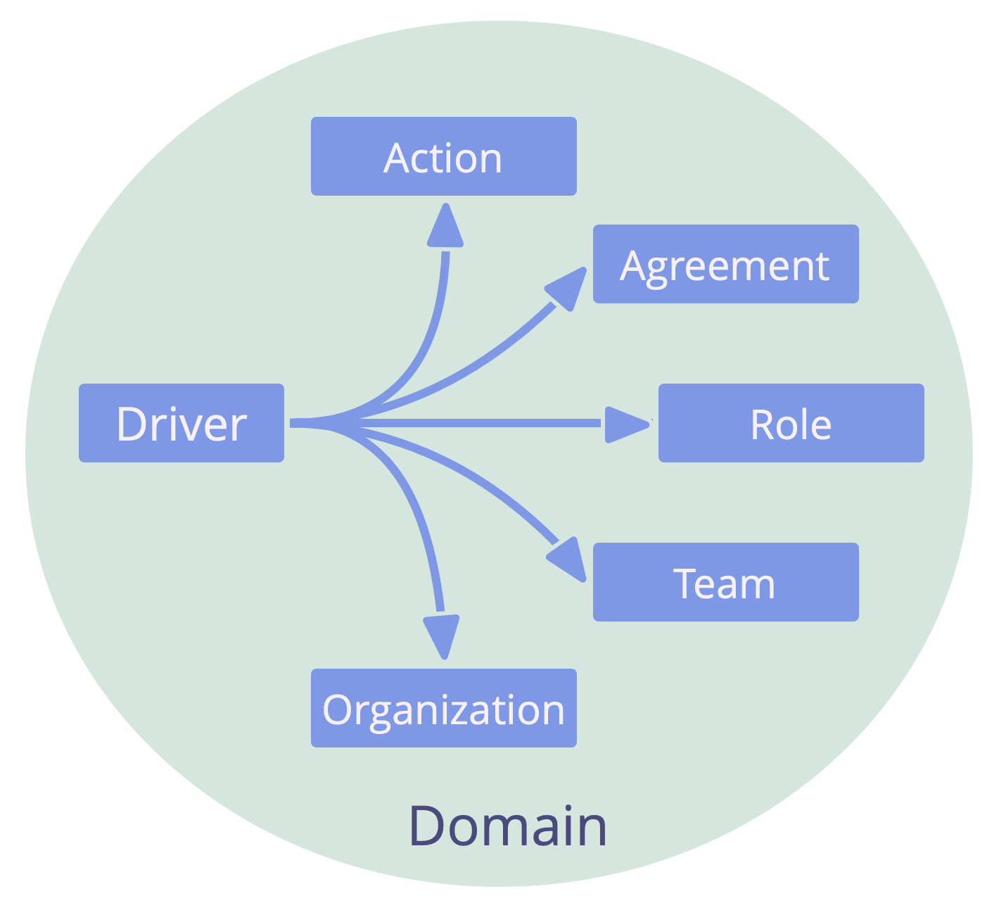
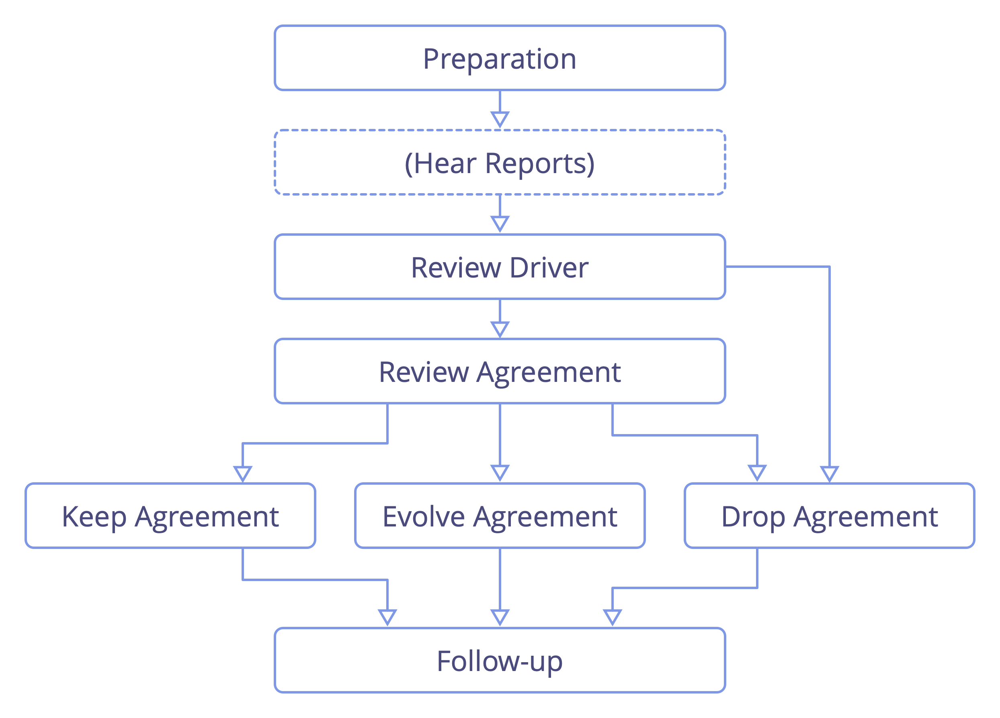
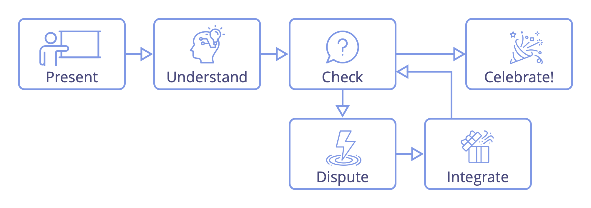
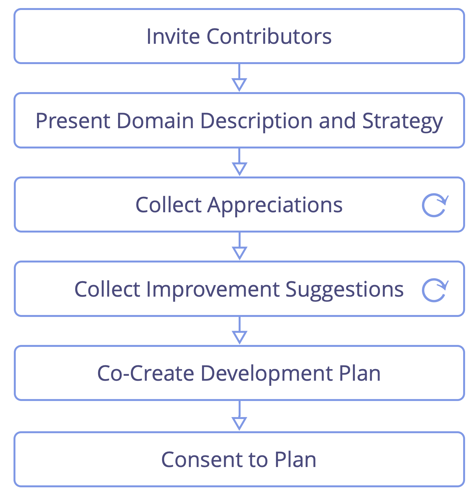
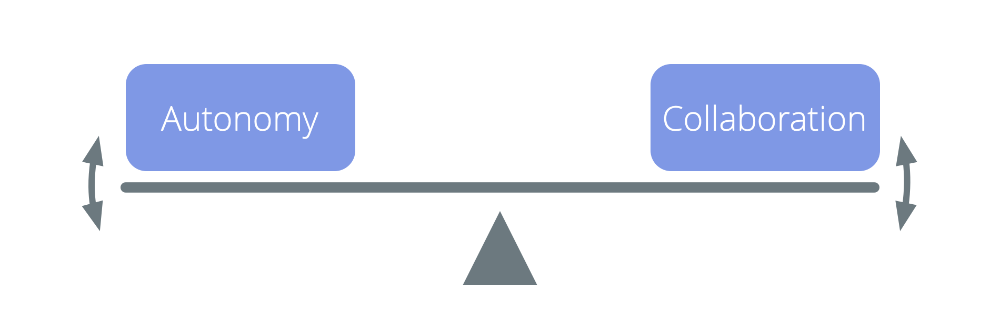
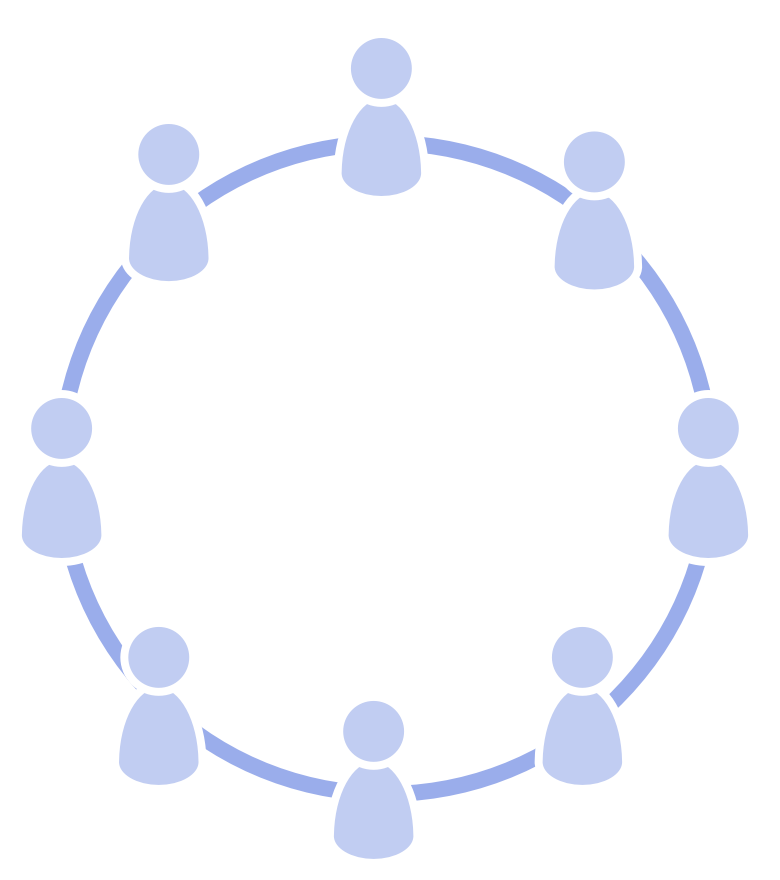
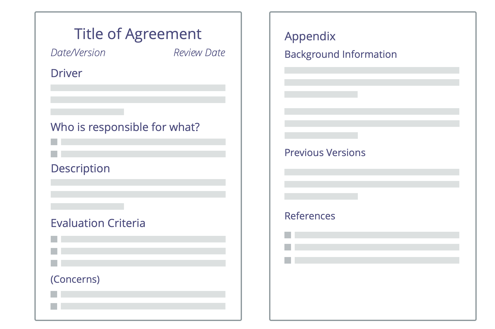
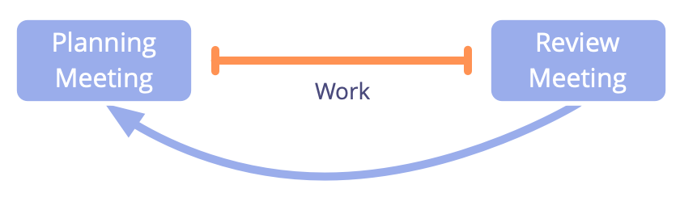
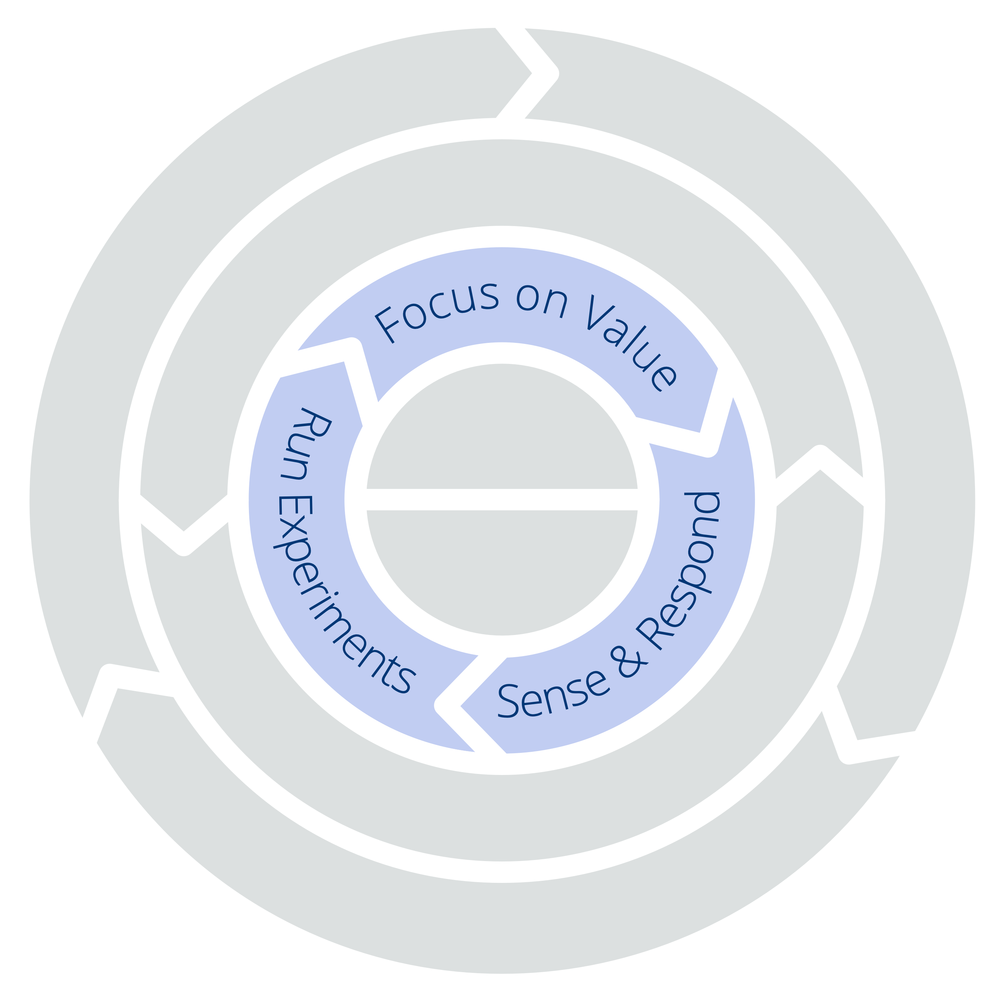

## Vad är Sociokrati 3.0?

Sociokrati 3.0 — också kallat "S3" — är en <a href="glossary.html#entry-social-technology" class="glossary-tooltip" data-toggle="tooltip" title="Social teknologi: Social teknologi är varje process, teknik, metod, skicklighet eller annat tillvägagångssätt som människor kan använda för att påverka sociala system – organisationer, samhällen, samhällen etc. — för att stödja uppnåendet av gemensamma mål och vägleda meningsfullt samspel och utbyte.">social teknologi</a> för att utveckla lättrörliga och motståndskraftiga organisationer i alla storlekar, från små nystartade företag till stora internationella nätverk och samarbeten mellan många myndigheter.

Denna praktiska guide innehåller en omfattande samling av beprövade och testade **koncept, principer och metoder för att förbättra prestanda, engagemang och välbefinnande** i organisationer.

Sedan starten 2015 har mönster från S3 hjälpt människor i en rad olika organisatoriska sammanhang att få ut det bästa av samarbete. Från nystartade företag till små och medelstora företag, stora internationella organisationer, investerarfinansierade och ideella organisationer, familjer och samhällen.

Att använda S3 kan **hjälpa dig att uppnå dina mål** och framgångsrikt navigera i komplexa omständigheter. Du kan göra ändringar ett steg i taget, **utan att behöva en plötslig, radikal, omorganisation** eller planera ett långsiktigt förändringsinitiativ:

-   Börja helt enkelt med att identifiera de områden där det finns störst behov och välj en eller flera metoder eller riktlinjer som hjälper.
-   Gå fram i egen takt och utveckla färdigheter och kompetenser på vägen.

**Oavsett din position i organisationen** finns det många beprövade idéer som är relevanta och användbara för dig.

**Sociokrati 3.0 är gratis och helt fritt att använda**, och licensierat under Creative Commons Free Culture License.

### Hur kan Sociokrati 3.0 hjälpa?

S3 är en transformationsteknik för både individer och hela organisationer som hjälper till att förstå hur man kan möta organisationens största utmaningar, dra nytta av de möjligheter man står inför och lösa de mest svårlösta problemen.

Sociokrati 3.0 är utformad för att vara flexibel och stöder experimenterande och lärande. Man kan använda det som behövs, anpassa saker för att passa sammanhanget och berika den befintliga strategin.

S3 integrerar grundläggande koncept och metoder som finns i agila metoder, lean management, Kanban (och KMM), Design Thinking, Teal Organizations och familjen av sociokrati-baserade styrningsmetoder (SCM/Dynamic Governance, Holacracy® etc.). Den kompleterar och är kompatibel med alla ramverk ur Agile och Lean, inklusive men inte begränsat till Scrum och dess olika ramverk för skalning.

### Ett mönsterbaserat tillvägagångssätt för organisatorisk förändring

S3 erbjuder ett mönsterbaserat tillvägagångssätt för organisatorisk förändring.

Ett **mönster** är en process, praxis eller riktlinje som fungerar som en mall för att framgångsrikt agera på en viss typ av utmaning eller möjlighet. S3-mönster upptäcks genom att observera människor som arbetar tillsammans i olika organisationer för att lösa problem och agera på de möjligheter de möter. När man upptäcker att det invanda sättet att göra saker inte ger förväntat eller önskat utfall kan man ofta hitta S3-mönster som kan hjälpa.

Mönster är modulära och anpassningsbara, kan användas självständigt, och är ömsesidigt förstärkande och kompletterar varandra när de används i kombination. S3-mönster kan förädlas och anpassas för att passa en organisations specifika behov.

I den här handledningen har mönstren grupperats efter ämne i elva kategorier för att lättare kunna identifiera vilka som är mest relevanta i en viss organisation:

- Meningsskapande och beslutsfattande
- Utveckla organisationer
- Kollegial utveckling
- Möjliggörare för samskapande
- Bygga organisationer
- Att börja använda S3
- Definiera överenskommelser
- Mötesformat
- Mötestekniker
- Organisera arbete
- Organisationsstruktur

Genom att tillhandahålla en meny med mönster att välja mellan efter behov, uppmuntrar S3 ett organiskt, **stegvist förhållningssätt till förändring utan en enorm initial investering**. Det möter människor där de är och hjälper dem att röra sig framåt och börja använda mönster i sin egen takt och enligt sitt unika sammanhang.

### Vad finns i den här handledningen?

Denna praktiska handledning innehåller:

-   Användbara koncept som hjälper dig **att förstå din organisation** och kommunicera precist om vilka förändringar som behövs.
-   En **organisk, iterativ strategi för att förändra** som möter människor där de är, hjälper dem att gå framåt i sin egen takt och utifrån deras unika sammanhang och behov.
-   **Sju kärnprinciper** för smidigt och sociokratiskt samarbete
-   En sammanhängande samling av **över 70 metoder och riktlinjer** för att hjälpa dig att navigera i komplexa miljöer och förbättra samarbete:
    -   **Enkla, faciliterade format** som stöder team i att utnyttja gruppens kollektiva intelligens för att stegvis omforma tillgänglig information till en kontinuerlig förbättring av arbetsprocesser, produkter, tjänster och förmågor.
    -   **Gruppmetoder** som hjälper organisationer att använda begåvning som redan finns, genom att **personer stödjer varandra** i att bygga färdigheter, ansvarighet och engagemang.
    -   Enkla **verktyg för att förtydliga vem som gör vad** som frigör människor att bestämma och agera självständigt så mycket som möjligt, inom tydligt definierade begränsningar som möjliggör experiment och utveckling.
    -   Mönster för att **odla organisationsstrukturer bortom hierarkier** till flexibla, decentraliserade nätverk där informationsflödet och påverkan direkt stöder skapandet av värde.
-   **"Common Sense Framework" - Ramverket för sunt förnuft**, ett verktyg för att förstå team, organisationer och hur man kommer igång med S3.
-   En **begreppslista** med förklaringar till alla termer som används inom S3.

Denna praktiska handledning till Sociokrati 3.0 är skriven och publicerad av de tre samutvecklarna av Sociokrati 3.0.

Trogen tankesättet bakom S3, kommer denna bok alltid att vara ett pågående arbete som växer och förändras vartefter vi lär oss av människor som experimenterar med S3 i organisationer runt om i världen. Sedan vi började för 5 år sedan har vi släppt flera uppdateringar per år och vi kommer att fortsätta göra det under de kommande åren.

Även om flera avsnitt i denna bok är korta och kanske inte färdigformulerade, så har innehåll och förklaringar varit tillräckliga för att många människor ska ha  kommit igång med S3 och uppnått positiva förändringar i sina organisationer. Vi hoppas att du också kommer att tycka att material är användbart.

### Inspiration till och historien bakom Sociokrati 3.0

Den bokstavliga innebörden av termen **sociokrati** är "kamraternas styre": *socio* - från latinets *socius* - som betyder "följeslagare", eller "vän", och suffixet *-cracy* - från den forntida grekiskans κρα<unk> τος (kra<unk> tos) - som betyder "makt" eller "styre".

Ordet sociokrati kan spåras tillbaka till 1851, när **Auguste Comte** föreslog att man skulle tillämpa ett vetenskapligt förhållningssätt till samhället: stater skulle styras av en grupp forskare som är experter på samhället (som han kallade "sociologer"). Enligt hans uppfattning skulle denna framtid, även om den ännu inte är genomförbar, vara oundviklig.

Några decennier senare använde **Lester Frank Ward** ordet sociokrati för att beskriva hur människor kunde styra baserat på sina relationer med varandra. I stället för att ha sociologer i centrum, ville han ge mer makt och ansvar till individen, han föreställde sig sociologer i en roll som forskare och konsulter.

År 1926 grundade den holländska reformisten och kväkaren **Kees Boeke** en internatskola baserad på principen om samtycke. Personal och studenter behandlades som likvärdiga deltagare i den strukturella styrningen av skolan, alla beslut var tvungna att vara acceptabla för alla. Han byggde denna version av sociokrati på kväkarnas principer och praxis, och beskrev sociokrati som en demokratiutveckling i sin essä "Demokrati som den kan vara" från 1945.

**Gerard Endenburg**, också en kväkare och en elev i Boekes skola, ville tillämpa sociokrati i sin familjs företag, Endenburg Elektrotechniek. Han skapade och utvecklade *Den Sociokratiska Cirkelmetoden (SCM)* (som senare blev "Sociocratic Method"), där han integrerade Boekes form av sociokrati med ingenjörskonst och cybernetik. 1978 grundade Endenburg Sociocratisch Centrum i Utrecht (som nu är Sociocratic Center i Rotterdam) som ett sätt att främja sociokrati i och utanför Nederländerna. Sedan 1994 är organisationer i Nederländerna som använder SCM undantagna från det rättsliga kravet att ha ett arbetarråd.

Under slutet av 1990-talet och början av 2000-talet stötte flera icke-holländsktalande på sociokratin, men det var inte förrän 2007 då **Sharon Villines och John Buck** släppte sin bok, "We the People", som sociokrati blev allmänt tillgänglig för den engelsktalande världen, och har därifrån börjat sprida sig till flera andra språk.

Sociokrati har visat sig vara kraftfullt för många organisationer och samhällen runt om i världen, men har ännu inte tagit fart fullt ut.

År 2014 samlades **James Priest och Bernhard Bockelbrink** för att tillsammans skapa en samling utbildningsresurser baserade på idéer från sociokrati, agilt och Lean under Creative Commons licensiering. De upptäckte att organisationer av alla storlekar behöver en flexibel meny av metoder och strukturer – lämpliga för deras specifika sammanhang – som gör det möjligt att utveckla ett socialt och agilt tänkesätt för att uppnå större effektivitet, samordning, tillfredsställelse och välbefinnande. Den första versionen av **Sociokrati 3.0.** lanserades i mars 2015.

**Liliana David** anslöt sig till teamet strax efter. Tillsammans arbetar de regelbundet för att göra S3 tillgängligt och tillämpligt för så många organisationer som möjligt, och tillhandahåller resurser under **Creative Commons Free Culture License** för människor som vill lära sig, tillämpa och berätta för andra om Sociokrati 3.0.

#### Sociokrati 3.0 - Rörelsen

Då intresset för Sociocracy 3.0. ökar finns det en snabbt växande gemenskap av människor från en mängd olika bakgrunder - banbrytande konsulter, coacher, utbildande facilitatorer, och personer som tillämpar S3 i sina olika sammanhang — som alla uppskattar transformationspotentialen i Sociocracy 3.0 som kan hjälpa organisationer och deras medlemmar att blomstra. Många är vänliga nog att gärna ägna en del av sin tid åt att experimentera med och dela med sig om S3, och en del samarbetar också för att lära av varandra och dokumentera erfarenheter för att vägleda den pågående utvecklingen och förfiningen av ramverket och dess olika tillämpningar.

### Varför "3.0"?

Sociokrati som en form av styrning har funnits sedan 1851. Sedan dess har den utvecklats och anpassats av många olika personer och organisationer, bland annat Gerard Endenburg, The Sociocracy Group (TSG) och Brian Robertson (HolacracyOne).

Men utanför Nederländerna har sociokratin fram till nyligen varit i stort sett okänd.

Vi älskar sociokrati eftersom vi ser organisationer och deras medlemmar frodas när de använder delar av det för att berika eller förändra det de gör idag.

Vi älskar också Agile, Lean, Kanban, Core Protocol, icke-våldsligt språk och många andra idéer också. Vi tror att världen kommer att bli en bättre plats när allt fler organisationer lär sig att utnyttja det överflöd av fantastiska metoder som växer fram i världen idag, och lär sig att kombinera dem med det de redan kan.

Därför bestämde vi oss för att ägna en del av vår tid åt att utveckla och utveckla sociokratin, integrera den med många av dessa andra potenta idéer, för att göra den tillgänglig och tillämplig för så många organisationer som möjligt.

För detta ändamål inser vi värdet av en stark identitet, ett radikalt annorlunda sätt att sprida information, och av att anpassa *Sociocratic Circle Organization Metod* för att förbättra dess tillämpbarhet.

#### Namnet

Namnet "*Sociokrati 3.0*" visar både på respekt för härstamningen och ett betydande steg framåt.

Det bidrar också till att undvika uppfattningen att vi förvanskar *Sociocratic Circle Organization Method* (SCM) så som den marknadsförs av The Sociocracy Group.

#### Ny modell för spridning

*Sociokrati 3.0* använder en icke-centraliserad modell för distribution. Detta är ett paradigmskifte i hur sociokrati kan föras ut till människor och organisationer, och en som många människor redan är vana vid.

Vi stöder "viral" spridning genom två viktiga strategier:

* **Sociokrati 3.0 är öppet:** Vi vill uppmuntra tillväxten av ett levande ekosystem av tillämpningar och smaker av sociokrati där människor delar och diskuterar sina insikter och de anpassningar de gör utifrån sitt specifika sammanhang. Därför lägger Sociokrati 3.0 tonvikten på att kommunicera de bakomliggande principerna och uppmanar uttryckligen alla människor att kreativt blanda, utöka och anpassa saker efter deras behov.
* **Sociokrati 3.0 är gratis:** För att förenkla för människor och organisationer att börja nyttja Sociokrati 3.0 tillhandahåller vi gratis material under *Creative Commons Free Culture License* för att alla skall kunna lära sig, praktisera och lära ut *Sociokrati 3.0*. Vem som helst får använda materialet utan uttryckligt tillstånd, även i kommersiella sammanhang, eller som grund för att skapa nytt material, så länge de delar dessa under samma licens. Vi uppmanar, och stöttar, andra organisationer, konsulter, coacher, facilitatorer och utbildare att följa vårt exempel och också göra sitt material tillgängligt.

#### Utvecklingen av den sociokratiska cirkelorganisations-metoden

Vi känner att vi behöver vara tydliga med att Sociocracy 3.0 inte är specifikt inriktad mot den existerande gemenskapen av människor som använder *Sociocratic Circle Organization Method*, eller mot The Sociocracy Group (TSG). *Sociocratic Circle Organization Method* (SCM) är redan väl utvecklad och många människor verkar vara mestadels nöjda med den.

Men våra personliga erfarenheter är att även för de organisationer som har hört talas om sociokrati finns det många hinder för att komma igång. Med *Sociocracy 3.0* försöker vi aktivt arbeta för att adressera och minimera de saker som står i vägen.

##### Minska risk och motstånd

*Sociokrati 3.0* möter organisationer där dom befinner sig och tar dem med på en resa av ständiga förbättringar. Det krävs ingen radikal förändring eller omorganisation. *Sociokrati 3.0* tillhandahåller en samling oberoende och principiella mönster som en organisation kan utnyttja för att bli mer ändamålsenlig. Alla mönster bygger på en uppsättning grundläggande principer, och kan lätt anpassas till sammanhanget.

##### Att skifta fokus från mål (eller syfte) till behov

*Sociokrati 3.0* flyttar en organisations primära fokus från vision, uppdrag, mål eller syfte, mot källan till motivation, och anpassar organisationen till att upptäcka och ta itu med vad den behöver. Organisationer som redan är behovsstyrda, värdedrivna eller kundcentrerade, finner detta naturligt att anamma.

##### Kondenserad till det väsentliga

Vid en jämförelse kan *Sociocratic Circle Organization Method* verka stor och omfattande. Genom att fokusera på det väsentliga erbjuder *Sociokrati 3.0* ett lättviktigt ramverk som är lätt att anpassa och bygga vidare på vid behov.

Detta betyder inte att det är helt enkelt, att välja att börja med mönster från *Sociokrati 3.0s* kräver en investering i lärande och omtänk. Det är därför det är viktigt att börja med bara det som behövs, det är ingen idé att ändra på saker som redan är tillräckligt bra.

##### Integration med Agile och Lean

*Sociocratic Circle Organization Method* innehåller inget stöd för den operationella verksamheten eller för hur man skapar en kultur av nära samarbete. Många organisationer använder redan eller är intresserade av Lean och agilt tänkande för den operationella verksamheten och samarbete. Vi är övertygade om att det är bra, så *Sociokrati 3.0* är utformat för att lätt anammas i organisationer med Lean och/eller agilt som ambition eller arbetssätt.

##### Ett nytt sätt att utveckla organisationsstrukturer

Organisationsstrukturen enligt *Sociocratic Circle Organization Metod* modelleras efter en strikt hierarki av domäner. Vi ser allt fler miljöer av samarbete mellan flera intressenter och därmed ett ökat behov av ett bredare utbud av mönster för organisationsstrukturer. Organisationsstrukturen utvecklas naturligt när informationsflödet och inflytandet i en organisation stegvis anpassas till värdeflödet. *Sociokrati 3.0* möjliggör en mängd olika strukturella mönster som kan kombineras för att utveckla strukturen efter behov och på ett flexibelt sätt.

## De Sju Principerna

Sociokrati 3.0 bygger på sju grundläggande principer som möjliggör socokratisk och agil samverkan. Eftersom de sju principerna återspeglas i alla mönster, är det viktigt att förstå dessa principer för att införa, och av största vikt när man anpassar, mönster från Sociokrati 3.0.

Att utöva Sociokrati 3.0 hjälper människor att uppskatta det fundamentala värde som dessa principer ger – både för individer och organisationer – och stödjer deras integration i organisationskulturen.

**_Principen om ändamålsenlighet_:**

***Lägg endast tid på sådant som leder närmare organisationens övergripande mål**, så att den begränsade tid, energi och resurs som finns tillgänglig används på bästa sätt.*

**_Principen om samtycke_:**

***Ta upp, undersök och lös upp invändningar mot beslut och åtgärder** så att risken för oönskade konsekvenser minskar och eventuella värdefulla förbättringar kan upptäckas.*

**_Principen om empiri_:**

***Pröva alla antaganden du är beroende av genom experiment och kontinuerlig revidering** så att du lär dig snabbt, förstår och kan navigera så ändamålsenligt som möjligt.*

**_Principen om ständig förbättring_:**

***Granska regelbundet utfallet av det du gör, och gör sedan stegvisa förbättringar av vad du gör och hur du gör det baserat på vad du lärt dig** så att du kan anpassa dig till förändringar när det behövs, och upprätthålla eller förbättra ändamålsenligheten över tid.*

**_Principen om likvärdighet_:**

***Engagera människor i att fatta och förädla beslut som påverkar dem** så att engagemanget och ansvarstagandet ökar, och ni utnyttjar den distribuerade intelligensen för att uppnå och utveckla era mål.*

**_Principen om öppenhet_:**

***Anteckna all information som är värdefull för organisationen och gör den tillgänglig för alla i organisationen, såvida det inte finns någon speciell anledning till sekretess** så att alla har den information de behöver för att förstå hur man gör sitt arbete på ett sätt som så ändamålsenligt som möjligt bidrar till helheten.*

**_Principen om ansvarighet_:**

***Agera när något behövs, gör vad du åtagit dig och axla din del av ansvaret för organisationens framgång** så att det som behöver göras blir gjort, ingenting förbises och alla gör vad de kan för att bidra till organisationens ändamålsmässighet och integritet.*

### Principen om ändamålsenlighet

_**Lägg endast tid på sådant som leder närmare organisationens övergripande mål**, så att den begränsade tid, energi och resurs som finns tillgänglig används på bästa sätt._

Principen om ändamålsenlighet inbjuder oss att medvetet tänka på vad vi gör och hur vi gör saker. Det kräver att man avsiktligt och medvetet beaktar de konsekvenser som våra åtgärder har på vår organisation, både nu och över tid, men också den bredare miljön, omgivningen och världen i stort.

Att eftersträva ändamålsenlighet kräver att vi agerar med avsikt att minimera spill och slöseri, avlägsna hinder och om möjligt uppträda på ett sätt som med tiden leder till största möjliga värdeskapande, genom synergin av vår kreativitet, resurser, energi och tid.

#### Förtydliga "varför?"

För att vara ändamålsenlig måste man börja med att komma till klarhet med varför man vill göra något och etablera en ungefärlig uppfattning om vad man vill uppnå. Att definiera varför organisationen finns och vilka mål den försöker uppnå hjälper alla att förstå mer om vad de arbetar mot och hur de kan bidra på ett meningsfullt sätt. Utan denna tydlighet är det svårt för individer att se sitt eget arbete i ett större sammanhang. Det är också svårare att kvalificera och kvantifiera vad som ger värde och på vilka sätt.

#### Håll alternativen öppna

Det kan finnas många sätt att uppnå målen och ibland misslyckas man att möta behoven med sitt första försök. Håll alternativen öppna och undvika att fastna i en viss tankebana eller riktning så att upptäckta möjligheter för att förbättra inte missas. Undvik att konvergera för tidigt och välj en iterativ strategi närhelst möjligt. I komplexa omgivningar är det väsentligt att hitta sätt att testa hypoteser tidigt, genomföra flera små experiment om möjligt, och arbeta lättviktigt så att det går att byta inriktning snabbt.

#### Ändamålsenlig först, resurssnål sedan

Ändamålsenlighet är att nå önskat resultat, medan resurseffektivitet handlar om att göra saker med minsta spill och slöseri av ansträngning, resurser och tid. Det är fullt möjligt att göra “fel” sak mycket resurssnålt, så innan man optimerar för effektivitet, se till att utfallet faktiskt är vad du avsåg. Först efter det bör man leta efter värdefulla förbättringar för att åstadkomma samma resultat på ett mer resurssnålt sätt.

#### Se till helheten, övervaka, utvärdera och lär

Var vaksam på eventuella bieffekter och oavsiktliga konsekvenser före, under och efter varje påverkan som görs. Tänk på direkta och indirekta kostnader och negativa externa effekter och var beredd att utveckla eller ändra aktiviteter eller mål, baserat på lärdomar längs vägen.

Det finns olika skalor för ändamålsenlighet (och effektivitet) som bara kan förstås om man beaktar det bredare sammanhanget och konsekvenserna av åtgärder över tid. Ibland kan man uppnå det avsedda utfallet på kort sikt men med långsiktigt ogynnsamma konsekvenser och dolda kostnader.  Till exempel, storskaligt, industriellt jordbruk ger stor avkastning med hög resurseffektivitet, men på lång sikt kan det leda till en kritisk utarmning av matjorden och ett ökat beroende av gödningsmedel. insekticider och ogräsmedel. Det är ett exempel på kortsiktig vinst som kan ge problem på lång sikt.

I komplexa miljöer är det ibland svårt att räkna ut vad ändamålsenlighet skulle innebära. Tänk på andras perspektiv, även om du är ensam om att fatta ett beslut.  Ta till vara på den erfarenhet och expertis som finns spridd över hela organisationen och sök kontakt med personer med alternativa synvinklar. Att få andras synpunkter på idéer kan hjälpa till att undvika oönskade konsekvenser och att identifiera värdefulla förbättringar.

Bestäm hur utfall och värde kommer att mätas och i fallet  samarbete med andra, utveckla och upprätthåll en gemensam förståelse av vad det kommer att innebära. Efter att ha etablerat ett tydligt “_varför_” och definierat det avsedda utfallet, tänk över på hur utfallet kan mätas så att man också kan se framsteg längs vägen (och om det som görs överhuvudtaget är användbart!)

Om något varit värdefullt och ändamålsenligt kan ofta bara bedömas i efterhand. Var uppmärksam på och reflektera över konsekvenserna av dina handlingar, och använd sedan lärdomar och insikter för att öka ändamålsenligheten till nästa gång.

#### Var uppmärksam på beroenden och begränsningar

Sikta på att göra alla fria att agera så självständigt som möjligt och gör vad som krävs för att göra dig själv fri också. Gör alla nödvändiga beroenden mellan specifika individer och grupper explicita, och samlas för att samskapa och utveckla ett sammanhängande system för att hantera dem, så att värde fortfarande kan levereras snabbt även när beroenden inte kan undvikas.

Klargör alla bivillkor som begränsar verksamheten. Vilka är de interna och externa förväntningarna, riktlinjerna eller reglerna? Hur stöder eller begränsar de underförstådda eller uttryckliga värderingarna i din organisation, och i det vidare sammanhanget, beslut och åtgärder? Hur kommer man att agera för att hålla sig inom specifika begränsningar? Vem ska man kommunicera med om man ser ett argument för att ändra något eller för att göra ett undantag från en regel?

#### Prioritera och välj klokt

Sätt upp prioriteringar och håll fast vid dem om det inte framkommer anledningar att ändra på dem. Distraherande faktorer, ständigt skiftande prioriteter eller arbeten och brist på pauser eller återhämtningstid kommer oundvikligen att leda till spill och slöseri.

Förutom att göra klart vad som KOMMER att göras, var också tydlig med vad som INTE ska göras och sträva efter att lösa hinder vartefter de uppstår.

### Principen om samtycke

_**Ta upp, undersök och lös upp invändningar mot beslut och åtgärder** så att risken för oönskade konsekvenser minskar och eventuella värdefulla förbättringar kan upptäckas._

Att avsiktligt söka invändningar är ett sätt att få tillgång till den kollektiva intelligens som finns fördelad över hela organisationen och dra nytta av insikter som vi annars riskerar att missa. Att undersöka förslag, beslut och aktiviteter genom olika personers perspektiv bidrar till att identifiera orsaker till varför ett beslut eller verksamhet kan leda till konsekvenser som helst borde undvikas, eller till insikter om värdefulla förbättringar.

Att anta principen om samtycke förändrar fokus avseende beslutsfattandet, genom att skifta från att försöka nå en överenskommelse - "kan alla hålla med om detta?" - mot metoden att medvetet undersöka invändningar - "finns det några argument som visar varför detta inte är tillräckligt bra, tillräckligt säkert eller att det finns värdefulla förbättringar?"

Samtycke innebär inte att alla aktivt deltar i varje beslut, eftersom detta skulle vara ineffektivt. Istället är det nyttigt att fatta beslut som med tiden frigör människor så mycket som möjligt till att besluta och agera för att skapa värde av sig själva. Det kräver dock tillräcklig _transparens_ och medveten närvaro från beslutsfattare att informera och involvera människor som skulle påverkas (i olika grader), eller för att bjuda in de som kan tillföra relevant erfarenhet eller expertis (se _principen om ekvivalens_).

#### Uppmana meningsskiljaktigheter

När man hanterar komplexitet är ett enkelt men effektivt sätt att utveckla en samstämmig gemensam förståelse att beakta olika perspektiv, erfarenheter och expertis ur vilket mer ändamålsenliga beslut kan fattas.

Att utveckla en kultur som välkomnar avvikande åsikter och där människor beaktar dessa åsikter för att upptäcka deras eventuella värde skapar större engagemang, psykologisk säkerhet och stöd för olika beslut.

#### Flytta makten från personer och positioner till sunda argument

När man jämför de olika existerande paradigmerna för beslutsfattande ligger den väsentliga skillnaden i var den slutgiltiga auktoriteten för att fatta ett beslut finns. I autokratiska system ligger beslutsmakten hos en individ eller liten grupp. I ett system som styrs av majoritetsröster, ligger beslutsmakten hos majoriteten (eller de som kan övertyga majoriteten). I ett system som strävar efter samförstånd med enhällighet (konsensus) ligger beslutsmakten hos dem som bestämmer sig för att blockera ett förslag eller en befintlig överenskommelse. I alla tre fallen fattas ett beslut oavsett om motivet hos dessa aktörer är i linje med systemets intresse eller inte.

När en grupp eller organisation antar principen om samtycke skiftar beslutsmakten från en specifik individ eller grupp, till resonerande argument som avslöjar risker för oönskade konsekvenser som borde undvikas eller möjligheter till värdefulla förbättringar. På så sätt kan individer – oavsett deras position, rang, funktion eller roll – inte blockera beslut bara baserat på åsikter, personliga preferenser eller rang. Samtycke inbjuder alla att åtminstone vara resonabla, samtidigt som det lämnar utrymme för individer att uttrycka olika perspektiv, åsikter och idéer.

#### Skilj mellan åsikter eller preferenser, och invändningar

Samtycke bygger på den intelligens som finns distribuerad i en organisation, inte bara genom att bjuda in människor att uttrycka möjliga _invändningar_, men också genom att bjuda in till att undersöka dessa argument, rensa bort de som är ogrundade, utveckla de som upptäcks vara bara delvis sanna och att synliggöra de som är giltiga invändningar. Så det är oftast en bra idé att _pröva om argument kvalificerar som invändningar_ och bara agera på dem som gör det. Detta hjälper till att undvika att tid slösas på argument som enbart bygger på åsikter, personliga preferenser eller partiskhet.

Argument som kvalificerar som invändningar — åtminstone såvitt intressenterna kan avgöra - hjälper en grupp att styra sin insats till att göra förändringar i de områden där det är nödvändigt eller värt att anpassa och förbättra. Stegvis förbättring baserad på nya insikter och lärande är inbyggd i modellen för samtyckesbeslut och är en oundviklig konsekvens av att man antar principen.

Genom att anta principen om samtycke förskjuts syftet med beslutsfattande mot att identifiera en lösning som är tillräckligt bra för stunden och för vilken det inte finns några uppenbara, värdefulla, förbättringar som kan motivera att spendera mer tid. Detta tillvägagångssätt är mycket mer ändamålsenligt än att försöka nå samförstånd med enhällighet, där målet är att tillgodose allas personliga preferenser och idéer.

#### Integrera insikterna från invändningarna

Invändningar berättar om saker som kan förbättras. _Att lösa upp invändningar_ innebär vanligtvis att man utvecklar (föreslagna) överenskommelser och ändrar aktiviteter på ett sätt som neutraliserar argumentet. Ibland kan det dock finnas anledningar till att det finns mer att vinna på att lämna saker oförändrade, trots att det finns en giltig invändning. Slutligen, att lösa invändningar innebär att väga för- och nackdelar med varje beslut, både i förhållande till den specifika situationen som ett beslut är avsett att adressera, men också i det sammanhang som organisationen som helhet befinner sig i. I komplexa miljöer finns det vanligtvis inga perfekta eller helt korrekta beslut, bara de som (för stunden åtminstone) verkar tillräckligt bra och tillräckligt säkra för att prova. Ofta är allt som behövs ett tillräckligt bra nästa steg som gör att vi kan lära oss empiriskt och anpassa oss och utveckla beslutet över tid.

Detta främjande av naturligt och inkrementellt lärande utnyttjar mångfalden av kunskap, erfarenhet och expertis som finns distribuerad i en organisation. Det hjälper till att skifta från en paradigm rotat i binärt tänkande och polarisering (antingen/eller) till en kontinuerlig process av synergi (både/och), som med tiden också främjar starkare relationer mellan jämlikar.

#### Kontraktet för samtyckesbeslut

Att anta principen om samtycke i ett team, eller i organisationen som helhet, har konsekvenser för hur människor ser på beslutsfattande, dialog och åtgärder. Överväg att göra denna implicita överenskommelse om samtycke explicit, för att stötta medlemmar i organisationen att anta och tillämpa principen om samtycke:

1. I avsaknad av invändningar mot en överenskommelse har jag för avsikt att följa överenskommelsen efter bästa förmåga.
2. När jag blir medveten om dem kommer jag att dela alla tänkbara invändningar mot (föreslagna) överenskommelser och åtgärder, med dem som är direkt ansvariga för dem.
3. Jag kommer att överväga invändningar mot förslag, överenskommelser och verksamhet som jag ansvarar för, och kommer att arbeta för att lösa upp invändningen om jag kan.
4. Jag ska aktivt begrunda överenskommelser som ska granskas, för att söka efter möjliga invändningar.

### Principen om emperi

_**Pröva alla antaganden du är beroende av genom experiment och kontinuerlig revidering** så att du lär dig snabbt, förstår och kan navigera så ändamålsenligt som möjligt._

Empiri – grundvalen för den vetenskapliga metoden – är en grundläggande princip för att på ett bra sätt kunna navigera i en komplex värld. Inte bara är de miljöer som organisationer befinner sig i komplexa utan en organisation är i sig själv ett komplext adaptivt system. Kunskapen om ett organisatoriskt system och dess interaktioner är ofta oprecis och starkt beroende av sammanhanget.

Empiri kan hjälpa till att öka säkerheten och minska villfarelsen, så att tiden kan utnyttjas på bästa sätt. I våra försök att förstå saker och skaffa oss en känsla av säkerhet om vad som händer, varför det händer, vad som ska hända härnäst och vad som behövs för att uppnå det, drar vi ofta slutsatser utan att kontrollera om de antaganden de bygger på är sanna och korrekta. I en komplex omgivning kan det vi uppfattar som orsakssamband ofta visa sig vara bara korrelation eller tillfällighet, och utfallet av de åtgärder vi gör kommer alltid att leda till en del oförutsedda konsekvenser.

Att observera och sondera system och att använda sig av experiment för att vägleda en iterativ strategi för förändring stöder ständigt lärande och hjälper en organisation att kontinuerligt utvecklas för att förbli ändamålsenlig och mottaglig för förändring.

#### Förtydliga hypotesen

En hypotes är en preliminär förklaring av ett samband mellan en specifik orsak och en effekt som både kan testas och falsifieras. Den ger en startpunkt för experiment som bevisar eller motbevisar hypotesen.

När det gäller organisationer kan man utveckla hypoteser om hur en förändring i en arbetsprocess eller organisationsstruktur skulle förbättra ändamålsenligheten eller minska kostnaderna. Eller om hur en omplanering av ett möte skulle kunna öka engagemanget, eller hur en viss förändring av en produkt skulle kunna attrahera ett nytt kundsegment samtidigt som befintliga kunder är nöjda och så vidare.

När vi ställs inför osäkerhet hjälper det att göra eventuella frågor och antaganden explicita och sen forma en tydlig hypotes som kan göra det möjligt att besvara dessa frågorna och validera att antagandena är sanna. En vag eller tvetydig beskrivning gör antaganden svåra, eller till och med omöjliga, att testa. Om man försöker testa för många antaganden på en gång kan det leda in på en lång väg med få lärdomar och insikter av värde. Mindre är ofta mer.

En viktig färdighet att utveckla när man konstruerar experiment är förmågan att **skilja mellan etablerad kunskap och rena antaganden**. Genom att tydligt tillstå vad man ännu inte vet och vad man antar vara mer eller mindre sant, kan man identifiera frågor och antaganden kring vilka hypotesen ska byggas.

I komplexa domäner förlitar sig en hypotesdriven strategi på experiment för att validera eller motbevisa hypoteser, så att man kan hitta bärkraftiga idéer eller falsifiera dem tidigt. Att göra saker begripliga genom experimenterande, inte bara gör det möjligt att mer ändamålsenligt uppnå vad som behövs eller önskas, men det kan också hjälpa till att validera antaganden om vilka mål som kan vara värda att ens sträva efter.

#### Konstruera bra experiment

Ett experiment är ett kontrollerat test som är utformat för att bevisa eller motbevisa en hypotes. Experiment ger validerad kunskap om hur man bättre kan agera på kommande utmaningar och möjligheter. Utfallet ger ofta möjlighet att förädla hypotesen, eller till och med utveckla nya hypoteser som sedan kan testas med ytterligare experiment.

Innan ett experiment påbörjas är det viktigt att helt definiera och dokumentera det. När det gäller organisationer kommer ett experiment att bestå av en lista på aktiviteter som behöver genomföras, och om det hjälper, hur de behöver utföras, men även en lista på mätvärden som ska följas före, under och efter experimentet.

Definiera och dokumentera specifika värden på variablerna som visar på experimentets framgång och misslyckande och lägg till detaljer om detta till dina utvärderingskriterier. Tänk särskilt på vad ni skulle godkänna som bevis på att er hypotes är felaktig. Undvik att göra ändringar i ett pågående experiment, och om du ändrar något, dokumentera dessa förändringar, annars kan dina mätningar bli meningslösa. Det är viktigt att du **mäter innan du börjar experimentet** för att se till att värdet som visar på framgång inte redan är uppfyllt, t.ex. på grund av fel i hur experimentet konstruerats.

#### Behandla beslut som experiment

I ett komplext system är det omöjligt att förutsäga alla de sätt på vilka detta system kommer att reagera på introduktionen av specifika förändringar. Därför kan man även se på och hantera beslutsfattande som experiment. Det är värdefullt att se alla viktiga operativa och strukturella beslut som görs som experiment och därmed dokumentera de avsedda utfalls- och utvärderingskriterierna i varje enskilt fall. Fatta ett beslut i taget, börja med vad som verkar vara en lämplig eller logisk utgångspunkt och utveckla dessa beslut iterativt, baserat lärdomar och insikter längs vägen.

### Principen om ständig förbättring

_**Granska regelbundet utfallet av det du gör, och gör sedan stegvisa förbättringar av vad du gör och hur du gör det baserat på vad du lärt dig** så att du kan anpassa dig till förändringar när det behövs, och upprätthålla eller förbättra ändamålsenligheten över tid._

Principerna för _empirism_ och _samtycke_ frilägger möjligheter för lärande, emedan Kontinuerlig förbättring relaterar till vad vi gör med det dessa insikter. Kontinuerlig förbättring avser hur vi bedriver vår operationella verksamhet, men också den strukturella styrningen. Allt från utveckling av strategier, policyer, processer och riktlinjer, till utveckling av produkter, tjänster, kompetenser och färdigheter, attityder och beteende, valda värden och verktyg, allt kan ständigt förbättras.

#### Använd en iterativ strategi för att ändra

Evolution är ofta mer ändamålsenlig och mer hållbar än revolution, något som sällan är nödvändigt eller värdefullt annat än om man misslyckas med att kontinuerligt förbättra ett system när det behövs. Speciellt i en komplex miljö kan många samtidiga förändringar i ett system leda till en oreda som är svår att ordna upp. Konsekvenser av större ingripanden är ofta svåra att mäta på ett bra sätt, särskilt i komplexa förhållanden, och relationen mellan orsak och verkan kommer att bli svår, om inte omöjlig, att avgöra och utvärdera.

Överväg istället att stegvis ändra saker närhelst det finns en möjlighet till en liten och värdefull förbättring. Detta minskar avsevärt behovet av ett stort ingripande. Detta hjälper till att effektivt anpassa organisationen till föränderliga miljöer, att hålla din organisation och system anpassade för ändamålet, och förhindra att saker och ting förvärras till ett tillstånd som är kostsamt eller till och med omöjligt att reparera.

**Även när en stor förändring behövs, gör även det stegvis**. Ta reda på hur saker och ting behöver vara och **justera åtgärderna efter insikter och lärdomar**. Med små förändringar kan antaganden testas snabbt och misslyckanden är mer hanterbara. När ett litet experiment misslyckas, kan man lära sig snabbt och om nödvändigt, använda lärdomarna för att utveckla ett bättre experiment. När ett stort experiment misslyckas kan mycket tid och ansträngning spenderas utan att lära sig mycket alls.

Var medveten om att om du ändrar flera saker samtidigt, är det kanske inte möjligt vilken av dem som leder till de effekter du ser, så **sikta på en eller endast ett fåtal samtidiga förändringar åt gången**.

#### Övervaka, mät och ändra baserat på insikter och lärdomar

**Definiera det _avsedda utfallet_** som en förändring förväntas leda till och var tydlig med hur utvärdering kommer att göras, oberoende vad som än händer. När förändringar görs, var tydlig och specifik med vad som är tänkt att bli bättre. Vilka positiva konsekvenser vill du förstärka och vilka negativa konsekvenser vill du minska?

**Övervaka konsekvenserna av åtgärderna** och reflektera över insikter och lärdomar. Var uppmärksam på vad som faktiskt händer och om resultaten av dina ingripanden speglar dina antaganden och avsikter. Detta kommer att hjälpa till att följa om förändringarna överhuvudtaget ledde till några förbättringar.

Kom också ihåg att även om saker och ting inte blir som ni förväntar er ibland, betyder det inte nödvändigtvis att resultaten är negativa. Ibland blir saker annorlunda än hur vi antog eller avsåg. Alla utfall hjälper oss att lära. **Var öppen för allt som händer**, överväg för- och nackdelar med eventuella oavsiktliga konsekvenser som uppstår och var uppmärksam på när det skulle vara fördelaktigt att göra saker annorlunda, eller att sikta på ett annat resultat.

### Principen om likvärdighet

_**Engagera människor i att fatta och förädla beslut som påverkar dem** så att engagemanget och ansvarstagandet ökar, och ni utnyttjar den distribuerade intelligensen för att uppnå och utveckla era mål._

Likvärdighet är viktig i organisationssystem, just för att människor inte är likvärdiga med varandra på flera olika sätt och beroende på sammanhanget.

Likvärdighet ökar engagemanget genom att ge personer som berörs av beslut möjlighet att i viss utsträckning påverka dessa beslut.

Genom att inkludera människor i att fatta och förädla ett beslut som påverkar dem, får de djupare förståelse för det slutliga beslutet, situationen den är avsedd att adressera, och de för- och nackdelar som har vägts i processen. Det bidrar också till att hålla systemen öppnare och mer genomskinliga och minskar risken att information som är avgörande för beslutet att förbises eller ignoreras. Beroende på graden av engagemang kan människor också ha möjlighet att forma saker enligt deras önskemål, och i vilket fall som helst leder delaktighet i beslutsfattandet till en större känsla av ägande över det som beslutas.

Människor är mer benägna att ta ansvar för att följa beslut när de är involverade i att fatta dem. Detta förstärks ytterligare när man säkrar att berörda parter även har inflytande i anpassningen av dessa beslut senare, om de upptäcker skäl till varför ett beslut inte längre är tillräckligt bra, eller om de ser ett genomförbart sätt att förbättra det.

Beslut som vi tar tillsammans kommer alltid att vara "_våra_"beslut, medan beslut som fattas av andra alltid kommer att vara ”_deras_” och kommer att uppskattas och stödjas i högre eller lägre grad, beroende på personlig preferens och synvinkel.

Vissa beslut kommer att påverka en stor grupp människor, t.ex. en hel avdelning, eller till och med hela organisationen. Att inkludera de som berörs i beslutsprocessen kommer att ge fördelar som når långt utöver det aktuella beslutet. Människor kommer att bygga relationer, förtroende och en större känsla av gemenskap och tillhörighet. Det finns en mängd olika gruppfaciliteringstekniker och online-verktyg som kan hjälpa till att involvera ett stort antal intressenter i beslutsprocessen.

#### Delegera ansvar och makten att påverka

För att bli eller förbli ändamålsenlig tjänar organisationer av alla storlekar på att distribuera arbete, och makten att påverka beslut som rör det arbetet, ut i hela organisationen. Detta bidrar till att undanröja onödiga beroenden så att människor kan skapa värde obehindrat, utan att fastna i flaskhalsar, vänta på beslut som ska fattas högre upp i hierarkin eller på information eller indata från andra som befinner sig längre ifrån arbetet.

För frågor som berör ett stort antal personer finns det poänger med att delegera ansvaret att ingå och utveckla överenskommelser till en mindre grupp som har nödvändig erfarenhet och kompetens som sedan kan informera och rådgöra med andra i organisationen under sin beslutsprocess. Med tillräcklig öppenhet och viss proaktivitet i att informera människor som påverkas av besluten om allt som kan vara användbart för dem att veta, kan eventuella invändningar från alla intressenter ändå snabbt identifieras, kvalificeras och vid behov lösas. På så sätt möjliggör likvärdighet en delegering av ansvar till individer eller små grupper, samtidigt som hela systemet fortfarande är öppet för att upptäcka och utnyttja den kollektiva intelligensen hos alla inblandade.

Att periodvis rotera vem som leder beslutsfattandet bidrar till att bygga tillit, ansvarighet och en bredare förståelse för det sammanhang där beslut fattas, eftersom ett växande antal människor kommer att få erfarenhet av den rollen.

#### Begrunda vem som ska vara involverad och hur

Alla i en organisation påverkas i viss mån av alla beslut, eftersom varje beslut kommer att påverka helheten på något sätt. Likvärdighet i beslutsfattandet betyder inte att alla måste vara delaktiga i varje beslut hela tiden. Det innebär inte heller att alla måste ha samma inflytande i alla sammanhang där de påverkas. Likvärdighet innebär att se till att de som berörs av beslut åtminstone kan påverka dessa beslut, på grundval av argument som avslöjar oavsiktliga konsekvenser för organisationen som bör undvikas eller visar på värdefulla förbättringar. Med andra ord är minimikravet för att det ska finnas likvärdighet att höra och överväga eventuella invändningar från personer som berörs av beslut, och arbeta för att dessa invändningar ska lösas.

Vilken grad av inblandning från de påverkade som är mest värdefull är starkt kontextberoende. I ena änden av spektrumet kan det vara tillräckligt att beslut som påverkar andra först fattas av en individ eller en mindre grupp och att dessa beslut sedan prövas för eventuella invändningar mot dem som berörs i efterhand. I andra änden av skalan kan likvärdighet ta sitt uttryck i en process för fullt samarbete där de som berörs deltar i beslutsfattande från början till slut. En medelväg är ett deltagande tillvägagångssätt som håller människor informerade om framsteg och bjuder in specifik återkoppling i olika skeden på vägen.

Likvärdighet måste balanseras med _Ändamålsenlighet_, möjliggöras genom _Öppenhet_ och begränsas av _Samtycke_för att den ska fungera som bäst. Det är värdefullt att väga fördelarna med mer eller mindre engagemang mot kostnader i resurser, energi och tid.

För varje beslut av betydelse är det bra att fråga vem, om någon, bör vara inblandad, och i vilken grad? Överväg särskilt de som direkt eller indirekt kommer att påverkas och de som kommer att ha ansvaret för att agera på det du bestämmer. Även om det inte är direkt relaterat till likvärdighet, kan det också vara klokt att överväga dem som inte uppenbarligen påverkas av ett beslut, men som kan bidra med sin påverkan, erfarenhet och expertis.

#### Gör nödvändig information tillgänglig

För att människor ska kunna bidra på ett effektivt sätt behöver de tillgång till relevant information om beslutet i fråga. Det kan vara bra att utveckla ett system för att synliggöra viktiga beslut och sända ut information om dem till andra. Synlighet och möjlighet till öppen dialog om vad som händer i organisationen bidrar till att skapa gemensam förståelse, vilket i sin tur bidrar till att mer ändamålsenliga beslut fattas.

#### Satsa på lärande och utveckling

När människor involveras i beslutsfattande och alla förstår vad invändningar är – och hur de skiljer sig från oro, åsikter och preferenser – hjälper det människor att bidra till beslut på ett mer meningsfullt och ändamålsenligt sätt. Skapa vägar att samla eventuella invändningar som människor uttrycker och utveckla ett system för att enkelt göra dem tillgängliga för de människor som är direkt ansvariga för att fatta och förädla dessa beslut.

I de fall där människor är ansvariga för att ingå och förädla överenskommelser tillsammans regelbundet, satsa på att alla utvecklar nödvändig kompetens och skicklighet. Det inkluderar att lära sig grundläggande kommunikationsfärdigheter och att vara bekväm i vilka beslutsprocesser du än använder.

#### Bjud in externt inflytande

En del beslutfattande kan förbättras genom att inkludera en rad olika perspektiv och expertis. När du letar efter personer med ett värdefullt perspektiv att ta med, ta då hänsyn till hela organisationen och även den omgivande miljön. Vem har värdefull kompetens eller erfarenhet från andra håll i organisationen och vilka är kunder, investerare och andra intressenter? Alla dessa människor påverkas på något sätt av konsekvenserna av de beslut som fattas. Förutom att vara öppen för att begrunda deras förslag och synpunkter, kan det finnas tillfällen när det är lämpligt att aktivt fråga efter deras åsikter eller involvera dem i vissa beslut som behöver fattas, då det kan visa på bättre sätt att uppnå målen.

### Principen om öppenhet

_**Anteckna all information som är värdefull för organisationen och gör den tillgänglig för alla i organisationen, såvida det inte finns någon speciell anledning till sekretess** så att alla har den information de behöver för att förstå hur man gör sitt arbete på ett sätt som så ändamålsenligt som möjligt bidrar till helheten._

Öppenhet i en organisation hjälper människor att förstå vad som händer, vad de kan förvänta sig och varför saker görs som de görs. Det minskar osäkerheten, stöder tillit och pålitlighet och främjar ansvarighet.

Tillräcklig öppenhet innebär att människor antingen har direkt tillgång till den information de behöver, eller att de åtminstone vet vart de ska gå eller vem de ska be om att få tillgång till det. Öppenhet hjälper alla att förstå när de på ett säkert och effektivt sätt kan besluta och agera själva och när de behöver involvera andra för att agera på beroenden de delar.

Öppenhet hjälper oss att lära oss av och med varandra. Det bidrar till att minska risken att små problem växer till stora eftersom vi är mer benägna att upptäcka misstag och negativa oavsiktliga konsekvenser snabbare.

Öppenhet underlättar den kontinuerliga utvecklingen och vidmakthållandet av en sammanhängande och adaptiv lärande organisation. Att ha tillgång till relevant information hjälper oss att snabbt identifiera viktiga behov och förändringar och att reagera snabbt.

#### Tydliggör motivet för (mer) öppenhet

Öppenhet är ett medel, inte ett mål i sig, så om du funderar på att öka öppenheten i din organisation, ta dig tid att klargöra skälen varför. Vilka utmaningar försöker ni lösa, och/eller vilka möjligheter vill ni utforska, genom att införa mer öppenhet ?

Inför mer öppenhet i din organisation som ett sätt att stödja lärande och att frigöra människor, inte som ett sätt att kontrollera dem. Använd det som ett sätt att förbättra prestanda. Låt inte människor bli tveksamma till att agera på grund av att de är oroliga för att bli övervakade. Öppenhet kan möjliggöra samskapande och innovation men om misslyckanden betraktas negativt och inte som en möjlighet att lära, kommer det att minska människors vilja att ta risker och experimentera.

#### Överväg skäl till sekretess

Var tydlig med information som är olämplig att dela. Även om sekretess ibland kan förknippas med olagliga eller tvivelaktiga affärer, finns det många legitima skäl för sekretess i organisationer.  Ibland är sekretess nödvändigt, till exempel skydd av människors personuppgifter och affärer, skydd av tillgångar eller immateriella rättigheter som hjälper en organisation att uppnå sina mål.

#### Identifiera vilken information som är värdefull att registera och dela

Tänk noga över vilken information som är värd att registrera. Värdefull information som bör registeras är typiskt:

-   beslut som har fattats, tillsammans med den information som de bygger på, vem som fattade dem och skälen till varför de fattades.
-   all information som hjälper människor att fatta effektiva beslut, såsom detaljer om sammanhanget, vilka alternativ som utforskats och eventuella viktiga begränsningar
-   information som hjälper till att utvärdera framsteg och utfall, inklusive utvärderingskriterier, mätvärden, beskrivningar av tänkta utfall och detaljer kring eventuella hypoteser som beslut bygger på
-   information som minskar osäkerheten och stöder utvecklingen av förtroende, såsom ekonomi och framtidsplaner
-   nyttiga insikter och lärande
-   mötesprotokoll

#### Skapa och underhåll ett sammanhängande system för registrering av information

Att dokumentera relevant information på ett sätt som är sammanhängande och tillgängligt är en pågående uppgift som bygger på att alla i organisationen gör sin del. Att utveckla ett system för att registrera och dela information och hålla det uppdaterat tar tid och ansträngning. Välj verktyg som gör det enkelt att skapa, uppdatera och korsreferera poster, samt att söka och hämta information när det behövs. Tydliggör vilken information som registreras och uppdateras, av vem och när, och strukturera poster utifrån det. Reservera tid att regelbundet gå igenom dina register, se till att ditt system förblir användbart och håll ett arkiv med historisk information för senare referens.

### Principen om ansvarighet

_**Agera när något behövs, gör vad du åtagit dig och axla din del av ansvaret för organisationens framgång** så att det som behöver göras blir gjort, ingenting förbises och alla gör vad de kan för att bidra till organisationens ändamålsmässighet och integritet._

När vi är del av ett system (t.ex en organisation, ett samhälle, en familj eller stat) kommer vårt agerande eller avsaknad av det, att påverka andra i samma system på gott och ont. Därför äger vi ett visst ansvar för systemets välbefinnande.

I synnerhet när vi väljer att bli en del av en organisation, går vi in i en transaktionsrelation med andra, där vi kan förvänta oss att få något i utbyte mot att ta hand om ett eller flera specifika behov som organisationen har.

Det löfte vi ger om att ta ansvar för saker som behöver göras, skapar ett beroende mellan oss och dem som är beroende av att detta löfte uppfylls.

#### Bekräfta delat ansvar

Konsekvenserna av våra handlingar, eller passivitet, kommer att påverka organisationen på något sätt, så genom att bli en del av en organisation tar vi ett visst ansvar för helhetens välbefinnande. Många ansvarområden inom en organisation är svåra att förutse, är odefinierade och därmed odelegerade. När medlemmar i en organisation inser att de _delar ansvarighet_ för organisationen som helhet, är de mer benägna att kliva fram och ta ansvar för saker och ting när det behövs. Det ökar sannolikheten att problem och möjligheter vidkänns och hanteras och minskar risken för att en kultur av att blunda för problem, eller ännu värre, en kultur av skuldbeläggande, utvecklas.

Många ansvarsområden är vanligtvis fördelade i en organisation genom _delegation_, vilket innebär att människor tar ansvar för specifikt arbete och beslutsfattande. Närhelst ett ansvar delegeras av en part ( <a href="glossary.html#entry-delegator" class="glossary-tooltip" data-toggle="tooltip" title="Delegator: En individ eller grupp som delegerar ansvarigheten för en domän till andra.">delegator</a>) till en annan ( <a href="glossary.html#entry-delegatee" class="glossary-tooltip" data-toggle="tooltip" title="Delegat: En individ eller grupp som tar ansvar för en domän som delegeras till dem, genom att bli rollinnehavare eller ett team.">delegat(er)</a>), delas ansvarigheten för resultaten mellan båda parter. Detta beror på att båda parters val och handlingar (eller passivitet) kommer att påverka resultaten. Dessutom har delegatorn ansvarighet för sitt beslut att delegera dessa ansvarsområden och för sitt beslut om vem de delegerat dem till.

Även om det typiskt är produktivt för delegater att driva beslut om hur man tar hand om sin <a href="glossary.html#entry-domain" class="glossary-tooltip" data-toggle="tooltip" title="Domän: Ett tydligt urskiljbart område av inflytande, aktivitet och beslutsfattande inom en organisation.">domän</a>, ger regelbunden kommunikation mellan delegator och delegat(er) ett bredare perspektiv som i sin tur stöder strategisk utveckling och ändamålsenligt genomförande av arbete.

När människor anser sig ha ansvarighet endast för de saker som direkt påverkar deras omedelbara ansvarsområde, missar man många av de saker som borde uppmärksammas, men som inte specifikt har delegerats till någon, eller som verkar vara någon annans problem att lösa.

Närhelst du ser en viktig fråga, se till att den tas om hand, antingen genom att uppmärksamma andra som kommer att ta itu med det, eller genom att ta itu med det själv.

#### Gör hierarkin av ansvarighet explicit

De flesta organisationer har en hierarki av delegering och därför en hierarki av ansvarighet. Detta innebär att ansvarighet för utfall fördelas i hela organisationen, medan övergripande ansvarighet för integriteten i organisationen vilar på dem som tar juridiskt ansvar för organisationen som helhet. I många organisationer av idag pekar detta i allmänhet upp längs en ledarskapshierarki till den position där ansvaret ytterst axlas. Men i andra sammanhang, som till exempel i en gemenskap, ligger det övergripande ansvaret lika mycket hos alla som är involverade.

Oavsett det speciella organisatoriska sammanhanget, är en explicit hierarki av ansvarighet användbar eftersom det avslöjar förhållandet mellan [delegator] och [delegat(er).

#### Från ”hålla ansvarig” till självansvarighet

Principen om ansvarighet gäller för alla. Den främjar ett skifte från att ställas till svars av någon – vilket ofta leder till en kultur av rädsla och skuld – till en kultur av självansvarighet där alla tillstår den effekt som ens handlingar och passivitet har på andra, och på systemet som helhet, och agerar därefter. I relationer med andra handlar det om att göra och fullfölja sina åtaganden, hantera förväntningar, göra det som överenskommits och svara för när det inte gjorts.

#### Skapa förutsättningar för att ansvarighet ska frodas

Att bara klargöra vad människor får och inte får göra är inte tillräckligt för att uppmuntra en kultur där ansvarigheten befrämjas. I själva verket, taget ensamt, kan detta ha motsatt effekt. För att öka graden av självansvarighet i en organisation finns det olika faktorer som kan vara till hjälp:

-   **Medverkan**: ju mer människor kan påverka beslut som påverkar dem, desto större blir deras känsla av ägande, och desto större är sannolikheten att de kommer att dela en känsla av ansvarighet för resultat (se också: _Principen om likvärdighet_)
-   **Tillgång till information**: när människor har möjlighet att ta reda på vad som händer i organisationen och varför vissa beslut fattas, kan de själva räkna ut hur de bäst kan bidra till helheten och vara en aktiv och skicklig medlem av organisationen (se också: _Principen om öppenhet_)
-   **Tryggt nog att inte hålla med**: när människor är fria att uttrycka sina åsikter och lär sig att lyssna och vara oense på konstruktiva sätt, kan organisationen förlita sig på ett bredare perspektiv, fler erfarenheter och större expertis, och människor kommer att känna sig psykologiskt säkrare och att de har kontroll (se också: _Principen om samtycke_)

#### Gör implicita ansvar explicita

När ansvar är oklart kan det leda till felaktiga antaganden om vem som är ansvarig för vad, dubbelt arbete, att man överskrider viktiga gränser, eller misslyckas med att vidta åtgärder som respons på viktiga situationer. Samtidigt när ansvar klargörs, är det viktigt att undvika att begränsa människor för mycket eftersom det minskar deras förmåga att fatta viktiga beslut, att förnya och att agera. Det leder till att viljan att ta ansvar minskar.

För mycket detaljer eller för mycket tvetydighet i beskrivningen av den makt som människor har att påverka kan leda till villrådighet, tvekan och slöseri. Och i värsta fall kan det betyda att viktiga saker inte behandlas alls.

_Att förtydliga domäner_ är ett sätt att tydligt beskriva ansvarsområden och definiera var gränserna för människors autonomi går.

#### Uppmuntra självansvarighet

För att uppmuntra en kultur med en hög grad av självansvarighet, måste alla göra sin del i att skapa en arbetsmiljö där människor frivilligt tar på sig följande ansvar:

-   Agera inom begränsningarna för de överenskommelser som styr domäner du är ansvarig för, inklusive organisationen själv, team som du är en del av, och roller du innehar.
-   Agera i enlighet med uttryckligen definierade organisatoriska värden.
-   Var transparent och proaktiv vid kommunikation med dem du delar ansvar med, om du inser att det du överenskommit inte är det bästa tillvägagångssättet.
-   Hitta andra som kan hjälpa dig om du upptäcker att du inte kan ta hand om det du ansvarar för.
-   Bryt överenskommelser när det är tydligt att nyttan för organisationen av det är större än kostnaden av att först vänta på en förändring av överenskommelsen. Och ta ansvar för eventuella konsekvenser, inklusive att följa upp så snart som möjligt med de som påverkas.
-   Tala ut om du inte håller med om något eller tror att det kan förbättras på ett värdefullt sätt, genom att ge luft åt eventuella invändningar så snart du blir medveten om dem.
-   Var proaktiv i att agera på situationer som kan hjälpa eller skada organisationen, antingen genom att hantera dem själv direkt, eller genom att hitta de människor som kan, och uppmärksamma dem på situationen.
-   Sträva mot att göra ditt bästa, både genom det arbete du gör och genom hur du samverkar eller direkt samarbetar med andra.
-   Ta ansvar för ditt pågående lärande och din utveckling, och stötta andra att göra detsamma.

## Nyckelbegrepp för att förstå organisationer

Det här avsnittet beskriver följande nyckelbegrepp:

- Drivkraft
- Domän
- Överenskommelse
- Invändning
- Strukturell styrning och operationell verksamhet

Här beskrivs också hur dessa begrepp förhåller sig till värde (och spill), delegering (och ansvarsskyldighet), självorganisering, självstyre och halv-autonomi.

När man förstår dessa begrepp, ger det ett gemensamt språk för att tydligt beskriva vad som händer i organisationen. Detta bidrar till att öka den delade förståelsen och möjliggör en konstruktiv dialog om vad som behöver göras.

Du kan slå upp begrepp du vill ha en förklaring till i begreppslistan i slutet.

### Drivkrafter

_En **drivkraft** är en persons eller grupps motiv för att svara på en specifik situation._

Drivkrafter:

- kan användas för att härleda mål, målsättningar, uppdrag, vision, syfte
- kan ändras över tid

#### Drivkrafter, värde och spill

_**Värde** är vikten, värdet, nyttan eller användbarheten av något i förhållande till en drivkraft._

_**Spill**, eller slöseri, är allt som är onödigt — eller står i vägen — för en (mer) ändamålsenlig respons på en drivkraft._

Genom att anamma begreppen värde och spill, kan många metoder och idéer från **lean production** och **lean software development** användas av organisationer som börjar använda mönster från S3:

- värdeströmskartläggning
- olika strategier för att eliminera spill
- Kanban-metoden

### Domän

_En **domän** är ett tydligt urskiljbart område av inflytande, aktivitet och beslutsfattande inom en organisation._

För att bättre utnyttja den begränsade mängd tid, energi och resurser som finns, fördela arbetetet mellan personer i organisationen genom att skapa roller eller forma team, enheter eller avdelningar. Samtidigt kommer dom att, explicit eller implicit, definiera domäner - distinkta områden med ansvar och självbestämmande. Alla domäner existerar inom den övergripande domänen för en organisation och kan överlappa och/eller vara helt inneslutna inom andra domäner.

Varje roll eller grupps syfte är att bidra till det övergripande syftet med organisationen genom att ta hand om ett specifikt organisatoriskt behov. Otillräckligt definierade domäner leder typiskt till att intressenter har olika antaganden om ansvarsområden och autonomi. Som en följd av detta uppstår brister i både samarbete och arbetsfördelning på grund av att man missar beroenden, gör dubbelt arbete eller att inget arbete utförs alls.

_Förtydliga och utveckla domäner_ gör kontraktet mellan *delegatorn* (som delegerar ansvar för en domän) och *delegaten* (den som domänen är delegerad till) uttrycklig, vilket gör det möjligt för alla att lära sig vad som fungerar och vad som inte fungerar, och att förstå vem som är ansvarig för vad. En tydlig domänbeskrivning med en rimlig detaljrikedom är en nödvändig förutsättning för att människor framgångsrikt ska kunna utvärdera och kontinuerligt förbättra sitt arbete.

#### Utvärdera och förfina domäner regelbundet

Människors förståelse för sin organisation är alltid begränsad och miljön förändras alltid. Därför är det viktigt att delegatorn, delegaten och andra relevanta intressenter regelbundet tar sig tid att utvärdera och utveckla både utformningen av domänen och hur människor ansvarar för den allt eftersom deras förståelse av domänen fördjupas.

Människor kan ansvara för en domän på ett bra sätt på det sätt som domänen är utformad, men utformningen av den kan vara primitiv eller bristfällig. Å andra sidan, även om utformningen av en domän är dålig i den första iterationen, genom denna process kommer den att förbättras med tiden.

#### Delegerat ansvar för domäner

_Delegation är utdelandet av befogenheter från en part (_delegatorn_) till en annan (_delegaten_) för att ansvara för en domän (dvs. att göra vissa saker och / eller att fatta vissa beslut), för vilka delegatorn behåller det övergripande redovisningsansvaret._

Ansvaret för domäner är delegerat till grupper eller individer, som sedan agerar inom de definierade avgränsningarna avseende självständighet och påverkan.

När en domän delegeras till en grupp människor blir de ett <a href="glossary.html#entry-team" class="glossary-tooltip" data-toggle="tooltip" title="Team: En grupp människor som samarbetar mot en gemensam drivkraft (eller mål). Vanligtvis är ett team en del av en organisation, eller så bildas det som ett samarbete mellan flera organisationer.">team</a>, när det delegeras till en individ blir den en <a href="glossary.html#entry-role-keeper" class="glossary-tooltip" data-toggle="tooltip" title="Rollinnehavare: En person som tar ansvar för en roll.">rollinnehavare</a>.

Delegaten(erna) kan göra det som de tror kommer att hjälpa dem att uppnå sitt syfte, om det inte är utanför domänen för organisationen, explicit förbjudet, de bryter mot någon annans (explicita) domän, eller hindrar andra människor att bidra till organisationen på något annat sätt.

**Obs:** *Saker som är förbjudna inkluderar uttryckliga begränsningar som anges i domänbeskrivningen, andra överenskommelser delegaten(s) måste hålla, såväl som rättsliga och regulatoriska krav.*

<a href="glossary.html#entry-delegator" class="glossary-tooltip" data-toggle="tooltip" title="Delegator: En individ eller grupp som delegerar ansvarigheten för en domän till andra.">Delegatorn</a> har fortfarande den övergripande ansvarigheten för domänen, allokerar **resurser** och definierar ofta:

- **organisatoriska behov** domänen är utformad för att agera på
- **huvudsakligt ansvar** (viktiga resultat och leverabler, eventuella kritiska risker att hantera, annat viktigt arbete och vilket beslutsfattande som delegerats)
- **begränsningar i autonomi och inflytande** för dem som domänen är delegerad till (delegaterna), vanligtvis i förhållande till organisationen själv (beroenden, delegatorns medverkan, rapportering etc.)

#### Drivkrafter och domäner

Det är också möjligt att förstå en domän i förhållande till organisatoriska drivkrafter:

- domänens **primära drivkraft** - den huvudsakliga drivkraften delegaten/delegaterna svarar på
- den uppsättning av sekundära, underliggande, drivkrafter organisationen kan dra nytta av att ta itu med samtidigt som man agerar på den primära drivkraften, vilket inkluderar: 
    - **nyckelansvar** (alla drivkrafter som följer direkt från domänens primära drivkraft)
    - **beroenden** och **externa begränsningar** (drivkrafter relaterade till andra domäner eller till miljön utanför organisationen) som begränsar delegaternas autonomi

### Invändningar

_En **invändning** är ett argument som rör ett förslag, beslut, en överenskommelse eller åtgärd och som visar på oavsiktliga konsekvenser som borde undvikas eller värdefulla förbättringar._

Man kan tänka på invändningar som ett enkelt verktyg för att nyttja distribuerad intelligens och förbättra beslutsfattandet.

Tänk på att undanhållna invändningar kan påverka personers, teams eller hela organisationens möjligheter att uppnå sina mål negativt.

Det är varje individs ansvar i en organisation att uttrycka sina potentiella invändningar mot förslag, beslut, befintliga <a href="glossary.html#entry-agreement" class="glossary-tooltip" data-toggle="tooltip" title="Överenskommelse: En överenskommen inriktning, process, förhållningssätt eller policy som skapats för att vägleda värdeflödet.">överenskommelser</a> eller aktiviteter.

De som ansvarar för en aktivitet eller en (föreslagen) överenskommelse, är ansvariga för att *begrunda argument och ta itu med invändningar* som gjorts, när det att bidrar till att uppnå organisationens mål.

När du utforskar potentiella invändningar, beakta:

- varför den <a href="glossary.html#entry-intended-outcome" class="glossary-tooltip" data-toggle="tooltip" title="Avsett utfall: Det förväntade utfallet av en överenskommelse, ett projekt, en åtgärd eller strategi.">avsedda effekten</a> inte skulle uppnås (fullständigt): **verkan**
- varför det skulle vara slösaktigt att fortsätta som föreslagits (eller tidigare överenskommits): **ansträngning**
- negativa konsekvenser som något skulle kunna ha någon annanstans (i samma <a href="glossary.html#entry-domain" class="glossary-tooltip" data-toggle="tooltip" title="Domän: Ett tydligt urskiljbart område av inflytande, aktivitet och beslutsfattande inom en organisation.">domän</a>, i den vidare organisationen, eller bortom): **biverkningar**

Den information som kommer fram vid invändningar kan användas för att förbättra:

-   pågående och planerade åtgärder
-   hur människor verkställer beslut
-   befintliga överenskommelser
-   förslag
-   delad förståelse för drivkrafter

Skapa en kultur där människor känner sig bekväma att visa på  *potentiella* invändningar när som helst, så att de utan oro kan fatta beslut som är *tillräckligt bra för tillfället och tillräckligt säkra för att prova*. Detta uppmuntrar till att utveckla en vana att prova i stället för att försöka förutse och redogöra för alla möjligheter i förväg.

Utnyttja en mångfald av perspektiv och var öppen för att utmana ditt eget, för att upptäcka när och vad som kan förändras, dra fördel av snabbare cykler, genomföra experiment och lära av resultaten på vägen.

#### Oro

**Inte alla argument som framförs är invändningar, men de kan avslöja farhågor:.**

_En **oro** är ett antagande som inte kan backas upp av resonemang eller tillräckligt med bevis för att bevisa dess relevans eller giltighet._

Oro kan peka på sätt att vidareutveckla överenskommelser, som att göra ändringar i en överenskommelse som lindrar oron, lägga till vissa utvärderingskriterier, eller justera utvärderingsfrekvensen. Ta upp oron om du tycker att det kan vara värdefullt att resonera om dem.

Att avgöra om ett argument är en invändning eller oro är ibland beroende av sammanhanget.

Om du är osäker på om du har en invändning eller en oro, var proaktiv och fråga andra för att se vad de anser. (Se också _Pröva om argument är invändningar_).

### Överenskommelser

_En **överenskommelse** är en överenskommen inriktning, process, förhållningssätt eller policy som skapats för att vägleda värdeflödet._

Samsyn om riktlinjer om varför, hur och när man ska agera, och vad som särskilt krävs, möjliggör ett effektivt samarbete.

Överenskommelser skapas som ett sätt att agera på <a href="glossary.html#entry-organizational-driver" class="glossary-tooltip" data-toggle="tooltip" title="Organisatorisk drivkraft: En drivkraft är en persons eller grupps motiv till att agera på en specifik situation. En drivkraft anses vara en **organisatorisk drivkraft** om en respons på den skulle hjälpa organisationen att generera värde, minska spill och slöseri eller undvika oönskade konsekvenser.">organisatoriska drivkrafter</a>, ska **utvärderas regelbundet**, och förädlas vid behov.

**Övergripande ansvarighet** för överenskommelser ligger hos de människor som ingår dom.

En överenskommelse kan innehålla **delegering av särskilda ansvarsområden** till personer eller grupper.

### Strukturell styrning och operationell verksamhet

När människor tänker på styrning ("governance") tänker de ofta på bolagsstyrning, regelverk, praxis och processer som används för att styra och leda företaget. Traditionellt har många av dessa beslut ansett vara en uppgift för chefer och ledare i en organisatorisk ledningshierarki, men många andra över hela organisationen fattar ofta, eller åtminstone bidrar till, beslut om strukturell styrning, oavsett om de är medvetna om det eller inte. Den strukturella styrningen sker inte bara i den hierarkiska organisationsstrukturen utan även inom team, arbetsgrupper och till och med på individuell nivå.

De flesta av dagens organisationer och team skulle dra nytta av att utveckla kapacitet för gemensamt meningsskapande och av att utnyttja en mångfald perspektiv för att ändamålsenligt fatta och utveckla de beslut som krävs för att navigera i en komplex värld.

Eftersom det krävs så många beslut för att driva en organisation på ett ändamålsenligt sätt, strävar S3 efter att möjliggöra produktivitet genom att tillåta människor att själva göra och bestämma så mycket som möjligt men samtidigt säkerställa samstämmighet i samverkan för en framgångsrik och ändamålsenlig organisation.

Större självständighet för individer och team kräver tydliga överenskommelser (dvs. riktlinjer och begränsningar) som möjliggör ett smidigt samarbete mellan dessa team och personer, och som stöder uppnåendet av både långsiktiga och kortsiktiga mål. Regelbunden och återkommande utvärdering och successiv utveckling av överenskommelser säkrar att de förblir lämpliga för ändamålet.

Medan ett beslut med kortsiktig och liten påverkan lätt kan ändras spontant, tjänar överenskommelser med större påverkan och som begränsar människors beteende och aktivitet, ofta på ett större deltagande och en tydlig och avsiktlig _beslutsprocess_. Dessa överenskommelser omfattar men är inte begränsade till frågor som: strategi, prioriteringar, fördelning av ansvar och makt att påverka, arbetsprocesser och många beslut om produkter och tjänster.

Sådana överenskommelser måste dokumenteras, både för att man skall minnas dem och för att stödja ändamålsenlig _utvärdering_, men också för att kunna kommuniceras till berörda människor (som lämpligtvis också är _involverade i skapandet och förädlingen_ av dessa överenskommelser).

Därför är det värdefullt att skilja mellan två kategorier av aktiviteter i en organisation, en av dem kallar vi strukturell styrning och den andra operationell verksamhet:

_**Strukturell styrning** i en organisation (eller en domän inom den) är processen att sätta upp mål och fatta och förädla beslut som vägleder människor mot att uppnå dessa mål._

_**Operativ verksamhet** är att organisera, planera och utföra de dagliga aktiviteterna inom de begränsningar som definierats genom strukturell styrning._

För varje domän i en organisation finns det ett *strukturellt styrande organ*: personer med mandat att ingå och utveckla överenskommelser som styr hur de människor som utför arbetet inom området skapar värde.

Det finns många sätt att fördela arbete och strukturell styrning. Ibland är det styrande organet en enda person, t.ex. när det gäller en chef som leder andra. I andra fall styr en _grupp av människor sig själva_ och alla medlemmar delar ansvaret för den strukturella styrningen inom deras område.

**Beslut om strukturell styrning** sätter begränsningar på aktiviteter och vägleder framtida beslut. De rör till exempel frågor som:

- Arbetsprocesser
- Policy och rutiner för hur människor arbetar tillsammans
- Organisationsstruktur: 
    - Fördela ansvar och makt att påverka genom att skapa domäner och välja personer att ansvara för dem
    - Ansvarighet för beroenden mellan team
- Fördelning av resurser
- Strategi (för hela organisationen, för ett team, produkt eller roll), 
- Prioriteringar och mål
- Följdbeslut om produkter, tjänster, verktyg, teknik, säkerhet etc.

Beroende på sammanhanget kan en grupp fatta strukturella styrningsbeslut:

- i dedikerade _möten för strukturell styrning_ som planeras in regelbundet
- i farten, under arbetsdagen
- i ett separat möte för att ta itu med ett specifikt ämne
- i andra typer av möten såsom produktmöten, _planeringsmöten_ eller _retrospektiv_, etc.

Var och när beslut om styrning fattas är det värt att tänka på att _dokumentera dem på något sätt_. På så sätt kommer man att kunna komma ihåg vad som överenskommits, och det finns något att komma tillbaka till när det är dags att utvärdera.

#### Relaterade begrepp

**Självstyrning:** Människor som själva fattar beslut om den strukturella styrning inom en domän.

**Halv-autonomi:** Människors självständighet att själva bestämma hur man skapar värde, inom ramen för begränsningarna i deras domän, och genom invändningar från delegatorn, representanter eller andra.

**Självorganisering:** Alla aktiviteter eller processer genom vilka människor organiserar arbete. Självorganisering sker inom begränsningarna av ett område, men utan direkt inflytande av externa agenter. I varje organisation eller grupp samexisterar självorganisation med externt inflytande (t.ex. externa invändningar eller styrningsbeslut som påverkar domänen).

Beroende på de begränsningar som delegatorn har satt upp har delegaten eller teamet mer eller mindre frihet att bedriva strukturell styrning och bestämma hur de organiserar sin operationella verksamhet, och är därför mer eller mindre självstyrande och självorganiserande.

## Mönstren

S3 erbjuder ett mönsterbaserat tillvägagångssätt för organisatorisk förändring.

_Ett **mönster** är en process, teknik eller riktlinje som fungerar som en mall för att framgångsrikt agera på en viss typ av utmaning eller möjlighet._

Mönster är modulära och anpassningsbara, kan användas självständigt, och är ömsesidigt förstärkande och kompletterar varandra när de används i kombination. S3-mönster kan förädlas och anpassas för att passa en organisations specifika behov.

I den här handledningen har mönstren grupperats efter ämne i elva kategorier för att lättare kunna identifiera vilka som är mest relevanta i en viss organisation:

- [Meningsskapande och beslutsfattande](sense-making-and-decision-making.html)
- [Utveckla organisationer](evolving-organizations.html)
- [Kollegial utveckling](peer-development.html)
- [Möjliggörare för samskapande](enablers-of-co-creation.html)
- [Bygga organisationer](building-organizations.html)
- [Börja använda S3](bringing-in-s3.html)
- [Definiera överenskommelser](defining-agreements.html)
- [Mötesformat](meeting-formats.html)
- [Mötestekniker](meeting-practices.html)
- [Organisera arbete](organizing-work.html)
- [Organisationsstruktur](organizational-structure.html)

### Meningsskapande och beslutsfattande

#### Agera på organisatoriska drivkrafter

Tydliggör organisatoriska drivkrafter (t.ex vad händer och vad behövs i relation till den organisatoriska drivkraften), och agera på lämpligt sätt.

Att agera på <a href="glossary.html#entry-organizational-driver" class="glossary-tooltip" data-toggle="tooltip" title="Organisatorisk drivkraft: En drivkraft är en persons eller grupps motiv till att agera på en specifik situation. En drivkraft anses vara en **organisatorisk drivkraft** om en respons på den skulle hjälpa organisationen att generera värde, minska spill och slöseri eller undvika oönskade konsekvenser.">organisatoriska drivkrafter</a> innebär bland annat:

- direkta <a href="glossary.html#entry-operations" class="glossary-tooltip" data-toggle="tooltip" title="Operativ verksamhet: Att organisera, planera och utföra de dagliga aktiviteterna inom de begränsningar som definierats genom strukturell styrning.">åtgärder</a>
- organisera hur arbete kommer att utföras
- fatta beslut om strukturell styrning

Hur man beslutar att agera på en organisatorisk drivkraft bör alltid betraktas som ett experiment som ska utvärderas och förädlas över tid.

##### Kvalificera drivkrafter som organisatoriska drivkrafter

En drivkraft är en persons eller grupps motiv till att agera på en specifik situation. En drivkraft anses vara en **organisatorisk drivkraft** om en respons på den skulle hjälpa organisationen att generera värde, minska spill och slöseri eller undvika oönskade konsekvenser.

Ett enkelt sätt att avgöra om en drivkraft faller inom en organisations <a href="glossary.html#entry-domain" class="glossary-tooltip" data-toggle="tooltip" title="Domän: Ett tydligt urskiljbart område av inflytande, aktivitet och beslutsfattande inom en organisation.">domän</a> är genom att kontrollera:

_Skulle det hjälpa organisationen om vi agerar på den här drivkraften? Eller skulle det leda till oönskade konsekvenser om vi inte gör det?_

#### Navigera via spänning

Var uppmärksam på spänningar som upplevs i organisationen, undersök deras orsak och vidarebefordra alla organisatoriska drivkrafter som upptäcks till personer som är ansvariga för den relevanta domänen.

En organisations **utmaningar och möjligheter** synliggörs genom att människor blir medvetna om orsakerna till de spänningar de upplever.

**Notera:** I detta sammanhang är en _spänning_ en personlig upplevelse: ett symptom på dissonans mellan en persons uppfattning av en situation, och dennes förväntningar (eller preferenser).

För att **upptäcka drivkrafter**, undersök vad som triggar spänningen och försök att beskriva vad som händer och vad som behövs. Ibland avslöjar en sådan enkel undersökning missuppfattningar och spänningen försvinner.

När en drivkraft vidarebefordras till en annan domän är det ofta tillräckligt att kommunicera det som händer och varför det spelar roll (hur det påverkar organisationen). Låt de som ansvarar tänka på vad som behövs och vad man kan göra åt det.

#### Beskriv organisatoriska drivkrafter

Beskriv organisatoriska drivkrafter för att förstå, kommunicera och komma ihåg dem.

Att beskriva <a href="glossary.html#entry-organizational-driver" class="glossary-tooltip" data-toggle="tooltip" title="Organisatorisk drivkraft: En drivkraft är en persons eller grupps motiv till att agera på en specifik situation. En drivkraft anses vara en **organisatorisk drivkraft** om en respons på den skulle hjälpa organisationen att generera värde, minska spill och slöseri eller undvika oönskade konsekvenser.">drivkrafter</a> kan göras av en grupp eller av en enstaka person. Beroende på deras perspektiv kan de bestämma sig för att beskriva en drivkraft som ett **problem** att lösa eller en **möjlighet** att utnyttja.

Ett enkelt sätt att beskriva en drivkraft är genom att förklara:

-   **Vad händer …:**
    -   **nuvarande situation**
    -   **påverkan** som denna situation har på organisationen
-   och **vad som behövs:**
    -   **behovet** som organisationen har i förhållande till denna situation
    -   den **effekt** som ett åtgärdande av behovet kan få

Skapa en kort men mångsidig sammanfattning som innehåller precis tillräckligt med information för att tydligt förmedla behovet av en åtgärd eller ett beslut.

Sikta på en eller två meningar, så att informationen är lätt att komma ihåg och bearbeta.

Förutom sammanfattningen kan fler detaljer om drivkraften registreras i loggboken.

##### Exempel:

> _"Köket är i oordning: det finns inga rena koppar, diskbänken är full av tallrikar och det går inte att bara snabbt ta en kopp kaffe och återgå till jobbet. Vi behöver köket i ett användbart skick så att vi kan fokusera på vårt arbete._

##### 1. Nuvarande situation

> _"Köket är i oordning: det finns inga rena koppar, diskhon är full av tallrikar …"_

Beskriv den nuvarande situationen:

- Fånga kortfattat det väsentliga i det som händer och, om nödvändigt, i vilket sammanhang det inträffar.
- Var objektiv - beskriv observationer och undvik att värdera.

##### 2. Påverkan

> _"… det går inte att bara snabbt ta en fika och återgå till jobbet."_

Förklara hur organisationen påverkas av denna situation:

- Klargör **varför** situationen behöver uppmärksamhet: hur påverkar den organisationen?
- Var tydlig med om effekterna är verkliga eller förväntade.
- Förklara utmaningar, förluster, möjligheter eller vinster.

##### 3. Behov

> _"Vi behöver köket i ett användbart skick …"_

Förklara organisationens <a href="glossary.html#entry-need" class="glossary-tooltip" data-toggle="tooltip" title="Behov: Avsaknad av något som önskas eller anses nödvändigt (ett krav).">behov</a> i förhållande till denna situation:

- En **organisations behov** kan vara vad som helst som ett team (eller person) behöver för att på ett effektivt sätt hantera en <a href="glossary.html#entry-domain" class="glossary-tooltip" data-toggle="tooltip" title="Domän: Ett tydligt urskiljbart område av inflytande, aktivitet och beslutsfattande inom en organisation.">domän</a>.
- Var tydlig med vems behov det är ("vi behöver", "de behöver", "jag behöver").
- Om det finns oenighet om behovet kan det hjälpa att zooma ut från specifika lösningar och fokusera på vad organisationen saknar i denna situation.

##### 4. Effekt

> _"… så att vi kan fortsätta fokusera på vårt arbete"._

Beskriv den förväntade effekten av att ta hand om behovet:

- Förklara potentiella fördelar, möjligheter, eller till och med <a href="glossary.html#entry-intended-outcome" class="glossary-tooltip" data-toggle="tooltip" title="Avsett utfall: Det förväntade utfallet av en överenskommelse, ett projekt, en åtgärd eller strategi.">avsedda resultat</a> av att svara på det behovet.
- Effekten kan vara uppenbar eller implicit, särskilt när påverkan av den nuvarande situationen redan har beskrivits.

##### Utvärdera drivkrafter

Se till att utvärdera drivkrafterna regelbundet, för att fördjupa förståelsen för vad som händer och behövs.

Värdefulla frågor vid en sådan utvärdering kan vara:

-   Är beskrivningen av situationen (fortfarande) korrekt?
-   Förknippar vi fortfarande samma behov med situationen?
-   Ligger hanteringen av drivkraften fortfarande inom vår domän?
-   Är drivkraften fortfarande relevant?

#### Samtyckesbeslut

En (faciliterad) grupprocess för beslutsfattande: välkomna invändningar, och överväg nyupptäckt information och kunskap för att ytterligare förädla förslag eller befintliga överenskommelser.

Samtycke inbjuder människor till att (åtminstone) vara rimliga och öppna för möjligheter till lärande och förbättring. När man tillämpar _-principen för samtycke_ är man överens om att avsiktligt söka efter _invändningar_.

_En **invändning** är ett argument som rör ett förslag, beslut, en överenskommelse eller åtgärd och som visar på oavsiktliga konsekvenser som borde undvikas eller värdefulla förbättringar._

Förslag blir <a href="glossary.html#entry-agreement" class="glossary-tooltip" data-toggle="tooltip" title="Överenskommelse: En överenskommen inriktning, process, förhållningssätt eller policy som skapats för att vägleda värdeflödet.">överenskommelser</a> när de anses tillräckligt bra för tillfället och tillräckligt säkra för att prövas fram till nästa utvärdering. Invändningar hindrar förslag från att bli avtal, men oro gör det inte.

Att inte ta upp invändningar kan försvåra eller hindra personer, team eller hela organisationen att agera på organisatoriska drivkrafter och därmed uppnå sina mål.

Inte alla argument som framförts är invändningar, men de kan avslöja _oro_:

_En **oro** är ett antagande som inte kan backas upp av resonemang eller tillräckligt med bevis för att bevisa dess relevans eller giltighet._

##### Steg 1: Samtycke till drivkraften

_Se till att <a href="glossary.html#entry-driver" class="glossary-tooltip" data-toggle="tooltip" title="Drivkraft: En persons eller grupps motiv för att agera på en specifik situation.">drivkraften</a> har sammanfattas tillräckligt tydligt och är relevant för gruppen att agera på._

**Facilitatorn frågar:** _Finns det några invändningar mot att denna drivkraft har beskrivs tillräckligt tydligt och är relevant för oss att agera på?_

**Notera:** Om ni har samtyckt till drivkraften redan i ett tidigare skede i processen, finns det ingen anledning att upprepa detta steg här. Men i fall där ett förslag presenteras för en grupp intressenter som inte var med och skapade det, eller om det finns människor som först nu deltar i beslutsprocessen, kontrollera att alla förstår drivkraften som lett till förslaget. Se också till att drivkraften beskrivs tillräckligt tydligt och att ni är överens om att den är relevant för de närvarande att agera på, innan ni överväger själva förslaget.

Som en allmän rekommendation, försök att slutföra detta steg med mötesdeltagarna asynkront, _före mötet_. Det ger dig möjlighet att göra förbättringar i förväg och undvika att slösa värdefull mötestid.

Om det finns invändningar som indikerar:

-   **Drivkraften beskrivs inte tillräckligt tydligt:** tar sig tid att klargöra och göra några nödvändiga ändringar i hur föraren sammanfattas tills det inte finns några ytterligare invändningar. Om detta inte ser ut att kunna göras snabbt, överväg att fokusera på beskrivningen av drivkraften och skjuta upp beslutet tills drivkraften är tydligt beskriven.
-   **Drivkraften är inte relevant för detta möte / grupp:** skicka den vidare till lämplig person eller team, eller kasta den.

##### Steg 2: Presentera förslaget

_Dela förslaget med alla._

**Facilitatorn frågar författaren/författarna till förslaget:** _Skulle du/ni vilja presentera förslaget för alla?_

Författaren/författarna till förslaget ("förslagsformulerarna"), presenterar det för gruppen, inklusive uppgifter om vem som är ansvarig för vad, ett föreslaget utvärderingsdatum eller frekvens, och eventuella identifierade utvärderingskriterier.

**Förberedelser:** Om möjligt, sänd ut förslaget i före mötet, så att deltagare kan bekanta sig med innehållet, ställa eventuella förtydligande frågor, eller till och med dela förbättringsförslag, före mötet. Detta undviker att använda dyrbar mötestid för saker som kan göras utanför mötet.

Förslag skapas typiskt av en individ eller grupp i förväg men föreslås ibland "i farten".

Om du är den som lägger fram ett förslag, skriv ner det, dela den med de andra i förväg om möjligt och sträva efter att hålla din förklaring koncis och tydlig. Beskriv förslaget på ett sätt som maximerar chansen att andra kan förstå vad du föreslår, utan att kräva ytterligare förklaring.

**Notera:** Att involvera intressenter i skapandet av ett förslag kan öka engagemang och känslan av ansvar för det som beslutas eftersom människor är mer benägna att ta ägandeskap för ett förslag som de medverkat till att skapa. Å andra sidan kräver deltagande eller gemensamt beslutsfattande människors tid och ansträngning, så använd det bara när fördelarna är uppenbara.

##### Steg 3: Förstå förslaget

_Se till att alla förstår förslaget._

**Facilitatorn frågar:** _Finns det några frågor för att förstå detta förslag så som det är skrivet?_

Detta är _inte_ ett tillfälle att diskutera _varför_ ett förslag har satts samman på ett visst sätt, utan helt enkelt för att kontrollera att alla förstår _vad_ som föreslås. Undvik frågor om "_varför_" utan fokusera istället på frågor som "_vad menar du med …_".

Förtydligande frågor kan ibland visa på hjälpsamma vägar att förändra förslagstexten så att den blir tydligare.  Man kan använda denna tid för att göra ändringar i förslaget, om det hjälper förståelsen för förslaget, men var försiktig med att ändra vad som faktiskt föreslås i detta skede.

**Notera:** Om gruppen är har erfarenhet av att använda samtyckesbesluts, kan man mycket väl göra förbättringar av förslaget i detta skede. Men om gruppen är mindre erfaren, se upp för att glida över i ett nytt möte för att formulera förslaget, den här gång med alla inblandade istället för bara de utsedda "förslagsformulerarna". Ni riskerar då att slösa tid på att försöka nå samförstånd om förslaget, istället för att gå vidare med processen och utveckla förslaget baserat på invändningar (i steg 7).

**Tips till facilitatorn:**

-   Använd en runda och bjud in "förslagsformulerarna" (eller vem som än skapade förslaget) för att svara på en fråga åt gången.
-   Fånga upp "_varför_" och "_varför inte_"-frågor och påminn deltagarna att syftet med detta steg är endast att säkra förståelse för förslaget och inte varför förslaget har skrivits på ett särskilt sätt.

**Tips till alla:**

-   Säg "_pass_" om du inte har någon fråga eller om du just nu inte är säker på vad din fråga är.
-   Håll frågorna korta, precisa och håll dig till ämnet.
-   Undvik inledningar och kom till saken direkt, t.ex. "_Ja, en sak som inte är så tydlig för mig, eller åtminstone, att jag vill se till att jag förstår korrekt är …_" eller "_Jag är inte säker på hur man uttrycker detta, men låt mig prova..._", etc.

##### Steg 4: Kortfattad reaktion

_Skapa en känsla av hur detta förslag tas emot av alla._

**Facilitatorn frågar:** Vad är dina tankar och känslor kring förslaget?

Att höra andra dela med sig av sina reflektioner, åsikter och känslor om ett förslag, bidrar till att bredda förståelsen och att betrakta förslaget ur olika synvinklar.

Svaren kan avslöja användbar information som indikerar oro eller möjliga invändningar. I detta skede, lyssna men undvik att interagera med det som sägs. Detta steg handlar bara om att se förslaget genom andras ögon.

Exempel:

-   "_Jag gillar att det är enkelt och okomplicerat. Det är ett bra nästa steg._"
-   "_Jag är lite orolig för att detta kommer att ta mycket tid, när det finns andra viktiga saker som vi måste ta hand om också._"
-   "_Jag tror att det finns några väsentliga saker som saknas här, som A och B till exempel._"

**Tips till facilitatorn:**

-   Bjud in till en runda.
-   Ange hur "kort" den "kortfattade reaktionen" ska vara! Det kommer att bero mycket på sammanhang och kan variera från en enda mening till några minuter från varje person.

**Tips till alla:**

-   Undvik att ge kommentarer eller svara på det som sägs.
-   Anpassa ditt bidrag till tidsbegränsningen.
-   Det är värdefullt att höra något från alla i denna runda, så undvik att passa. Om du inte finner rätt ord, kan du fortfarande säga något som "_Jag behöver lite mer tid att tänka på det_" eller "_Just nu är jag osäker på vad jag tycker_"

##### Steg 5: Kontrollera eventuella invändningar

_Deltagarna överväger förslaget och indikerar sedan om de har invändningar eller oro._

Detta steg handlar helt enkelt om att identifiera vem som eventuellt har invändningar eller oro. Argumenten presenteras först i nästa steg.

**Om du kom hit från steg 7 (Lös en invändning)**, kontrollera eventuella ytterligare invändningar mot det **ändrade** förslaget.

**Facilitatorn frågar:** _Finns det några invändningar mot, eller någon oro inför, detta förslag?_

**Kom ihåg:** en oro kan inte hindra ett förslag att bli överenskommelse, det kan bara  kvalificerade invändningar göra. Oro artikuleras i steg 9, efter att vi firat att vi nått en överenskommelse!

**Tips till facilitatorn:**

Om skillnaden mellan invändningar och oro fortfarande är oklar för någon, påminn om:

-   _En **invändning** är ett argument som rör ett förslag, beslut, en överenskommelse eller åtgärd och som visar på oavsiktliga konsekvenser som borde undvikas eller värdefulla förbättringar._
-   _En **oro** är ett antagande som inte kan backas upp av resonemang eller tillräckligt med bevis för att bevisa dess relevans eller giltighet._
-   Förslag blir överenskommelser när de anses tillräckligt bra för tillfället och tillräckligt säkra för att prövas fram till nästa utvärdering.

**Tips till alla:**

-   Många **använder handsignaler** som ett sätt att snabbt och tydligt indikera om man har någon invändning eller oro. Om ni inte har erfarenhet av processen och tror att man kan påverkas av andra kan facilitatorn vänta till alla är klara och sedan be alla visa sina händer samtidigt.
-   **Om du tvekar** mellan en eventuell invändning eller ett problem, dela den som en möjlig invändning så kan ni tillsammans pröva om den kvalificerar som en invändning.

**Om ingen indikerar att de har några invändningar, har ni nått en överenskommelse, kommit överens. Fortsätt vidare till steg 8 (Fira)!**

##### Steg 6: Pröva om ett argument kvalificerar som invändning

_Utnyttja er begränsade tid och resurser klokt genom att pröva om argument kvalificerar som invändningar och hantera bara de som gör det._

Vanligtvis är det mest effektiva att **ta en möjlig invändning** åt gången, pröva om den kvalificerar som en invändning, och om den gör det, lösa invändningen innan du går vidare till nästa argument.

**Tips till facilitatorn:** Om det finns flera möjliga invändningar, förklara för alla att du kommer att välja en person åt gången, som får presentera ett argument. Klargör för alla att om, efter man har hört argumentet bör säga till om man anser att det skulle vara mer effektivt att överväga ett av sitt argument först.

Kontrollera att argumentet visar att ett oförändrat förslag:

-   leder till konsekvenser som bör undvikas,
-   kan leda till konsekvenser som bör undvikas och det är en risk du inte är villig att ta,
-   eller visar på ett värdefullt sätt att förbättra hur man kan uppnå resultatet.

(Se också _Pröva om argument är invändningar_).

**Om argumentet inte kvalificerar sig som en invändning, gå tillbaka till steg 5 (Kontrollera eventuella invändningar), annars fortsätt till nästa steg.**

##### Steg 7: Lös invändningen

_Förbättra förslaget, baserat på den information som visat sig genom invändningen i föregående steg._

Se mönstret _Lös invändningar_ för detaljer.

Så snart invändningen är löst, återvänd **till steg 5.**

##### Steg 8: Fira!

**Fantastiskt! Ni är överens och har gjort en överenskommelse! Och med övning kommer det också att gå snabbare!** Ta en stund och begrunda det faktum att en överenskommelse har gjorts. Fira!

##### Steg 9: Betrakta oro

Efter att ha firat, överväg om någon oro som yttrats är värt att diskutera i gruppen innan ni går vidare till nästa ämne. Om inte, registrera dem åtminstone efter mötet, tillsammans med utvärderingskriterierna för överenskommelsen ni just gjort. Information om uttryckt oro kan vara användbar när det är dags att utvärdera överenskommelsen.

**Facilitatorn frågar dem som uttryckt oro:** _Finns det någon oro  som är värd att diskutera nu? Om inte, registrera dem efter mötet, tillsammans med utvärderingskriterierna för överenskommelsen.

Ibland visar sig det som verkade vara en oro faktiskt vara en invändning. I dessa fall kan det lösas genom att ändra ert avtal med hjälp av processen i Steg 7 (Lös invändningen).

**En sista anmärkning:**

Om samtyckesbeslut är nytt för er rekommenderar vi att ni följer processen strikt tills ni har blivit bekanta med den och grundligt förstått alla steg. När ni fått mycket erfarenhet kan ni möjligen hoppa runt¹ bland stegen men att göra det i början kan leda till förvirring eller till och med kaos.

¹ Om det till exempel finns ett allmänt uttryck för oro under rundan med _Korta reaktioner_ kan facilitatorn (eller en annan medlem i gruppen) föreslå att förslaget utvecklas på plats för att inkludera underförstådda tankar eller antaganden som inte uttryckts. I så fall, kontrollera alltid först om det finns någon invändning mot att göra så.

#### Pröva om argument är invändningar

Utnyttja er begränsade tid och resurser klokt genom att pröva om argument kvalificerar som invändningar och agera bara på de som gör det.

När någon tar upp en möjlig invändning (ett argument för att ändra något), kontrollera om argumentet avslöjar vilka oönskade konsekvenser som kommer – eller kan – uppstå om saker lämnas oförändrade, eller om det indikerar ett värdefullt sätt att förbättra hur man gör för att nå målsättningarna.

Utforska och förädla varje argument så som krävs för att identifiera eventuella missuppfattningar eller missförstånd, och för att eliminera aspekter av argumentet som endast bygger på antaganden, personliga preferenser eller åsikter. Om ni är överens om att det som återstår av argumentet kvalificerar sig som en invändning, gå då vidare med att _lösa invändningen_.

##### Att arbeta med argument

För att föra en produktiv dialog är det bra att förstå att alla argument består av en serie av **anspråk**: Varje argument innehåller en eller flera **premisser**, som förs fram som skäl för att acceptera en **slutsats**.

Vart och ett av argumentens premisser kan granskas individuellt, och när man gjort detta kan man sedan analysera om den slutsats som följer av dessa premisser är korrekt.

Det är en fördel om man kan presentera argumenten på ett sätt som gör premisserna och slutsatsen uppenbara, t.ex.

1 Första premissen \
2 Andra premissen \
– – – – – – – – \
**Därför**: Slutsats

**Facilitator:** bjud in gruppen att lista premisserna och förklara slutsatsen, och fortsätt diskussionen därifrån.

Det kan vara bra att anteckna detta på ett blädderblock eller en digital whiteboard, eller till och med helt enkelt som text i en chatt.

När argumenten presenteras på det här viset kan gruppen fokusera frågorna på att förstå argumentet utifrån specifika påståenden och peka på de som de inte håller med om. Varje oenighet kan presenteras på samma sätt som ovan.

När man har kommit överens om en premiss, markera det som gjorts. Om dialogen skulle avslöja en dold premiss, lägg helt enkelt till den till listan. Om en premiss visar sig vara ogiltig, ta bort den från listan, t.ex. genom att stryka över den. Genom att anteckna och påvisa framsteg synligt på det här viset är det större chans att alla har samma förståelse för argumentets status.

**När överenskommelse verkar utom räckhåll:** Det kan ibland visa sig omöjligt att direkt lösa en oenighet om ett specifikt påstående i samband med en eventuell invändning, ofta för att gruppen saknar data, kunskap eller expertis. När det inträffar kan ett sätt att hantera den vara att omforma den eventuella invändningen så att den handlar om denna specifika osäkerhet. Om det ändrade argumentet kan kvalificerar som en invändning, kan det sen lösas genom att ändra förslaget med en extra utfästelse att fastställa fakta om det kontroversiella påståendet.

##### En process för att pröva om ett argument kvalificerar som invändning

Denna process för att pröva om argument kvalificerar som invändningar, är en variant av mönstret _Resonerande beslutsfattande_.

**Steg 1:** Presentera argumentet som framförs som en möjlig invändning.

**Steg 2:** Förstå argumentet.

**Steg 3:** Kontrollera på ett enkelt sätt om det finns någon oenighet med påståendet att argumentet kvalificerar sig som en invändning (man kan t.ex. visa  med en uppsträckt hand). Skälen till meningsskiljaktigheterna presenteras först i nästa steg.

- Om det inte finns någon oenighet **kvalificerar argumentet som en invändning** och ni kan fortsätta till _Lös invändningen_.
- Annars ta en eventuell oenighet i taget, och:

**Steg 4:** Undersök resonemanget bakom oenigheten:

- Om det visar sig att det ursprungliga argumentet är falskt (helt eller delvis) eller att det (trots att det låter bra) inte kvalificerar som en invändning, fortsätt med nästa steg.
- Annars gå tillbaka till steg 3 för att kontrollera eventuella ytterligare meningsskiljaktigheter.

**Steg 5:** Integrera informationen som kom fram i föregående steg med det ursprungliga argumentet:

- Om det fortfarande finns viss giltighet i det ursprungliga argumentet, förfina det och fortsätt sedan med steg 3 för att se om det finns någon oenighet kring det förfinade argumentet.
- Om inte, är det visat att det ursprungliga argumentet **inte är en invändning.**,

Nedan hittar du mer vägledning om hur varje steg kan göras. Precis som med alla mönster i S3 kan förstås ert sätt att pröva om argument kvalificerar som invändningar justeras för att passa ert sammanhang.

###### Steg 1 Presentera argumentet

*Presentera argumentet som läggs fram som en möjlig <a href="glossary.html#entry-objection" class="glossary-tooltip" data-toggle="tooltip" title="Invändning: Ett argument – i relation till ett förslag, avtal, en aktivitet eller det rådande läget – som avslöjar konsekvenser eller risker bör undvikas, eller visar på värdefull förbättring.">invändning</a>*.

**Facilitator frågar** personen med den möjliga invändningen: *Vänligen förklara ditt argument.*

###### Steg 2 Förstå argumentet

*Säkra att alla förstår förslaget.*

**Facilitator frågar alla:** *Någon som har några frågor för att förstå argumentet?*

**Alla:** Om du inte förstår, eller du upplever att det behövs något förtydligande, passa på och ställ en förtydligande fråga. Personen som presenterar argumentet förklarar ytterligare, tills alla förstår.

###### Steg 3 Kontrollera om det finns oenighet kring argumentet

*Deltagarna begrundar argumentet och indikerar sedan om de inte håller med om det.*

**Alla:** reflektera för dig själv om du tror att argumentet som presenterats kvalificerar som en invändning eller inte.

**Obs:** Om en grupp inte har tidigare erfarenhet av processen, kan facilitatorn uttryckligen bjuda in alla att reflektera för sig själva: *Tror du att detta argument kvalificerar som en invändning?*

**Facilitator frågar**: *Är det någon som, helt eller delvis, inte håller med om att detta argument är en invändning? I så fall, räck upp handen.*

- Om alla håller med om argumentet: **argumentet kvalificerar som en invändning.** Fortsätt till _Lös invändningen_.
- Om någon inte håller med om argumentet: fortsätt till nästa steg.

###### Steg 4: Undersök resonemanget bakom meningsskiljaktigheten

Välj en av de personer som räckte upp handen och använda samma process för att pröva om argument kvalificerar sig som invändningar för att avgöra om deras skäl för att inte hålla med är giltiga eller inte:

**4.1. Presentera orsaken till meningsskiljaktigheten**: Facilitator bjuder in: *Förklara varför du tycker att det ursprungliga argumentet är helt eller delvis felaktigt.*

**4.2. Förstå resonemangen bakom meningsskiljaktigheten**: Facilitatorn bjuder in alla: *Finns det några frågor för att förstå detta argument?*

**4.3. Kontrollera om det finns meningsskiljaktigheter kring meningsskiljaktigheten:** Facilitator frågar: *Är det någon som inte håller med om orsaken till denna meningsskiljaktighet, helt eller delvis?*

- **Om ingen signalerar att de inte håller med**: argumentet anses därmed vara giltigt. Gå till steg 5.
- **Om någon inte håller med**: undersök resonemanget bakom meningsskiljaktigheten (se steg 4) tills du kommer till ett argument som alla håller med om. Ta sedan varje föregående argument i sin tur – kontrollera om det finns något kvar och/eller om det behöver ändras eller släppas (se steg 5 för riktlinjer för hur man gör detta) – tills du kommer tillbaka till den ursprungliga meningsskiljaktigheten.

###### Steg 5: Integrera informationen som kom fram i föregående steg med det ursprungliga argumentet

**Facilitator frågar** den person som presenterade det ursprungliga argumentet: *“Återstår något av ditt argument?”*

Den person som anförde det ursprungliga argumentet har möjlighet att förfina, omformulera eller omfokusera sitt argument, eller att släppa det helt, om det inte finns något kvar.

- Om det fortfarande finns viss giltighet i det ursprungliga argumentet, förfina det och fortsätt sedan med steg 3 för att se om det finns någon oenighet kring det förfinade argumentet.
- Om inte, är det visat att det ursprungliga argumentet **inte är en invändning.**,

#### Lös invändningar

Använd den information som uppenbarats av en invändning för att hitta sätt att utveckla förslag, avtal och åtgärder till ett nivå som är tillräckligt bra. 

Vanligtvis är det mest effektiva att **ta en  <a href="glossary.html#entry-objection" class="glossary-tooltip" data-toggle="tooltip" title="Invändning: Ett argument – i relation till ett förslag, avtal, en aktivitet eller det rådande läget – som avslöjar konsekvenser eller risker bör undvikas, eller visar på värdefull förbättring.">invändning</a> i taget**, skapa ett förslag på justering, lösa alla invändningar mot den justeringen och sedan fortsätta med nästa invändning mot det, nu justerade, övergripande förslaget.

Ett förslag blir en överenskommelse när alla invändningar har lösts.

Invändningar löses genom att förslaget justeras. **Ändringsförslag** kan innebära:

- att lägga till, ta bort och/eller ändra något i förslaget.
- att skjuta upp en lösning av en viss invändning till senare. (Kom ihåg att klargöra vem som kommer att ta ansvar för detta, när och vad som kommer att hända efter det).
- ett alternativt förslag, eller en överenskommelse om att (sam-)skapa ett nytt förslag i framtiden (om det anses mer effektivt än att fortsätta arbeta med att utveckla det befintliga förslaget).
- att delegera uppgiften att granska, forska och/eller föreslå en ändring för en, eller till och med flera relaterade invändningar, till en individ eller grupp.
- att lämna huvudförslaget oförändrat och istället övervaka resultatet av det liggande förslaget på grund av att ansträngningen eller kostnaden för att ändra saker för att lösa invändningen, är större än de förväntade fördelarna eller vinsten.
- att be en delegator om återkoppling eller åsikter (t.ex. när man kommer överens om en strategi för en underdomän).
- att ta lite mer tid för eftertanke och sedan komma tillbaka till invändningen igen senare.
- etc.

Det finns alltid ett iterativt nästa steg av något slag som du kan ta! Även om ett förslag inte fullt ut adresserar <a href="glossary.html#entry-driver" class="glossary-tooltip" data-toggle="tooltip" title="Drivkraft: En persons eller grupps motiv för att agera på en specifik situation.">drivkraften</a> kan en överenskommelse om **ett eller flera iterativa nästa steg** ofta vara tillräckligt bra. Det är också ofta bra att bryta ner saker i små steg, särskilt när du har att göra med komplexa eller komplicerade situationer.

Invändningar kan lösas genom att följa processen som beskrivs i _Resonerande beslutsfattande_:

**Steg 1:** Hitta ett förslag till justering

**Steg 2:** Förstå den föreslagna justeringen

**Steg 3:** Kontrollera om det finns några möjliga invändningar mot den föreslagna justeringen, t.ex. genom att använda handsignaler. De möjliga invändningarna presenteras sedan i steg 4.

Om det inte finns några invändningar, gå vidare till steg 6 (Fira), annars hantera en invändning åt gången och:

**Steg 4:** Lyssna på resonemanget bakom den eventuella invändningen och _pröva om argumentet som lagts fram är giltigt_.

**Steg 5: Integrera** all information som framkommit i föregående steg för att förbättra den föreslagna ändringen, gå sedan tillbaka till steg 3.

**Steg 6:** Fira! Ni har enats om ett ändringsförslag som löser invändningen!

Nedan hittar du mer vägledning om hur varje steg kan göras. Den här processen kan upprepas tills alla invändningar har lösts. Precis som med alla mönster i S3 kan förstås ert sätt att lösa invändningar justeras för att passa ert sammanhang.

##### Steg 1: Hitta ett förslag till justering

*Ta fram ett förslag på hur man kan justera förslaget för att lösa invändningen baserat på information invändningen mot den avslöjar.*

Det finns många sätt att ta fram ett förslag på justering. Nedan finns några typiska alternativ att använda. Vi rekommenderar att du använder dem i den ordning de presenteras: om det första alternativet inte fungerar, gå till nästa, och så vidare. När ni blir mer vana kommer ni att snabbare kunna se vilket alternativ som kan vara lämpligt att använda.

1. Fråga personen som reser invändningen: "*Har du en idé om hur man kan justera förslaget så att vi löser denna invändning?*"
2. Fråga gruppen ”*Har någon en idé om hur man justerar förslaget så att vi löser denna invändning?*” och välj sedan en person att presentera sitt förslag.
3. Om det är svårt att direkt komma på ett sätt att justera förslaget, bjud in till en tidsbegränsad dialog för att dela idéer i syfta att tillsammans ta fram en förslag på justering.

Precis som med alla förslag ger ett förslag på justering er en utgångspunkt som sedan i sin tur kan förädlas genom att bjuda in och lösa invändningar mot det. (Steg 4: Pröva om ett argument kvalificerar som invändning)

Det är ofta bra att upprepa eller sammanfatta förslaget på justering och skriva ner det så att alla kan läsa det.

##### Steg 2: Förstå förslaget på justering

*Se till att alla förstår den justering som föreslås.*

**Facilitatorn frågar:** _Finns det några frågor för att förstå detta förslag på justering?_

Tips till alla:

- Håll frågorna korta, precisa och håll dig till ämnet.
- Undvik att diskutera eller uttrycka åsikter om den förslagna justeringens giltighet i detta skede. Poängen med detta steg är helt enkelt att se till att den föreslagna justeringen är tydlig för alla.
- Lägg till relevanta förtydliganden till den nedskrivna justeringsförslaget.

##### Steg 3: Kontrollera eventuella invändningar

*Deltagarna överväger förslaget till justering och indikerar sedan om de har invändningar eller oro.*

Detta steg handlar helt enkelt om att identifiera vem som eventuellt har invändningar eller oro. Argumenten presenteras först i nästa steg.

**Facilitator frågar:** *Finns det några invändningar, eller problem med detta förslag på justering?* (observera att ämnet här är förslaget på justering, inte hela förslaget!)

Många använder handsignaler som ett sätt att snabbt och tydligt indikera om man har någon invändning.

- Om det finns möjliga invändningar mot den föreslagna justeringen, gå vidare till nästa steg, _Pröva om argument kvalificerar som invändning_.
- Om ingen indikerar att de har möjliga invändningar, gå till **Steg 6: Fira**, eftersom ni nu har enats om en justering.

##### Steg 4: Pröva om ett argument kvalificerar som invändning

Se _Pröva om argument är invändningar_

- Om argumentet kvalificerar, fortsätt till **Steg 5** (Lös en invändning)
- Om argumentet inte kvalificerar sig, gå tillbaka till **Steg 3** för att kontrollera om det finns ytterligare möjliga invändningar mot den föreslagna justeringen.

##### Steg 5: Lös en invändning

*Upprepa processen: använd mönstret **Lös invändningar** för att lösa en invändning mot förslaget på justering.*

Ta fram ett förslag på justering av det aktuella förslaget på justering! Tänk på att ett justeringförslag kan innefatta att helt ersätta den nuvarande justeringen med en helt annan.

Precis som detta visar kan mönstret **Lös invändningar** användas rekursivt. Nedan hittar du en illustration som visar hur detta fungerar.

##### Steg 6: Fira!

Ni har enats om ett förslag på justering som löser invändningen! Innan ni går vidare, kom ihåg att uppdatera det ursprungliga förslaget med justeringen ni enades om.

#### Utvärdera och förädla överenskommelser

Förädla kontinuerligt existerande överenskommelser, och eliminera spill och slöseri.

Regelbunden utvärdering av överenskommelser är en viktig procedur för en lärande organisation:

-   anpassa överenskommelser för att passa föränderliga sammanhang
-   integrera lärandet för att göra dem mer effektiva

Säkra att alla <a href="glossary.html#entry-agreement" class="glossary-tooltip" data-toggle="tooltip" title="Överenskommelse: En överenskommen inriktning, process, förhållningssätt eller policy som skapats för att vägleda värdeflödet.">överenskommelser</a> har ett lämpligt datum för utvärdering.

Att utvärdera en överenskommelse kan vara så enkelt som att kontrollera att den fortfarande är relevant, och att inte det finns några invändningar mot att behålla det som det är.

Utvärdering av överenskommelser sker ofta i _möten om strukturell styrning_, men ibland är det bättre att schemalägga särskilda möten för det.

Justera utvärderingsfrekvensen vid behov, och utvärdera tidigt om det behövs.

Delar av detta mönster kan också användas av enstaka personer för att utvärdera beslut de fattar.

##### Kort format

-   _Hur har denna överenskommelse hjälpt oss?_
-   _Finns det anledning att avsluta denna överenskommelse?_
-   _Hur kan denna överenskommelse förbättras?_
-   Enas om datum för nästa utvärdering.

##### Längre format

Förberedelser:

-   Schemalägg utvärderingen.
-   Säkerställ att nödvändig information är tillgänglig.

Uppföljning:

-   Enas om datum för nästa utvärdering.
-   Dokumentera beslut och uppgifter, och fördela till relevanta personer.
-   Överväg effekter på eventuella relaterade överenskommelser.

#### Samskapa förslag

För samman människor så att de tillsammans kan skapa förslag som respons på organisatoriska drivkrafter: utnyttja kollektiv intelligens, bygg upp en känsla av ägandeskap och öka engagemang och ansvarighet.

Det finns många sätt att skapa förslag tillsammans. De följer vanligtvis ett liknande mönster:

1. Enas om <a href="glossary.html#entry-organizational-driver" class="glossary-tooltip" data-toggle="tooltip" title="Organisatorisk drivkraft: En drivkraft är en persons eller grupps motiv till att agera på en specifik situation. En drivkraft anses vara en **organisatorisk drivkraft** om en respons på den skulle hjälpa organisationen att generera värde, minska spill och slöseri eller undvika oönskade konsekvenser.">drivkraften</a> (eller problemet / tillfället / behovet)
2. Utforska ämnet och förstå begränsningar
3. Generera idéer
4. Formulera ett förslag (ofta gjort av en mindre grupp)

Ett sätt att samskapa förslag är att använda S3s mönster _Förslagsformulering_.

För inspiration till steg 2 och 3, titta på klassiska grupparbetstekniker eller "Design Thinking".

Förutom att göra detta i fysiska möten kan processen anpassas för videomöten. Det går även att använda den asynkront (och under en längre tid) vilket gör det möjligt att inkludera många människor.

#### Förslagsformulering

En (faciliterad) gruppprocess för att samskapa ett svar på en drivkraft.

-   utnyttjar den kollektiva intelligensen och mångfalden av perspektiv inom en grupp
-   involverar personer i samskapandet av överenskommelser
-   främjar ansvarighet och en känsla av ägande

_Förslagsformulering_ kan också användas av en enstaka person.

##### Stegen i förslagsformulering

**Samtycke till drivkraften:** Presentera kort <a href="glossary.html#entry-organizational-driver" class="glossary-tooltip" data-toggle="tooltip" title="Organisatorisk drivkraft: En drivkraft är en persons eller grupps motiv till att agera på en specifik situation. En drivkraft anses vara en **organisatorisk drivkraft** om en respons på den skulle hjälpa organisationen att generera värde, minska spill och slöseri eller undvika oönskade konsekvenser.">drivkraften</a>. _Är denna drivkraft relevant för oss att agera på? Finns det några väsentliga tillägg till drivkraften som har lagts fram?_

**Fördjupa förståelsen av drivkraften:** Uppmuntra väsentliga frågor för att förstå drivkraften i mera detalj.

**Samla in överväganden** relaterade till möjliga lösningar, formulerade som frågor. Frågor avslöjar begränsningar (informationsinsamlingsfrågor) eller möjligheter (generativa frågor).

**Besvara** alla informationsinsamlingsfrågor om möjligt.

**Prioritera** övervägandena.

**Samla idéer** som möjliga ingredienser till ett förslag.

**Designa ett förslag** för att agera på drivkraften med tanke på de kreativa idéer och den information som samlats in hittills. Detta görs oftast av en mindre grupp av "förslagsformulerare".

##### Att välja förslagsformulerare

Ta hänsyn till:

-   vilka borde vara med?
-   vilka vill vara med?
-   vem mer kan ha värdefulla bidrag?
-   expertis, utifrån-perspektiv och inspiration

Två eller tre formulerare är oftast en lagom grupp. Kontrollera eventuella invändningar mot de föreslagna förslagsformulerarna.

#### Resonerande beslutsfattande

Engagera sig i en produktiv dialog genom att undersöka olika perspektiv och deltagarnas kunskaper för att nå samsyn om vad som betraktas som genomförbart, relevant, giltigt och empiriskt sant.

Det finns många vägar människor kan följa för att komma fram till ett beslut tillsammans med andra (majoritet, konsensus, auktoritativ, etc), men för varje tillvägagångssätt som använder resonemang som grund för denna samsyn så följer de vanligtvis ett mönster som liknar _Resonerande beslutsfattande_.

Resonerande beslutsfattande spänner upp den process som grupper använder när de applicerar resonemang för att pröva om ett förslag, existerande överenskommelse eller tillägg är tillräckligt bra eller om ett speciellt argument är relevant, giltigt eller empiriskt sant.

##### Stegen i processen

**Steg 1: Presentera** ämnet för utredning (detta kan vara ett argument eller ett förslag om hur man går vidare).

**Steg 2: Förstå** ämnet (t.ex. genom klargörande frågor).

**Steg 3: Kontrollera** om någon inte håller med (vilket innebär att de ifrågasätter förslagets lämplighet eller giltigheten av argumentet), t.ex. genom att använda handsignaler. Eventuella meningsskiljaktigheter förklaras i steg 4. Om det inte finns några meningsskiljaktigheter, **gå vidare till steg 6** (Fira), annars hantera en oenighet åt gången och:

**Steg 4: Tvist:** Lyssna på resonemanget bakom oenigheten och avgör om argumentet som framförs har någon giltighet.

**Steg 5: Integrera** all information som framkommit i föregående steg för att förbättra ämnet, gå sedan tillbaka till steg 3.

**Steg 6: Fira** den uppnådda överenskommelse.

Hur människor tar sig igenom vart och en av dessa steg varierar och beror mycket på kultur, sammanhang, preferens, antalet inblandade personer och om huruvida de kommunicerar asynkront eller möts ansikte mot ansikte.

##### Resonerande beslutsfattande i relation till andra mönster i S3

Resonerande beslutsfattande återspeglas i alla S3-mönster som stöder grupper att nå samsyn. Att förstå detta meta-mönster hjälper människor att mer effektivt tillämpa dem:

-   _Samtyckebeslut_, för att pröva om ett förslag eller ett befintligt avtal är tillräckligt bra och tillräckligt säkert. Och inom detta, två nästlade mönster:
-   _Pröva om argument kvalificerar som invändningar_, för att kontrollera om argument kvalificerar sig som invändningar och endast agera på dem som gör det.
-   _Lös invändningar_, för att använda den information som uppenbarats av invändningar för att ingå och utveckla överenskommelser.

Var och en av de tre processerna fokuserar på utforskning av var sitt ämne:

-    I _samtyckesbeslut_ är ämnet ett **förslag**.
-    I _pröva om argument kvalificerar som invändning_ är ämnet ett **argument** som indikerar en möjlig invändning.
-    I _att lösa invändningar_ är ämnet ett **ändringsförslag**.

#### Rollutnämning

En (faciliterad) gruppprocess för att välja en person för en roll baserat på styrkan i argumenten.

Istället för att helt enkelt tilldela personer till _roller_, eller göra ett val baserat på majoritet, använd processen för rollutnämning för att:

- utnyttja den kollektiva kunskapen genom att lyssna på och överlägga om argumenten för nomineringarna
- öka ägandeskapet över beslutet
- säkerställa stöd för rollinnehavaren från de påverkade.

En förutsättning för utnämningsprocessen är en _tydlig beskrivning_ av rollens <a href="glossary.html#entry-domain" class="glossary-tooltip" data-toggle="tooltip" title="Domän: Ett tydligt urskiljbart område av inflytande, aktivitet och beslutsfattande inom en organisation.">domän</a>.

##### Rollutnämning - steg

1. **Presentera rollbeskrivningen:** Om möjligt, skicka ut domänbeskrivningen för rollen i förväg.
2. **Notera nomineringar:** Deltagare skriver sin nominering på en papperslapp. Människor kan nominera sig själva, någon annan eller avstå.
3. **Argument för nomineringarna:** Varje person delar med sig av vem de nominerat och varför.
4. **Informationsinsamling:** Deltagarna delar eller begär information som kan stödja gruppen i att göra ett lämpligt val.
5. **Nomineringsändringar:** Kontrollera om någon vill ändra sin nominering på grund av de argument och den information som delats hittills, och lyssna på argumenten för ändringarna.
6. **Föreslå en kandidat** till rollen: Facilitatorn leder processen att identifiera en lämplig kandidat baserat på styrkan i de argument som presenterats, t.ex. genom att:
    -   själv föreslå en kandidat eller fråga en deltagare
    -   bjuda in någon eller några kandidater att komma överens om vem som ska föreslås
    -   bjuda in till gruppdialog för att uppdaga vem som är den starkaste kandidaten
7. **Kontrollera invändningar:** Be deltagarna (inklusive de föreslagna kandidaterna) att alla samtidigt signalera om de har någon <a href="glossary.html#entry-objection" class="glossary-tooltip" data-toggle="tooltip" title="Invändning: Ett argument – i relation till ett förslag, avtal, en aktivitet eller det rådande läget – som avslöjar konsekvenser eller risker bör undvikas, eller visar på värdefull förbättring.">invändning</a>.
8. **Hantera och lös upp invändningar**, börja med eventuella invändningar från den föreslagna kandidaten. _Invändningar kan lösas_ på många olika sätt, inklusive att förändra rollens domänbeskrivning eller att föreslå någon annan. När alla invändningar har lösts upp, kontrollera med den (slutligiltigt) nominerade kandidaten att denne accepterar rollen.
9. **Fira:** Bekräfta att en överenskommelse har nåtts och tacka den person som nu kommer att inneha rollen.

För att undvika att påverka andra, avstå från att uttrycka personligt intresse eller personliga åsikter före en utnämning.

Ibland visar en rollutnämning på en brist i kapacitet, relevanta erfarenheter, egenskaper eller förmågor. En grupp kommer då att behöva överväga utomstående kandidater, ompröva prioriteringar eller hitta ett alternativt sätt att hantera domänen.

Detta mönster kan också användas i alla situationer där det finns ett behov av att välja mellan ett antal olika alternativ.

### Utveckla organisationer

#### Tydliggör och utveckla domäner

Att uttryckligen tydliggöra, och sedan utvärdera och utveckla en domäns design baserat på lärande för att underlätta för de som är ansvariga för domänen att hantera den så att den får största effekt. 

En klar förståelse för personers ansvarsområden och autonomi underlättar ökad effektivitet, verkansfullt samarbete och lättrörlighet i hela organisationen.

För att bättre utnyttja den begränsade mängd tid, energi och resurser som finns, fördela arbetetet mellan personer i organisationen genom att skapa roller eller forma team, enheter eller avdelningar. I det arbetet kommer också <a href="glossary.html#entry-domain" class="glossary-tooltip" data-toggle="tooltip" title="Domän: Ett tydligt urskiljbart område av inflytande, aktivitet och beslutsfattande inom en organisation.">domäner</a> - distinkta ansvarsområden och självbestämmande - att definieras, uttryckligen eller underförstått.

Uppgiften för varje roll eller team är att bidra till det övergripande syftet med organisationen genom att ta hand om ett specifikt organisatoriskt behov. Otillräckligt definierade domäner leder typiskt till att intressenter har olika antaganden om ansvarsområden och autonomi. Som en följd av detta uppstår brister i både samarbete och arbetsfördelning på grund av att man missar beroenden, gör dubbelt arbete eller att inget arbete utförs alls.

Förtydligande av domäner gör kontraktet mellan <a href="glossary.html#entry-delegator" class="glossary-tooltip" data-toggle="tooltip" title="Delegator: En individ eller grupp som delegerar ansvarigheten för en domän till andra.">delegator</a> och <a href="glossary.html#entry-delegatee" class="glossary-tooltip" data-toggle="tooltip" title="Delegat: En individ eller grupp som tar ansvar för en domän som delegeras till dem, genom att bli rollinnehavare eller ett team.">delegater</a> explicit, vilket gör det möjligt för alla att inse vad som fungerar och vad som inte fungerar, eftersom alla förstår vem som är ansvarig för vad. En tydlig domänbeskrivning med en rimlig detaljrikedom är en nödvändig förutsättning för att människor framgångsrikt ska kunna utvärdera och kontinuerligt förbättra sitt arbete.

Ett enkelt sätt att stödja intressenter i att utveckla en gemensam förståelse för olika aspekter av en domän är genom att skapa en **domänbeskrivning** som innehåller information om:

-   Primär drivkraft (och/eller syfte)
-   Huvudansvar
-   Beroenden
-   Externa begränsningar
-   Viktiga utmaningar
-   Viktiga leverabler
-   Kompetenser, egenskaper och färdigheter
-   Nyckelresurser
-   Delegatorns ansvar
-   Primära mätvärden
-   Utvärdering

På  [mikro-sajten för S3-kartan](http://s3canvas.sociocracy30.org/s3-delegation-canvas.html) kan du hitta en mängd olika mallar som du kan använda för att (sam)skapa och dokumentera domänbeskrivningar.

Överväg att skapa domäner med minsta möjliga, men tillräckliga, begränsningar och välj alltid begränsningar som gör möjligheterna för människor att skapa värde maximala.

Delegaten(erna) kan göra vad helst de tror kan hjälpa dem att uppnå sitt syfte, om det inte är utanför domänen för organisationen, explicit förbjudet, de bryter mot någon annans (explicita) domän, eller hindrar andra människors bidrag till organisationen på något annat sätt. Saker som är förbjudna inkluderar uttryckliga begränsningar som anges i domänbeskrivningen, andra överenskommelser delegaten(-erna) måste hålla, såväl som rättsliga och regulatoriska krav.

##### När behöver man förtydliga domäner?

Överväg att förtydliga domäner när du märker att intressenter har olika antaganden om domänen för en befintlig _roll_, position, team, avdelning, enhet eller till och med för organisationens domän som helhet.

Som delegator, se till att förtydliga varje nytt område som du har för avsikt att delegera.

När man retroaktivt tydliggör domäner som redan har delegerats till människor, kan en delegator få värdefulla insikter genom att bjuda in delegaten(-erna) och låta dom beskriva domänen ur deras perspektiv först.

##### Utvärdera och utveckla domäner regelbundet

Människors förståelse för organisationen är begränsad och omgivningen förändras alltid. Därför är det viktigt att delegatorn, delegaten och andra relevanta intressenter regelbundet tar sig tid att utvärdera och utveckla både utformningen av domänen och hur människor ansvarar för den allt eftersom deras förståelse av domänen fördjupas.

Ofta kan människor ansvara väl för en domän på det sätt som domänen är utformad, men utformningen av domänen kan vara förenklad eller bristfällig. Å andra sidan, även om utformningen av en domän är dålig i den första iterationen, genom denna process kommer den att förbättras med tiden.

##### Förtydliga hela organisationens domän

Alla domäner i en organisation är inbäddade inom organisationens övergripande domän, som kan utformas avsiktligt i ett tidigt skede, eller förtydligas retroaktivt. En organisations domän måste göra det möjligt för medlemmarna i organisationen att på ett ändamålsenligt sätt uppfylla sitt syfte och måste oftas utvecklas över tid.

Överväg att explicit tydliggöra organisationens övergripande domän om du upptäcker att viktiga intressenter har olika förståelse för det, eller när ändringar i domänen måste göras. För att göra detta är det nödvändigt att identifiera vem som är den övergripande delegatorn för organisationen.

En organisations domän bör utformas med kunden och affärsmodellen i åtanke, och måste ta hänsyn till begränsningar i omgivningen (t.ex rättsligt, ekonomiskt, marknad, konkurrens osv.)

Utvärdera organisationens domän regelbundet för att stötta de ansvariga för organisationen att snabbt lära och anpassa.

Ett sätt att förtydliga en organisations domän är genom att arbeta med en [S3 Organisation Canvas](http://s3canvas.sociocracy30.org/s3-organization-canvas.html).

##### Aspekter som är värdefulla att tydliggöra i en domänbeskrivning

Alla de följande faktorerna är viktiga att tänka på när man klargör en domän. Beroende på din situation och var du befinner dig i domänens livscykel, kan det vara mer eller mindre möjligt att beskriva var och en av dem tydligt. Utvärdera regelbundet, testa antaganden och tydliggör vartefter insikter görs.

###### Primär drivkraft

Förklara hur delegaten(-erna) kommer att bidra till det övergripande syftet med organisationen genom att tydliggöra de specifika organisatoriska behov som de (kommer) ta hand om.

Beskriv vilken organisatorisk drivkraft delegaten(-erna) (kommer att) agera på, till exempel med hjälp av mönstret _Beskriv organisatoriska drivkrafter_.

Sikta på en eller två meningar, så att informationen är lätt att komma ihåg och bearbeta.

Förutom sammanfattningen kan fler detaljer om drivkraften registreras i _loggboken_.

###### Huvudansvar

Lista allt viktigt arbete och beslutsfattande som delegeras på ett sätt som gör det möjligt att mäta framgång.

Huvudansvaret är de ansvarsområden som intressenterna anser vara väsentliga att ta hand om för att delegaten(-erna) framgångsrikt skall ansvara för domänen.

Beskriv uttryckligen varför vart och ett av dessa ansvarsområden är viktigt för organisationen och det värde som organisationen har av att de tas om hand.

Ansvar bör vara specifika och mätbara, så att de kan utvärderas och utvecklas efter behov.

###### Beroenden

Gör de väsentliga beroendena mellan denna domän och andra delar av organisationen explicita, så att delegaten(-erna) kan samarbeta med andra intressenter för att hantera dessa beroenden.

Ta hänsyn till:

-   Interna och externa kunder (de som nyttjar teamets resultat)
-   Leverantörer av produkter eller tjänster som är väsentliga för delegatens/delegaternas arbete.
-   Delade resurser

###### Externa begränsningar

Beskriv viktiga begränsningar i delegatens(-ernas) autonomi och inflytande.

Externa begränsningar kan vara fasta eller förhandlingsbara. De kan hänvisa till kundkrav, till omvärlden, till andra viktiga intressenter i organisationen, till övergripande ansvar delegaten(-erna) kan ha, eller till delegatorns preferenser.

Några exempel:

-   Särskilda beslut som kräver tillstånd
-   Rättsliga, tids- eller budgetbegränsningar
-   Revision och/eller förväntad rapportering
-   Delegatorns och hela organisationens strategi
-   Organisatoriska värderingar

###### Viktiga utmaningar

Vilka är de kända eller förväntade utmaningar som delegaten(-erna) kan möta när de ansvarar för denna domän: relaterande till omvärlden, resten av organisationen och ibland till en specifik delegat?

-   risker och sårbarheter
-   variabler (t.ex. väder)
-   osäkerhet och komplexitet
-   brist på kompetens eller resurser.

**Obs:** Det finns alltid några risker som måste hanteras. Försök att lista minst 3!

###### Viktiga leverabler

Vad åstadkommer teamet eller rollen för att svara på sin främsta drivkraft, de viktigaste ansvarsområdena och de viktigaste utmaningarna som de står inför?

Som delegator, överväga noga i vilken grad du kommer att lämna utformningen av leverablerna till delegaten(-erna), som kan definiera leverabler och lägga till dem i domänbeskrivningen senare. Att låta delegaten(-erna) leda utformningen av leverabler frigör ofta dem för att skapa värde enligt deras styrkor och intresse.

Beskriv varje leverabel rimligt detaljerat och säkra att leverablerna är värdefulla för de intressenter som tar emot dem. Du kan börja med bara en mening eller två om varje leverabel men så småningom kan du behöva _beskriva dem mer i detalj_.

###### Kompetenser, egenskaper och färdigheter

Vilka kompetenser, kvaliteter och färdigheter krävs – eller är åtminstone att föredra – för att framgångsrikt ansvara för detta område?

###### Nyckelresurser

Grundläggande resurser delegaten(-erna) kan använda sig av i hanteringen av sin domän är t.ex. tidstilldelning, budget, privilegier, anläggningar, hårdvara, programvara etc.

###### Delegatorns ansvar

När en domän delegeras till andra, behåller delegatorn fortfarande den övergripande ansvarsskyldigheten för domänen och kan ofta ha värdefulla bidrag till hanteringen av domänen.

Lista exakt vilka skyldigheter delegatorn tar på sig till stöd för delegaten(-erna) som ansvara för denna domän.

Ta hänsyn till:

-   Möjligheter till lärande och utveckling och stöd som erbjuds till delegaten(-erna).
-   Saker som är viktiga för att framgångsrikt kunna ansvara för den domän som endast delegatorn kan göra.
-   Saker som gör delegaternas liv lättare och är värda att ta med.

Beskriv delegatorns ansvar i specifika och mätbara termer, så att de kan granskas och utvecklas efter behov.

###### Primära mätvärden

<a href="glossary.html#entry-metric" class="glossary-tooltip" data-toggle="tooltip" title="Mätvärde: Ett kvantifierbart mått som används för att spåra och bedöma framsteg, utvärdera utfall och bestämma framgång">Mätvärden</a> är statistik som fungerar som kritiska indikatorer för framsteg, projektstatus eller prestanda. De relaterar till den primära drivkraften (och/eller syftet), nyckelansvar, utmaningar, leverabler och delegatorns ansvar som definierats för denna domän.

Primära mätvärden övervakas och utvärderas ofta. De är relevanta kriterier för utvärdering av utfall och framgång i schemalagda utvärderingar (se ”Övervakning och utvärdering” nedan).

För varje mätetal, betrakta de faktiska siffror som övervakas, liksom innebörden av dessa värden i förhållande till domänen (börvärden, acceptabelt omfång eller tolerans).

Sikta på att definiera enkla och specifika mätvärden som kan inhämtas regelbundet (helst dagligen).

###### Övervakning och utvärdering

Utvärdera regelbundet utfallet av aktiviteten inom denna domän och använd insikterna för att förbättra värdeskapandet.

I utvärderingen, se till att du överväger följande aspekter:

-   Värdet som delegaten(-erna) tillfördeorganisationen genom att ansvara för domänen.
-   Delegaternas arbetsprocesser och deras samarbete med varandra, med delegatorn och med resten av organisationen.
-   Hur väl delegatorn(-erna) tar hand om sitt ansvar.
-   Designen av själva domänen (och potentiellt utformningen av andra relaterade domäner).
-   Delegatens(-ernas) kompetens och färdigheter i förhållande till domänen.
-   Den <a href="glossary.html#entry-strategy" class="glossary-tooltip" data-toggle="tooltip" title="Strategi: Ett angreppssätt på hög nivå för hur människor skapar värde för att framgångsrikt kunna vara ansvarig för en domän.">strategi</a> delegaten(s) följer att ansvara för denna domän.

Definiera:

-   Schema eller frekvens för utvärderingar.
-   Andra användbara utvärderingskriterier utöver de primära mätetalen.
-   Eventuella andra relevanta aspekter att beakta vid utvärderingen.
-   Vem ska delta i utvärderingen.
-   En process för utvärdering (t.ex. _kollegiala utvärderingar_).
-   Överväg att ange en termin (för en roll).

Se till att registrera och övervaka när en domän skall granskas och lägg till dessa datum i din _loggbok_.

###### Ytterligare information

Överväg att också inkludera följande information till domänbeskrivningen

-   Domännamn
-   Delegator (namn på cirkeln eller rollen; t.ex. utvecklingsavdelningen, projektledare, VD, etc.)
-   Delegat(-er) (om de har utsetts)
-   Datum för senaste uppdateringen till domänbeskrivningen
-   Författarens namn
-   Termin (för en roll)

#### Delegera inflytande

Fördela makten att påverka, för att göra det möjligt för människor att bestämma och agera för sig själva inom definierade begränsningar.

En <a href="glossary.html#entry-delegator" class="glossary-tooltip" data-toggle="tooltip" title="Delegator: En individ eller grupp som delegerar ansvarigheten för en domän till andra.">delegator</a> kan stödja <a href="glossary.html#entry-delegatee" class="glossary-tooltip" data-toggle="tooltip" title="Delegat: En individ eller grupp som tar ansvar för en domän som delegeras till dem, genom att bli rollinnehavare eller ett team.">delegater</a> för att leverera värde genom att:

-   Tydligt definiera <a href="glossary.html#entry-domain" class="glossary-tooltip" data-toggle="tooltip" title="Domän: Ett tydligt urskiljbart område av inflytande, aktivitet och beslutsfattande inom en organisation.">domäner</a> för autonomi och ansvar
-   Säkra att det finns möjligheter till lärande och utveckling
-   Ge det stöd som behövs

Justera begränsningar stegvis, med tanke på möjlighet, tillförlitlighet och utfall.

Decentralisera så mycket som möjligt, och behåll bara så mycket inflytande som nödvändigt.

#### Förtydliga och utveckla strategi

_En **strategi** är ett angreppssätt på hög nivå för hur människor skapar värde för att framgångsrikt kunna vara ansvarig för en domän._

Det är oftast mer effektivt om ett team eller rollinnehavare leder utvecklingen av sin egen strategi.

En strategi innehåller ofta en beskrivning av det <a href="glossary.html#entry-intended-outcome" class="glossary-tooltip" data-toggle="tooltip" title="Avsett utfall: Det förväntade utfallet av en överenskommelse, ett projekt, en åtgärd eller strategi.">avsedda utfallet</a> av genomförandet av denna strategi.

Eftersom <a href="glossary.html#entry-delegator" class="glossary-tooltip" data-toggle="tooltip" title="Delegator: En individ eller grupp som delegerar ansvarigheten för en domän till andra.">delegatorn</a> delar redovisningsansvar för de <a href="glossary.html#entry-domain" class="glossary-tooltip" data-toggle="tooltip" title="Domän: Ett tydligt urskiljbart område av inflytande, aktivitet och beslutsfattande inom en organisation.">domäner</a> de delegerar, är det värdefullt att de utvärderar en <a href="glossary.html#entry-delegatee" class="glossary-tooltip" data-toggle="tooltip" title="Delegat: En individ eller grupp som tar ansvar för en domän som delegeras till dem, genom att bli rollinnehavare eller ett team.">delegats</a> strategi, för att se potentiella hinder och föreslå sätt som den kan förbättras på.

En strategi är en överenskommelse mellan delegator(er) och delegat(er) som regelbundet utvärderas och uppdateras vid behov (*byt riktning eller fortsätt*)

Strategier valideras och förädlas genom experiment och lärande.

#### Ensa flödet

För att stödja ett kontinuerligt värdeflöde, flytta beslutsfattandet nära där värdet skapas, och anpassa informationsflödet efter det.

**Värdeflöde:** Leverabler som rör sig genom en organisation mot kunder eller andra intressenter.

Sträva efter, och upprätthåll, ensade flöden genom att ständigt utveckla och förädla organisationens samlade <a href="glossary.html#entry-agreement" class="glossary-tooltip" data-toggle="tooltip" title="Överenskommelse: En överenskommen inriktning, process, förhållningssätt eller policy som skapats för att vägleda värdeflödet.">överenskommelser</a>:

-   säkra att alla beslut som påverkar värdeflödet faktiskt stöder värdeflödet
-   möjliggör att personer med relevant kompetens och kunskap kan påverka beslut
-   gör all användbar information tillgänglig
-   sikta på snabbare återkoppling för att förstärka lärandet

När beslut tas nära där värde skapas, och informationsflödet stödjer det kontinuerliga och stadiga flödet av värde, minskar risken för spill.

#### Skapa ett flödebaserat system för organisatorisk förändring

Skapa en miljö som inbjuder och gör det möjligt för medlemmar i organisationen att driva förändring.

Ändra saker när det finns ett värde i att göra det.

-   Ta in mönster som hjälper till att lösa aktuella och viktiga problem.
-   Ha inte sönder sådant som redan fungerar!
-   Möt alla där de är...
-   … och stötta alla att göra nödvändiga förändringar i en hanterbar takt.

#### Kartläggning av drivkrafter

Ett workshopformat för större grupper att samskapa och organisera sig som respons på en komplex situation av betydande omfattning och skala.

Under workshopen tar intressenterna fullt ansvar för processen från början till slut, då de snabbt går från idé till fullt fungerande samarbete.

Identifiera relevanta intressenter, kartlägg relaterade krav och använd dem för att identifiera arbete som behöver göras och beslut som behöver fattas, distribuera arbetet och definiera en initial struktur för samarbete.

Ni kan använda Kartläggning av drivkrafter till att:

-   organisera start-ups,
-   kickstarta projekt,
-   tackla stora hinder eller möjligheter,
-   genomföra strategi,
-   utveckla organisationsstrukturen för att bättre stötta värdeflödet.

Resultatet av en workshop för kartläggning av drivkrafter är vanligen:

-   en fördelning av arbete, kategoriserad i ett antal domäner, centrerade kring intressenternas behov.
-   en skräddarsydd organisationsstruktur som sammanför alla delar, inklusive sammanlänkning av domäner för att hantera beroenden.
-   ett första utkast till prioriterade planeringslistor för strukturell styrning och operationell verksamhet för varje identifierad underdomän.
-   delegering av inflytande och fördelning av människor till underdomäner genom självutnämnande och nominering.

Även om kartläggning av drivkrafter ofta används för att identifiera och definiera nya domäner, har det också sin användning vid identifiering och fördelning av drivkrafter för strukturell styrning och operativ verksamhet i redan existerande domäner i en organisation, t.ex. när ett initiativ ska behandlas av befintliga team i en organisation, eller om ett team tycker att de sitter fast i sin nuvarande struktur och letar efter inspiration för hur man stegvis anpassar den. Arbetsgruppen kan bestämma om det är lämpligt att mappa drivkrafterna till befintliga domäner, räkna ut vilka nya som skulle behöva skapas, eller till och med skapa en ny struktur från grunden.

Små team eller cirklar (max. 6-8 personer), kan, när det inte är prioriterat att fördela arbete, använda bara steg 1-5, för att förstå omfattningen och fylla på planeringslistorna för den strukturella styrningen och operationella verksamheten, för att sedan använda förslagsformulering eller någon annan strategi för att identifiera strategi och/eller nästa steg.

Som förberedelse:

-   Bjud in personer som kan bidra på ett relevant sätt till detta projekt. Skicka ut dagordningen för workshopen i förväg.
-   Skicka med beskrivningen av den primära drivkraften, och om det berör en redan existerande domän, domänbeskrivningen för projektet/initiativet i förväg så att människor kan bekanta sig med det. Sikta på att lösa eventuella invändningar före workshopen.
-   Deltagarna kan förbereda sig redan innan workshopen genom att tänka igenom och anteckna sina idéer om aktörer och relaterade behov.
-   Förbered en affisch med domänbeskrivningen för att presentera i det första steget. Du kommer också att behöva A5-paper, post-its, pennor och en bred vägg eller yta att arbeta vid.

##### Arbetsflöde för kartläggning av drivkrafter

Följ dom här stegen:

###### 1. Varför är vi här?

_Presentera och säkra samtycke kring den primära drivkraften_

-   Presentera den primära drivkraften för gruppen.
-   Samtycke till drivkraften - _är den tillräckligt tydligt beskriven? Är den relevant för oss att agera på?_
-   Förtydliga eventuella begränsningar från delegatorn, t.ex. budget, färdigdatum, förväntningar etc. Om kartläggningen sker inom en existerande domän presentera även domänbeskrivningen. Öppna för ytterligare frågor som kan fördjupa förståelsen för vad som händer och vad som behövs.
-   Tydliggör nivå av engagemang som förväntas av deltagarna. T.ex. förväntas deltagarna vara här bara under workshopen, eller under hela initiativet etc.
-   Anteckna all relevant information som kommer fram.

###### 2. Vem kommer att påverkas?

_Vem kommer att påverkas när vi agerar på den primära drivkraften? Överväg vem som kan hjälpa / stå i vägen / nytta/förlora eller skadas._

-   Sätt upp aktörerna på en tavla t.ex med hjälp av notis-lappar
-   Fokusera på faktiska personer som kommer att påverkas av detta initiativ (grupper eller individer), och undvik i detta skede att göra antagande om framtida roller (såsom _projektledare_) eller andra domäner (t.ex _Marknadsavdelningen_).

###### 3. Vad behövs?

_Tänk på de olika aktörerna och beskriv vad som behövs: vad behöver de i förhållande till den primära drivkraften, och vad behöver vi av dem?_

-   Skriv varje förslag på en separat klisterlapp ("behovskort")
-   Beskriv behovet samt den förväntade effekten av att svara på detta behov
-   Använd formatet _"Vi/de behöver … så att …"_
-   Skriv aktörens namn i det övre vänstra hörnet av kortet
-   Skriv ditt namn i det övre högra hörnet av kortet

###### 4. Identifiera erfarenhet och expertis

_Identifiera de som har erfarenhet eller expertis att svara på behoven, så att när människor senare agerar på ett specifikt behov de förstå veta vem som kan ha värdefulla kommentarer eller idéer._

-   Ta dig tid att bekanta dig med de olika _behovskorten_.
-   Skriv ditt namn på de _behovskort_ som du har erfarenhet av, eller idéer om hur man skulle kunna åtgärda, så att det går att rådgöra med dig senare i processen.
-   Överväg att lägga till namn på personer som inte är närvarande om du tror att de skulle kunna göra ett värdefullt bidrag.
-   Skriv namnet/namnen på dessa personer längst ner på _behovskortet_.
-   Att skriva sitt eget namn på ett kort i detta steg innebär inte att du tar ansvar för behovet, bara att du kan, och är villig att, bidra till att hitta en lösning i det kommande arbetet.

###### 5. Identifiera domäner

_Gruppera aktörer och/eller behov, i förhållande till relevans, till sammanhängande **domäner** som utgångspunkt för sortering och prioritering av behoven. Överväg hur man optimerar leverans av värde längs hela flödet till de olika aktörer som identifierades i steg 2._

Några sätt att identifiera domäner:

-   Gruppera liknande aktörer (aktörs-fokus)
-   Gruppera liknande behov (behovs-fokus)
-   En kombination av båda (av ovanstående) är vanligt

Detta steg kan anses klart när det finns en överenskommelse om en första iteration av hur meningsfullt arbete är fördelat. Kom ihåg att det när som helst går att göra ändringar i de domäner som definierats (under workshoppen eller senare), så målet behöver bara vara något som är tillräckligt bra som en start.

_Facilitatorn stöttar gruppen i deras självorganisering och uppmärksammar personer som inte är fokuserade på konversationen. Processen innehåller ofta en fas som kan verka kaotisk för vissa deltagare, vilket kan få dem att känna sig obekväma. För att testa om ett resultat har uppnåtts, fråga efter invändningar mot att domänerna är tillräckligt bra för tillfället._

###### 6. Populera & definiera domäner

_Låt deltagarna organisera sig i mindre grupper runt de olika domänerna, sedan definiera domänen och ge den ett namn._

-   Bilda små grupper för domänerna enligt erfarenhet och intresse.
-   Lägg till minst 1 eller 2 personer med expertis först. Använd informationen på korten.
-   Kontrollera att alla domäner har tagits om hand tillräckligt.
-   I varje grupp:
    -   enas om ett namn på domänen.
    -   definiera den primära drivkraften för domänen (och skissa på en kort domänbeskrivning om det hjälper).
-   Slutligen, låt varje grupp göra en kort presentation av sin domän, och under dem var uppmärksam på beroenden och eventuella överlapp mellan domänerna.

I denna fas kan några personer vandra mellan domäner tills de hittar en som de känner att de kan bidra till.

###### 7. Förädla planeringslistorna

_Organisera arbetet framåt inom varje område, säkra att behoven prioriteras och beskrivs tillräckligt tydligt._

-   För varje domän, kopiera mallen nedan till ett blädderblock
-   Skriv ner alla kvarvarande behov på varsitt kort och sortera in dom i de två planeringslistorna på blädderblocket:
    -   operativ planeringslista: behov som det direkt går att agera på
    -   strukturell planeringslista: behov som skulle må bra av eller behöver ett beslut
-   Kombinera och omformulera kort vid behov, så att beskrivningen på varje kort är tydlig. Konsultera författaren till kortet när du är osäker.
-   Ordna korten i varje lista enligt prioritet.
-   Arkivera alla kort som verkar överflödiga.
-   Studera domänen och beskriv och prioritera andra behov som inte identifierats tidigare.
-   Vidarebefordra de kort som verkar beskriva behov som ligger innanför andra domäners ansvar.
-   Lägg undan kort relaterade till flera domäner. Du kan ta itu med dem i steg 8.

_Facilitatorn av arbetet med att kartlägga drivkrafter tillhandahåller en plats där kort som berör flera domäner samtidigt så att de kan hanteras senare._

Pausa regelbundet för att rapportera framsteg mellan grupperna som arbetar med de olika domänerna. Obs: Vissa domäner kan upplösas, ändras eller slås samman med andra.

###### 8. Koppla domäner

_Skapa en struktur för att hantera beroenden och frågor som sträcker sig utanför domänen eller berör den bredare organisationen_

-   I en ny organisation eller nytt projekt, överväg  _delegatscirklar_, _servicecirklar_ eller _dubbellänkning mellan domäner_.
-   I en existerande organisation, överväg också att koppla till redan befintliga domäner i organisationen.

###### 9. Vad mer?

_Reservera tid för att kontrollera om något saknas._

Vad mer behöver vi tänka på för att...

-   ...vara trygga nog att starta?
-   ...ta itu med den primära drivkraften?

###### 10. Fira!

_Ta tid att fira det som uppnåtts för att komma igång med organisationen eller initiativet!_
	

#### Öppna system

Kommunicera medvetet med och lär av andra utanför ditt system.

Personer, team och hela organisationer kan erkänna ömsesidigt beroende och medvetet bjuda in människor utanför deras eget system för att föra in **kunskap, erfarenhet och inflytande** för att hjälpa till i beslutsfattande och stötta kollektivt lärande.

-   **Externa experter** kan erbjuda ett utifrån-perspektiv och bidra med kunskap, förståelse och kompetens
-   **Representanter för berörda parter** kan bidra med information och ha inflytande över beslutsfattandet på sätt som gynnar övergripande målsättningar (se _Involvera de som påverkas_)

### Kollegial utveckling

#### Be om hjälp

Ett enkelt protokoll för lärande, kunskapsdelning och byggande av kontakter, med respekt för människors medverkan.

Fråga någon, "*skulle du vara villig att hjälpa mig med...*?" Den tillfrågade accepterar eller avböjer med ett enkelt "*ja*" eller "*nej*".

- om begäran avslås, accepterar den som frågar svaret utan förhandling eller utfrågning
- om begäran är oklar, frågar den tillfrågade efter mer information
- om begäran accepteras ska den frågade ge sitt bästa möjliga stöd

#### Kollegial återkoppling

Bjud in en medlem i din organisation att ge dig konstruktiv återkoppling på din prestation i en roll eller i ett team, om ditt allmänna deltagande och bidrag, eller om något annat område som du vill utveckla.

Innan du bjuder in, överväg vem som kan och är villig att ge den feedback du söker, och besluta om en lämplig varaktighet – 15 eller 30 minuter är oftast tillräckligt.

Schemalägg sessionen i förväg, så att din kollega kan förbereda sig för ditt möte, och schemalägg lite tid för dig själv efter sessionen för att bestämma hur du ska agera på den feedback du fått.

Klargör i inbjudan området du vill ha feedback på och förklara att du letar efter både **uppskattningar** och **förbättringsförslag du kan agera på**.

Under själva sessionen överväg att:

- ta anteckningar för att säkerställa att du kan komma ihåg detaljerna
- upprepa återkoppling som du får med dina egna ord för att kontrollera din förståelse av den
- ställa förtydligande frågor för att förstå feedbacken bättre om den avsedda innebörden är oklar för dig 

Undvik att diskutera eller bedöma den feedback du får och kom ihåg att tacka din kollega för att hen tagit sig tid att ge dig feedback.

Efter sessionen går du igenom dina anteckningar och bestämmer själv vad du ska göra med den feedback du fått. Det är ditt val om du vill dela ditt beslut med din kollega.

#### Kollegial utvärdering

Stötta varandra i att lära och växa i de roller och team du arbetar i.

Rollinnehavaren — eller teamet — leder den kollegiala utvärderingen genom att sätta upp processen, och genom att tala först i varje steg.

Bjud in personer med komplementerande perspektiv för att bidra till utvärderingen samt en _facilitator_.

För både uppskattningar och förbättringsförslag, se till att du beaktar följande aspekter:

- **värdet** som delegaten bidragit med till organisationen genom att ansvara för <a href="glossary.html#entry-domain" class="glossary-tooltip" data-toggle="tooltip" title="Domän: Ett tydligt urskiljbart område av inflytande, aktivitet och beslutsfattande inom en organisation.">domänen</a>
- rollinnehavaren eller teamets **arbetsprocesser**, deras **samarbete** med <a href="glossary.html#entry-delegator" class="glossary-tooltip" data-toggle="tooltip" title="Delegator: En individ eller grupp som delegerar ansvarigheten för en domän till andra.">delegatorn</a> och med andra relevanta intressenter, och – i fallet med ett team – med varandra
- hur väl **delegatorn(-erna)** tar hand om sitt ansvar
- designen av själva domänen (och potentiellt utformningen av andra relaterade domäner)
- rollinnehavaren eller teamets **kompetens och förmågor** i förhållande till domänen
- den **<a href="glossary.html#entry-strategy" class="glossary-tooltip" data-toggle="tooltip" title="Strategi: Ett angreppssätt på hög nivå för hur människor skapar värde för att framgångsrikt kunna vara ansvarig för en domän.">strategi</a>** rollinnehavaren eller teamet följer att ansvara för denna domän

#### Utvecklingsplan

En plan för hur man kan utveckla mer verkansfulla sätt att ansvara för ett område som man kommit överens om mellan delegator och delegat.

Utvecklingsplanen kan skapas för en person i en roll eller för ett team (t.ex. en avdelning, _cirkel_ eller ett _öppet team_).

Utveckling kan ske i form av förfining av _beskrivningen av drivkraften_ och <a href="glossary.html#entry-domain" class="glossary-tooltip" data-toggle="tooltip" title="Domän: Ett tydligt urskiljbart område av inflytande, aktivitet och beslutsfattande inom en organisation.">domänen</a>, göra ändringar i <a href="glossary.html#entry-strategy" class="glossary-tooltip" data-toggle="tooltip" title="Strategi: Ett angreppssätt på hög nivå för hur människor skapar värde för att framgångsrikt kunna vara ansvarig för en domän.">strategi</a>, eller genom att skapa nya eller uppdatera avtal och specifika åtgärder som ska vidtas inom delegatorns eller delegatens område.

En utvecklingsplan (och eventuella medföljande rekommendationer för ändringar i beskrivningen av domänen och <a href="glossary.html#entry-driver" class="glossary-tooltip" data-toggle="tooltip" title="Drivkraft: En persons eller grupps motiv för att agera på en specifik situation.">drivkraften</a>) kräver samtycke från både <a href="glossary.html#entry-delegatee" class="glossary-tooltip" data-toggle="tooltip" title="Delegat: En individ eller grupp som tar ansvar för en domän som delegeras till dem, genom att bli rollinnehavare eller ett team.">delegaten</a> och <a href="glossary.html#entry-delegator" class="glossary-tooltip" data-toggle="tooltip" title="Delegator: En individ eller grupp som delegerar ansvarigheten för en domän till andra.">delegatorn</a>.

### Möjliggörare för samskapande

#### Skickligt deltagande

Förbind dig till att göra ditt bästa för att agera och interagera på ett sätt som främjar ett effektivt samarbete.

_"Är mitt beteende i detta ögonblick det bästa jag kan göra för att få detta samarbete att fungera så bra som möjligt?"_

Att delta skickligt kan inkludera att avbryta, invända eller bryta  <a href="glossary.html#entry-agreement" class="glossary-tooltip" data-toggle="tooltip" title="Överenskommelse: En överenskommen inriktning, process, förhållningssätt eller policy som skapats för att vägleda värdeflödet.">överenskommelser</a>.

_Skickligt deltagande_ är ett **individuellt åtagande** att:

-   aktivt **överväga och följa upp alla överenskommelser** som gjorts, på bästa möjliga sätt, givet omständigheterna
-   **utveckla medvetenhet och förståelse** för personers individuella och gemensamma behov
-   **utveckla de nödvändiga färdigheterna**
-   **stötta andra** att delta på ett skickligt sätt
-   ta upp hinder och förbättringsförslag inför varandra vid behov

##### Fördelarna med skickligt deltagande

Skickligt deltagande

- möjliggör **samskapande och förfining** av överenskommelser
- bidrar till att utveckla bättre team
- bygger eget ansvar, integritet och förtroende
- skapar en kultur av ömsesidigt stöttning och nära samarbete
- ju fler som använder det desto mer kraftfullt är det

##### Skickligt deltagande: Självutvärdering

-   Hur kan jag hjälpa mig själv och andra att delta på ett mer skickligt sätt?
-   När är mina interaktioner med andra ohjälpsamma eller inte ändamålsenliga?
-   Vilka överenskommelser har jag svårt att hålla? Vad kan jag göra för att ta itu med detta?
-   Vilka färdigheter kan jag utveckla, som skulle hjälpa mig att delta på ett skickligare sätt?
-   Vad skulle skickligt deltagande betyda i förhållande till
    -   mina dagliga aktiviteter?
    -   samarbete och interaktion med andra?
    -   organisationen?
    -   våra kunder eller klienter?
    -   den vidare omgivningen?

#### Anta De Sju Principerna

Ensa samarbetsformerna med De Sju Principerna.

Att anta De Sju Principerna minskar behovet av uttryckliga överenskommelser, och vägleder anpassningen av S3-mönster för att passa organisationens situation.

En organisations värderingar måste omfatta De Sju Principerna.

#### Enas om värderingar

Utveckla medvetet kulturen i din organisation.

_**Värderingar** är grundläggande principer som vägleder beteende. Värderingar definierar omfattningen och begränsningar för åtgärder och etiska restriktioner._

-   varje medlem i en organisation har med sig sina egna värderingar baserat på sina personliga erfarenheter och uppfattningar
-   ett team eller en organisation kan **välja att kollektivt anta värderingar** för att vägleda sitt samarbete

Värderingar kan ge vägledning till lämpliga åtgärder, även när tydliga <a href="glossary.html#entry-agreement" class="glossary-tooltip" data-toggle="tooltip" title="Överenskommelse: En överenskommen inriktning, process, förhållningssätt eller policy som skapats för att vägleda värdeflödet.">överenskommelser</a> saknas.

Att gemensamt anta en uppsättning värderingar stöder en organisations ändamålsenlighet. Det:

-   minskar risken för **missförstånd**
-   hjälper till att **ensa** beslutsfattande och åtgärder
-   **lockar nya medlemmar, partners och kunder** som har liknande värderingar som organisationen

De valda värderingarna bildar en överenskommelse som tjänar på **regelbundna utvärderingar**.

#### Involvera de som påverkas

Involvera de personer som påverkas när beslut fattas för att upprätthålla likvärdighet och ansvarighet och för att 
öka kunskapen som används vid beslutet.

För större grupper:

-   facilitera en process i flera steg och skapa mindre grupper som väljer delegater
-   använd ett online-verktyg och genomför en asynkron, _tidsbegränsad_ process i flera steg

Överväg att inkludera de som berörs även i att utvärdera och förädla beslut.

#### Bryta överenskommelser

Bryt överenskommelser när det är tydligt att nyttan för organisationen av det är större än kostnaden av att först vänta på en förändring av överenskommelsen och tag ansvar för konsekvenserna.

Att bryta <a href="glossary.html#entry-agreement" class="glossary-tooltip" data-toggle="tooltip" title="Överenskommelse: En överenskommen inriktning, process, förhållningssätt eller policy som skapats för att vägleda värdeflödet.">överenskommelser</a> är ibland **nödvändigt** men kan betyda en **kostnad** för organisationen.

Ansvara för att:

-   **rensa ut** störningar
-   **följ upp** så snart som möjligt med de påverkade
-   **ändra överenskommelsen** istället för att vid upprepade tillfällen tvingas bryta mot den

#### Transparent lönesättning

Skapa en rättvis löneformel och gör den synlig för alla.

Transparent lönesättning (även kallad "öppen lön") är en teknik för att bestämma varje arbetstagares ersättning enligt en uppsättning regler – _lönesättningsformeln_ – i stället för att göra ersättningen föremål för individuella förhandlingar mellan arbetsgivare och arbetstagare. Löneformeln – och ofta även individuell ersättning – är synlig för alla medlemmar i en organisation och ibland även för allmänheten.

En transparent löneformel måste anpassas till en organisations förhållanden och måste uppfattas som tillräckligt rättvis av alla intressenter.

Uppfattningen av rättvisa varierar från person till person och är beroende på sammanhang, så för att skapa en löneformel krävs att man utvecklar en gemensam förståelse för vad som anses vara rättvist.

När man beslutar (eller överenskommer) om en löneformel för en organisation eller institution, bör man beakta:

- vad som skulle vara en lämplig garanterad levnadsnivå
- hur man beräknar ersättning enligt behov, investeringar, produktivitet eller meriter
- hur man fördelar organisationens vinst och täcker förluster i linje med de olika intressenternas förväntningar och behov

Besluta hur ersättning för förändrade roller ska hanteras och _utveckla en strategi_ för hur man går över till nya kontrakt och ersättningsavtal.

#### Kontrakt för framgångsrikt samarbete

Främja framgångsrikt samarbete redan från början och skapa förtroende mellan parterna genom att skapa ömsesidigt fördelaktiga och juridiskt robusta kontrakt.

Ett **kontrakt** är ett antal löften som två eller flera parter kommer överens om att göra juridiskt bindande, dvs. om dessa löften bryts har den förfördelade parten rätt till rättslig (eller alternativ) kompensation.

Att utveckla en gemensam förståelse för behov och förväntningar är avgörande för ett framgångsrikt samarbete.

Under förhandlingar om, och fastställande av,  ett kontrakt, modellera den samarbetskultur du vill uppnå, och bygg en positiv relation med de andra berörda parterna.

Detta mönster avser kontrakt relaterade till samarbete kring alla affärstransaktioner mellan en organisation och andra parter (t.ex. anställda, konsulter, tjänsteleverantörer, aktieägare eller kunder). Det är särskilt relevant för kontrakt som har ett betydande inflytande på framtiden för en organisation eller en av dess partner, såsom:

- anställningskontrakt och kontrakt med externa entreprenörer eller konsulter i _stödjande roller_ (inklusive kontrakt som resulterar i en förändring av ersättning eller insats)
- kontrakt som reglerar samarbete med kunder, leverantörer eller tjänsteleverantörer
- aktieägaravtal

**Observera:** Många överenskommelser om samarbete inom en organisation kräver inga speciella kontrakt, eftersom de redan styrs av eller omfattas av befintliga avtal eller överenskommelser.

##### Framgångskriterier för kontraktsförhandlingar

När du förhandlar ett kontrakt, säkerställ att:

- det finns en gemensam förståelse för orsaken till samarbetet, likväl som för den avsedda effekten och eventuella viktiga begränsningar
- alla parter förstår vad som förväntas av dem
- alla parter som berörs av ett kontrakt är involverade i att skapa kontraktet och ingår det frivilligt
- förväntningarna är realistiska
- kontaktet är fördelaktigt för alla parter
- alla har för avsikt att hålla sig till det kontrakt som ingåtts

Om ett eller flera av dessa kriterier av någon anledning inte kan uppfyllas är det förmodligen klokt att inte gå vidare.

##### Samskapande av kontrakt

Det sätt som ett kontrakt förhandlas fram på kan avsevärt bidra till att bygga förtroende mellan parter. Hantera kontraktsskrivning från utgångspunkten att skapa en överenskommelse mellan parter, inte utifrån att parterna är motståndare: skapa kontraktet tillsammans, skräddarsy det till det specifika sammanhanget och se till att det är juridiskt stabilt.

- Kontraktet bör innehålla alla förväntningar från berörda parter, där varje förväntan förklaras i tillräcklig detalj.
- Använd ett tydligt och enkelt språk som alla parter kan förstå, och var entydig om rättsliga konsekvenser.
- Om du behöver använda specifika tekniska eller juridiska termer som en part kan vara obekant med, förklara dem i en ordlista som medföljer kontraktet.
- Konsultera en advokat som stödjer den kultur du strävar efter och är kompetent inom affärsområdet som är föremål för förhandlingen.

##### Vid samskapande av ett kontrakt:

- se till att alla parter har en delegation som inkluderar representation för alla berörda <a href="glossary.html#entry-domain" class="glossary-tooltip" data-toggle="tooltip" title="Domän: Ett tydligt urskiljbart område av inflytande, aktivitet och beslutsfattande inom en organisation.">domäner</a> (t.ex. inte bara försäljning, men också utveckling / produktion / stöd, etc.)
- beskriv uttryckligen den kultur du vill utveckla, med hänsyn till en gemensam grund och eventuella kulturella skillnader mellan parter
- ange skälen till det föreslagna samarbetet, och var öppen om förväntningar och behov hos alla parter
- lämna ut all relevant information (under NDA om nödvändigt)
- enas först om villkoren för relationen och förväntningarna hos alla parter, och överväg sedan hur du kan göra dem juridiskt robusta
- sammanställa en lista över specifika lagar och regler som kontraktet måste ta hänsyn till
- förhandla i flera steg, detta ger tid att överväga konsekvenser och föreslå ändringar
- gör anteckningar på varje möte för att minska risken för missuppfattningar

##### Stöd samarbetets hela livscykel:

Alla kontrakt kan ändras när som helst, förutsatt att alla parter är överens. Det minskar dock avsevärt risken för senare konflikter om man beaktar samarbetets hela livscykel i kontraktet:

- vidta åtgärder för att framgångsrikt komma igång genom att definiera uppstartsförfaranden
- har en prövotid, där alla parter kan prova på samarbetet, och ett tydligt protokoll för hur varje part kan säga upp kontraktet under provperioden
- definiera och bygg in regelbundna utvärderingsmöten i överenskommelsen där de som undertecknat träffas för att dela erfarenheter och lärande och besluta hur överenskommelsen kan ändras för att anpassas till förändrade förhållanden
- inkludera tydliga rutiner för hanteringen av kontraktsöverträdelser
- överväg att tillhandahålla alternativa metoder för tvistlösning, t.ex. medling, förlikning eller skiljeförfarande
- överväg att begränsa kontraktet till en viss tid varefter avtalet löper ut och kan förnyas om det krävs

##### Kultur

Varje kontrakt påverkar kulturen i det samarbete som den styr, även när det verkar bara beskriva *vad* som skall levereras:

- skapa avsiktligt den önskade samarbetskulturer genom att inkludera förväntningar på *hur* saker ska göras
- ensa kontraktet med organisationskulturen (hos alla parter) och med juridiska krav
- bygg kontrakt som möjliggör och uppmuntrar ansvarskänsla

Om standardavtal i branschen är föråldrade jämfört med den önskade kulturen, bygg en databas med mallar för kontrakt och klausuler och överväg att dela den med andra, så att det går att utnyttja tidigare erfarenheter när nya kontrakt skapas.

#### Stödjande roll

Tillämpa rollmönstret även på externa entreprenörer.

-   Tydliggör och beskriv <a href="glossary.html#entry-organizational-driver" class="glossary-tooltip" data-toggle="tooltip" title="Organisatorisk drivkraft: En drivkraft är en persons eller grupps motiv till att agera på en specifik situation. En drivkraft anses vara en **organisatorisk drivkraft** om en respons på den skulle hjälpa organisationen att generera värde, minska spill och slöseri eller undvika oönskade konsekvenser.">drivkraften</a> för _rollen _.
-   Skapa en _domänbeskrivning_.
-   Om det är värdefullt, gör en utnämning via utnämningsprocessen.
-   överväg att begränsa avtalets löptid, efter vilken det kan ses över och förnyas vid behov
-   Bygg in regelbundna _kollegiala utvärderingar_.

Yttre entreprenörer samtycker till att ta på sig sin roll.

**Se även:** _Kontrakt för framgångsrikt samarbete_

#### Stadgar

Säkerställ att S3:s principer och mönster reflekteras i stadgar efter behov så att **rättslig integritet** och **organisationskultur** skyddas.

Ta hänsyn till:

-   samtycke och likvärdighet i beslutsfattande
-   processen för utnämning till ledande roller
-   organisationsstruktur, <a href="glossary.html#entry-values" class="glossary-tooltip" data-toggle="tooltip" title="Värderingar: Värderade principer som styr beteende. Icke att förväxla med &quot;värde&quot; i samband med en drivkraft.">värderingar</a> och <a href="glossary.html#entry-principle" class="glossary-tooltip" data-toggle="tooltip" title="Princip: En grundläggande idé eller regel som styr beteendet, eller förklarar eller styr hur något händer eller fungerar.">principer</a>
-   inflytande från ägare eller aktieägare
-   hur vinster och kostnader skall fördelas

### Bygga organisationer

#### Cirkel

_En **cirkel** är ett självstyrande och halv-autonomt team av likvärdiga personer som samarbetar för att hantera en domän._

En cirkel:

- kan vara permanent eller tillfällig
- kan vara <a href="glossary.html#entry-self-organization" class="glossary-tooltip" data-toggle="tooltip" title="Självorganisering: Alla aktiviteter eller processer genom vilka människor organiserar arbete. Självorganisering sker inom begränsningarna av ett område, men utan direkt inflytande av externa agenter. I varje organisation eller grupp samexisterar självorganisation med externt inflytande (t.ex. externa invändningar eller styrningsbeslut som påverkar domänen).">självorganiserande</a>
- ansvarar för sin egen utveckling och sin uppsättning av <a href="glossary.html#entry-agreement" class="glossary-tooltip" data-toggle="tooltip" title="Överenskommelse: En överenskommen inriktning, process, förhållningssätt eller policy som skapats för att vägleda värdeflödet.">överenskommelser</a>.

- **halv-autonom:**
    
    - En cirkels medlemmar agerar inom begränsningarna i deras <a href="glossary.html#entry-domain" class="glossary-tooltip" data-toggle="tooltip" title="Domän: Ett tydligt urskiljbart område av inflytande, aktivitet och beslutsfattande inom en organisation.">domän</a>.
    - Varje cirkel kan skapa <a href="glossary.html#entry-value" class="glossary-tooltip" data-toggle="tooltip" title="Värde: Vikt, värde, nytta eller användbarhet av något i förhållande till en drivkraft. Se också &quot;värderingar&quot;.">värde</a> självständigt.
- **självstyrande:** 
    - En cirkels medlemmar bestämmer tillsammans och kontinuerligt vad som behöver göras för att de skall kunna svara upp för sin domän och sätter gränser för hur och när saker ska göras.
- **cirkelmedlemmarnas likvärdighet:** 
    - Alla medlemmar i en cirkel är lika ansvariga för den <a href="glossary.html#entry-governance" class="glossary-tooltip" data-toggle="tooltip" title="Strukturell styrning: Processen att fastställa mål och fatta och förädla beslut som vägleder människor mot att uppnå dessa mål.">strukturella styrningen</a> av cirkelns domän.

#### Roll

Delegera ansvar för en domän till enskilda personer.

En roll är ett ansvarsområde (en <a href="glossary.html#entry-domain" class="glossary-tooltip" data-toggle="tooltip" title="Domän: Ett tydligt urskiljbart område av inflytande, aktivitet och beslutsfattande inom en organisation.">domän</a>) som <a href="glossary.html#entry-delegation" class="glossary-tooltip" data-toggle="tooltip" title="Delegering: Utdelandet av befogenheter från en part (_delegatorn_) till en annan (_delegaten_) för att ansvara för en domän (dvs. att göra vissa saker och / eller att fatta vissa beslut), för vilka delegatorn behåller det övergripande redovisningsansvaret.">delegeras</a> till en person ( **rollinnehavaren**), som har självständighet att bestämma och agera inom domänens begränsningar.

Rollinnehavaren leder arbetet att skapa en <a href="glossary.html#entry-strategy" class="glossary-tooltip" data-toggle="tooltip" title="Strategi: Ett angreppssätt på hög nivå för hur människor skapar värde för att framgångsrikt kunna vara ansvarig för en domän.">strategi</a> för hur hen kommer att redogöra för sin domän. De utvecklar sin strategi i samarbete med <a href="glossary.html#entry-delegator" class="glossary-tooltip" data-toggle="tooltip" title="Delegator: En individ eller grupp som delegerar ansvarigheten för en domän till andra.">delegatorn</a>.

En roll är ett enkelt sätt för en organisation (eller <a href="glossary.html#entry-team" class="glossary-tooltip" data-toggle="tooltip" title="Team: En grupp människor som samarbetar mot en gemensam drivkraft (eller mål). Vanligtvis är ett team en del av en organisation, eller så bildas det som ett samarbete mellan flera organisationer.">team</a>) att delegera återkommande uppgifter eller ett specifikt arbetesområde och beslutsfattande till en av sina medlemmar.

- människor kan ta ansvar för mer än en roll
- istället för att formellt sätta upp ett nytt team är det ibland enklare att bara låta flera personer dela en roll
- rollinnehavare väljs genom samtycke och för en begränsad tid
- kollegor stödjer varandra så att de utvecklas i rollerna de innehar

En rollinnehavare kan upprätthålla en <a href="glossary.html#entry-backlog" class="glossary-tooltip" data-toggle="tooltip" title="Planeringslista: En lista av (ofta prioriterade, ordnade) oavslutade uppgifter (leverabler eller drivkrafter) som behöver åtgärdas.">planeringslista</a> för den strukturella styrningen, och en <a href="glossary.html#entry-logbook" class="glossary-tooltip" data-toggle="tooltip" title="Loggbok: Ett (digitalt) system för att lagra all information som är relevant för att driva en organisation.">loggbok</a> för att föra anteckningar i och hjälpa dem att utveckla sin strategi för att leverera <a href="glossary.html#entry-value" class="glossary-tooltip" data-toggle="tooltip" title="Värde: Vikt, värde, nytta eller användbarhet av något i förhållande till en drivkraft. Se också &quot;värderingar&quot;.">värde</a>.

**Observera:** I S3 behandlas riktlinjer, processer eller protokoll skapade av personer som innehar roller också som överenskommelser.

#### Länkning

Möjliggör flöde av information och inflytande mellan två team.

Ett team väljer en av sina medlemmar att företräda sina intressen i beslut om den <a href="glossary.html#entry-governance" class="glossary-tooltip" data-toggle="tooltip" title="Strukturell styrning: Processen att fastställa mål och fatta och förädla beslut som vägleder människor mot att uppnå dessa mål.">strukturella styrningen</a> av ett annat team.

#### Dubbellänkning

Möjliggör <em>tvåvägsflöde</em> av information och inflytande mellan två team.

Två ömsesidigt beroende team väljer var sin medlem för att representera sina intressen i beslut om den <a href="glossary.html#entry-governance" class="glossary-tooltip" data-toggle="tooltip" title="Strukturell styrning: Processen att fastställa mål och fatta och förädla beslut som vägleder människor mot att uppnå dessa mål.">strukturella styrningen</a> av det andra teamet.

Dubbel länkning möjliggör likvärdighet mellan två team och kan användas för att locka ut värdefull information i hierarkiska strukturer.

#### Representant

En teammedlem utses till att delta i beslut kring den strukturella styrningen för ett annat team för att underlätta flödet av information och inflytande.

Representanter (även kallat länkar):

- representera intressena från ett <a href="glossary.html#entry-team" class="glossary-tooltip" data-toggle="tooltip" title="Team: En grupp människor som samarbetar mot en gemensam drivkraft (eller mål). Vanligtvis är ett team en del av en organisation, eller så bildas det som ett samarbete mellan flera organisationer.">team</a> i ett annat team
- väljs för en begränsad tidsperiod
- delta i **strukturella styrningsbeslut** för det team som de länkar med, och kan: 
    - lägga in punkter i dagordningen
    - delta i utformandet av förslag
    - lyfta <a href="glossary.html#entry-objection" class="glossary-tooltip" data-toggle="tooltip" title="Invändning: Ett argument – i relation till ett förslag, avtal, en aktivitet eller det rådande läget – som avslöjar konsekvenser eller risker bör undvikas, eller visar på värdefull förbättring.">invändningar</a> mot förslag och befintliga <a href="glossary.html#entry-agreement" class="glossary-tooltip" data-toggle="tooltip" title="Överenskommelse: En överenskommen inriktning, process, förhållningssätt eller policy som skapats för att vägleda värdeflödet.">överenskommelser</a>

#### Öppet team

Avsiktligen skapa ansvar för en domän genom att bjuda in, snarare än genom att peka ut, och begära att de inbjudna bidrar när de kan.

_Ett **öppet team** är en grupp människor som bjuds in att bidra till det arbete och den styrning som görs inom en domän när de kan._

<a href="glossary.html#entry-delegator" class="glossary-tooltip" data-toggle="tooltip" title="Delegator: En individ eller grupp som delegerar ansvarigheten för en domän till andra.">Delegatorn</a> för den öppna domänen skapar en inbjudan som förtydligar:

- den <a href="glossary.html#entry-primary-driver" class="glossary-tooltip" data-toggle="tooltip" title="Primär drivkraft: Den primära drivkraften för en domän är den huvudsakliga drivkraften som de personer som ansvarar för den domänen agerar på.">primära drivkraften</a>, huvudansvar och begränsningar för det öppna teamets domän
- vem som är inbjuden att bidra (medlemmarna i det öppna teamet)
- begränsningar avseende delegatorns deltagande i den öppna teamets <a href="glossary.html#entry-governance" class="glossary-tooltip" data-toggle="tooltip" title="Strukturell styrning: Processen att fastställa mål och fatta och förädla beslut som vägleder människor mot att uppnå dessa mål.">strukturella styrning</a>

Beroende på de begränsningar som delegatorn fastställt, kan de som bidrar antingen bara <a href="glossary.html#entry-operations" class="glossary-tooltip" data-toggle="tooltip" title="Operativ verksamhet: Att organisera, planera och utföra de dagliga aktiviteterna inom de begränsningar som definierats genom strukturell styrning.">organisera och utföra arbete</a>, eller även delta i beslut avseende den strukturella styrningen.

Delegatorn är ansvarig för att genomföra regelbundna utvärderingar för att stödja att arbetet och beslutsfattande i det öppna teamet har rätt effekter.

#### Hjälpande team

Samlar ett team av likvärda människor med mandat att agera på en specifik uppsättning behov som definierats av en delegator.

Ett hjälpande team:

- är ett sätt för en <a href="glossary.html#entry-delegator" class="glossary-tooltip" data-toggle="tooltip" title="Delegator: En individ eller grupp som delegerar ansvarigheten för en domän till andra.">delegator</a> att öka sin kapacitet
- kan vara självorganiserande eller vägledd av en _koordinator_ som utsetts av delegatorn
- styrs av delegatorn
- har med fördel en tydligt definierad <a href="glossary.html#entry-domain" class="glossary-tooltip" data-toggle="tooltip" title="Domän: Ett tydligt urskiljbart område av inflytande, aktivitet och beslutsfattande inom en organisation.">domän</a>

Medlemmar i det hjälpande teamet:

- kan invända mot delegatorns beslut som påverkar dem
- kan lägga till punkter till delegatorns <a href="glossary.html#entry-governance-backlog" class="glossary-tooltip" data-toggle="tooltip" title="Planeringslista för strukturell styrning: En synlig, prioriterad lista över ärenden (drivkrafter) som är kopplade till att styra en domän och kräver åtgärder.">planeringslista för den strukturella styrningen</a>
- kan bjudas in att välja en _representant_ att delta i strukturella styrningsbeslut av delegatorn

### Börja använda S3

#### Anpassa mönster till sammanhang

Anpassa och utveckla mönstren i S3 så att de passar de speciella förhållandena.

Säkra att alla som påverkas:

- förstår varför en ändring av mönstret behövs (eller är bra)
- är närvarande eller representerade när beslutet om hur ett mönster skall ändras
- använder principer från S3 som riktlinjer för anpassningen

Genomför experiment med anpassningarna tillräckligt länge för att upptäcka fördelar och eventuella fallgropar.

Dela värdefulla anpassningar med S3-gemenskapen.

#### Var förändringen

Led genom att vara ett exempel.

Uppför dig och agera på det sätt du vill att andra ska uppföra sig och agera på.

#### Bjud in till förändring

Klargör argumenten för att förändra och bjud in människor att delta och bidra.

Att bjuda in till, snarare än att påtvinga, förändring bidrar till att minska motståndet och gör det möjligt för människor att välja själva.

Vid inbjudan:

- var tydlig med argumenten för förändringen
- klargör förväntningar och begränsningar
- undvik tvång eller manipulation
- acceptera eventuell skepticism och tvivel

Bjud in de inblandade och påverkade till regelbunden utvärdering av utfallet.

#### Öppen kultur för förändring

Bjud in alla att skapa och genomföra experiment för att förädla organisationen.

- tydliggör <a href="glossary.html#entry-organizational-driver" class="glossary-tooltip" data-toggle="tooltip" title="Organisatorisk drivkraft: En drivkraft är en persons eller grupps motiv till att agera på en specifik situation. En drivkraft anses vara en **organisatorisk drivkraft** om en respons på den skulle hjälpa organisationen att generera värde, minska spill och slöseri eller undvika oönskade konsekvenser.">drivkraften</a> bakom förändringarna
- schemalägga regelbundna öppna diskussioner: 
    - bjud in alla medlemmar att skapa och genomföra experiment
    - definiera begränsningar för experimenten som möjliggör utveckling av <a href="glossary.html#entry-sociocracy" class="glossary-tooltip" data-toggle="tooltip" title="Sociokrati: En strategi för att samorganisera där människor som påverkas av beslut kan påverka dem då det finns skäl att göra det.">sociokratisk</a> och agilt tänkesätt (t.ex. S3 principer)
    - återkoppla, utvärdera och lär av genomförda experiment i nästkommande öppna diskussion

#### Kontinuerlig förbättring av arbetsprocessen

Identifiera drivkrafter och etablera ett flödes- och evidensbaserat system för organisatorisk förändring genom att kontinuerligt förbättra och förädla processerna.

- introducera principen om samtycke och _Navigera via spänning_ för att utveckla processerna i ett team
- överväga att välja en facilitator för att leda en grupps processer, och välja värderingar för att vägleda beteenden
- initiera en process av ständiga förbättringar, t.ex. genom Kanban eller regelbundna _retrospektiv_
- medlemmarna i ett team använder nya mönster från S3 efter behov
- när det är värdefullt, utöka stegvis omfattningen av experiment att omfatta andra grupper
- leta medvetet efter hinder för förändring eller i arbetet

##### Spill och kontinuerlig förbättring

_**Spill**, eller slöseri, är allt som är onödigt — eller står i vägen — för en (mer) ändamålsenlig respons på en drivkraft._

Spill finns i olika former och på olika abstraktionsnivåer (uppgifter, processer, organisationsstruktur, mentala modeller ...)

En ständigt pågående process för att eliminera olika typer av spill möjliggör en organisations naturliga utveckling mot större ändamålsenlighet och anpassning till förändrade sammanhang.

### Definiera överenskommelser

S3 främjar en hypotesdriven strategi för beslutsfattande.

#### Teckna ner överenskommelser

Anteckna detaljerna i de överenskommelser som görs, så att de kan återfinnas senare och göra det möjligt att utvärdera effekter och förädla överenskommelsen över tid.

_En **överenskommelse** är en överenskommen inriktning, process, förhållningssätt eller policy som skapats för att vägleda värdeflödet._

**Observera:** I S3 behandlas riktlinjer, processer eller protokoll skapade av personer som innehar roller också som överenskommelser.

Håll register över överenskommelser uppdaterade, t.ex. i en <a href="glossary.html#entry-logbook" class="glossary-tooltip" data-toggle="tooltip" title="Loggbok: Ett (digitalt) system för att lagra all information som är relevant för att driva en organisation.">loggbok</a>.

##### Vad behöver antecknas?

Teckna ned överenskommelser med tillräcklig detaljrikedom, så att viktig information kan återfinnas senare.

Inkludera åtminstone en sammanfattning av drivkraften, en beskrivning av vad som överenskommits, vem som ansvarar för vad, utvärderingskriterier och ett datum för utvärdering.

Beroende på överenskommelsens omfattning och betydelse kan man överväga att inkludera följande:

-   Rubrik på överenskommelsen
-   _Beskrivning av drivkraften_
-   Datum när överenskommelsen gjordes (och/eller version)
-   Datum när överenskommelsen går ut, avslutas eller resultatet levereras (om relevant)
-   Utvärderingsdatum (eller -period)
-   Vem är ansvarig för vad?
-   En beskrivning av överenskommelsen, inklusive:
    -   Alla relevanta krav och förväntningar
    -   Åtgärdspunkter
    -   Resurser
    -   Begränsningar
    -   _Avsett utfall_
    -   _Leverabler_
    -   Motivering
-   _Utvärderingskriterier_ (och potentiell <a href="glossary.html#entry-concern" class="glossary-tooltip" data-toggle="tooltip" title="Oro: Ett antagande som inte kan backas upp av resonemang eller tillräckligt med bevis för att bevisa dess relevans eller giltighet.">oro</a>)
-   Bilaga (vid behov)
    -   Bakgrundsinformation
    -   Tidigare versioner av överenskommelsen
    -   Referenser

#### Förtydliga avsett utfall

Var tydlig och uttryck den förväntade effekten av överenskommelser, aktiviteter, projekt och strategier.

Godkänn och teckna ner en tydlig beskrivning av det avsedda utfallet.

Det avsedda utfallet kan användas för att definiera _utvärderingskriterier_ och <a href="glossary.html#entry-metric" class="glossary-tooltip" data-toggle="tooltip" title="Mätvärde: Ett kvantifierbart mått som används för att spåra och bedöma framsteg, utvärdera utfall och bestämma framgång">mätvärden</a> för att värdera det verkliga utfallet.

#### Beskriv leverabler

Beskriv tydligt alla leverabler (konkreta utresultat) som förväntas från en överenskommelse för att underlätta en gemensam förståelse av förväntningarna.

_En **leverabel** är en produkt, tjänst, komponent eller material som tillhandahålls som respons på en organisatorisk drivkraft._

När en leverabel ska beskrivas:

- inkludera nödvändig mängd detaljer
- hänvisa till andra dokument när det är användbart eller nödvändigt

Att tydligt beskriva leverabler kan vara användbart för att förbättra kommunikation och samarbete inom organisationen, med kunden och med externa partners.

**Exempel:** Ett vanligt sätt att beskriva leverabler i programutveckling är så kallade **user stories** (användarberättelser), som fokuserar på en användares behov i relation till ett programvarusystem. Användarberättelser utvecklas i dialog mellan en kund (eller deras representant, produktchef eller "produktägare") och programutvecklarna. Det som skrivs ner är oftast en mycket kort beskrivning för att påminna teamet om användarens behov samt acceptanskriterier, en lista över krav för den nya funktionen, som kunden sedan kommer att använda i en utvärdering för att avgöra om de accepterar den nya funktionen som levereras.

#### Utvärderingskriterier

Utveckla väl definierade utvärderingskriterier för att kunna avgöra om en överenskommelse haft önskad effekt.

- Sikta på **enkla och entydiga** kriterier och dokumentera dem (för att undvika diskussion eller onödig dialog vid senare utvärdering av <a href="glossary.html#entry-agreement" class="glossary-tooltip" data-toggle="tooltip" title="Överenskommelse: En överenskommen inriktning, process, förhållningssätt eller policy som skapats för att vägleda värdeflödet.">överenskommelsen</a>).
- Definiera **konkreta <a href="glossary.html#entry-metric" class="glossary-tooltip" data-toggle="tooltip" title="Mätvärde: Ett kvantifierbart mått som används för att spåra och bedöma framsteg, utvärdera utfall och bestämma framgång">mätvärden</a>** som det går att agera på för att kontinuerligt följa resultat och upptäcka avvikelser från det <a href="glossary.html#entry-intended-outcome" class="glossary-tooltip" data-toggle="tooltip" title="Avsett utfall: Det förväntade utfallet av en överenskommelse, ett projekt, en åtgärd eller strategi.">avsedda utfallet</a>.
- Överväg att lägga till kriterier som tydliggör när det skulle kunna anses att det tänkta utfallet av en överenskommelse **inte har uppnåtts**.
- Vid utvärdering av en överenskommelse, överväg **att förädla utvärderingskriterierna** baserat på lärdomarna.

#### Loggbok

Upprätthåll ett sammanhängande och tillgängligt system som lagrar all information som krävs för samarbete.

En loggbok är ett (digitalt) system där all information som är relevant för att driva en organisation och dess olika grupper lagras. Loggboken är tillgänglig för alla medlemmar i organisationen och information hålls konfidentiell endast när det finns anledning att göra det.

Vanliga plattformar för loggböcker är Wikis (t.ex. [Dokuwiki](https://www.dokuwiki.org/), [MediaWiki](https://www.mediawiki.org/), [Confluence](https://www.atlassian.com/software/confluence)), webbplattformar (t.ex. [Wordpress](https://wordpress.org/)), [G Suite](https://gsuite.google.com), [Evernote](https://evernote.com/business) eller till och med [Trello](https://trello.com/).

##### Loggboksinnehåll

Innehåll som rör hela organisationen:

- <a href="glossary.html#entry-primary-driver" class="glossary-tooltip" data-toggle="tooltip" title="Primär drivkraft: Den primära drivkraften för en domän är den huvudsakliga drivkraften som de personer som ansvarar för den domänen agerar på.">primär drivkraft</a>, <a href="glossary.html#entry-strategy" class="glossary-tooltip" data-toggle="tooltip" title="Strategi: Ett angreppssätt på hög nivå för hur människor skapar värde för att framgångsrikt kunna vara ansvarig för en domän.">strategi</a> och organisatoriska <a href="glossary.html#entry-values" class="glossary-tooltip" data-toggle="tooltip" title="Värderingar: Värderade principer som styr beteende. Icke att förväxla med &quot;värde&quot; i samband med en drivkraft.">värderingar</a>
- organisationsstruktur (<a href="glossary.html#entry-domain" class="glossary-tooltip" data-toggle="tooltip" title="Domän: Ett tydligt urskiljbart område av inflytande, aktivitet och beslutsfattande inom en organisation.">domäner</a> och kopplingarna mellan dem)
- <a href="glossary.html#entry-agreement" class="glossary-tooltip" data-toggle="tooltip" title="Överenskommelse: En överenskommen inriktning, process, förhållningssätt eller policy som skapats för att vägleda värdeflödet.">överenskommelser</a>

Innehåll som rör ett specifikt team eller <a href="glossary.html#entry-role" class="glossary-tooltip" data-toggle="tooltip" title="Roll: En domän som delegeras till en person som då blir rollinnehavare.">roll</a>:

- domänbeskrivning och strategi
- överenskommelser (inklusive <a href="glossary.html#entry-delegatee" class="glossary-tooltip" data-toggle="tooltip" title="Delegat: En individ eller grupp som tar ansvar för en domän som delegeras till dem, genom att bli rollinnehavare eller ett team.">delegaters</a> domänbeskrivningar, strategier och _utvecklingsplaner_)
- <a href="glossary.html#entry-backlog" class="glossary-tooltip" data-toggle="tooltip" title="Planeringslista: En lista av (ofta prioriterade, ordnade) oavslutade uppgifter (leverabler eller drivkrafter) som behöver åtgärdas.">planeringslistor</a> och annan information om arbete och <a href="glossary.html#entry-governance" class="glossary-tooltip" data-toggle="tooltip" title="Strukturell styrning: Processen att fastställa mål och fatta och förädla beslut som vägleder människor mot att uppnå dessa mål.">strukturell styrning</a>

#### Sekreterare

Välj en medlem av ditt team som särskilt ansvarig för att hålla all nedtecknad information som teamet behöver uppdaterad.

Sekreteraren är ansvarig för att underhålla ett teams <a href="glossary.html#entry-logbook" class="glossary-tooltip" data-toggle="tooltip" title="Loggbok: Ett (digitalt) system för att lagra all information som är relevant för att driva en organisation.">loggbok</a> genom att:

- anteckna information om <a href="glossary.html#entry-agreement" class="glossary-tooltip" data-toggle="tooltip" title="Överenskommelse: En överenskommen inriktning, process, förhållningssätt eller policy som skapats för att vägleda värdeflödet.">avtal</a>, <a href="glossary.html#entry-domain" class="glossary-tooltip" data-toggle="tooltip" title="Domän: Ett tydligt urskiljbart område av inflytande, aktivitet och beslutsfattande inom en organisation.">domän</a>-beskrivningar, _utnämningar_, utvärderingsdatum, protokoll från möten etc.
- organisera relevant information och förbättra systemet vid behov
- hålla anteckningarna uppdaterade
- säkerställa tillgång till informationen för alla i teamet (och i den bredare organisationen enligt överenskommelse)
- hantera alla tekniska aspekter av att sköta loggboken

### Mötesformat

#### Återblick

Reservera tid för att reflektera över tidigare erfarenheter och lärdomar och bestämma hur man kan förbättra arbetsprocessen.

-   resultat: förändringar i arbetsprocessen, nya uppgifter, <a href="glossary.html#entry-agreement" class="glossary-tooltip" data-toggle="tooltip" title="Överenskommelse: En överenskommen inriktning, process, förhållningssätt eller policy som skapats för att vägleda värdeflödet.">överenskommelser</a> och <a href="glossary.html#entry-organizational-driver" class="glossary-tooltip" data-toggle="tooltip" title="Organisatorisk drivkraft: En drivkraft är en persons eller grupps motiv till att agera på en specifik situation. En drivkraft anses vara en **organisatorisk drivkraft** om en respons på den skulle hjälpa organisationen att generera värde, minska spill och slöseri eller undvika oönskade konsekvenser.">drivkrafter</a> som kräver en överenskommelse
-   faciliterade möten (~1h)
-   med jämna mellanrum (1-4 veckor)
-   anpassa till situation och sammanhang

##### Fem faser i ett återblicksmöte

1. Sätt förutsättningarna
2. Samla in data
3. Generera insikter
4. Besluta vad som ska göras
5. Avsluta återblicken

Många olika aktiviteter för varje fas kan man hitta på [plans-for-retrospectives.com](http://www.plans-for-retrospectives.com/)

#### Möte för strukturell styrning

Team träffas med jämna mellanrum för att bestämma vad de ska göra för att uppnå målsättningarna, och för att avgränsa hur och när saker ska göras.

Ett möte för strukturell styrning är vanligtvis:

-   faciliterat
-   förberett
-   _tidsbegränsat_ till 90-120 minuter
-   schemalagt till varannan till var fjärde vecka

Ett typiskt möte för strukturell styrning inkluderar:

-   öppning: _checka in_ med varandra och känn in avsikten med mötet
-   administrativa frågor
    -   kontrollera samtycke till protokollet för det senaste mötet
    -   kom överens om ett datum för nästa möte
    -   kontrollera om några punkter på dagordningen tillkommit i sista minuten och gruppens samtycke till dagordningen
-   punkter på dagordningen
-   _mötesutvärdering_: reflektera över dina interaktioner, fira framgångar och dela förslag på förbättringar
-   avslut: gör en utcheckning innan du lämnar mötet

Typiska punkter på dagordningen är:

-   korta rapporter
-   utvärdering av befintliga <a href="glossary.html#entry-agreement" class="glossary-tooltip" data-toggle="tooltip" title="Överenskommelse: En överenskommen inriktning, process, förhållningssätt eller policy som skapats för att vägleda värdeflödet.">överenskommelser</a> som skall utvärderas enligt deras utvärderingsperiod
-   utnämning av personer till roller
-   nyupptäckta drivkrafter som kräver att beslut fattas, inklusive:
    -   _förslagsformulering_
    -   _definiera överenskommelser_
    -   _utforma domäner_ och bestämma hur de ska hanteras och ansvaras för (t.ex. nya _roller_, _cirklar_, team eller _öppna team_)

#### Dagligt planeringsmöte

Träffas dagligen för att organisera arbetet, underlätta inlärning och förbättra produktivitet och verkan.

-   <a href="glossary.html#entry-timebox" class="glossary-tooltip" data-toggle="tooltip" title="Tidsbox: En bestämd tidsperiod fokuserad på en specifik aktivitet (som inte nödvändigtvis hinner blir klar inom tidsperioden).">tidsbegränsad</a> (vanligtvis 15 minuter)
-   vid samma tid varje dag
-   teamet samlas kring en visuell planeringstavla eller -verktyg för att:
    -   organisera dagens arbete
    -   hantera med hinder/blockeringar
    -   anpassa befintliga <a href="glossary.html#entry-agreement" class="glossary-tooltip" data-toggle="tooltip" title="Överenskommelse: En överenskommen inriktning, process, förhållningssätt eller policy som skapats för att vägleda värdeflödet.">överenskommelser</a> eller skapa nya på plats

#### Planerings- och utvärderingsmöten

Människor träffas med jämna mellanrum (1-4 veckor) i tidsbegränsade möten för att planera och utvärdera arbetet.

**Planeringsmöte:** välj och storleksuppskatta arbetsposter för nästa period.

**Utvärderingsmöte:** utvärdera slutfört arbete och avgör om det krävs omarbetning och ändringar inför nästa period.

#### Samordningsmöte

Träffas regelbundet (oftast veckovis) för rapportering och samordning av arbetet mellan domäner.

-   facilitera mötet (<a href="glossary.html#entry-timebox" class="glossary-tooltip" data-toggle="tooltip" title="Tidsbox: En bestämd tidsperiod fokuserad på en specifik aktivitet (som inte nödvändigtvis hinner blir klar inom tidsperioden).">tidsbegränsa</a> dialogen och använd rundor när det är värdefullt)
-   när det är användbart, sammanställa en agenda inför mötet och dela den med deltagarna i förväg
    -   inkludera detaljer om eventuella förutsättningar som kan hjälpa deltagarna att förbereda sig
    -   ytterligare punkter kan komma upp vid statusrapporteringen

Punkter på dagordningen:

- synkronisering och ensning mellan domäner
- prioritering och fördelning av arbete
- hantering av och agerande på hinder

### Mötestekniker

#### Rundor

I ett gruppmöte, genom att cirkulera vem som har ordet ges alla möjlighet att tala i tur och ordning.

Rundor är en gruppfaciliteringsteknik för att säkerställa likvärdighet och stödja en ändamålsenlig dialog.

Var tydlig med syftet med, och det avsedda utfallet av, varje runda.

Sitt i en cirkel, börja varje runda med olika personer, och ändra riktning (medsols eller motsols) för att variera vem som talar först och sist, och ordningen mellan talarna.

#### Facilitera möten

Att välja någon att facilitera mötet för att hjälpa gruppen att hålla fokus, hålla siktet på syftet med mötet och på rätt sätt utnyttja deltagarnas kreativitet och kunskap.

Före varje möte, förbered en agenda med ämnen, och välj en facilitator för att:

- se till att alla får utrymme i tid, rum, åsikter, håll tid och låta agendan vara ledande för diskussioner
- facilitera en lämplig aktivitet eller format för varje ämne
- facilitera en _utvärdering_ i slutet av mötet

Överväg att välja en facilitator för en specifik tidsperiod. Även en oerfaren facilitator kan göra möten bättre.

**Se även:** _Förberedelse inför möten_, _Rollutnämning_

#### Förbered möten

Förbered möten i förväg för att göra dem mer ändamålsenliga.

Några saker att tänka på när man förbereder ett möte:

- förtydliga och kommunicera <a href="glossary.html#entry-driver" class="glossary-tooltip" data-toggle="tooltip" title="Drivkraft: En persons eller grupps motiv för att agera på en specifik situation.">drivkraften</a> för, och <a href="glossary.html#entry-intended-outcome" class="glossary-tooltip" data-toggle="tooltip" title="Avsett utfall: Det förväntade utfallet av en överenskommelse, ett projekt, en åtgärd eller strategi.">avsedda resultat</a> av mötet
- bestäm vem som ska bjudas in
- skapa en dagordning
- planera mötet tillräckligt långt i förväg, så att det finns tid att förbereda sig
- välj en lämplig längd på mötet
- vara tydlig med vem som ska _facilitera mötet_, vem som ska anteckna och vem som ska ta hand om eventuell uppföljning

##### Förbered en dagordning

Engagera deltagarna i att förbereda och prioritera en dagordning och skicka ut den i förväg

För varje punkt på föredragningslistan enas om:

- drivkraften
- den avsedda effekten
- processen
- hur mycket tid som skall ägnas åt den
- hur deltagarna behöver förbereda sig

##### Underlätta deltagarnas förberedelser

- överväga vad som kan göras i förväg för att förbereda mötet
- meddela deltagarna om eventuella förväntningar och förutsättningar
- gör allt som kan behövas för förberedelse tillgängligt

##### Som deltagare

- överväg mönstret _Skickligt deltagande_
- granska dagordningen och fundera över hur du kan bidra till varje punkt
- ta upp dina invändningar mot dagordningen, och försök om möjligt lösa dem före mötet
- granska förbättringsförslag från senaste mötets utvärdering och fundera över hur **du** kan agera på dem

#### Incheckning

Hjälper människor att bli medvetna om sig själva och andra, att fokusera, vara närvarande och engagera.

För att checka in, nämn kort något om vad som är aktuellt för dig och hur du känner dig, något som visar dina tankar, känslor, distraktioner eller behov.

Att checka in kan ske i form av en öppnings- eller avslutningsrunda i ett gruppmöte, eller bara ett kort utbyte i ett 1:1-möte.

Du kan också uppmana till en incheckning mitt under ett möte, eller välja att individuellt checka in när du tror att det kan vara värdefullt för gruppen.

I en gruppincheckning, tillåt att deltagare avböjer.

När man checkar in i en ny miljö kan man också säga sitt namn och var man kommer ifrån, som ett sätt att presentera sig själv. (Tips: Undvik att tala om din funktion, rang mm. om det inte finns en speciell anledning att göra det.)

#### Utvärdera möten

Se till att det finns tid att lära i slutet av varje möte eller workshop.

Reflektera över interaktioner, fira framgångar och dela förslag på förbättringar innan mötet avslutas.

- reservera 5 minuter av varje timme, eller 15 minuter om det är en heldagsaktivitet
- registrera lärdomarna och se över dom inför nästa möte

Några förslag på korta format:

- mer av/mindre av/börja med/sluta med/behåll
- positiva/kritiska/föreslagna förbättringar

##### Utvärdera möten: Långt format

I en _runda_ be alla att reflektera över något eller alla av följande ämnen i en kort delning, och registrera viktiga punkter ni vill komma ihåg till nästa gång:

- ändamålsenlighet och format
- facilitering och deltagande
- emotionell ton
- uppskattningar och prestationer (jag gillade...)
- utvecklingsområden och förbättringsförslag (jag önskar...)
- galna idéer och radikala förslag (tänk om...)

#### Mötesvärd

Att välja någon som tar ansvar för förberedelser och uppföljning av möten, workshops eller andra arrangemang.

En person kan ta på sig rollen som mötesvärd för ett specifikt arrangemang eller för flera arrangemang över en tidsperiod.

##### Mötesvärdens uppgifter

Förberedelser:

- identifiera mål och leverabler
- förbereda och distribuera agenda
- identifiera och bjud in deltagare
- uppskatta tidsåtgång och gör schema för mötet
- boka lokal (och transport om så krävs)
- förbered rummet, tillhandahåll nödvändigt material och information
- säkra val av en facilitator och en sekreterare för att föra protokoll, om så är lämpligt

**Efter mötet:** städa upp lokalen, återlämna nycklar, fånga upp utestående frågor och uppgifter och se till att anteckningar eller protokoll distribueras.

**Se även:** _Facilitera möten_, _Förbered möten_

#### Facilitator för strukturell styrning

Välj någon att facilitera mötena för strukturell styrning.

En facilitator för <a href="glossary.html#entry-governance" class="glossary-tooltip" data-toggle="tooltip" title="Strukturell styrning: Processen att fastställa mål och fatta och förädla beslut som vägleder människor mot att uppnå dessa mål.">strukturell styrning</a>

-   säkerställer att _möten för strukturell styrning_ fokuserar på rätt saker och utvärderas
-   väljs (oftast) av ett <a href="glossary.html#entry-team" class="glossary-tooltip" data-toggle="tooltip" title="Team: En grupp människor som samarbetar mot en gemensam drivkraft (eller mål). Vanligtvis är ett team en del av en organisation, eller så bildas det som ett samarbete mellan flera organisationer.">team</a> bland dess medlemmar (och för en viss period)
-   bekantar sig med _planeringslistan för strukturell styrning_
-   bjuder ofta in andra att facilitera vissa punkter på dagordningen

Som facilitator för möten för strukturell styrning bör du överväga att lära dig om och använda följande mönster från S3 för att hantera den strukturella styrningen på ett effektivt sätt:

-   _Rundor_
-   _Förslagsformulering_
-   _Samtyckesbeslut_
-   _Rollutnämning_
-   _Utvärdera möten_
-   _Lös upp invändningar_
-   _Kollegial utvärdering_

#### Planeringslista för strukturell styrning

_En **planeringslista för strukturell styrning** är en synlig, prioriterad lista över ärenden (drivkrafter) som är kopplade till att styra en domän och som kräver åtgärder._

En planeringslista för strukturell styrning innehåller:

- ärenden som kräver beslut
- förslag som behöver skapas och övervägas
- utnämning av personer till roller

**Obs:** Rapporter och planerade utvärderingar av överenskommelser läggs oftast till direkt i agendan (snarare än i planeringslistan).

### Organisera arbete

#### Planeringslista

_En **planeringslista** (att-göra-lista) är en lista av (ofta prioriterade, ordnade) oavslutade uppgifter (leverabler eller drivkrafter) som behöver åtgärdas._

Överväg att göra planeringslistor synliga, inte bara för andra medlemmar i ett team, utan också för alla andra i organisationen.

Planeringslistor kan användas för

- <a href="glossary.html#entry-governance" class="glossary-tooltip" data-toggle="tooltip" title="Strukturell styrning: Processen att fastställa mål och fatta och förädla beslut som vägleder människor mot att uppnå dessa mål.">strukturell</a> styrning
- <a href="glossary.html#entry-operations" class="glossary-tooltip" data-toggle="tooltip" title="Operativ verksamhet: Att organisera, planera och utföra de dagliga aktiviteterna inom de begränsningar som definierats genom strukturell styrning.">operationell</a> styrning
- uppgifter för en bestämd tidsperiod (t.ex _sprint_)
- produktändringslista
- hinder

**Genomförande:**

- **analog:** postit-lappar på en vägg, indexkort, magneter och/eller whiteboard
- **digital:** t.ex. [Google Kalkylark](https://www.google.com/sheets/about/), [Trello](https://trello.com/), [Kanban Flow](https://kanbanflow.com/), [Jira](https://www.atlassian.com/software/jira), [Asana](https://asana.com/), eller andra digitala verktyg

Varje punkt på i en (prioriterad) planeringslista innehåller ofta

- en **kort beskrivning** av en <a href="glossary.html#entry-deliverable" class="glossary-tooltip" data-toggle="tooltip" title="Leverabel: En produkt, tjänst, komponent eller material som tillhandahålls som respons på en organisatorisk drivkraft.">leverabel</a> eller en <a href="glossary.html#entry-organizational-driver" class="glossary-tooltip" data-toggle="tooltip" title="Organisatorisk drivkraft: En drivkraft är en persons eller grupps motiv till att agera på en specifik situation. En drivkraft anses vara en **organisatorisk drivkraft** om en respons på den skulle hjälpa organisationen att generera värde, minska spill och slöseri eller undvika oönskade konsekvenser.">drivkraft</a>
- en **unik referens**
- (**ordningsnummer** om det inte framgår på annat sätt)
- **beroenden** till andra punkter i listan eller projekt
- planerat **färdigdatum** (om så krävs)
- (valfritt) ett mått på **värdet**
- (valfritt) ett mått på **investeringen** (ofta en uppskattning av tid eller komplexitet)

#### Ordna planeringslistor

Ordna allt oavslutat arbete i planeringslistan med de viktigaste objekten först, och starta sedan arbete från toppen av planeringslistan när det finns ledig kapacitet.

Två olika arbeten får inte vara på samma plats, vara lika viktiga. Det innebär att det är nödvändigt att komma överens om prioriteringar och göra svåra val.

En ordnad <a href="glossary.html#entry-backlog" class="glossary-tooltip" data-toggle="tooltip" title="Planeringslista: En lista av (ofta prioriterade, ordnade) oavslutade uppgifter (leverabler eller drivkrafter) som behöver åtgärdas.">planeringslista</a> hjälper till att **behålla fokus** på de viktigaste punkterna.

#### Synliggör arbete

Använd ett system som gör att alla intressenter kan studera tillståndet för de uppgifter som för närvarande väntar, pågår eller slutförts.

- värdefullt för <a href="glossary.html#entry-self-organization" class="glossary-tooltip" data-toggle="tooltip" title="Självorganisering: Alla aktiviteter eller processer genom vilka människor organiserar arbete. Självorganisering sker inom begränsningarna av ett område, men utan direkt inflytande av externa agenter. I varje organisation eller grupp samexisterar självorganisation med externt inflytande (t.ex. externa invändningar eller styrningsbeslut som påverkar domänen).">självorganisering</a> och för att ta på sig arbete när det finns kapacitet
- systemet måste vara tillgängligt för alla som påverkas
- **analog:** postit-lappar på en vägg, indexkort, magneter och/eller whiteboard
- **digital:** [Trello](https://trello.com/), [Kanbanery](https://kanbanery.com/), [Leankit](https://leankit.com/), [Jira](https://www.atlassian.com/software/jira), [Google Kalkylark](https://www.google.com/sheets/about/), etc.

##### Saker att synliggöra:

- **typer av uppgifter** (t.ex. kundbegäran, projektuppgifter, rapporteringsuppgifter, omarbetning)
- **startdatum** (och **förfallodatum** vid behov)
- **prioriteter**
- **stadier** av arbete (t.ex. "att göra", "pågår", "granska" och "gjort")
- hinder/blockeringar
- vem som arbetar på vad
- <a href="glossary.html#entry-agreement" class="glossary-tooltip" data-toggle="tooltip" title="Överenskommelse: En överenskommen inriktning, process, förhållningssätt eller policy som skapats för att vägleda värdeflödet.">överenskommelser</a> och förväntningar som väglededer arbetsflöde (t.ex. "Definiton of Done", checklistor, policy, kvalitetsstandarder)
- använd färger, symboler, markörer etc.

#### Flödesorientera arbetet

Påbörja nya uppgifter när det finns kapacitet (i stället för att arbete åläggs eller tilldelas).

Prioritera väntande uppgifter för att säkra att viktigt arbete görs först.

Att åta sig arbete vid ledig kapacitet förhindrar att systemet överlastas, särskilt om man begränsar _mängden pågående arbete per person eller team_.

#### Begränsa pågående arbete

Begränsa antalet samtidigt pågående uppgifter i varje skede av din arbetsprocess.

Till pågående uppgifter räknas t.ex

- antalet punkter i en <a href="glossary.html#entry-backlog" class="glossary-tooltip" data-toggle="tooltip" title="Planeringslista: En lista av (ofta prioriterade, ordnade) oavslutade uppgifter (leverabler eller drivkrafter) som behöver åtgärdas.">planeringslista</a>
- samtidiga projekt eller uppgifter för team eller individer
- produkter i en produktportfölj

När igångsättandet av ett arbete skulle överskrida en överenskommen gräns för samtidigt pågående arbete, måste detta tas upp med teamet innan det påbörjas.

#### Tidsbegränsa aktiviteter

Att sätta en tidsbegränsning för att förbli fokuserad, göra alla medvetna om den tid som finns tillgänglig och hur man använder den på bästa sätt.

_En **timebox** är en bestämd tidsperiod fokuserad på en specifik aktivitet (som inte nödvändigtvis hinner blir klar inom tidsperioden)._

- var tydlig med vad som skall uppnås för att få ut så mycket värde som möjligt av den begränsade tiden
- kom överens om längden på tidsbegränsningen och synliggör kvarvarande tid
- resonera och kom överens om en ev. förlängning av tiden innan den tar slut
- bryt ner längre aktiviteter i hanterbara tidsbegränsningar
- överväg frekvent återkoppling på framsteg och resultat
- överväg att välja någon ("tidshållaren") för att hjälpa andra att vara medvetna om tiden

Man kan tidsbegränsa

- möten, samtal, dialoger
- uppgifter
- experiment
- försök att lösa ett problem
- läsa e-post
- pauser
- arbete som sträcker sig över en längre tid (en sprint)

#### Samordnare

En person som innehar rollen som samordnare ansvarar för att <strong>samordna en domäns operationella verksamhet</strong> och väljs <strong>för en begränsad tidsperiod.</strong>

Samordnaren kan väljas av teamet självt, eller av <a href="glossary.html#entry-delegator" class="glossary-tooltip" data-toggle="tooltip" title="Delegator: En individ eller grupp som delegerar ansvarigheten för en domän till andra.">delegatorn</a>.

Flera koordinatorer kan samarbeta för att synkronisera arbetet mellan flera <a href="glossary.html#entry-domain" class="glossary-tooltip" data-toggle="tooltip" title="Domän: Ett tydligt urskiljbart område av inflytande, aktivitet och beslutsfattande inom en organisation.">domäner</a>.

Istället för att välja en koordinator kan ett team välja att själv-organisera sig.

### Organisationsstruktur

Organisationsstruktur är det sätt som man strukturerar <a href="glossary.html#entry-domain" class="glossary-tooltip" data-toggle="tooltip" title="Domän: Ett tydligt urskiljbart område av inflytande, aktivitet och beslutsfattande inom en organisation.">domäner</a> och kopplingarna mellan dom. Det synliggör var makten att påverka finns och de kanaler genom vilka information och inflytande flödar.

Förädla ständigt organisationens struktur för att:

- stödja det kontinuerliga <a href="glossary.html#entry-flow-of-value" class="glossary-tooltip" data-toggle="tooltip" title="Värdeflöde: Leverabler som rör sig genom en organisation mot kunder eller andra intressenter.">värdeflödet</a>
- möjliggöra effektivt samarbete kring beroenden
- säkra att information är tillgänglig för dem som behöver den
- fördela resurser och makt att påverka efter behov

The basic building blocks for organizational structure are interdependent, connected domains.

Domäner kan länkas för att bilda en hierarki eller en **heterarki** (s.k. komplext adaptivt system eller nätverk, där flera funktionella strukturer samexisterar).

Sociokrati 3.0 beskriver en mängd **strukturella mönster** för att bygga organisationsstrukturen.

- S3:s strukturmönster är lämpliga att använda på olika abstraktionsnivåer
- olika strukturella mönster tjänar olika <a href="glossary.html#entry-driver" class="glossary-tooltip" data-toggle="tooltip" title="Drivkraft: En persons eller grupps motiv för att agera på en specifik situation.">drivkrafter</a>
- strukturmönster kan anpassas och kombineras efter behov
- det används säkert redan ytterligare mönster som kan identifieras och vara värdefulla att använda

#### Delegatscirkel

Att delegera beslut om strukturell styrning som påverkar flera domäner till en grupp av representanter som valts ut av dessa domäner.

För att fatta beslut om <a href="glossary.html#entry-governance" class="glossary-tooltip" data-toggle="tooltip" title="Strukturell styrning: Processen att fastställa mål och fatta och förädla beslut som vägleder människor mot att uppnå dessa mål.">strukturell styrning</a> å deras vägnar skickar intressenter _representanter_ för att bilda en delegatscirkel.

De beslut om strukturell styrning som fattas i en delegatscirkel gäller för och skall genomföras i de olika <a href="glossary.html#entry-domain" class="glossary-tooltip" data-toggle="tooltip" title="Domän: Ett tydligt urskiljbart område av inflytande, aktivitet och beslutsfattande inom en organisation.">domäner</a> som den tjänar.

Delegatscirklar gör det möjligt att styra organisationer på ett sätt som är ensat med <a href="glossary.html#entry-flow-of-value" class="glossary-tooltip" data-toggle="tooltip" title="Värdeflöde: Leverabler som rör sig genom en organisation mot kunder eller andra intressenter.">värdeflödet</a> och att sammanföra en mångfald perspektiv på beslut om den strukturella styrningen.

En delegatscirkel kan inkludera andra personer (t.ex. externa experter) för att hjälpa till med specifika beslut, eller till och med som medlem i cirkeln.

#### Servicecirkel

Flytta ut tjänster som behövs av två eller flera domäner.

En servicecirkel kan fyllas av medlemmar i de <a href="glossary.html#entry-domain" class="glossary-tooltip" data-toggle="tooltip" title="Domän: Ett tydligt urskiljbart område av inflytande, aktivitet och beslutsfattande inom en organisation.">domäner</a> den tjänar och/eller andra personer.

#### Lagrad organisation

Leverera värde i komplexa och konkurrenskraftiga miljöer genom <em>decentralisering</em> (av resurser och inflytande) och <em>direkt samverkan</em> mellan de som skapar värde och de kunder och intressenter de tjänar.

Team vid randen:

- levererar värde i direkt utbyte med omvärlden (kunder, partners, samhällen, kommuner osv.)
- förvaltar de monetära resurserna och inriktar organisationens verksamhet

Navet erbjuder interna tjänster för att stödja organisationen.

<a href="glossary.html#entry-domain" class="glossary-tooltip" data-toggle="tooltip" title="Domän: Ett tydligt urskiljbart område av inflytande, aktivitet och beslutsfattande inom en organisation.">Domäner</a> är sammanlänkade efter behov för att information och inflytande ska flöda, och för att stödja samarbete kring beroenden.

#### Dubbellänkad hierarki

Delegera allt mandat för att fatta beslut om strukturell styrning till självstyrande cirklar, dubbelkopplade över alla nivåer i hierarkin, för att gå från en traditionell hierarki till en struktur som är mer lämplig för att nyttja den kollektiva intelligensen, säkerställa likvärdighet och bygga engagemang.

1. Flytta beslut om strukturell styrning från enstaka individer till team genom att bilda <a href="glossary.html#entry-governance" class="glossary-tooltip" data-toggle="tooltip" title="Strukturell styrning: Processen att fastställa mål och fatta och förädla beslut som vägleder människor mot att uppnå dessa mål.">självstyrande</a> <a href="glossary.html#entry-circle" class="glossary-tooltip" data-toggle="tooltip" title="Cirkel: Ett självstyrande och halv-autonomt team av likvärdiga personer som samarbetar för att hantera en domän.">cirklar</a> på alla nivåer i din organisation.
2. Medlemmarna i varje cirkel väljer en i sin grupp som ska representera deras intressen och delta i beslut om <a href="glossary.html#entry-governance" class="glossary-tooltip" data-toggle="tooltip" title="Strukturell styrning: Processen att fastställa mål och fatta och förädla beslut som vägleder människor mot att uppnå dessa mål.">strukturell styrning</a> i cirkeln på nästa högre nivå, och vice versa.

En dubbellänkad hierarki:

- ger likvärdighet i den strukturella styrningen
- bibehåller möjligheten att ha en funktionell hierarki (så länge den underlättar värdeflödet).

**Se även:** _cirkel_, _dubbellänkning_, _representant_

#### Serviceorganisation

Samarbete med flera intressenter och gemensam inriktning mot en delad drivkraft (eller målbild).

- förbättrar möjligheten till likvärdighet mellan olika enheter
- ökar samstämmigheten mellan avdelningar och organisatoriska delar
- stödjer samarbete mellan avdelningar eller organisationsdelar med olika primära motiv, eller som befinner sig i konflikt
- lämplig för både enstaka projekt eller längre samarbeten

**Notera:** en serviceorganisation kallas ibland för **ryggradsorganisation**.

#### Fraktal organisation

Flera kretsar (avdelningar, team eller projekt) i en organisation som har en gemensam (eller liknande) primär drivkraft och struktur kan dela lärande tvärs funktionella domäner, ensa åtgärder och fatta beslut på hög nivå (t.ex övergripande strategi).

Att skapa en fraktal organisation kan göra det möjligt för ett stort nätverk att snabbt agera på en föränderlig omvärld.

Om det behövs kan mönstret upprepas för att koppla ihop flera fraktala organisationer till en.

##### Förutsättningar

En fraktal organisation kan bildas antingen av flera (o-)beroende organisationer som delar en gemensam (primär) <a href="glossary.html#entry-driver" class="glossary-tooltip" data-toggle="tooltip" title="Drivkraft: En persons eller grupps motiv för att agera på en specifik situation.">drivkraft</a>, eller av flera grenar, avdelningar, eller projekt inom en större organisation.

Dessa <a href="glossary.html#entry-constituent" class="glossary-tooltip" data-toggle="tooltip" title="Krets: Ett team (t.ex. en cirkel, team, avdelning, gren, projekt eller organisation) som delegerar befogenhet till en representant för att agera på deras vägnar i andra team eller organisationer.">kretsar</a> (dvs organisationer, grenar, avdelningar eller projekt) måste dela åtminstone några — och typiskt de flesta — funktionella <a href="glossary.html#entry-domain" class="glossary-tooltip" data-toggle="tooltip" title="Domän: Ett tydligt urskiljbart område av inflytande, aktivitet och beslutsfattande inom en organisation.">domäner</a> (t.ex. redovisning, produkthantering, eller utveckling).

##### Nivåer

En fraktal organisation har minst tre nivåer:

- första nivån: **kretsar** (dvs organisationer, grenar, avdelningar eller projekt)
- andra nivån: **funktionsspecifika _delegatscirklar_** för att dela lärande och för att ingå och förädla överenskommelser på uppdrag av funktionsspecifika domäner
- tredje nivå: en **tvärfunktionell delegatscirkel** för att ingå och förädla överenskommelser som respons på drivkrafter som påverkar de övergripande organisatoriska kretsarna

##### Att bilda en fraktal organisation

1. Bilda den **andra nivån:** I varje organisatorisk krets bestämmer medlemmarna i varje gemensam (och betydande) funktionell domän vem av dem kommer att representera dem i en **funktionsspecifik delegatscirkel**, där de delar kunskap och lärande, och gemensamt ingår och förädlar överenskommelser. Representanter väljs för en begränsad tid (varefter ett nytt val görs).
2. Bilda den **tredje nivån:** andra nivåns delegatscirklar väljer var och en varsin delegat till en **tvärfunktionell delegatscirkel**.

##### Påverkan på organisationen

Varje organisatorisk krets:

- får tillgång till en mängd erfarenheter, visdom och färdigheter för att öka verkan, effektivitet och innovation.
- kan dela resurser, infrastruktur och erfarenhet med andra organisatoriska kretsar beroende på kapacitet och behov

Den andra och tredje nivån kan:

- prova beslut i flera instanser av funktionsspecifika domäner samtidigt vilket ger utförlig återkoppling och snabbt lärande
- organisera, ensa och styra hela systemet och samtidigt bibehålla autonomi hos, och medverkan av, de enskilda organisatoriska kretsarna

## Ett ramverk för sunt förnuft i organisationer och team

Vi ser ett framväxande gemensamt sunt förnuft som transformerar organisationer runt om i världen, som inspirerar och gör det möjligt för människor att bygga framgångsrika organisationer där BÅDE människor och organisationen frodas.

Vi har summerat kärnan i detta _sunda förnuft_ till ett koncist ramverk för team och organisationer: **"The Common Sense Framework" (CSF) - ramverket för sunt förnuft** - är ett verktyg för att skapa mening och förståelse, utformat för att hjälpa människor att ta itu med de utmaningar och möjligheter de står inför. Det stöttar byggandet av en gemensam förståelse för helheten, att identifiera och prioritera behovsområden inom ett team och i en organisation, och förstå vad man ska fokusera på som nästa steg.

Vi korsrefererade de 10 principer som utgör ramen till mönstren i S3, så att man kan använda CSF som en guide för att identifiera de mönster som hjälper till att tillgodose specifika behov.

CSF kan tillämpas för att utveckla enskilda team eller hela organisationer. 

### En organisation där BÅDE människor och organisationen kan frodas

**Se helheten – identifiera vad som behövs – prioritera var man börjar.**

Människor står inför många utmaningar och möjligheter i organisationer och inser potentialen för att förbättra det nuvarande läget, men de är osäkra eller oförmögna att komma överens om hur och var man ska börja och vad man ska göra för att gå vidare.

De behöver ett enkelt sätt att bygga en gemensam förståelse för vad som händer i deras organisation, och vad som behöver göras, så att de på ett effektivt och hållbart sätt kan agera på de hinder och möjligheter de står inför.

**"The Common Sense Framework" - Ramverket för sunt förnuft -** (CSF) målar en helhetsbild av vad man ska tänka på för att bygga och vidmakthålla organisationer där BÅDE människor och organisationen kan frodas, och föreslår specifika metoder och verktyg som kan vara nyttiga för att komma dit.

**Via 10 grundläggande principer** som gäller lika mycket för enskilda grupper som för organisationen som helhet, kan man utveckla organisationer som är:

-   **fokuserade på värde** – människors insatser är inriktade på att skapa värde för organisationen, dess medlemmar, kunder och andra intressenter.
-   **produktiva** – organisationen identifierar, utvecklar och levererar på ett ändamålsenligt sätt de nödvändiga produkter och tjänster som krävs för att uppnå sitt syfte.
-   **anpassningsbara** – människor kan på ett effektivt sätt identifiera och svara på organisatoriska behov och förändrade sammanhang (både kortsiktigt och långsiktigt).
-   **motståndskraftiga** – organisationen och dess medlemmar kan vid behov stå emot motgångar och osäkerhet.
-   **ömsesidig** – organisationen och dess medlemmar delar en ömsesidighet där organisationen är engagerad i utvecklingen, välbefinnandet och framgången för sina medlemmar, och vice versa.

### Tio principer för att utveckla team och organisationer

**Princip 1 – Förtydliga syfte:** _Se till att alla förstår vem organisationen eller teamet tjänar, varför och med vilket mål, så att människor kan fokusera och förena sina ansträngningar för att uppnå detta syfte._

**Princip 2 – Utveckla strategi:** _Utveckla en strategi för att vägleda värdeskapandet, så att människor delar en gemensam riktning, och anpassa den efter behov för att uppnå syftet._

**Princip 3 – Fokus på värde:** _Fokusera dagligt arbete på leverans av värde, så att de viktiga saker som behöver göras för att uppnå syftet blir gjort._

**Princip 4 – Känn av & agera:** _Identifiera, prioritera och agera på hinder och möjligheter, så att du kan justera eller byta riktning efter behov och förbättra varhelst det är möjligt._

**Princip 5 – Experimentera:** _Genomför experiment för att hantera komplexa utmaningar och lära hur man kommer närmare dit man vill komma._

**Princip 6 – Möjliggör autonomi:** _Frigör individer och team för att skapa värde så självständigt som möjligt, så att värde kan levereras snabbt och onödiga beroenden undviks._

**Princip 7 – Samarbeta om beroenden:** _Skapa och utveckla tillsammans ett sammanhängande system för att hantera alla beroenden så att värde levereras snabbt även när beroenden inte kan undvikas._

**Princip 8 – Investera i lärande:** _Stötta alla att utveckla sin kompetens och skicklighet, så att deras bidrag förblir värdefulla och organisationen kan utvecklas._

**Princip 9 – Utveckla kulturen medvetet** _Samarbeta för att odla en kooperativ kultur där alla kan uppnå sin fulla potential så att en engagerande och produktiv arbetsmiljö uppstår och kan vidmakthållas._

**Princip 10 - Bygg gemensamma mentala modeller** _Investera tid och ansträngning i att bygga gemensamma mentala modeller så att människor kan föra en meningsfull dialog om vad som händer och vad som behöver göras, och samtidigt fördjupa sin förståelse för hur organisationen fungerar, vad den gör och varför.

### Två principer för orientering

#### Princip 1 – Förtydliga syfte

**_Se till att alla förstår vem organisationen eller teamet tjänar, varför och med vilket mål, så att människor kan fokusera och förena sina ansträngningar för att uppnå detta syfte._**

Viktiga möster för att hjälpa till att uppnå detta är:

-   _Beskriv organisatoriska drivkrafter_ – Att förstå motivet för att agera och svara på en specifik situation är en väsentlig del i att förstå, definiera och kommunicera syftet med en organisation, ett team eller avdelning.

#### Princip 2 – Utveckla strategi

**_Utveckla en strategi för att vägleda värdeskapande, så att människor delar en gemensam riktning, och anpassa den efter behov för att uppnå syftet._**

Viktiga möster för att hjälpa till att uppnå detta är:

-   _Förtydliga och utveckla domäner_ – Ett tydligt definierat område för inflytande, aktivitet och beslutsfattande är en förutsättning för att definiera en effektiv strategi för en organisation, ett team eller roll.
-   _Förtydliga avsett utfall_ - Att definiera det avsedda utfallet av en strategi är en viktig del i att övervaka och utvärdera dess ändamålsenlighet och att kunna anpassa saker efter behov.
-   _Beskriv organisatoriska drivkrafter_ – Att förstå motivet för att agera på en specifik situation är en väsentlig del i att förstå, definiera och kommunicera syftet med en organisation, ett team eller avdelning.
-   _Förtydliga och utveckla strategi_ – Intressenter som samarbetar för att skapa och utveckla strategier för en organisation, team eller roll, möjliggör skapandet av en relevant och effektiv strategi.
-   _Utvärdera och förädla överenskommelser_ – Genom att granska strategin och utveckla den så som krävs över tid ser man till att den förblir användbar och relevant för organisationen, ett team eller en roll.
-   _Utvärderingskriterier_ – Att definiera kriterier för framgång eller misslyckande är nödvändigt för att räkna ut om strategin är ändamålsenlig eller inte.

### Tre principer för navigering

#### Princip 3 – Fokusera på värde

**_Fokusera ditt dagliga arbete på leverans av värde, så att de saker som behöver göras för att uppnå syftet faktiskt görs._**

Viktiga mönster för att uppnå detta är:

-   _Förtydliga och utveckla domäner_ – Att förtydliga området man har inflytande inom, åtgärder,  och beslutsfattande som ett team, eller en person i en roll, är ansvariga för, gör det lättare att förstå det värde de förväntas leverera.
-   _Agera på organisatoriska drivkrafter_ – Att förstå vad som är nödvändigt att agera på och varför, och se till att dessa saker tas om hand, maximerar potentialen för att skapa värde.
-   _Ordna planeringslistor_ – När du ordnar din lista över de kommande insatserna efter värde, blir det uppenbart vilka som måste hanteras först.
-   _Begränsa pågående arbete_ – Att begränsa mängden samtidigt pågående arbete för personer och grupper bidrar till att upprätthålla ett stadigt värdeflöde och uppmuntrar samarbete när det uppstår hinder.
-   _Daglig planering_ – Ett dagligt möte för kortsiktig planering ger ett team möjlighet att organisera hur de tillsammans kommer att skapa värde under den kommande dagen.
-   _Pröva om argument är invändningar_ – Genom att pröva varje argument som förs fram mot ett beslut om huruvida det avslöjar värdefulla förbättringar eller oönskade konsekvenser, fokuseras diskussionen på värde och man undviker att diskussionen spårar ur på grund av ogrundade åsikter och personliga preferenser.

#### Princip 4 - Känn av & agera

**_Identifiera, prioritera och svara på hinder och möjligheter för att anpassa och styra om på bästa sätt och förbättra där det är möjligt._**

Viktiga möster för att hjälpa till att uppnå detta är:

-   _Kontinuerlig förbättring av arbetsprocessen_ – Att skaffa sig vanan att ständigt sträva efter att förbättra arbetsprocessen lyfter fram människors förmåga att identifiera och agera på möjligheter att förbättra.
-   _Beskriv organisatoriska drivkrafter_ – Innan man agerar på ett upplevt hinder eller möjlighet är det viktigt att förstå den nuvarande situationen, och varför det kan vara meningsfullt för organisationen att agera.
-   _Planeringslista för strukturell styrning_ – Att ha en prioriterad lista över alla hinder och möjligheter som kräver att ett styrningsbeslut fattas håller olösta frågor synliga och förtydligar vad som är viktigast att agera på först.
-   _Navigera via spänning_ – När alla i organisationen är uppmärksamma på situationer som verkar annorlunda än vad som förväntas eller önskas och förmedlar detta faktum till ansvariga maximeras organisationens potential för att identifiera hinder och möjligheter.
-   _Agera på organisatoriska drivkrafter_ – Att bara agera på de utmaningar och möjligheter som är värdefulla för organisationen maximerar värdet av att utnyttja en del av den begränsade tid, energi och resurser som finns tillgängligt.

#### Princip 5 - Experimentera

**_Genomför experiment för att adressera komplexa utmaningar och inse hur man kommer närmare dit man vill komma._**

Viktiga möster för att hjälpa till att uppnå detta är:

-   _Beskriv organisatoriska drivkrafter_ – Att bygga en gemensam mental model av situationen som skall adresseras är väsentligt för att lyckas skapa, bygga, genomföra, och senare även utvärdera, experiment.
-   _Förtydliga avsett utfall_ – Att ha en tydlig beskrivning av det avsedda utfallet av ett experiment är väsentligt för att förstå om ett experiment gav det avsedda resultatet.
-   _Utvärderingskriterier_ – Att definiera tydliga kriterier för framgång innan ett experiment börjar, kan avslöja brister i designen av experimentet och stödja en ändamålsenlig utvärdering av dess utfall.
-   _Samtyckesbeslut_ – En effektiv grupprocess för att se ett förslag ur en mångfald perspektiv och pröva om ett experiment är tillräckligt bra och säkert nog att genomföra.
-   _Utvärdera och förädla överenskommelser_ – Ett experiment måste regelbundet granskas för att avgöra vilket utfall det har, och som en följd av detta, potentiellt anpassas eller till och med stoppas.
-   _Begränsa pågående arbete_ – Begränsa antalet samtidigt pågående experiment för att undvika att överlasta organisationen och för att upprätthålla ett stadigt flöde av värde.
-   _Skapa ett flödesbaserat system för organisatorisk förändring_ – Att inbjuda till och göra det möjligt för människor att genomföra experiment när de upptäcker organisatoriska behov möjliggör en effektiv och decentraliserad anpassning av organisationen. 

### Två principer för struktur

#### Princip 6 – Främja autonomi

**_Frigör individer och team så att de kan skapa värde så självständigt som möjligt. Då kan värde levereras snabbt och man undviker onödiga beroenden._**

Viktiga möster för att hjälpa till att uppnå detta är:

-   _Förtydliga och utveckla domäner_ – När människor förstår sina egna och andras ansvarsområden förstår de också vad som förväntas av dem och var de är beroende av andra.
-   _Flödesorientera arbete_ – Om personer och team undviker att starta arbete innan det finns kapacitet så elimineras överbelastning och produktiviteten ökar.
-   _Delegera påverkan_ – Att fördela arbete tillsammans med makten att bestämma inom ramen för det arbetet frigör människor att skapa värde och tar bort onödiga beroenden.
-   _Roll_ – Att delegera autonomi till en individ att besluta och agera inom tydligt definierade begränsningar, frigör individer att skapa värde och gör det möjligt för dem som delegerar att behålla precis så mycket inflytande som är nödvändigt.
-   _Cirkel_ – Att delegera autonomi till ett team för att organisera och styra sig själva inom tydligt definierade begränsningar, frigör teamet att skapa värde och gör det möjligt för dem som delegerar denna auktoritet att behålla precis så mycket inflytande som är nödvändigt.
-   _Förtydliga och utveckla strategi_ – En strategi för att skapa värde, utvecklat av individen eller teamet och som alla relevanta intressenter enats om, bygger förtroende och stöder autonomi.
-   _Utvecklingsplan_ - Att samarbeta med relevanta intressenter för att ta fram en plan för förbättring hjälper team och personer som innehar en roll att utveckla sin skicklighet och kompetens och bygger också förtroende mellan alla berörda.
-   _Ensa flödet_ – Att flytta beslutsfattande närmare där värde skapas och samtidigt behålla inflytandet från berörda intressenter stöttar flödet av värde och undanröjer onödiga beroenden och förseningar.

#### Princip 7 – Samarbeta vid beroenden

**_Samskapa och utveckla ett sammanhängande system för att hantera alla beroenden, så att värde levereras snabbt när beroenden inte kan undvikas._**

Viktiga möster för att hjälpa till att uppnå detta är:

-   _Navigera via spänning_ – Att alla i organisationen är uppmärksamma på beroenden maximerar potentialen för att ohanterade beroenden upptäcks och hanteras.
-   _Förtydliga och utveckla domäner_ – När människor förstår sina egna och andras ansvarsområden förstår de också var beroenden gör det nödvändigt med samarbete.
-   _Synliggör arbete_ – Genom att visualisera arbeten och beroenden mellan dem, blir det lättare att hantera beroenden i samarbete med berörda intressenter.
-   _Svara på organisatoriska drivkrafter_ Att förstå varför ett beroende faktiskt finns, och se till att den tas om hand, är avgörande för samarbete för att hantera eller lösa upp beroenden.
-   _Involvera de som påverkas_ – För att hantera beroenden på ett effektivt sätt behöver man ofta samla perspektiv från alla (relevanta) intressenter och involvera dem i beslutsprocessen.
-   _Länkning_ – Beroenden mellan två team kan ofta hanteras effektivt genom att skicka en _representant_ till beslutsfattandet i det andra teamet för att säkerställa att alla relevanta perspektiv beaktas och att ägandet av beslutet delas.
-   _Delegatscirkel_ – Att delegera befogenheten att ingå och förädla överenskommelser för hur man ska hantera specifika beroenden mellan grupper till en krets av representanter samlar relevanta perspektiv och skapar ägandeskap bland intressenterna.
-   _Ensa flöde_ – Genom att flytta beslutsfattandet närmare där värde skapas samlar man de människor som behövs för att fatta beslut som svarar på specifika beroenden och undanröjer onödiga flaskhalsar i beslutsfattandet.
-   _Skapa ett flödesbaserat system för organisatorisk förändring_ – Att bjuda in och göra det möjligt för människor att göra förändringar av den organisatoriska strukturen, när det verkar vara ett ändamålsenligt sätt att hantera beroenden som de delar ansvar för, möjliggör en kontinuerlig förädling av en välstrukturerad och ändamålsenlig organisation.

### Tre principer för transformation

#### Princip 8 – Satsa på lärande

**_Stöd alla att utveckla sin kompetens och skicklighet så att deras bidrag förblir värdefulla och organisationen kan utvecklas._**

Viktiga möster för att hjälpa till att uppnå detta är:

-   _Navigera via spänning_ – När alla i organisationen är uppmärksamma på situationer där det kan vara värdefullt att odla kompetens och kunnande fokuseras lärandet och kontinuerliga förbättringar underlättas.
-   _Utvärdera möten_ – En kort utvärdering i slutet av varje möte eller workshop hjälper människor att identifiera sina styrkor, tillväxtutmaningar och sätt att förbättra sitt bidrag i framtiden.
-   _Kollegial utvärdering_ – Att som team eller person i en roll regelbundet bjuda in relevanta intressenter för en genomgång av sin effektivitet gör det möjligt att identifiera styrkor, tillväxtutmaningar och sätt att förbättra framtida bidrag.
-   _Utvecklingsplan_ – Att samarbeta med relevanta intressenter om en plan för hur man kan utveckla nödvändig kompetens och kunnande, är ett effektivt sätt att fokusera inlärningsarbetet hos en person i en roll eller för ett team.
-   _Kollegial återkoppling_ – Att bjuda in återkoppling från kollegor gör det möjligt för människor att förstå sina styrkor och tillväxtutmaningar så att de kan satsa på att lära sig inom områden där det kan vara till hjälp.

#### Princip 9 – Utveckla kulturen medvetet

**_Samarbeta kring att odla en samverkanskultur där människor uppnår sin fulla potential, så att en engagerande och produktiv arbetsmiljö skapas och upprätthålls._**

Viktiga möster för att hjälpa till att uppnå detta är:

-   _Skickligt deltagande_ – Att introducera begreppet "Skickligt deltagande" gör alla medvetna om hur de bidrar och får dem att göra förändringar när de inser hur deras nuvarande tillvägagångssätt kan utvecklas vidare.
-   _Anta de sju principerna_ – De sju principerna ger riktlinjer för beteende som möjliggör en produktiv, engagerande och kooperativ kultur.
-   _Enas om värderingar_ – Samsyn kring grundläggande riktlinjer för beteende i organisationen definierar de etiska parametrarna för hur man agerar och underlättar samstämmighet.
-   _Utvärdera och förädla överenskommelser_ – Regelbunden utvärdering och medveten utveckling av överenskommelserna avseende kultur håller dem levande i medvetandet hos människorna och gör det lättare att identifiera när och hur de kan förbättras.
-   _Kontrakt för framgångsrikt samarbete_ – Att tillsammans skapa ömsesidigt fördelaktiga överenskommelser för samarbete redan från början stöder uppbyggnaden och upprätthållandet av en engagerande och produktiv arbetsmiljö och en kultur av förtroende mellan parter.
-   _Skapa ett flödesbaserat system för organisatorisk förändring_ – Att fördela ansvaret för att utveckla kulturen på alla inbjuder till proaktivitet i att ta itu med utmaningar och möjligheter närhelst de uppstår.

#### Princip 10 – Bygg gemensamma mentala modeller

**_Investera tid och ansträngning i att bygga gemensamma mentala modeller så att människor kan föra en meningsfull dialog om vad som händer och vad som behöver göras, och samtidigt fördjupa sin förståelse för hur organisationen fungerar, vad den gör och varför._**

Viktiga möster för att hjälpa till att uppnå detta är:

-   _Navigera via spänning_ – Om alla i organisationen är uppmärksamma på situationer där man skulle kunna dra nytta av att bygga eller förädla en gemensam mental modell får man människor att se saker ur samma perspektiv så att de kan föra en produktiv dialog.
-   _Tydliggör och utveckla domäner_ – Att tydliggöra och dokumentera ansvarsområden säkrar en gemensam mental modell avseende förväntningar och ansvar.
-   _Förtydliga avsett utfall_ – Genom att först komma överens om det avsedda utfallet av en föreslagen aktivitet, projekt eller överenskommelse, utvecklar människor en gemensam förståelse för åt vilket håll saker bör utvecklas och kan sedan föra en produktiv dialog om hur man når dit.

### Var ska man börja?

Varje princip stöder ett specifikt utfall. För att bestämma var man bör börja i sin organisation eller sitt team kan man **titta på beskrivningen av utfallet av varje princip** (texten efter ”_så att_”) och reflektera över var det största behovet finns just nu. I vilket fall, **säkra först att organisationens eller teamets syfte och strategi är tillräckligt tydliga**.

I bilden nedan kan du se att några av principerna är mer nära besläktade än andra, det kan vara  ytterligare en hjälp till vad som är en lämplig startpunkt.

Med varje princip har vi inkluderat en lista med förslag på saker man kan prova. Förslagen är hämtade från [menyn av mönster i Sociokrati 3.0](http://patterns.sociocracy30.org). För närvarande finns bara de viktigaste mönstren som stöder varje princip, i framtida versioner av detta ramverk kommer det att finnas ännu fler mönster. 

## Bilagor

### Ändringslogg

#### Changes 2022-04-26

- added detailed description and new illustrations to _Test Arguments Qualify as Objections_ 

#### Changes 2022-04-05

- added detailed description and new illustrations to _Resolve Objections_ 

#### Changes 2022-02-04

- added detailed description of the _Consent Decision-Making_ process
- revised text of _Reasoned Decision-Making_
- updated 20 illustration to align with style of new illustration for Consent Decision-Making 

#### Changes 2022-01-27

- added _Reasoned Decision-Making_
- updated pattern categories: 
    - new category *Evolving Organizations*
    - renamed *Co-Creation and Evolution* to *Sense-Making and Decision-Making*
    - renamed *Focused Interactions* to *Meeting Formats*
    - renamed *Enablers of Collaboration* to *Enablers of Co-Creation*
    - and moved some patterns around
- Aligned spelling of decision-making throughout the guide
- revised summary of _Resolve Objections_
- revised text of _Driver Mapping_ (step 7)

#### Changes 2021-09-22

- fixed a link on the pattern map and added links to the principles
- fixed some typos, minor revisions to the text 

#### Changes 2021-09-03

- revised text about _Objections_ as well as the definitions of <a href="glossary.html#entry-objection" class="glossary-tooltip" data-toggle="tooltip" title="Invändning: Ett argument – i relation till ett förslag, avtal, en aktivitet eller det rådande läget – som avslöjar konsekvenser eller risker bör undvikas, eller visar på värdefull förbättring.">Objection</a> and <a href="glossary.html#entry-concern" class="glossary-tooltip" data-toggle="tooltip" title="Oro: Ett antagande som inte kan backas upp av resonemang eller tillräckligt med bevis för att bevisa dess relevans eller giltighet.">Concern</a>

#### Changes 2021-08-15

- renamed *Open Domain* to _Open Team_

#### Changes 2021-06-18

- added a dedicated chapter for each of the Seven Principles
- revised the ten principles of the Common Sense Framework
- updated section about governance in the introduction 
    - added more text to explain how governance can be distributed throughout the organization
    - more examples for governance decisions
- corrected a few typos
- several small revisions

#### Changes 2021-05-15

- _Navigate via Tension_: added more explanation about passing on drivers to another domain
- _Clarify and Develop Domains_: more explanation about refining the elements of a domain description, more information about metrics, monitoring and evaluation, added template illustration, 

#### Changes 2021-03-15

- updated the Seven Principles

#### Changes 2021-02-19

- fixed several broken links on the online version
- corrected a few typos

#### Changes 2021-02-11

- _Driver Mapping_: added explanation about applications of the pattern, and detailed instructions for each step of the format

#### Changes 2021-02-06

- Revised glossary definitions for <a href="glossary.html#entry-semi-autonomy" class="glossary-tooltip" data-toggle="tooltip" title="Halv-autonomi: Människors självständighet att själva bestämma hur man skapar värde, inom ramen för begränsningarna i deras domän, och genom invändningar från delegatorn, representanter eller andra.">Semi-Autonomy</a>, <a href="glossary.html#entry-self-organization" class="glossary-tooltip" data-toggle="tooltip" title="Självorganisering: Alla aktiviteter eller processer genom vilka människor organiserar arbete. Självorganisering sker inom begränsningarna av ett område, men utan direkt inflytande av externa agenter. I varje organisation eller grupp samexisterar självorganisation med externt inflytande (t.ex. externa invändningar eller styrningsbeslut som påverkar domänen).">Self-Organization</a> and <a href="glossary.html#entry-sociocracy" class="glossary-tooltip" data-toggle="tooltip" title="Sociokrati: En strategi för att samorganisera där människor som påverkas av beslut kan påverka dem då det finns skäl att göra det.">Sociocracy</a>
- Renamed Pattern: *Those Affected Decide* to *Involve Those Affected*
- Several small corrections and revisions

#### Changes 2021-02-03

- Added the **_Common Sense Framework_** to the Practical Guide
- A new structure of the Practical Guide that makes that the relevant parts easier to find: 
    - _Vad är Sociokrati 3.0_
    - _De Sju Principerna_
    - _Nyckelbegrepp för att förstå organisationer_
    - _Mönstren_
    - _The Common Sense Framework - ramverket för sunt förnuft_
    - _Bilagor_
- Redesigned the website for better usability: 
    - A new responsive menu that provides direct access to all patterns and other sections of the guide
    - A new homepage that explains what is where
    - A new layout for a cleaner experience on desktop and mobile devices

#### Changes 2021-01-12

- **Renamed Patterns:** 
    - renamed *Clarify Domains* to *Clarify and Develop Domains*
    - renamed *Develop Strategy* to *Clarify and Develop Strategy*
- _Clarify and Develop Domains_: revised text, added more details and explanations about domain descriptions
- _Peer Review_: added more details about what should be reviewed
- _Peer Feedback_: revised the text and added more details
- _Breaking Agreements_: added summary
- added glossary entry for "metric"
- revised glossary entry for "governance"
- _Describe Organizational Drivers_: revised text
- Introduction: 
    - added more details to the section about Domains and delegation
    - removed illustration in the section about patterns and listed the pattern groups in the text 
- Appendix: 
    - added a disclaimer 
    - added more information about the authors

#### Changes 2020-05-08

- revised all illustrations for a more consistent style and increased readability
- revised introduction: more explanation about patterns and core concepts
- updated glossary: revised explanation of <a href="glossary.html#entry-delegator" class="glossary-tooltip" data-toggle="tooltip" title="Delegator: En individ eller grupp som delegerar ansvarigheten för en domän till andra.">Delegator</a>, <a href="glossary.html#entry-delegatee" class="glossary-tooltip" data-toggle="tooltip" title="Delegat: En individ eller grupp som tar ansvar för en domän som delegeras till dem, genom att bli rollinnehavare eller ett team.">Delegatee</a>, <a href="glossary.html#entry-role" class="glossary-tooltip" data-toggle="tooltip" title="Roll: En domän som delegeras till en person som då blir rollinnehavare.">Role</a> and <a href="glossary.html#entry-pattern" class="glossary-tooltip" data-toggle="tooltip" title="Mönster: En process, teknik eller riktlinje som fungerar som en mall för att framgångsrikt agera på en viss typ av utmaning eller möjlighet.">Pattern</a>, added <a href="glossary.html#entry-role-keeper" class="glossary-tooltip" data-toggle="tooltip" title="Rollinnehavare: En person som tar ansvar för en roll.">Role Keeper</a>

#### Changes 2020-04-29

- Introduction: Added *Objection* and *Agreement* to concepts
- renamed pattern *Objection* to _Test Arguments Qualify as Objections_
- renamed pattern *Agreement* to _Record Agreements_
- _Test Arguments Qualify as Objections_: revised text and updated illustration
- _Record Agreements_: revised text, added more details of agreements that might be recorded, updated illustration

#### Changes 2019-12-22

- added new introduction text
- added "social technology" to glossary
- website now has separate pages for "Introduction" and "Concepts and Principles"
- ePub now looks much better

#### Changes 2019-11-29

- Principle of Transparency: revised description to clarify that valuable information needs to be recorded, and then shared with everyone in the organization
- Principle of Empiricism: clarified that only those assumptions one relies on need to be tested

#### Changes 2019-06-27

- *Objection*: further refined definition of objection, and updated the glossary term for <a href="glossary.html#entry-objection" class="glossary-tooltip" data-toggle="tooltip" title="Invändning: Ett argument – i relation till ett förslag, avtal, en aktivitet eller det rådande läget – som avslöjar konsekvenser eller risker bör undvikas, eller visar på värdefull förbättring.">objection</a> accordingly
- replaced "action" with activity in a few places where it made more sense
- fixed a few typos

#### Changes 2019-05-03

- refined glossary terms for <a href="glossary.html#entry-agreement" class="glossary-tooltip" data-toggle="tooltip" title="Överenskommelse: En överenskommen inriktning, process, förhållningssätt eller policy som skapats för att vägleda värdeflödet.">agreement</a>, <a href="glossary.html#entry-organization" class="glossary-tooltip" data-toggle="tooltip" title="Organisation: En grupp människor som samarbetar mot en delad drivkraft (eller mål). Ofta delas en organisation upp i flera grupper.">organization</a> and <a href="glossary.html#entry-team" class="glossary-tooltip" data-toggle="tooltip" title="Team: En grupp människor som samarbetar mot en gemensam drivkraft (eller mål). Vanligtvis är ett team en del av en organisation, eller så bildas det som ett samarbete mellan flera organisationer.">team</a>, added glossary term for <a href="glossary.html#entry-objective" class="glossary-tooltip" data-toggle="tooltip" title="Mål: Ett (specifikt) resultat som en person eller grupp eller organisation vill uppnå, en målsättning eller ambition.">objective</a>
- Principle of Accountability: clarified individual accountability for work as well as for collaboration
- _Contract For Successful Collaboration_: revised text
- _Describe Deliverables_: added User Stories as an example for describing deliverables
- _Double-Linked Hierarchy_: revised summary
- _Delegate Circle_: refined summary
- *Objection*: refined definition of objection and concern, added illustration for a process to qualify an objection
- _Proposal Forming_: added missing process illustration
- _Role Selection_: small amendment to illustration
- _Transparent Salary_: explained what a salary formula is

#### Changes 2019-03-08

**General Changes**

- expanded the introduction with more information about S3 and the history of sociocracy that was previously only available on the main S3 website
- updated section about governance in the introduction
- added captions to all illustrations
- renamed pattern group "Enablers of Co-Creation" to "Enablers of Collaboration"
- removed slide deck version and improved layout and formatting of pdf and ePub version
- website version: added clickable pattern map for simpler navigation, added glossary overlays to many patterns

**Begreppslista:**

- added <a href="glossary.html#entry-team" class="glossary-tooltip" data-toggle="tooltip" title="Team: En grupp människor som samarbetar mot en gemensam drivkraft (eller mål). Vanligtvis är ett team en del av en organisation, eller så bildas det som ett samarbete mellan flera organisationer.">team</a> to glossary (and replaced group with team throughout the practical guide where applicable)
- updated definition for <a href="glossary.html#entry-deliverable" class="glossary-tooltip" data-toggle="tooltip" title="Leverabel: En produkt, tjänst, komponent eller material som tillhandahålls som respons på en organisatorisk drivkraft.">deliverable</a>
- removed **driver statement** from text and glossary
- updated definitions for <a href="glossary.html#entry-governance" class="glossary-tooltip" data-toggle="tooltip" title="Strukturell styrning: Processen att fastställa mål och fatta och förädla beslut som vägleder människor mot att uppnå dessa mål.">governance</a>, <a href="glossary.html#entry-operations" class="glossary-tooltip" data-toggle="tooltip" title="Operativ verksamhet: Att organisera, planera och utföra de dagliga aktiviteterna inom de begränsningar som definierats genom strukturell styrning.">operations</a>, and <a href="glossary.html#entry-self-organization" class="glossary-tooltip" data-toggle="tooltip" title="Självorganisering: Alla aktiviteter eller processer genom vilka människor organiserar arbete. Självorganisering sker inom begränsningarna av ett område, men utan direkt inflytande av externa agenter. I varje organisation eller grupp samexisterar självorganisation med externt inflytande (t.ex. externa invändningar eller styrningsbeslut som påverkar domänen).">self-organization</a>

**Illustrations:**

- updated templates for domain description and role description
- updated illustrations for _Linking_ and _Double-Linking_

**Changes to Patterns:**

- _Agreement_: description now mentions that any expectations should be recorded
- _Describe Deliverables_: updated summary
- _Describe Organizational Drivers_: more information on summarizing drivers
- _Resolve Objections_: added summary and description

#### Changes 2018-08-17

**General Changes**

- added and revised the brief summary for many of the patterns
- removed bullet points in favor of full sentences in many patterns
- lots of small improvements to grammar and language
- included the URL to the web version of the practical guide

**Begreppslista:**

- **updated:** account for (v.), concern, deliverable, governance, objection, operations, primary driver, principle, role, self-organization, semi-autonomy, subdriver, values
- **added:** constituent, coordination, delegation, driver statement, evolve (v.), flow of value, helping team and open domain
- **removed:** peer driver

**Changes to Introduction**

- added the driver for creating Sociocracy 3.0
- The Seven Principles: 
    - *The Principle of Empiricism*: removed reference to "falsification"
    - *The Principle of Consent* is now explained more clearly as "Raise, seek-out and resolve objections to decisions and actions"
- *Governance, Semi-Autonomy and Self-Organization*: we refined the definitions of Governance, Operations, and Self-Organization, removed any reference to "coordination", and clarified the distinction between governance and operations
- *Drivers and Domains*: we clarified how domains can be understood in relation to organizational drivers

**Changes to Patterns:**

- _Agree on Values_: improved description
- _Align Flow_: improved description and illustration
- _Adapt Patterns To Context_: improved description
- _Agreement_: improved description, updated template
- _Artful Participation_: improved summary
- _Clarify Intended Outcome_ (renamed from *Intended Outcome*): improved description
- _Consent Decision-Making_: improved description, updated illustration
- _Continuous Improvement Of Work Process_: improved description
- _Contract For Successful Collaboration_: renamed the pattern to a more descriptive name, and explained process of creating contracts, and what needs to be in them
- _Coordination Meeting_: clarified agenda items, updated illustration
- _Delegate Circle_: improved description
- _Delegate Influence_: improved description
- _Describe Deliverables_: improved description
- _Describe Organizational Drivers_: made explicit that a driver statement is typically only 1-2 sentences, revised section about explaining the need, moved the section about reviewing driver statements from *Respond to Organizational Drivers* to this pattern, and added a new illustration that explains *how* to describe organizational drivers
- _Double Linking_: aligned description to *Link*
- _Double-Linked Hierarchy_: explained in more detail what a double-linked hierarchy is, and how it is created
- _Evaluate and Evolve Agreements_: rearranged the text so it's clear there is a long and a short format
- _Evaluation Criteria_: suggested clarifying a threshold for success, and we explained about also evolving evaluation criteria when evolving agreements
- _Facilitate Meetings_: improved description
- _Fractal Organization_: extended and improved description
- _Governance Backlog_: improved description
- _Governance Meeting_: improved description, clarified agenda items
- _Invite Change_: description now focuses on *how* to invite change
- _Linking_: aligned description to _Double Linking_
- _Logbook_: clarified that there is no difference between logbooks for groups and logbooks for roles
- _Navigate via Tension_: improved description, added a new illustration to clarify the distinction between *Navigate via Tension*, *Describe Organizational Drivers* and *Respond to Organizational Drivers*
- *Objection*: clarified the difference between objection and concern, clarified what qualifies as an objection, and how to qualify objections in a group context
- _Open Domain_: improved description and updated illustration
- _Open Systems_: improved description
- _Open Space for Change_: renamed from *Open S3 Adoption*, improved description
- _Peach Organization_: clarified relationship between periphery and center
- _Proposal Forming_: revised text and illustration to make process of choosing tuners more clear, updated template for proposal to align with template for agreement
- _Representative_: improved description
- _Resolve Objections_: updated both illustrations
- _Respond to Organizational Drivers_: improved description, simplified qualification of organizational drivers
- _Role_: improved description
- _Role Selection_: improved description, added description of each step
- _Rounds_: improved description
- _Transparent Salary_: added more details about fairness, and on how to develop a salary formula

**Renamed Patterns:**

- *Evaluate Agreements* to *Evaluate and Evolve Agreements*
- *Intended Outcome* to *Clarify Intended Outcome*
- *Open S3 Adoption* to *Open Space for Change*
- *Contracting and Accountability* to *Contract For Successful Collaboration*

**Added Patterns:**

- _Incheckning_
- _Co-create Proposals_
- _Prepare for Meetings_
- _Tidsbegränsa aktiviteter_

#### Changes 2018-03-21

- renamed pattern *Describe Drivers* to *Describe Organizational Drivers*
- _Describe Organizational Drivers_: explained four aspects of a driver: current situation, effect of the situation on the organization, need of the organization in relation to this situation, and impact of attending to need
- added *need* to glossary

#### Changes 2017-11-16

- small corrections
- aligned glossary entries for *Circle* and *Role* to pattern text
- *Development Plan*: clarification of responsibilities
- *Role*: clarified evolution of strategy

#### Changes 2017-11-10

- various small clarifications and corrections
- *Circle*: clarified relationship between circle and domain
- *Role*: improved description
- *Rounds*: improved description
- moved *Open Domain*, *Helping Team* and *Open Systems* to category "Building Organizations"
- added several terms to the glossary

#### Changes 2017-10-21

- added Liliana David to authors
- dropped the term "framework" (replaced with "practical guide")
- updated order of patterns
- added an index of all the patterns
- added a glossary
- added acknowledgments
- various small clarifications and corrections to text and illustrations
- updated templates for agreement and development plan

**Changes to Introduction**

- added "what's in it for me?"
- added definitions for governance, self-organization, semi-autonomy, operations to introduction
- clarified domains and their relationship to drivers
- fleshed out core concepts
- made all principles actionable

**Changes to Patterns:**

- *Artful Participation*: improved description
- *Agreement*: clarified that the concept of agreements is applicable to people in roles
- *Clarify Domains*: improved description
- *Circle*: updated definition of "circle", improved description
- *Driver*: updated definition of "driver"
- *Development Plan*: improved description, updated template
- *Develop Strategy*: updated definition of "strategy", improved description
- *Double-Linked Hierarchy*: new illustration
- *Evaluate Agreements*: aligned questions to peer review
- *Governance Backlog*: improved description
- *Logbook*: added details about governance to personal logbook
- *Objections*: clarified qualifying objections
- *Peer Review*: improved description
- *Respond to Organizational Driver*: integrated information about qualifying drivers
- *Role*: clarified role keeper may maintain a governance backlog, introduced the term "role keeper" for a person in a role
- *Proposal Forming*: added criteria for selecting tuners, added step for prioritizing considerations, small clarifications
- *Resolve Objections*: updated illustration to better reflect the process

**Renamed Patterns:**

- *Backbone Organization* to *Service Organization*
- *Effectiveness Review* to *Peer Review*
- *Strategy* to *Develop Strategy*
- *Domain Description* to *Clarify Domains*
- *Describing Deliverables* to *Describe Deliverables*

**Added Patterns:**

- *Delegera inflytande*
- *Describe Drivers*
- *Öppen domän*

**Removed Patterns**

- *Coordination Circle*
- *Nested Domains*
- *Qualify Driver*

### Alfabetisk lista över alla mönster

<dl>

  <dt><a href="respond-to-organizational-drivers.html">Agera på organisatoriska drivkrafter</a></dt>
  <dd>
Tydliggör organisatoriska drivkrafter (t.ex vad händer och vad behövs i relation till den organisatoriska drivkraften), och agera på lämpligt sätt.
</dd>

  <dt><a href="adapt-patterns-to-context.html">Anpassa mönster till sammanhang</a></dt>
  <dd>
Anpassa och utveckla mönstren i S3 så att de passar de speciella förhållandena.
</dd>

  <dt><a href="adopt-the-seven-principles.html">Anta De Sju Principerna</a></dt>
  <dd>
Ensa samarbetsformerna med De Sju Principerna.
</dd>

  <dt><a href="ask-for-help.html">Be om hjälp</a></dt>
  <dd>
Ett enkelt protokoll för lärande, kunskapsdelning och byggande av kontakter, med respekt för människors medverkan.
</dd>

  <dt><a href="limit-work-in-progress.html">Begränsa pågående arbete</a></dt>
  <dd>
Begränsa antalet samtidigt pågående uppgifter i varje skede av din arbetsprocess.
</dd>

  <dt><a href="describe-deliverables.html">Beskriv leverabler</a></dt>
  <dd>
Beskriv tydligt alla leverabler (konkreta utresultat) som förväntas från en överenskommelse för att underlätta en gemensam förståelse av förväntningarna.
</dd>

  <dt><a href="describe-organizational-drivers.html">Beskriv organisatoriska drivkrafter</a></dt>
  <dd>
Beskriv organisatoriska drivkrafter för att förstå, kommunicera och komma ihåg dem.
</dd>

  <dt><a href="invite-change.html">Bjud in till förändring</a></dt>
  <dd>
Klargör argumenten för att förändra och bjud in människor att delta och bidra.
</dd>

  <dt><a href="breaking-agreements.html">Bryta överenskommelser</a></dt>
  <dd>
Bryt överenskommelser när det är tydligt att nyttan för organisationen av det är större än kostnaden av att först vänta på en förändring av överenskommelsen och tag ansvar för konsekvenserna.
</dd>

  <dt><a href="circle.html">Cirkel</a></dt>
  <dd>
<em>En <strong>cirkel</strong> är ett självstyrande och halv-autonomt team av likvärdiga personer som samarbetar för att hantera en domän.</em>
</dd>

  <dt><a href="daily-standup.html">Dagligt planeringsmöte</a></dt>
  <dd>
Träffas dagligen för att organisera arbetet, underlätta inlärning och förbättra produktivitet och verkan.
</dd>

  <dt><a href="delegate-circle.html">Delegatscirkel</a></dt>
  <dd>
Att delegera beslut om strukturell styrning som påverkar flera domäner till en grupp av representanter som valts ut av dessa domäner.
</dd>

  <dt><a href="delegate-influence.html">Delegera inflytande</a></dt>
  <dd>
Fördela makten att påverka, för att göra det möjligt för människor att bestämma och agera för sig själva inom definierade begränsningar.
</dd>

  <dt><a href="double-linked-hierarchy.html">Dubbellänkad hierarki</a></dt>
  <dd>
Delegera allt mandat för att fatta beslut om strukturell styrning till självstyrande cirklar, dubbelkopplade över alla nivåer i hierarkin, för att gå från en traditionell hierarki till en struktur som är mer lämplig för att nyttja den kollektiva intelligensen, säkerställa likvärdighet och bygga engagemang.
</dd>

  <dt><a href="double-linking.html">Dubbellänkning</a></dt>
  <dd>
Möjliggör <em>tvåvägsflöde</em> av information och inflytande mellan två team.
</dd>

  <dt><a href="agree-on-values.html">Enas om värderingar</a></dt>
  <dd>
Utveckla medvetet kulturen i din organisation.
</dd>

  <dt><a href="align-flow.html">Ensa flödet</a></dt>
  <dd>
För att stödja ett kontinuerligt värdeflöde, flytta beslutsfattandet nära där värdet skapas, och anpassa informationsflödet efter det.
</dd>

  <dt><a href="governance-facilitator.html">Facilitator för strukturell styrning</a></dt>
  <dd>
Välj någon att facilitera mötena för strukturell styrning.
</dd>

  <dt><a href="facilitate-meetings.html">Facilitera möten</a></dt>
  <dd>
Att välja någon att facilitera mötet för att hjälpa gruppen att hålla fokus, hålla siktet på syftet med mötet och på rätt sätt utnyttja deltagarnas kreativitet och kunskap.
</dd>

  <dt><a href="pull-system-for-work.html">Flödesorientera arbetet</a></dt>
  <dd>
Påbörja nya uppgifter när det finns kapacitet (i stället för att arbete åläggs eller tilldelas).
</dd>

  <dt><a href="fractal-organization.html">Fraktal organisation</a></dt>
  <dd>
Flera kretsar (avdelningar, team eller projekt) i en organisation som har en gemensam (eller liknande) primär drivkraft och struktur kan dela lärande tvärs funktionella domäner, ensa åtgärder och fatta beslut på hög nivå (t.ex övergripande strategi).
</dd>

  <dt><a href="prepare-for-meetings.html">Förbered möten</a></dt>
  <dd>
Förbered möten i förväg för att göra dem mer ändamålsenliga.
</dd>

  <dt><a href="proposal-forming.html">Förslagsformulering</a></dt>
  <dd>
En (faciliterad) gruppprocess för att samskapa ett svar på en drivkraft.
</dd>

  <dt><a href="clarify-intended-outcome.html">Förtydliga avsett utfall</a></dt>
  <dd>
Var tydlig och uttryck den förväntade effekten av överenskommelser, aktiviteter, projekt och strategier.
</dd>

  <dt><a href="clarify-and-develop-strategy.html">Förtydliga och utveckla strategi</a></dt>
  <dd>
<em>En <strong>strategi</strong> är ett angreppssätt på hög nivå för hur människor skapar värde för att framgångsrikt kunna vara ansvarig för en domän.</em>
</dd>

  <dt><a href="helping-team.html">Hjälpande team</a></dt>
  <dd>
Samlar ett team av likvärda människor med mandat att agera på en specifik uppsättning behov som definierats av en delegator.
</dd>

  <dt><a href="check-in.html">Incheckning</a></dt>
  <dd>
Hjälper människor att bli medvetna om sig själva och andra, att fokusera, vara närvarande och engagera.
</dd>

  <dt><a href="involve-those-affected.html">Involvera de som påverkas</a></dt>
  <dd>
Involvera de personer som påverkas när beslut fattas för att upprätthålla likvärdighet och ansvarighet och för att 

öka kunskapen som används vid beslutet.
</dd>

  <dt><a href="driver-mapping.html">Kartläggning av drivkrafter</a></dt>
  <dd>
Ett workshopformat för större grupper att samskapa och organisera sig som respons på en komplex situation av betydande omfattning och skala.
</dd>

  <dt><a href="peer-review.html">Kollegial utvärdering</a></dt>
  <dd>
Stötta varandra i att lära och växa i de roller och team du arbetar i.
</dd>

  <dt><a href="peer-feedback.html">Kollegial återkoppling</a></dt>
  <dd>
Bjud in en medlem i din organisation att ge dig konstruktiv återkoppling på din prestation i en roll eller i ett team, om ditt allmänna deltagande och bidrag, eller om något annat område som du vill utveckla.
</dd>

  <dt><a href="continuous-improvement-of-work-process.html">Kontinuerlig förbättring av arbetsprocessen</a></dt>
  <dd>
Identifiera drivkrafter och etablera ett flödes- och evidensbaserat system för organisatorisk förändring genom att kontinuerligt förbättra och förädla processerna.
</dd>

  <dt><a href="contract-for-successful-collaboration.html">Kontrakt för framgångsrikt samarbete</a></dt>
  <dd>
Främja framgångsrikt samarbete redan från början och skapa förtroende mellan parterna genom att skapa ömsesidigt fördelaktiga och juridiskt robusta kontrakt.
</dd>

  <dt><a href="peach-organization.html">Lagrad organisation</a></dt>
  <dd>
Leverera värde i komplexa och konkurrenskraftiga miljöer genom <em>decentralisering</em> (av resurser och inflytande) och <em>direkt samverkan</em> mellan de som skapar värde och de kunder och intressenter de tjänar.
</dd>

  <dt><a href="logbook.html">Loggbok</a></dt>
  <dd>
Upprätthåll ett sammanhängande och tillgängligt system som lagrar all information som krävs för samarbete.
</dd>

  <dt><a href="linking.html">Länkning</a></dt>
  <dd>
Möjliggör flöde av information och inflytande mellan två team.
</dd>

  <dt><a href="resolve-objections.html">Lös invändningar</a></dt>
  <dd>
Använd den information som uppenbarats av en invändning för att hitta sätt att utveckla förslag, avtal och åtgärder till ett nivå som är tillräckligt bra. 
</dd>

  <dt><a href="governance-meeting.html">Möte för strukturell styrning</a></dt>
  <dd>
Team träffas med jämna mellanrum för att bestämma vad de ska göra för att uppnå målsättningarna, och för att avgränsa hur och när saker ska göras.
</dd>

  <dt><a href="meeting-host.html">Mötesvärd</a></dt>
  <dd>
Att välja någon som tar ansvar för förberedelser och uppföljning av möten, workshops eller andra arrangemang.
</dd>

  <dt><a href="navigate-via-tension.html">Navigera via spänning</a></dt>
  <dd>
Var uppmärksam på spänningar som upplevs i organisationen, undersök deras orsak och vidarebefordra alla organisatoriska drivkrafter som upptäcks till personer som är ansvariga för den relevanta domänen.
</dd>

  <dt><a href="prioritize-backlogs.html">Ordna planeringslistor</a></dt>
  <dd>
Ordna allt oavslutat arbete i planeringslistan med de viktigaste objekten först, och starta sedan arbete från toppen av planeringslistan när det finns ledig kapacitet.
</dd>

  <dt><a href="planning-and-review-meetings.html">Planerings- och utvärderingsmöten</a></dt>
  <dd>
Människor träffas med jämna mellanrum (1-4 veckor) i tidsbegränsade möten för att planera och utvärdera arbetet.
</dd>

  <dt><a href="backlog.html">Planeringslista</a></dt>
  <dd>
<em>En <strong>planeringslista</strong> (att-göra-lista) är en lista av (ofta prioriterade, ordnade) oavslutade uppgifter (leverabler eller drivkrafter) som behöver åtgärdas.</em>
</dd>

  <dt><a href="governance-backlog.html">Planeringslista för strukturell styrning</a></dt>
  <dd>
<em>En <strong>planeringslista för strukturell styrning</strong> är en synlig, prioriterad lista över ärenden (drivkrafter) som är kopplade till att styra en domän och som kräver åtgärder.</em>
</dd>

  <dt><a href="test-arguments-qualify-as-objections.html">Pröva om argument är invändningar</a></dt>
  <dd>
Utnyttja er begränsade tid och resurser klokt genom att pröva om argument kvalificerar som invändningar och agera bara på de som gör det.
</dd>

  <dt><a href="representative.html">Representant</a></dt>
  <dd>
En teammedlem utses till att delta i beslut kring den strukturella styrningen för ett annat team för att underlätta flödet av information och inflytande.
</dd>

  <dt><a href="reasoned-decision-making.html">Resonerande beslutsfattande</a></dt>
  <dd>
Engagera sig i en produktiv dialog genom att undersöka olika perspektiv och deltagarnas kunskaper för att nå samsyn om vad som betraktas som genomförbart, relevant, giltigt och empiriskt sant.
</dd>

  <dt><a href="role.html">Roll</a></dt>
  <dd>
Delegera ansvar för en domän till enskilda personer.
</dd>

  <dt><a href="role-selection.html">Rollutnämning</a></dt>
  <dd>
En (faciliterad) gruppprocess för att välja en person för en roll baserat på styrkan i argumenten.
</dd>

  <dt><a href="rounds.html">Rundor</a></dt>
  <dd>
I ett gruppmöte, genom att cirkulera vem som har ordet ges alla möjlighet att tala i tur och ordning.
</dd>

  <dt><a href="coordinator.html">Samordnare</a></dt>
  <dd>
En person som innehar rollen som samordnare ansvarar för att <strong>samordna en domäns operationella verksamhet</strong> och väljs <strong>för en begränsad tidsperiod.</strong>
</dd>

  <dt><a href="coordination-meeting.html">Samordningsmöte</a></dt>
  <dd>
Träffas regelbundet (oftast veckovis) för rapportering och samordning av arbetet mellan domäner.
</dd>

  <dt><a href="co-create-proposals.html">Samskapa förslag</a></dt>
  <dd>
För samman människor så att de tillsammans kan skapa förslag som respons på organisatoriska drivkrafter: utnyttja kollektiv intelligens, bygg upp en känsla av ägandeskap och öka engagemang och ansvarighet.
</dd>

  <dt><a href="consent-decision-making.html">Samtyckesbeslut</a></dt>
  <dd>
En (faciliterad) grupprocess för beslutsfattande: välkomna invändningar, och överväg nyupptäckt information och kunskap för att ytterligare förädla förslag eller befintliga överenskommelser.
</dd>

  <dt><a href="logbook-keeper.html">Sekreterare</a></dt>
  <dd>
Välj en medlem av ditt team som särskilt ansvarig för att hålla all nedtecknad information som teamet behöver uppdaterad.
</dd>

  <dt><a href="service-circle.html">Servicecirkel</a></dt>
  <dd>
Flytta ut tjänster som behövs av två eller flera domäner.
</dd>

  <dt><a href="service-organization.html">Serviceorganisation</a></dt>
  <dd>
Samarbete med flera intressenter och gemensam inriktning mot en delad drivkraft (eller målbild).
</dd>

  <dt><a href="create-a-pull-system-for-organizational-change.html">Skapa ett flödebaserat system för organisatorisk förändring</a></dt>
  <dd>
Skapa en miljö som inbjuder och gör det möjligt för medlemmar i organisationen att driva förändring.
</dd>

  <dt><a href="artful-participation.html">Skickligt deltagande</a></dt>
  <dd>
Förbind dig till att göra ditt bästa för att agera och interagera på ett sätt som främjar ett effektivt samarbete.
</dd>

  <dt><a href="bylaws.html">Stadgar</a></dt>
  <dd>
Säkerställ att S3:s principer och mönster reflekteras i stadgar efter behov så att <strong>rättslig integritet</strong> och <strong>organisationskultur</strong> skyddas.
</dd>

  <dt><a href="support-role.html">Stödjande roll</a></dt>
  <dd>
Tillämpa rollmönstret även på externa entreprenörer.
</dd>

  <dt><a href="visualize-work.html">Synliggör arbete</a></dt>
  <dd>
Använd ett system som gör att alla intressenter kan studera tillståndet för de uppgifter som för närvarande väntar, pågår eller slutförts.
</dd>

  <dt><a href="record-agreements.html">Teckna ner överenskommelser</a></dt>
  <dd>
Anteckna detaljerna i de överenskommelser som görs, så att de kan återfinnas senare och göra det möjligt att utvärdera effekter och förädla överenskommelsen över tid.
</dd>

  <dt><a href="timebox-activities.html">Tidsbegränsa aktiviteter</a></dt>
  <dd>
Att sätta en tidsbegränsning för att förbli fokuserad, göra alla medvetna om den tid som finns tillgänglig och hur man använder den på bästa sätt.
</dd>

  <dt><a href="transparent-salary.html">Transparent lönesättning</a></dt>
  <dd>
Skapa en rättvis löneformel och gör den synlig för alla.
</dd>

  <dt><a href="clarify-and-develop-domains.html">Tydliggör och utveckla domäner</a></dt>
  <dd>
Att uttryckligen tydliggöra, och sedan utvärdera och utveckla en domäns design baserat på lärande för att underlätta för de som är ansvariga för domänen att hantera den så att den får största effekt. 
</dd>

  <dt><a href="development-plan.html">Utvecklingsplan</a></dt>
  <dd>
En plan för hur man kan utveckla mer verkansfulla sätt att ansvara för ett område som man kommit överens om mellan delegator och delegat.
</dd>

  <dt><a href="evaluate-meetings.html">Utvärdera möten</a></dt>
  <dd>
Se till att det finns tid att lära i slutet av varje möte eller workshop.
</dd>

  <dt><a href="evaluate-and-evolve-agreements.html">Utvärdera och förädla överenskommelser</a></dt>
  <dd>
Förädla kontinuerligt existerande överenskommelser, och eliminera spill och slöseri.
</dd>

  <dt><a href="evaluation-criteria.html">Utvärderingskriterier</a></dt>
  <dd>
Utveckla väl definierade utvärderingskriterier för att kunna avgöra om en överenskommelse haft önskad effekt.
</dd>

  <dt><a href="be-the-change.html">Var förändringen</a></dt>
  <dd>
Led genom att vara ett exempel.
</dd>

  <dt><a href="retrospective.html">Återblick</a></dt>
  <dd>
Reservera tid för att reflektera över tidigare erfarenheter och lärdomar och bestämma hur man kan förbättra arbetsprocessen.
</dd>

  <dt><a href="open-space-for-change.html">Öppen kultur för förändring</a></dt>
  <dd>
Bjud in alla att skapa och genomföra experiment för att förädla organisationen.
</dd>

  <dt><a href="open-team.html">Öppet team</a></dt>
  <dd>
Avsiktligen skapa ansvar för en domän genom att bjuda in, snarare än genom att peka ut, och begära att de inbjudna bidrar när de kan.
</dd>

  <dt><a href="open-systems.html">Öppna system</a></dt>
  <dd>
Kommunicera medvetet med och lär av andra utanför ditt system.
</dd>
</dl>

### Länkar

Den **senaste on-line-versionen av den praktiska handledningen** på [https://patterns.sociocracy30.org](http://patterns.sociocracy30.org) kan kommenteras via hypotes.is och innehåller ett alfabetiskt index och en mönsterkarta för enkel navigering.

Denna praktiska handledning finns även i andra format och språk på [https://sociocracy30.org/guide/](http://sociocracy30.org/guide/).

**Fler S3-resurser:** [https://sociocracy30.org/resources/](http://sociocracy30.org/resources/)

**Primär webbplats för S3:** [https://sociocracy30.org](http://sociocracy30.org)

**Följ oss på twitter:** *@sociocracy30*

### Licens

"*En Praktisk Handledning för att Utveckla Agila och Motståndskraftiga Organisationer med Sociokrati 3.0*" skriven av Bernhard Bockelbrink, James Priest och Liliana David är licensierad under **Creative Commons Attribution-ShareAlike 4.0 International License**, som är en **fri kultur-licens (Free Culture License)**.

I grund och botten ger denna licens dig:

1. Frihet att använda själva verket.
2. Frihet att använda informationen i arbetet för alla ändamål, även kommersiellt.
3. Frihet att dela kopior av verket för vilket ändamål som helst, även kommersiellt.
4. Frihet att göra och dela remixer och andra derivat för vilket ändamål som helst.

Du måste **tillstå den ursprungliga skaparen av materialet**, och **alla derivat måste delas under samma licens**.

För att se denna licens fulla text, besök [https://creativecommons.org/licenses/by-sa/4.0/legalcode/](https://creativecommons.org/licenses/by-sa/4.0/legalcode)

Det finns mer om ämnet fri kultur på [Creative Commons webbplats](https://creativecommons.org/freeworks).

#### Tillerkännande av härledda verk

Om du skapar ett arbete som bygger på materialet, måste du ge lämplig tillerkännande, och ange vilka ändringar du gjort. Ett bra tillerkännande innehåller titel, författare, källa och licens, så här:

> Detta arbete, "[namnet på ditt arbete]", bygger på "A Practical Guide for Evolving Agile and Resilient Organizations with Sociocracy 3.0"av James Priest, Bernhard Bockelbrink och Liliana David använt under CC BY SA. "[namnet på ditt arbete]" är licensierat under CC BY SA av [ditt namn].

Du kan läsa mer om tillerkännande på [Creative Commons sida om bästa metoder för tillerkännanden](https://wiki.creativecommons.org/wiki/best_practices_for_attribution).

### Ansvarsfriskrivning

Den information som finns i denna guide får användas av alla enheter/organisationer. Följaktligen får varje enhet/organisation använda det som den tycker är användbart, utifrån den information och de förslag som finns tillgängliga, beroende på särdragen i den verksamhet som enheten/organisationen har. För att undvika tveksamheter: upphovsmännen till nämnda information kan inte hållas ansvariga, i någon form överhuvudtaget, vad gäller att vissa mål och/eller resultat kan uppnås i organisationer som använder informationen eller något eller flera av de förslag som finns tillgängliga i denna handledning.

### Det avsiktliga åtagandet för utövare och utbildare av Sociokrati 3.0 (ICPT)

Detta åtagande stöttar:

- **utövare och utbildare** genom en tydlig vägledning om hur man kontinuerligt utvecklar sina erfarenheter och färdigheter i att dela med sig av och tillämpa S3-mönster, och att vidareutveckla sin kunskap och förståelse av S3 i takt med att den utvecklas.

- **kunder och kursdeltagare** i att välja de personer de vill arbeta med och lära av, utifrån dessas erfarenhetsnivå, kvalitet och integriteten i deras arbete.

Om du följer detta frivilliga åtagande kan du använda våra emblem på din webbplats, eller i annat material som framhåller dig som utövare eller utbildare i Sociokrati 3.0. Vi ser helst du att undertecknar åtagandet så att vi kan meddela dig om föreslagna ändringar i ICPT och utforska eventuella invändningar eller oro som du kan ha. Tack.

Du kan läsa mer om ICPT på <https://sociocracy30.org/s3-intentional-commitment/>

#### ICPT:s fullständiga text

**Intentional Commitment for Practitioners and Teachers of Sociocracy 3.0 (ICPT)**

Jag förbinder mig att utveckla ett sociokratiskt och agilt tänkesätt, och jag håller mig själv ansvarig för att praktisera och undervisa Sociokrati 3.0 med integritet, genom att följa dessa riktlinjer:

Jag strävar efter att följa de sju principerna i mitt dagliga liv. Jag förbinder mig att uppträdda skickligt i mitt samarbete med andra.

Jag praktiserar och faciliterar användningen av S3 mönster.

Jag upprätthåller lämplig sekretess i frågor som rör mina kunder.

Jag kommer att arbeta i enlighet med min kompetens och kundens behov och vara tydlig på när jag rör mig utanför min expertis och erfarenhet.

Jag håller mig uppdaterad om den ständiga utvecklingen av S3 och hur den presenteras. (t.ex. genom att följa ändringsloggen i den senaste versionen av den praktiska handledningen)

Jag kommer att fortsätta lära mig om S3, fördjupa min förståelse och utforska relaterade ämnen.

Jag är öppen med min erfarenhet, min förståelse för S3, för den feedback jag får och min utvecklingsplan.

Jag genomför regelbundna kollegiala utvärderingar, och jag tar in återkoppling från klienter och kollegor så att jag kan utveckla det jag gör.

Jag kommer att ge alla kunder och kollegor möjlighet att dela sin återkoppling offentligt.

Jag är en del i en organiserad gruppcoachning (av minst 3 personer, t.ex. en triad eller en cirkel) för kollaborativt lärande för att stödja min utveckling, där jag delar med mig av mitt praktiserande och erbjuder och får hjälp av kollegor, inkluderat information om nya resurser som någon av oss skapar.

Jag ägnar en del tid åt att aktivt stödja andra i S3-gemenskapen att lära och utvecklas.

Jag kommer att göra alla S3-resurser jag anpassar eller skapar tillgängliga under en Creative Commons Attribution-ShareAlike licens.

Jag kommer att diskutera eventuella invändningar relaterade till S3 mönster i min coachinggrupp och vidarebefordra till utvecklarna av S3 om jag tror att de kvalificerar.

### Tack till

Innehållet i Sociokrati 3.0 representerar samlade erfarenheter och visdom från generationer av bidragsgivare. Dessa personer delar ett gemensamt mål: att utveckla effektivare, mer harmoniska och medvetna sätt att samarbeta tillsammans.

Ett särskilt erkännande riktas till Gerard Endenburg och andra som över åren har ägnat avsevärd tid för att utveckla och dokumentera metoden Sociocratic Circle Organization, som har bidragit till och inspirerat framtagandet av Sociokrati 3.0.

Vi skulle också vilja tacka alla dem som har gjort betydande arbete för att underlätta framväxten av ett mer smidigt och magert tänkesätt, och de som har utvecklat och delat olika metoder med världen.

Slutligen vill vi uppmärksamma våra många kollegor, kunder och deltagare i kurser om Sociokrati 3.0 som har valt att experimentera med Sociokrati 3.0. Tack för att ni bidrar med er återkoppling för att hjälpa till att utveckla mönstren och göra det möjligt för oss alla att lära och växa.

Vi skulle vilja visa vår uppskattning till följande personer, på intet sätt en uttömmande lista, som direkt bidragit till utvecklingen Sociokrati 3.0, eller vars arbete har påverkat vad det är i dag:

Gojko Adzic, Lyssa Adkins, Christopher Alexander, David J. Anderson, Ruth Andrade, Jurgen Appelo, Kent Beck, Sue Bell, Sonja Blignaut, Angelina Bockelbrink, Jesper Boeg, Kees Boeke, Mary Boone, John Buck, Betty Cadbury, Diana Leafe Christian, Mike Cohn, Stephen Covey, Gigi Coyle, Jef Cumps, David Deida, Esther Derby, Kourosh Dini, Jutta Eckstein, Frands Frydendal, Gerard Endenburg, Andreas Hertel, Andrei Iuoraia, François Knuchel, Diana Larsen, Helmut Leitner, Jim and Michele McCarthy, Pieter van der Meche, Daniel Mezick, Susanne Mühlbauer, Niels Pfläging, Mary and Tom Poppendieck, Karl Popper, Brian Robertson, Marshall Rosenberg, Dave Snowden, Hal and Sidra Stone, Ken Schwaber, Jeff Sutherland, Sharon Villines, Nathaniel Whitestone, Ken Wilber, Jack Zimmerman.

### Författare

Vi säljer konsulttjänster, utbildning, coaching och mentorskap, inkluderande, men inte begränsat till, *Sociokrati 3.0*. Vi ägnar en del av vår tid och pengar åt att skapa fritt tillgängliga resurser om *Sociokrati 3.0* som en del av vårt pågående engagemang för att göra sociokrati och relaterade idéer mer tillgängliga för omvärlden.

**James Priest** arbetar internationellt och tillhandahåller konsulttjänster och mentorskap inom organisationsutveckling och utbildning för personer som vill utveckla samarbetsvilliga och adaptiva organisationer i stor skala.

<https://thriveincollaboration.com>

<james@thriveincollaboration.com>

**Bernhard Bockelbrink** är en agil coach, utbildare och konsult som stödjer individer, team och organisationer i att navigera komplexa utmaningar och i att utveckla en kultur av ändamålsenligt, medvetet och glädjefyllt samarbete.

<https://evolvingcollaboration.com>

<bernhard.bockelbrink@evolvingcollaboration.com>

**Liliana David** arbetar internationellt och tillhandahåller utbildning, facilitering och mentorskap till team och organisationer som vill utveckla större ändamålsenlighet och likvärdighet i samarbetet.

<https://thriveincollaboration.com>

<lili@thriveincollaboration.com>

#### Vårt åtagande

Vi ägnar en del av vår tid och pengar åt att skapa fritt tillgängliga resurser om Sociokrati 3.0 som en del av vårt kontinuerliga engagemang för att göra sociokrati och relaterade idéer mer tillgängliga för omvärlden.

Det finns ett överlapp mellan vad vi ger bort gratis och hur vi försörjer oss. Förutom vårt arbete att utveckla Sociokrati 3.0 säljer vi också konsulttjänster, facilitering, coachning och mentorstjänster, samt kurser och evenemang om bland annat, men inte begränsat till, Sociokrati 3.0.

Du kan alltid förlita dig på att denna praktiska handledning är den aktuella och vederhäftiga beskrivningen av Sociokrati 3.0, och den kommer alltid att finnas tillgänglig under en internationell Creative Commons Attribution-ShareAlike 4.0 licens.

Utöver det gör vi allt innehåll på denna webbplats och allt material på sidan för resurser tillgängligt under samma licens.

Vi delar med oss av den nya dokumentation vi skapar, beskriver och förklarar om S3-mönster och hur de kan tillämpas, i den praktiska handledningen och på webbplatsen för Sociokrati 3.0, så snart dessa dokument är i ett tillstånd som vi är nöjda med.

För att ta reda på hur du kan bidra till utvecklingen av S3, gå till <https://sociocracy30.org/contribute/>

### Begreppslista

**Ansvara för (v.):** att ta på sig att göra någonting.

**Ansvarighet (princip):** **Agera när något behövs, gör vad du åtagit dig och axla din del av ansvaret för organisationens framgång** så att det som behöver göras blir gjort, ingenting förbises och alla gör vad de kan för att bidra till organisationens ändamålsmässighet och integritet.

**Avsett utfall:** Det förväntade utfallet av en överenskommelse, ett projekt, en åtgärd eller strategi.

**Behov:** Avsaknad av något som önskas eller anses nödvändigt (ett krav).

**Cirkel:** Ett självstyrande och halv-autonomt team av likvärdiga personer som samarbetar för att hantera en domän.

**Delegat:** En individ eller grupp som tar ansvar för en domän som delegeras till dem, genom att bli rollinnehavare eller ett team.

**Delegator:** En individ eller grupp som delegerar ansvarigheten för en domän till andra.

**Delegering:** Utdelandet av befogenheter från en part (_delegatorn_) till en annan (_delegaten_) för att ansvara för en domän (dvs. att göra vissa saker och / eller att fatta vissa beslut), för vilka delegatorn behåller det övergripande redovisningsansvaret.

**Domän:** Ett tydligt urskiljbart område av inflytande, aktivitet och beslutsfattande inom en organisation.

**Drivkraft:** En persons eller grupps motiv för att agera på en specifik situation.

**Empiri (princip):** **Pröva alla antaganden du är beroende av genom experiment och kontinuerlig revidering** så att du lär dig snabbt, förstår och kan navigera så ändamålsenligt som möjligt.

**Ensning:** Processen att ensa alla delar av en organisation i linje med organisationens mål.

**Förädla (v.):** att utveckla gradvis.

**Halv-autonomi:** Människors självständighet att själva bestämma hur man skapar värde, inom ramen för begränsningarna i deras domän, och genom invändningar från delegatorn, representanter eller andra.

**Hjälpande team:** Ett team av likvärdiga personer med mandat att agera på en specifik uppsättning krav.

**Huvudansvar:** Väsentligt arbete och beslutsfattande som krävs inom ramen för en domän.

**Incheckning:** Ett kort uttalande om vad som känns aktuellt för dig och hur du känner dig, något som visar dina tankar, känslor, distraktioner eller behov.

**Invändning:** Ett argument – i relation till ett förslag, avtal, en aktivitet eller det rådande läget – som avslöjar konsekvenser eller risker bör undvikas, eller visar på värdefull förbättring.

**Komplex:** En miljö där man inte vet vad man inte vet, orsak och verkan kan bara förstås i efterhand och åtgärder leder till oförutsägbara förändringar. [Snowden och Boone]

**Krets:** Ett team (t.ex. en cirkel, team, avdelning, gren, projekt eller organisation) som delegerar befogenhet till en representant för att agera på deras vägnar i andra team eller organisationer.

**Leverabel:** En produkt, tjänst, komponent eller material som tillhandahålls som respons på en organisatorisk drivkraft.

**Likvärdighet (princip):** **Engagera människor i att fatta och förädla beslut som påverkar dem** så att engagemanget och ansvarstagandet ökar, och ni utnyttjar den distribuerade intelligensen för att uppnå och utveckla era mål.

**Loggbok:** Ett (digitalt) system för att lagra all information som är relevant för att driva en organisation.

**Mätvärde:** Ett kvantifierbart mått som används för att spåra och bedöma framsteg, utvärdera utfall och bestämma framgång

**Mål:** Ett (specifikt) resultat som en person eller grupp eller organisation vill uppnå, en målsättning eller ambition.

**Mönster:** En process, teknik eller riktlinje som fungerar som en mall för att framgångsrikt agera på en viss typ av utmaning eller möjlighet.

**Operativ planeringslista:** En synlig lista över (typiskt prioriterade eller ordnade) oavslutade arbetsmoment (leverabler).

**Operativ verksamhet:** Att organisera, planera och utföra de dagliga aktiviteterna inom de begränsningar som definierats genom strukturell styrning.

**Organisation:** En grupp människor som samarbetar mot en delad drivkraft (eller mål). Ofta delas en organisation upp i flera grupper.

**Organisatorisk drivkraft:** En drivkraft är en persons eller grupps motiv till att agera på en specifik situation. En drivkraft anses vara en **organisatorisk drivkraft** om en respons på den skulle hjälpa organisationen att generera värde, minska spill och slöseri eller undvika oönskade konsekvenser.

**Oro:** Ett antagande som inte kan backas upp av resonemang eller tillräckligt med bevis för att bevisa dess relevans eller giltighet.

**Planeringslista:** En lista av (ofta prioriterade, ordnade) oavslutade uppgifter (leverabler eller drivkrafter) som behöver åtgärdas.

**Planeringslista för strukturell styrning:** En synlig, prioriterad lista över ärenden (drivkrafter) som är kopplade till att styra en domän och kräver åtgärder.

**Primär drivkraft:** Den primära drivkraften för en domän är den huvudsakliga drivkraften som de personer som ansvarar för den domänen agerar på.

**Princip:** En grundläggande idé eller regel som styr beteendet, eller förklarar eller styr hur något händer eller fungerar.

**Roll:** En domän som delegeras till en person som då blir rollinnehavare.

**Rollinnehavare:** En person som tar ansvar för en roll.

**Samordning:** Processen att göra det möjligt för individer eller team att samarbeta effektivt mellan olika domäner för att uppnå gemensamma mål.

**Samtycke (princip):** **Ta upp, undersök och lös upp invändningar mot beslut och åtgärder** så att risken för oönskade konsekvenser minskar och eventuella värdefulla förbättringar kan upptäckas.

**Självorganisering:** Alla aktiviteter eller processer genom vilka människor organiserar arbete. Självorganisering sker inom begränsningarna av ett område, men utan direkt inflytande av externa agenter. I varje organisation eller grupp samexisterar självorganisation med externt inflytande (t.ex. externa invändningar eller styrningsbeslut som påverkar domänen).

**Självstyre:** Människor som själva fattar beslut om den strukturella styrning inom en domän.

**Social teknologi:** Social teknologi är varje process, teknik, metod, skicklighet eller annat tillvägagångssätt som människor kan använda för att påverka sociala system – organisationer, samhällen, samhällen etc. — för att stödja uppnåendet av gemensamma mål och vägleda meningsfullt samspel och utbyte.

**Sociocratic Circle-Organisation Method (SCM):** En jämlik styrningsmetod för organisationer baserade på ett sociokratiskt tänkesätt som Gerard Endenburg utvecklat i Nederländerna.

**Sociokrati:** En strategi för att samorganisera där människor som påverkas av beslut kan påverka dem då det finns skäl att göra det.

**Spill:** Allt som är onödigt för — eller står i vägen för — en (mer) effektiv respons på en drivkraft.

**Spänning:** En personlig upplevelse: ett symptom av dissonans mellan en persons uppfattning om en situation och dennes förväntningar (eller preferenser).

**Strategi:** Ett angreppssätt på hög nivå för hur människor skapar värde för att framgångsrikt kunna vara ansvarig för en domän.

**Strukturell styrning:** Processen att fastställa mål och fatta och förädla beslut som vägleder människor mot att uppnå dessa mål.

**Ständig förbättring (princip):** **Granska regelbundet utfallet av det du gör, och gör sedan stegvisa förbättringar av vad du gör och hur du gör det baserat på vad du lärt dig** så att du kan anpassa dig till förändringar när det behövs, och upprätthålla eller förbättra ändamålsenligheten över tid.

**Syskondomän:** Två syskondomäner finns inom samma omedelbara överdomän och kan vara överlappande.

**Team:** En grupp människor som samarbetar mot en gemensam drivkraft (eller mål). Vanligtvis är ett team en del av en organisation, eller så bildas det som ett samarbete mellan flera organisationer.

**Tidsbox:** En bestämd tidsperiod fokuserad på en specifik aktivitet (som inte nödvändigtvis hinner blir klar inom tidsperioden).

**Underdomän:** En domän som är helt innesluten inom en annan domän.

**Underliggande drivkraft:** En underliggande drivkraft uppstår som en konsekvens av att agera på en annan drivkraft (den överliggande drivkraften) och är nödvändig för att på ett ändamålsenligt sätt kunna svara på den överliggande drivkraften.

**Valda värderingar:** En uppsättning principer ett team (eller en organisation) har valt att kollektivt anta för att vägleda deras beteende i samband med deras samarbete.

**Värde:** Vikt, värde, nytta eller användbarhet av något i förhållande till en drivkraft. Se också "värderingar".

**Värdeflöde:** Leverabler som rör sig genom en organisation mot kunder eller andra intressenter.

**Värderingar:** Värderade principer som styr beteende. Icke att förväxla med "värde" i samband med en drivkraft.

**Ändamålsenlighet (princip):** **Lägg endast tid på sådant som leder närmare organisationens övergripande mål**, så att den begränsade tid, energi och resurs som finns tillgänglig används på bästa sätt.

**Öppenhet (princip):** **Anteckna all information som är värdefull för organisationen och gör den tillgänglig för alla i organisationen, såvida det inte finns någon speciell anledning till sekretess** så att alla har den information de behöver för att förstå hur man gör sitt arbete på ett sätt som så ändamålsenligt som möjligt bidrar till helheten.

**Öppet team:** En grupp människor som bjuds in att bidra till det arbete och den styrning som görs inom ett område när de kan.

**Överdomän:** En domän som helt omsluter en annan domän.

**Överenskommelse:** En överenskommen inriktning, process, förhållningssätt eller policy som skapats för att vägleda värdeflödet.

**Överliggande drivkraft:** se underliggande drivkraft.

