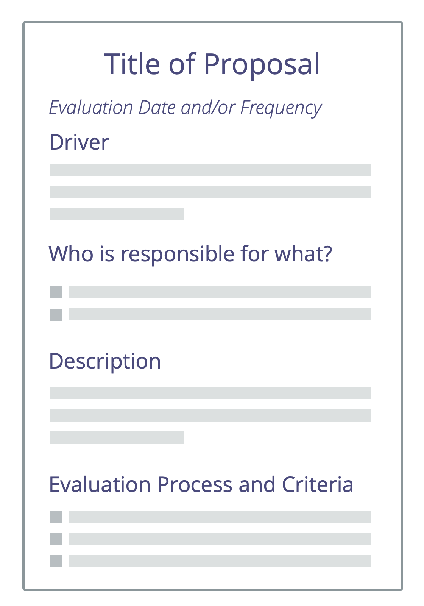

<strong>För samman människor så att de tillsammans kan skapa förslag som svar på organisatoriska drivkrafter: utnyttja kollektiv intelligens, bygga upp en känsla av ägandeskap och öka engagemang och ansvarskänsla.</strong>

Det finns många sätt att skapa förslag tillsammans. De följer vanligtvis ett liknande mönster:

1. Enas om <a href="#" class="tooltip" title="Organizational Driver: A driver is a person’s or a group&#x27;s motive for responding to a specific situation. A driver is considered an **organizational driver** if responding to it would help the organization generate value, eliminate waste or avoid unintended consequences.">drivkraften</a> (eller problemet / tillfället / behovet)
2. Utforska ämnet och förstå begränsningar
3. Generera idéer
4. Formulera ett förslag (ofta gjort av en mindre grupp)

Ett sätt att samskapa förslag är att använda S3s mönster [Förslagsformulering](proposal-forming.html).

För inspiration till steg 2 och 3, titta på klassiska grupparbetstekniker eller "Design Thinking".

Förutom att göra detta i fysiska möten kan processen anpassas för videomöten. Det går även att använda den asynkront (och under en längre tid) vilket gör det möjligt att inkludera många människor.

<a href="involve-those-affected.html" title="Back to: Involvera de som påverkas">◀</a> <a href="co-creation-and-evolution.html" title="Up: Co-Creation and Evolution">▲</a> <a href="proposal-forming.html" title="Read next: Förslagsformulering">▶ Read next: Förslagsformulering</a>

