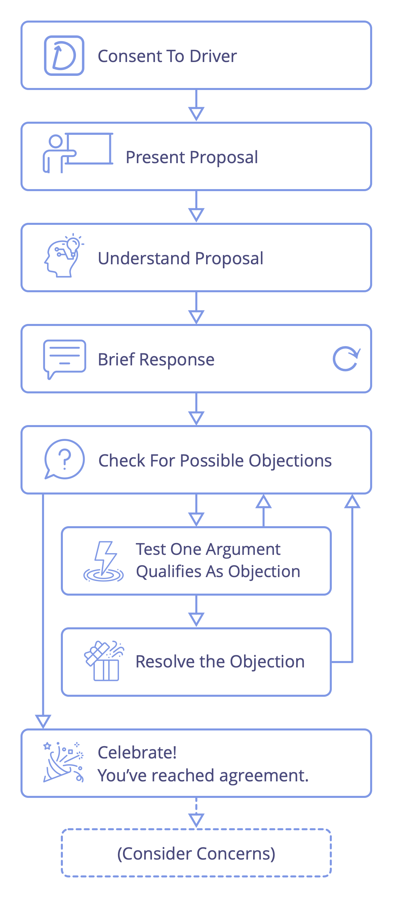

<strong>En (faciliterad) grupprocess för beslutsfattande: välkomna invändningar, och överväg nyupptäckt information och kunskap för att ytterligare förädla förslag eller befintliga avtal.</strong>

Förslag blir <a href="#" class="tooltip" title="Överenskommelse: An agreed upon guideline, process, protocol or policy designed to guide the flow of value.">överenskommelser</a> när de anses *tillräckligt bra för tillfället och tillräckligt säkra för att provas* fram till nästa utvärdering.

Oupplösta <a href="#" class="tooltip" title="Invändning: An argument relating to a (proposed) agreement or activity that reveals unintended consequences you’d rather avoid, or that demonstrates worthwhile ways to improve.">invändningar</a> hindrar förslag från att bli överenskommelser.

Att undanhålla invändningar kan försvåra uppnåendet av syftet för ett team eller organisation.

## Underförstådda regler vid samtyckesbeslut

1. I avsaknad av invändningar mot en överenskommelse har jag för avsikt att följa överenskommelsen efter bästa förmåga.
2. Jag kommer att dela invändningar när jag blir medveten om dem.

<a href="describe-organizational-drivers.html" title="Back to: Beskriv organisatoriska drivkrafter">◀</a> <a href="co-creation-and-evolution.html" title="Up: Co-Creation and Evolution">▲</a> <a href="test-arguments-qualify-as-objections.html" title="Read next: Kontrollera om argument är invändningar">▶ Read next: Kontrollera om argument är invändningar</a>

