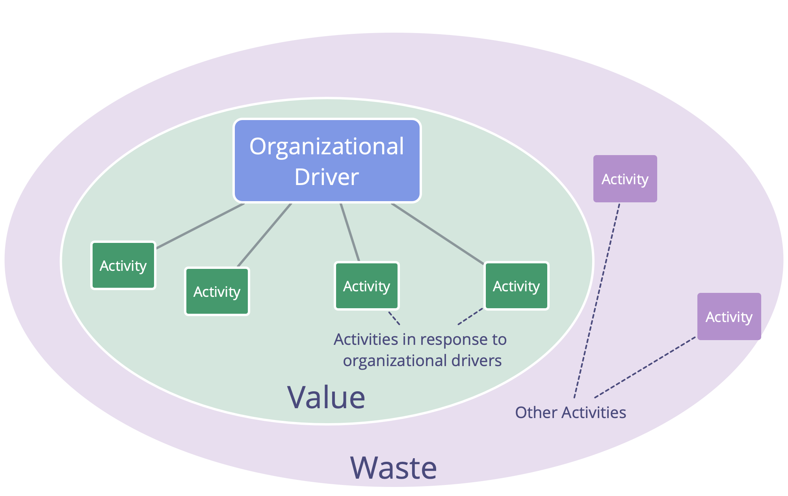

<strong>Identifiera drivkrafter och etablera ett flödes- och evidensbaserat system för organisatorisk förändring genom att kontinuerligt förbättra och förfina processerna.</strong>

- introducera principen om samtycke och [Navigera via spänning](navigate-via-tension.html) för att utveckla processerna i ett team
- överväga att välja en facilitator för att leda en grupps processer, och välja värderingar för att vägleda beteenden
- initiera en process av ständiga förbättringar, t.ex. genom Kanban eller regelbundna [retrospektiv](retrospective.html)
- medlemmarna i ett team använder nya mönster från S3 efter behov
- när det är värdefullt, utöka stegvis omfattningen av experiment att omfatta andra grupper
- leta medvetet efter hinder för förändring eller i arbetet

## Spill och kontinuerlig förbättring

_**Waste** is anything unnecessary for — or standing in the way of — a (more) effective response to a driver._

Spill finns i olika former och på olika nivåer av abstraktion (uppgifter, processer, organisationsstruktur, mentala modeller ...)

En ständigt pågående process för att eliminera olika typer av spill möjliggör en organisations naturliga utveckling mot större effektivitet och anpassning till förändrade sammanhang.

<a href="open-space-for-change.html" title="Back to: Öppen kultur för förändring">◀</a> <a href="bringing-in-s3.html" title="Up: Bringing in S3">▲</a> <a href="defining-agreements.html" title="Read next: Definiera avtal">▶ Read next: Definiera avtal</a>

