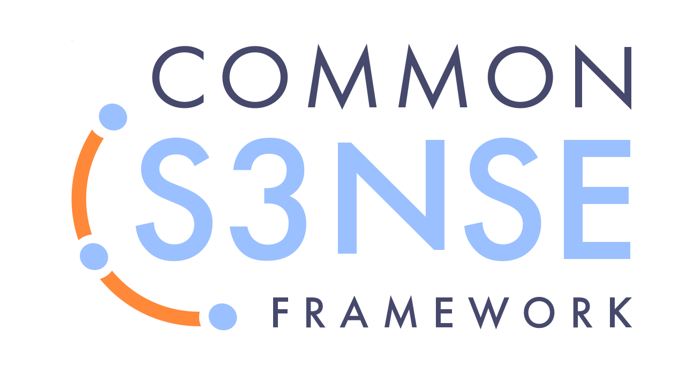

Vi ser ett framväxande gemensamt sunt förnuft som transformerar organisationer runt om i världen, som inspirerar och gör det möjligt för människor att bygga framgångsrika organisationer där BÅDE människor och organisationen frodas.

Vi har summerat kärnan i detta _sunda förnuft_ till ett koncist ramverk för team och organisationer: **"The Common Sense Framework" (CSF) - ramverket för sunt förnuft** - är ett verktyg för att skapa mening och förståelse, utformat för att hjälpa människor att ta itu med de utmaningar och möjligheter de står inför. Det stöttar byggandet av en gemensam förståelse för helheten, att identifiera och prioritera behovsområden inom ett team och i en organisation, och förstå vad man ska fokusera på som nästa steg.

Vi korsrefererade de 10 principer som utgör ramen till mönstren i S3, så att man kan använda CSF som en guide för att identifiera de mönster som hjälper till att tillgodose specifika behov.

CSF kan tillämpas för att utveckla enskilda team eller hela organisationer. 
