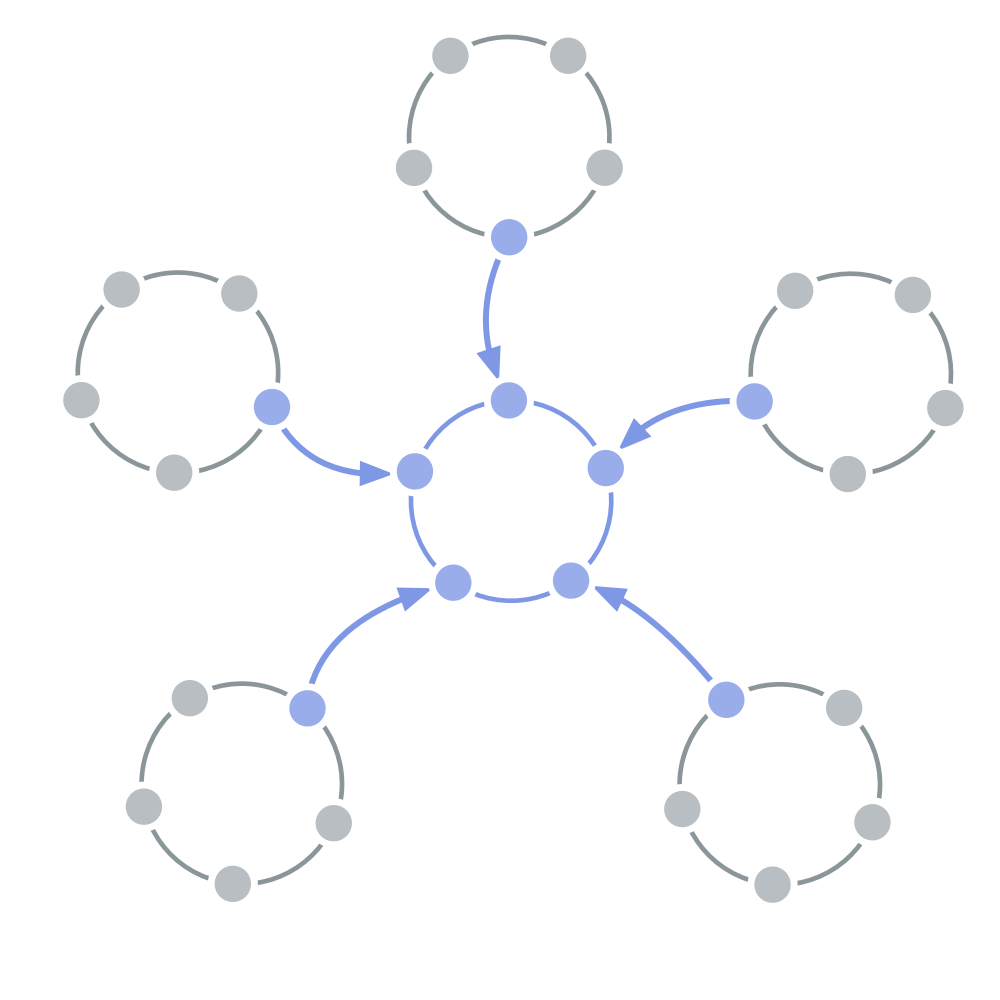

<strong>Delegera beslut om strukturell styrning som påverkar flera domäner till en grupp av representanter som valts ut av dessa domäner.</strong>

För att fatta beslut om <a href="#" class="tooltip" title="Strukturell styrning: Processen att fastställa mål och fatta och förädla beslut som vägleder människor mot att uppnå dessa mål.">strukturell styrning</a> å deras vägnar skickar intressenter [representanter](representative.html) för att bilda en delegatscirkel.

De beslut om strukturell styrning som fattas i en delegatscirkel gäller för och skall genomföras i de olika <a href="#" class="tooltip" title="Domän: Ett tydligt avskiljt område av inflytande, aktivitet och beslutsfattande inom en organisation.">domäner</a> som den tjänar.

Delegatscirklar gör det möjligt att styra organisationer på ett sätt som är ensat med <a href="#" class="tooltip" title="Värdeflöde: Leverabler som rör sig genom en organisation mot kunder eller andra intressenter.">värdeflödet</a> och att sammanföra en mångfald perspektiv på beslut om den strukturella styrningen.

En delegatscirkel kan inkludera andra personer (t.ex. externa experter) för att hjälpa till med specifika beslut, eller till och med som medlem i cirkeln.

<a href="service-circle.html" title="Tillbaka till: Servicecirkel">◀</a> <a href="organizational-structure.html" title="Upp: Organisationsstruktur">▲</a> <a href="peach-organization.html" title="Läs vidare: Lagrad organisation">▶ Läs vidare: Lagrad organisation</a>

