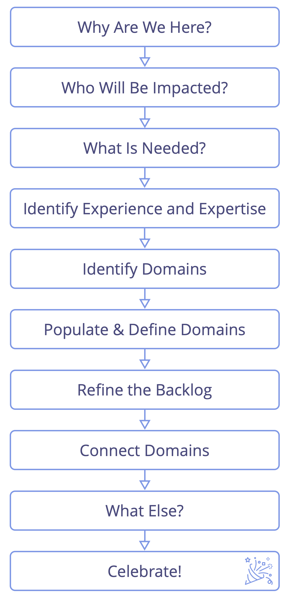

Ett workshopformat för större grupper att samskapa och organisera sig som respons på en komplex situation av betydande omfattning och skala.

Under workshopen tar intressenterna fullt ansvar för processen från början till slut, då de snabbt går från idé till fullt fungerande samarbete.

Identifiera relevanta intressenter, kartlägg relaterade krav och använd dem för att identifiera arbete som behöver göras och beslut som behöver fattas, distribuera arbetet och definiera en initial struktur för samarbete.

Ni kan använda Kartläggning av drivkrafter till att:

-   organisera start-ups,
-   kickstarta projekt,
-   tackla stora hinder eller möjligheter,
-   genomföra strategi,
-   utveckla organisationsstrukturen för att bättre stötta värdeflödet.

Resultatet av en workshop för kartläggning av drivkrafter är vanligen:

-   en fördelning av arbete, kategoriserad i ett antal domäner, centrerade kring intressenternas behov.
-   en skräddarsydd organisationsstruktur som sammanför alla delar, inklusive sammanlänkning av domäner för att hantera beroenden.
-   ett första utkast till prioriterade planeringslistor för strukturell styrning och operationell verksamhet för varje identifierad underdomän.
-   delegering av inflytande och fördelning av människor till underdomäner genom självutnämnande och nominering.

Även om kartläggning av drivkrafter ofta används för att identifiera och definiera nya domäner, har det också sin användning vid identifiering och fördelning av drivkrafter för strukturell styrning och operativ verksamhet i redan existerande domäner i en organisation, t.ex. när ett initiativ ska behandlas av befintliga team i en organisation, eller om ett team tycker att de sitter fast i sin nuvarande struktur och letar efter inspiration för hur man stegvis anpassar den. Arbetsgruppen kan bestämma om det är lämpligt att mappa drivkrafterna till befintliga domäner, räkna ut vilka nya som skulle behöva skapas, eller till och med skapa en ny struktur från grunden.

Små team eller cirklar (max. 6-8 personer), kan, när det inte är prioriterat att fördela arbete, använda bara steg 1-5, för att förstå omfattningen och fylla på planeringslistorna för den strukturella styrningen och operationella verksamheten, för att sedan använda förslagsformulering eller någon annan strategi för att identifiera strategi och/eller nästa steg.

Som förberedelse:

-   Bjud in personer som kan bidra på ett relevant sätt till detta projekt. Skicka ut dagordningen för workshopen i förväg.
-   Skicka med beskrivningen av den primära drivkraften, och om det berör en redan existerande domän, domänbeskrivningen för projektet/initiativet i förväg så att människor kan bekanta sig med det. Sikta på att lösa eventuella invändningar före workshopen.
-   Deltagarna kan förbereda sig redan innan workshopen genom att tänka igenom och anteckna sina idéer om aktörer och relaterade behov.
-   Förbered en affisch med domänbeskrivningen för att presentera i det första steget. Du kommer också att behöva A5-paper, post-its, pennor och en bred vägg eller yta att arbeta vid.

## Arbetsflöde för kartläggning av drivkrafter

Följ dom här stegen:

### 1. Varför är vi här?

_Presentera och säkra samtycke kring den primära drivkraften_

-   Presentera den primära drivkraften för gruppen.
-   Samtycke till drivkraften - _är den tillräckligt tydligt beskriven? Är den relevant för oss att agera på?_
-   Förtydliga eventuella begränsningar från delegatorn, t.ex. budget, färdigdatum, förväntningar etc. Om kartläggningen sker inom en existerande domän presentera även domänbeskrivningen. Öppna för ytterligare frågor som kan fördjupa förståelsen för vad som händer och vad som behövs.
-   Tydliggör nivå av engagemang som förväntas av deltagarna. T.ex. förväntas deltagarna vara här bara under workshopen, eller under hela initiativet etc.
-   Anteckna all relevant information som kommer fram.

### 2. Vem kommer att påverkas?

_Vem kommer att påverkas när vi agerar på den primära drivkraften? Överväg vem som kan hjälpa / stå i vägen / nytta/förlora eller skadas._

-   Sätt upp aktörerna på en tavla t.ex med hjälp av notis-lappar
-   Fokusera på faktiska personer som kommer att påverkas av detta initiativ (grupper eller individer), och undvik i detta skede att göra antagande om framtida roller (såsom _projektledare_) eller andra domäner (t.ex _Marknadsavdelningen_).

### 3. Vad behövs?

_Tänk på de olika aktörerna och beskriv vad som behövs: vad behöver de i förhållande till den primära drivkraften, och vad behöver vi av dem?_

-   Skriv varje förslag på en separat klisterlapp ("behovskort")
-   Beskriv behovet samt den förväntade effekten av att svara på detta behov
-   Använd formatet _"Vi/de behöver … så att …"_
-   Skriv aktörens namn i det övre vänstra hörnet av kortet
-   Skriv ditt namn i det övre högra hörnet av kortet

### 4. Identifiera erfarenhet och expertis

_Identifiera de som har erfarenhet eller expertis att svara på behoven, så att när människor senare agerar på ett specifikt behov de förstå veta vem som kan ha värdefulla kommentarer eller idéer._

-   Ta dig tid att bekanta dig med de olika _behovskorten_.
-   Skriv ditt namn på de _behovskort_ som du har erfarenhet av, eller idéer om hur man skulle kunna åtgärda, så att det går att rådgöra med dig senare i processen.
-   Överväg att lägga till namn på personer som inte är närvarande om du tror att de skulle kunna göra ett värdefullt bidrag.
-   Skriv namnet/namnen på dessa personer längst ner på _behovskortet_.
-   Att skriva sitt eget namn på ett kort i detta steg innebär inte att du tar ansvar för behovet, bara att du kan, och är villig att, bidra till att hitta en lösning i det kommande arbetet.

### 5. Identifiera domäner

_Gruppera aktörer och/eller behov, i förhållande till relevans, till sammanhängande **domäner** som utgångspunkt för sortering och prioritering av behoven. Överväg hur man optimerar leverans av värde längs hela flödet till de olika aktörer som identifierades i steg 2._

Några sätt att identifiera domäner:

-   Gruppera liknande aktörer (aktörs-fokus)
-   Gruppera liknande behov (behovs-fokus)
-   En kombination av båda (av ovanstående) är vanligt

Detta steg kan anses klart när det finns en överenskommelse om en första iteration av hur meningsfullt arbete är fördelat. Kom ihåg att det när som helst går att göra ändringar i de domäner som definierats (under workshoppen eller senare), så målet behöver bara vara något som är tillräckligt bra som en start.

_Facilitatorn stöttar gruppen i deras självorganisering och uppmärksammar personer som inte är fokuserade på konversationen. Processen innehåller ofta en fas som kan verka kaotisk för vissa deltagare, vilket kan få dem att känna sig obekväma. För att testa om ett resultat har uppnåtts, fråga efter invändningar mot att domänerna är tillräckligt bra för tillfället._

### 6. Populera & definiera domäner

_Låt deltagarna organisera sig i mindre grupper runt de olika domänerna, sedan definiera domänen och ge den ett namn._

-   Bilda små grupper för domänerna enligt erfarenhet och intresse.
-   Lägg till minst 1 eller 2 personer med expertis först. Använd informationen på korten.
-   Kontrollera att alla domäner har tagits om hand tillräckligt.
-   I varje grupp:
    -   enas om ett namn på domänen.
    -   definiera den primära drivkraften för domänen (och skissa på en kort domänbeskrivning om det hjälper).
-   Slutligen, låt varje grupp göra en kort presentation av sin domän, och under dem var uppmärksam på beroenden och eventuella överlapp mellan domänerna.

I denna fas kan några personer vandra mellan domäner tills de hittar en som de känner att de kan bidra till.

### 7. Förädla planeringslistorna

_Organisera arbetet framåt inom varje område, säkra att behoven prioriteras och beskrivs tillräckligt tydligt._

-   För varje domän, kopiera mallen nedan till ett blädderblock
-   Skriv ner alla kvarvarande behov på varsitt kort och sortera in dom i de två planeringslistorna på blädderblocket:
    -   operativ planeringslista: behov som det direkt går att agera på
    -   strukturell planeringslista: behov som skulle må bra av eller behöver ett beslut
-   Kombinera och omformulera kort vid behov, så att beskrivningen på varje kort är tydlig. Konsultera författaren till kortet när du är osäker.
-   Ordna korten i varje lista enligt prioritet.
-   Arkivera alla kort som verkar överflödiga.
-   Studera domänen och beskriv och prioritera andra behov som inte identifierats tidigare.
-   Vidarebefordra de kort som verkar beskriva behov som ligger innanför andra domäners ansvar.
-   Lägg undan kort relaterade till flera domäner. Du kan ta itu med dem i steg 8.

_Facilitatorn av arbetet med att kartlägga drivkrafter tillhandahåller en plats där kort som berör flera domäner samtidigt så att de kan hanteras senare._

Pausa regelbundet för att rapportera framsteg mellan grupperna som arbetar med de olika domänerna. Obs: Vissa domäner kan upplösas, ändras eller slås samman med andra.

### 8. Koppla domäner

_Skapa en struktur för att hantera beroenden och frågor som sträcker sig utanför domänen eller berör den bredare organisationen_

-   I en ny organisation eller nytt projekt, överväg  [delegatscirklar](delegate-circle.html), [servicecirklar](service-circle.html) eller [dubbellänkning mellan domäner](double-linking.html).
-   I en existerande organisation, överväg också att koppla till redan befintliga domäner i organisationen.

### 9. Vad mer?

_Reservera tid för att kontrollera om något saknas._

Vad mer behöver vi tänka på för att...

-   ...vara trygga nog att starta?
-   ...ta itu med den primära drivkraften?

### 10. Fira!

_Ta tid att fira det som uppnåtts för att komma igång med organisationen eller initiativet!_
	