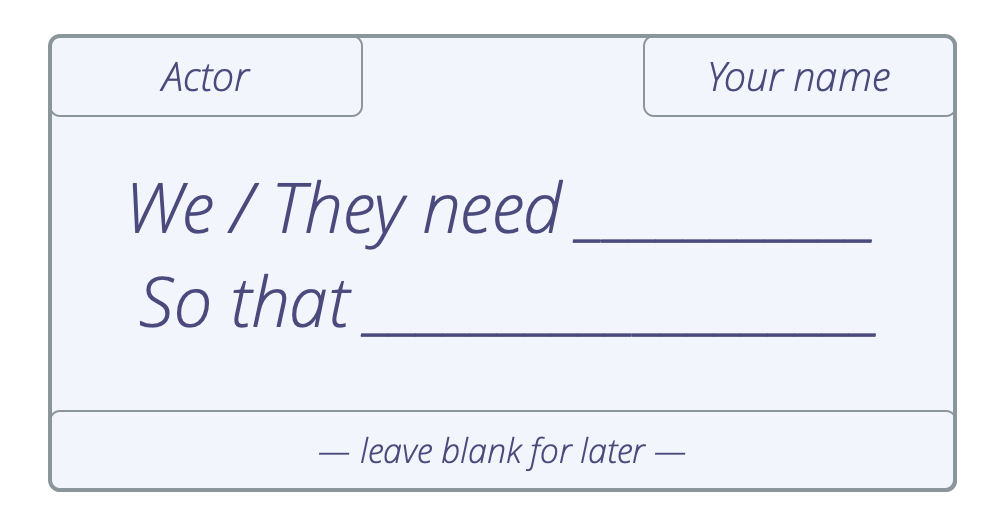
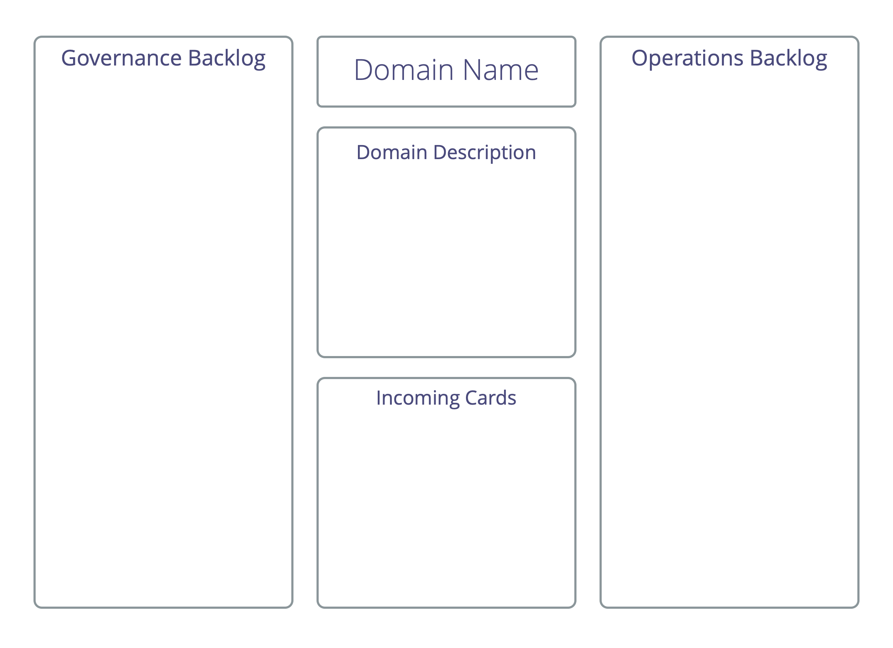

<strong>Ett workshopformat för stora grupper att samskapa och organisera sig som svar på en komplex situation av betydande omfattning och skala.</strong>

Under workshopen tar intressenterna fullt ansvar för processen från början till slut, då de snabbt går från idé till fullt fungerande samarbete.

Identifiera relevanta intressenter, kartlägga relaterade krav och använd dem för att identifiera arbete som behöver göras och beslut som behöver fattas, distribuera arbetet och definiera en initial struktur för samarbete.

Du kan använda Kartläggning av drivkrafter till att:

- organisera start-ups, 
- kickstarta projekt, 
- tackla stora hinder eller möjligheter, 
- genomföra strategi,
- utveckla organisationsstrukturen för att bättre stötta värdeflödet.

Resultatet av en workshop för kartläggning av drivkrafter är vanligen:

- a distribution of work, categorized in a number of domains, centered around the needs of stakeholders. 
- en skräddarsydd organisationsstruktur som sammanför alla delar, inklusive sammanlänkning av domäner för att hantera beroenden.
- ett första utkast till prioriterade planeringslistor för strukturell styrning och operationell verksamhet för varje identifierad underdomän.
- delegering av inflytande och fördelning av människor till underdomäner genom självutnämnande och nominering.

Även om kartläggning av drivkrafter ofta används för att identifiera och definiera nya domäner, har det också användning vid identifikation och fördelning av drivkrafter för strukturell styrning och operativa verksamhet bland redan existerande domäner i en organisation, t.ex. när ett initiativ ska behandlas av befintliga team i en organisation, eller om ett team tycker att de sitter fast i sin nuvarande struktur och letar efter inspiration för hur man stegvis anpassar den. Arbetsgruppen kan bestämma om det är lämpligt att mappa drivkrafterna till befintliga domäner, räkna ut vilka nya som skulle behöva skapas, eller till och med skapa en ny struktur från grunden.

I ett litet team eller cirkel (max. 6-8 personer), när det inte är prioriterat att fördela arbete, kan teamet använda bara steg 1-5, för att förstå omfattningen och fylla på planeringslistorna för den strukturella styrningen och operationella verksamheten, för att sedan använda förslagsformulering eller någon annan strategi för att identifiera strategi och / eller nästa steg.

Som förberedelse:

- Bjud in personer som kan bidra på ett relevant sätt till projektet. Skicka ut dagordningen för workshopen i förväg. 
- Skicka med den primära drivkraften som ska arbetas med, och om det gäller en eller flera befintliga domäner, domänbeskrivningen för projektet/initiativet i förväg så att människor kan bekanta sig med det. Sikta på att lösa eventuella invändningar före workshopen.
- Deltagarna kan förbereda sig redan innan workshopen genom att tänka igenom och anteckna sina idéer om aktörer och relaterade behov.
- Förbered en plansch med domänbeskrivningen för att kunna presentera den redan i det första steget. Du kommer också att behöva A5-papper och rektangulära postit-lappar, pennor och en bred vägg. 

## Arbetsflöde för kartläggning av drivkrafter

Följ dom här stegen:

### 1. Varför är vi här?

*Presentera och säkra samtycke kring den primära drivkraften*

- Presentera den primära dirvkraften för gruppen 
- Samtycke kring drivkraften – *Är detta en tillräckligt tydlig beskivning av drivkraften? Är den relevant för oss att svara på*?
- Förtydliga eventuella begränsningar från delegatorn, t.ex. budget, färdigdatum, förväntningar etc. Om kartläggningen sker inom en existerande domän presentera även domänbeskrivningen. Öppna för ytterligare frågor som kan fördjupa förståelsen för vad som händer och vad som behövs. 
- Beskriv tydligt förväntningarna på deltagarna. T.ex om deltagarna förväntas deltaga under workshoppen eller under hela initiativet, etc.
- Anteckna all relevant information som kommer fram.

### 2. Vem kommer att påverkas?

*Vem kommer att påverkas när vi svarar på den primära drivkraften? Överväg vem som kan hjälpa / stå i vägen / tjäna / förlora eller skadas.*

- Sätt upp aktörerna på en tavla t.ex med hjälp av notis-lappar
- Fokusera på faktiska personer som kommer att påverkas av detta initiativ (grupper eller individer), och undvik i detta skede att göra antagande om framtida roller (såsom *projektledare*) eller andra domäner (t.ex *Marknadsavdelningen*).

### 3. Vad behövs?

*Tänk på de olika aktörerna och beskriv vad som behövs: vad behöver de i förhållande till den primära drivkraften, och vad behöver vi av dem?*

- Skriv varje förslag på en separat klisterlapp ("behovskort")
- Beskriv behovet samt den förväntade effekten av att svara på detta behov
- Använd formatet *"Vi/de behöver … så att …"*
- Skriv aktörens namn i det övre vänstra hörnet av kortet
- Skriv ditt namn i det övre högra hörnet av kortet

### 4. Identifiera erfarenhet och expertis

*Identifiera dem som har erfarenhet eller expertis att svara på behoven, så att senare, när människor agerar på ett specifikt behov, de vet vem som kan ha värdefulla kommentarer eller idéer.*

- Ta dig tid att bekanta dig med de olika *behovskorten*.
- Skriv ditt namn på de *behovskort* som du har erfarenhet av, eller idéer om hur man skulle kunna åtgärda, så att det går att rådgöra med dig senare i processen. 
- Överväg att lägga till namn på personer som inte är närvarande om du tror att de skulle kunna göra ett värdefullt bidrag.
- Skriv namnet/namnen på dessa personer längst ner på *behovskortet*.
- Att skriva sitt eget namn på ett kort i detta steg innebär inte att du tar ansvar för behovet, bara att du kan, och är villig att, bidra till att hitta en lösning i det senare arbetet.

### 5. Identifiera domäner

*Gruppera aktörer och/eller behov, i förhållande till relevans, till sammanhängande **domäner** som utgångspunkt för sortering och prioritering av behoven. Överväg hur man optimerar end-to-end-leverans av värde till de olika aktörer som du identifierade i steg 2.*

Sätt att identifiera domäner:

- Gruppera liknande aktörer (aktörs-fokus)
- Grupper liknande behov (behovs-fokus)
- En kombination av båda (av ovanstående) är vanligt

Detta steg är klart när det finns en överenskommelse om en första omgång av fördelat meningsfullt arbete. Kom ihåg att det när som helst går att göra ändringar i de domäner som definierats (under workshoppen eller senare), så målet behöver bara vara något som är tillräckligt bra som en start.n

*En facilitator bör stötta gruppen i självorganisering och vara uppmärksam på personer som inte är fokuserade på konversationen. Process innehåller ofta en fas som kan verkar kaotisk för vissa deltagare, vilket kan få dem att känna sig obekväma. För att testa om ett resultat har uppnåtts, fråga efter invändningar mot att domänerna är tillräckligt bra för tillfället.*

### 6. Populera & definiera domäner

*Människor organiserar sig i mindre grupper runt de olika domänerna, definierar sedan domänen och ger den ett namn.*

- Bilda små grupper för domänerna enligt erfarenhet och intresse
- Börja grupperna med 1 eller 2 personer som har expertis. Använd informationen på behovskorten 
- Kontrollera att alla domäner har tagits om hand ordentligt 
- I varje grupp: 
    - enas om ett namn för domänen.
    - definiera den primära drivkraften för domänen (och skissa på en kort domänbeskrivning om det hjälper). 
- Slutligen, låt varje grupp kort presentera sin domän, och under dem var uppmärksam på beroenden och eventuella överlapp mellan domänerna.

I denna fas kan några personer vandra mellan domäner tills de hittar en som de känner att de kan bidra till.

### 7. Refine the Backlogs

*Organize the work that lies ahead in each domain, ensure things are prioritized and described clearly.*

- For each domain, copy the template below to a flip chart
- Sort all remaining needs into the two backlogs on the flip chart: 
    - operations backlog: needs that can be acted
    - governance backlog: needs that would benefit from or necessitate a decision
- Combine and rephrase cards as necessary, so that description on each card is clear. Consult the author of the card when in doubt.
- Prioritize the cards in each board.
- Archive any “needs” cards that appear superfluous.
- Consider the domain and describe and prioritize other needs that may not have been identified.
- Pass on cards that appear to be the accountability of another domain to address.
- Add cards concerning multiple domains to a dedicated backlog to address later.

_As a facilitator of the driver mapping process, provide a space to collect cards concerning multiple domains so that they can be addressed later. _

Regularly pause to share reports between the various domains. Note: Some domains might dissolve, change or merge with others.

### 8. Koppla ihop domäner

*Create structure to manage dependencies and deal with matters that extend beyond the scope of one domain or concern the wider organization*

- For a new organization or project, consider [Delegate Circles](delegate-circle.html), [ Service Circles](service-circle.html) or [Double-linking between domains](double-linking.html).
- For an existing organization, also consider connecting to existing domains in the organization.

### 9. Vad mer?

*Take a moment to check if anything’s missing.*

What else do we need to consider…

- …to run safely?
- …to address the primary driver? 

### 10. Fira!

*Take a moment to celebrate your achievements in getting your organization or initiative started!*

<a href="role-selection.html" title="Back to: Rollutnämning">◀</a> <a href="co-creation-and-evolution.html" title="Up: Co-Creation and Evolution">▲</a> <a href="peer-development.html" title="Read next: Kollegial utveckling">▶ Read next: Kollegial utveckling</a>

