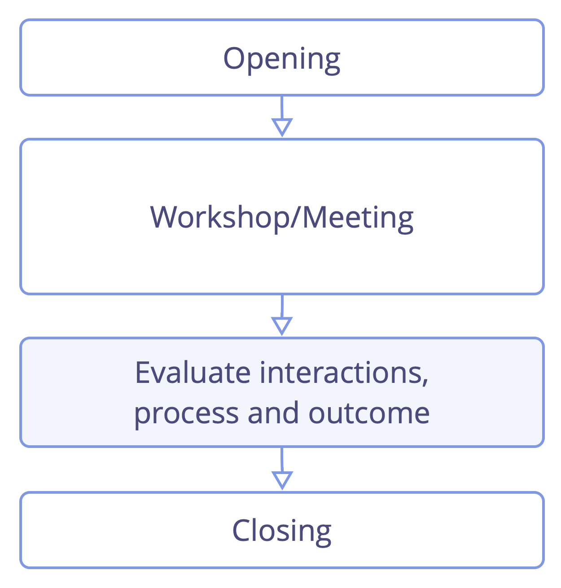

<strong>Se till att det finns tid att lära i slutet av varje möte eller workshop.</strong>

Reflektera över interaktioner, fira framgångar och dela förslag på förbättringar innan mötet avslutas.

- reservera 5 minuter av varje timme, eller 15 minuter om det är en heldagsaktivitet
- registrera lärdomarna och se över dom inför nästa möte

Några förslag på korta format:

- mer av/mindre av/börja med/sluta med/behåll
- positiva/kritiska/föreslagna förbättringar

## Utvärdera möten: Långt format

Ask everyone in a [round](rounds.html) to reflect on any or all of the following topics in a brief sharing, and report key points you'd like to remember for next time:

- verkan och format
- facilitering och deltagande
- emotionell ton
- uppskattningar och prestationer (jag gillade...)
- utvecklingsområden och förbättringsförslag (jag önskar...)
- galna idéer och radikala förslag (tänk om...)

<a href="check-in.html" title="Back to: Incheckning">◀</a> <a href="meeting-practices.html" title="Up: Mötespraxis">▲</a> <a href="meeting-host.html" title="Read next: Mötesvärd">▶ Read next: Mötesvärd</a>

