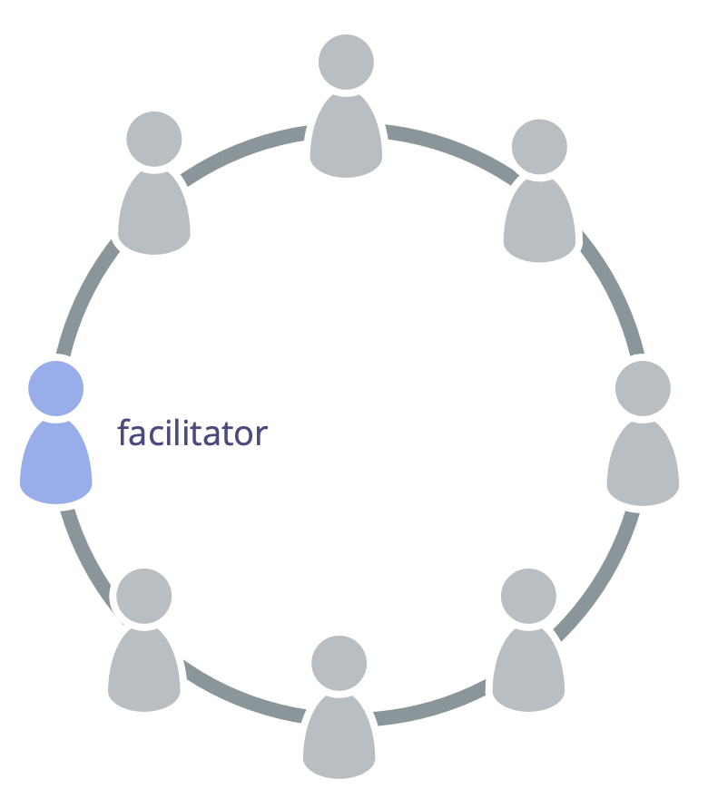

<strong>Välj någon att facilitera mötena för strukturell styrning.</strong>

En facilitator för <a href="#" class="tooltip" title="Strukturell styrning: Processen att fastställa mål och fatta och förädla beslut som vägleder människor mot att uppnå dessa mål.">strukturell styrning</a>

- säkerställer att [möten för strukturell styrning](governance-meeting.html) fokuserar på rätt saker och utvärderas
- väljs (oftast) av ett <a href="#" class="tooltip" title="Team: En grupp människor som samarbetar mot en gemensam drivkraft (eller mål). Vanligtvis är ett team en del av en organisation, eller så bildas det som ett samarbete mellan flera organisationer.">team</a> bland dess medlemmar (och för en viss period)
- bekantar sig med [planeringslistan för strukturell styrning](governance-backlog.html)
- bjuder ofta in andra att facilitera vissa punkter på dagordningen

Som facilitator för möten för strukturell styrning bör du överväga att lära dig om och använda följande mönster från S3 för att hantera den strukturella styrningen på ett effektivt sätt:

- [Rundor](rounds.html)
- [Förslagsformulering](proposal-forming.html)
- [Samtyckesbeslut](consent-decision-making.html)
- [Rollutnämning](role-selection.html)
- [Utvärdera möten](evaluate-meetings.html)
- [Lös upp invändningar](resolve-objections.html)
- [Kollegial utvärdering](peer-review.html)

<a href="agree-on-values.html" title="Tillbaka till: Enas om värderingar">◀</a> <a href="enablers-of-collaboration.html" title="Upp: Främja samarbete">▲</a> <a href="breaking-agreements.html" title="Läs vidare: Bryta överenskommelser">▶ Läs vidare: Bryta överenskommelser</a>

