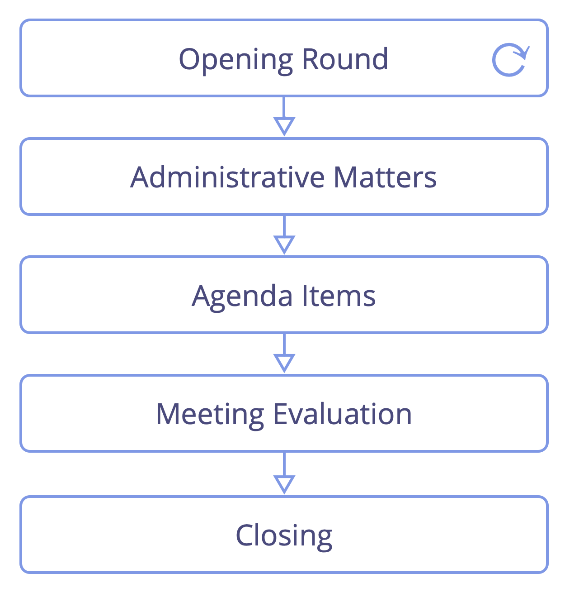

<strong>Teamen träffas med jämna mellanrum för att bestämma vad de ska göra för att uppnå målsättningarna, och för att avgränsa hur och när saker ska göras.</strong>

Ett möte för strukturell styrning är vanligtvis:

- faciliterat
- förberett
- [tidsbegränsat](timebox-activities.html) till 90-120 minuter
- schemalagt till varannan till var fjärde vecka

Ett typiskt möte för strukturell styrning inkluderar:

- öppning: [checka in](check-in.html) med varandra och känn in avsikten med mötet
- administrativa frågor 
    - kontrollera samtycke till protokollet för det senaste mötet
    - kom överens om ett datum för nästa möte
    - kontrollera om några punkter på dagordningen tillkommit i sista minuten och gruppens samtycke till dagordningen
- punkter på dagordningen
- [mötesutvärdering](evaluate-meetings.html): reflektera över dina interaktioner, fira framgångar och dela förslag på förbättringar
- avslut: checka in med varandra innan du lämnar mötet

Typiska punkter på dagordningen är:

- korta rapporter
- utvärdering av befintliga <a href="#" class="tooltip" title="Överenskommelse: An agreed upon guideline, process, protocol or policy designed to guide the flow of value.">överenskommelser</a> som skall utvärderas enligt deras utvärderingsperiod
- utnämning av personer till roller
- nyupptäckta drivkrafter som kräver att beslut fattas, inklusive: 
    - [förslagsformulering](co-create-proposals.html)
    - [definiera överenskommelser](consent-decision-making.html)
    - [utforma domäner](clarify-and-develop-domains.html) och bestämma hur de ska hanteras (t.ex. nya [roller](role.html), [cirklar](circle.html), team eller [öppna domäner](open-domain.html))

<a href="focused-interactions.html" title="Up: Fokuserade interaktioner">▲</a> <a href="retrospective.html" title="Read next: Återblick">▶ Read next: Återblick</a>

