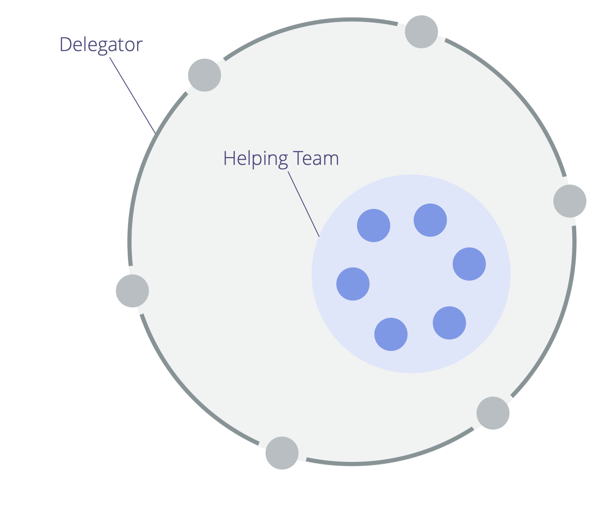

<strong>Samla ett team av likvärdiga människor med mandat att agera på en specifik uppsättning behov som definierats av en delegator.</strong>

Ett hjälpande team:

- är ett sätt för en <a href="#" class="tooltip" title="Delegator: En individ eller grupp som delegerar ansvarigheten för en domän till andra.">delegator</a> att öka sin kapacitet
- kan vara självorganiserande eller vägledd av en [koordinator](coordinator.html) som utsetts av delegatorn
- styrs av delegatorn
- har med fördel en tydligt definierad <a href="#" class="tooltip" title="Domän: Ett tydligt avskiljt område av inflytande, aktivitet och beslutsfattande inom en organisation.">domän</a>

Medlemmar i det hjälpande teamet:

- kan invända mot delegatorns beslut som påverkar dem
- kan lägga till punkter till delegatorns <a href="#" class="tooltip" title="Planeringslista för strukturell styrning: En synlig, prioriterad lista över ärenden (drivkrafter) som är kopplade till att styra en domän och kräver åtgärder.">planeringslista för den strukturella styrningen</a>
- kan bjudas in att välja en [representant](representative.html) att delta i strukturella styrningsbeslut av delegatorn

<a href="representative.html" title="Tillbaka till: Representant">◀</a> <a href="building-organizations.html" title="Upp: Bygga organisationer">▲</a> <a href="open-domain.html" title="Läs vidare: Öppen domän">▶ Läs vidare: Öppen domän</a>

