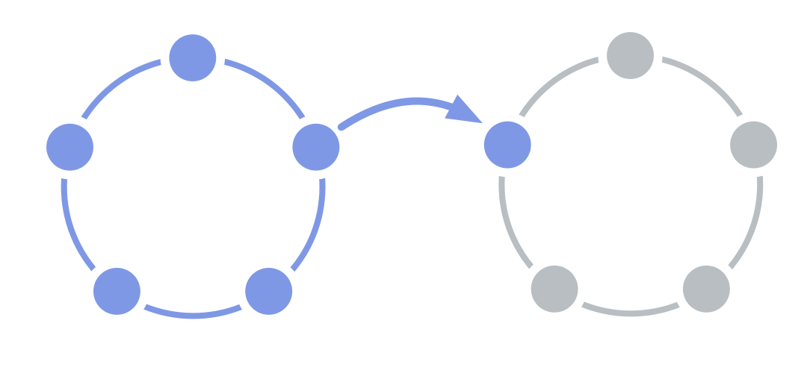

Möjliggör flöde av information och inflytande mellan två team.

Ett team väljer en av sina medlemmar att företräda sina intressen i beslut om den <a href="glossary.html#entry-governance" class="glossary-tooltip" data-toggle="tooltip" title="Strukturell styrning: Processen att fastställa mål och fatta och förädla beslut som vägleder människor mot att uppnå dessa mål.">strukturella styrningen</a> av ett annat team.

