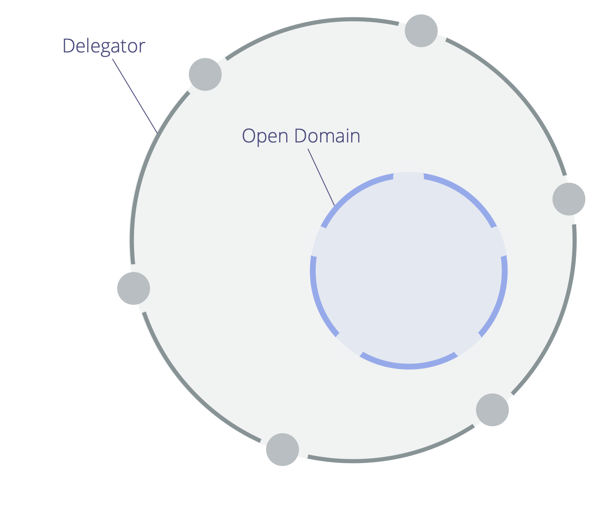

<strong>Avsiktligt skapa ansvar för en domän via inbjudan, snarare än genom utpekning och begäran, så att de inbjudna kan bidra när de kan.</strong>

<a href="#" class="tooltip" title="Delegator: An individual or group delegating responsibility for a domain to other(s).">Delegatorn</a> för den öppna domänen förtydligar:

- den <a href="#" class="tooltip" title="Primary Driver: The primary driver for a domain is the main driver that people who account for that domain respond to.">primära drivkraften</a>, huvudansvar och begränsningar för den öppna domänen
- vem som har bjudits in till att bidra till den öppna domänen
- begränsningar avseende delegatorns deltagande i den öppna domänens <a href="#" class="tooltip" title="Governance: The process of setting objectives and making and evolving decisions that guide people towards achieving those objectives.">strukturella styrning</a>

Beroende på de begränsningar som delegatorn fastställt, kan bidragsgivarna antingen bara <a href="#" class="tooltip" title="Operations: Doing the work and organizing day-to-day activities within the constraints defined through governance.">organisera och utföra arbete</a>, eller även delta i beslut avseende den strukturella styrningen.

En delegator skall säkra att det finns regelbundna återkopplingar för att stödja att arbetet och beslutsfattandet inom ett öppet område har rätt effekter.

<a href="helping-team.html" title="Back to: Hjälpande team">◀</a> <a href="building-organizations.html" title="Up: Bygga organisationer">▲</a> <a href="open-systems.html" title="Read next: Öppna system">▶ Read next: Öppna system</a>

