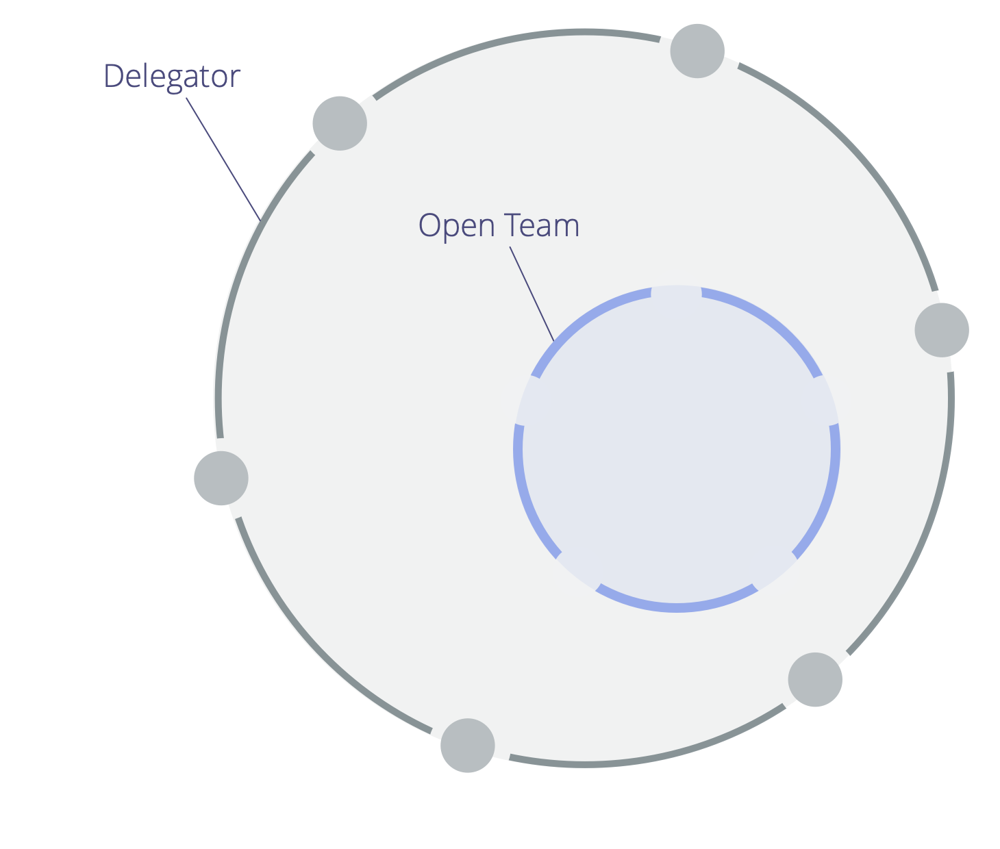

Avsiktligen skapa ansvar för en domän genom att bjuda in, snarare än genom att peka ut, och begära att de inbjudna bidrar när de kan.

_Ett **öppet team** är en grupp människor som bjuds in att bidra till det arbete och den styrning som görs inom en domän när de kan._

<a href="glossary.html#entry-delegator" class="glossary-tooltip" data-toggle="tooltip" title="Delegator: En individ eller grupp som delegerar ansvarigheten för en domän till andra.">Delegatorn</a> för den öppna domänen skapar en inbjudan som förtydligar:

- den <a href="glossary.html#entry-primary-driver" class="glossary-tooltip" data-toggle="tooltip" title="Primär drivkraft: Den primära drivkraften för en domän är den huvudsakliga drivkraften som de personer som ansvarar för den domänen agerar på.">primära drivkraften</a>, huvudansvar och begränsningar för det öppna teamets domän
- vem som är inbjuden att bidra (medlemmarna i det öppna teamet)
- begränsningar avseende delegatorns deltagande i den öppna teamets <a href="glossary.html#entry-governance" class="glossary-tooltip" data-toggle="tooltip" title="Strukturell styrning: Processen att fastställa mål och fatta och förädla beslut som vägleder människor mot att uppnå dessa mål.">strukturella styrning</a>

Beroende på de begränsningar som delegatorn fastställt, kan de som bidrar antingen bara <a href="glossary.html#entry-operations" class="glossary-tooltip" data-toggle="tooltip" title="Operativ verksamhet: Att organisera, planera och utföra de dagliga aktiviteterna inom de begränsningar som definierats genom strukturell styrning.">organisera och utföra arbete</a>, eller även delta i beslut avseende den strukturella styrningen.

Delegatorn är ansvarig för att genomföra regelbundna utvärderingar för att stödja att arbetet och beslutsfattande i det öppna teamet har rätt effekter.

