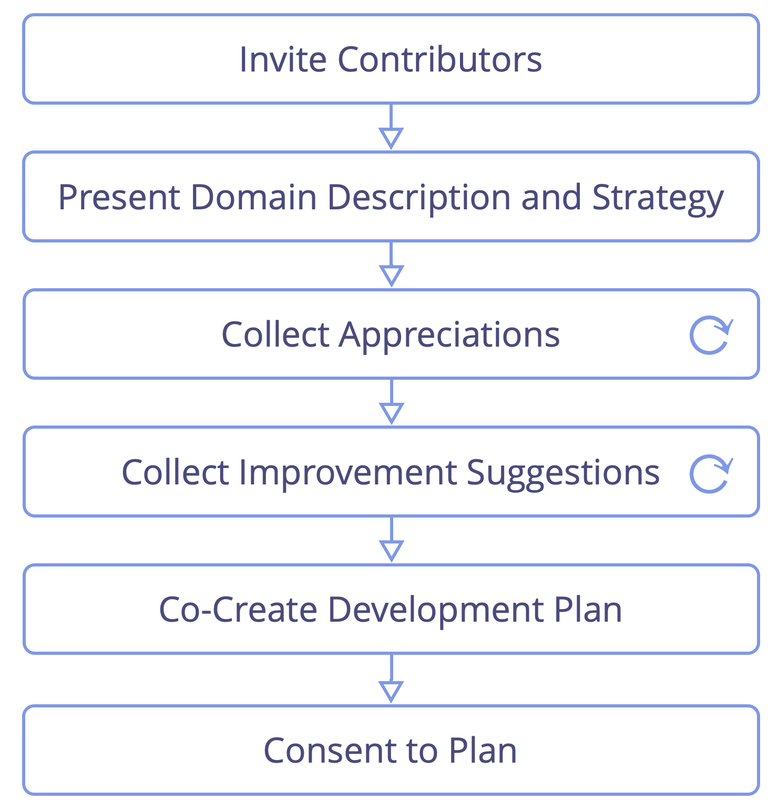

<strong>Stötta varandra i att lära och växa i de roller och team du arbetar i.</strong>

Rollinnehavaren — eller teamet — leder den kollegiala utvärderingen genom att sätta upp processen, och genom att tala först i varje steg.

Bjud in personer med komplementerande perspektiv för att bidra till utvärderingen samt en [facilitator](facilitate-meetings.html).

För både uppskattningar och förbättringsförslag, se till att du beaktar följande aspekter:

- **värdet** som delegaten bidragit med till organisationen genom att ansvara för <a href="#" class="tooltip" title="Domän: Ett tydligt avskiljt område av inflytande, aktivitet och beslutsfattande inom en organisation.">domänen</a>
- rollinnehavaren eller teamets **arbetsprocesser**, deras **samarbete** med <a href="#" class="tooltip" title="Delegator: En individ eller grupp som delegerar ansvarigheten för en domän till andra.">delegatorn</a> och med andra relevanta intressenter, och – i fallet med ett team – med varandra
- hur väl **delegatorn(-erna)** tar hand om sitt ansvar
- designen av själva domänen (och potentiellt utformningen av andra relaterade domäner)
- rollinnehavaren eller teamets **kompetens och förmågor** i förhållande till domänen
- den **<a href="#" class="tooltip" title="Strategi: Ett angreppssätt på hög nivå för hur människor skapar värde för att framgångsrikt kunna vara ansvarig för en domän.">strategi</a>** rollinnehavaren eller teamet följer att ansvara för denna domän

<a href="peer-feedback.html" title="Tillbaka till: Kollegial återkoppling">◀</a> <a href="peer-development.html" title="Upp: Kollegial utveckling">▲</a> <a href="development-plan.html" title="Läs vidare: Utvecklingsplan">▶ Läs vidare: Utvecklingsplan</a>

