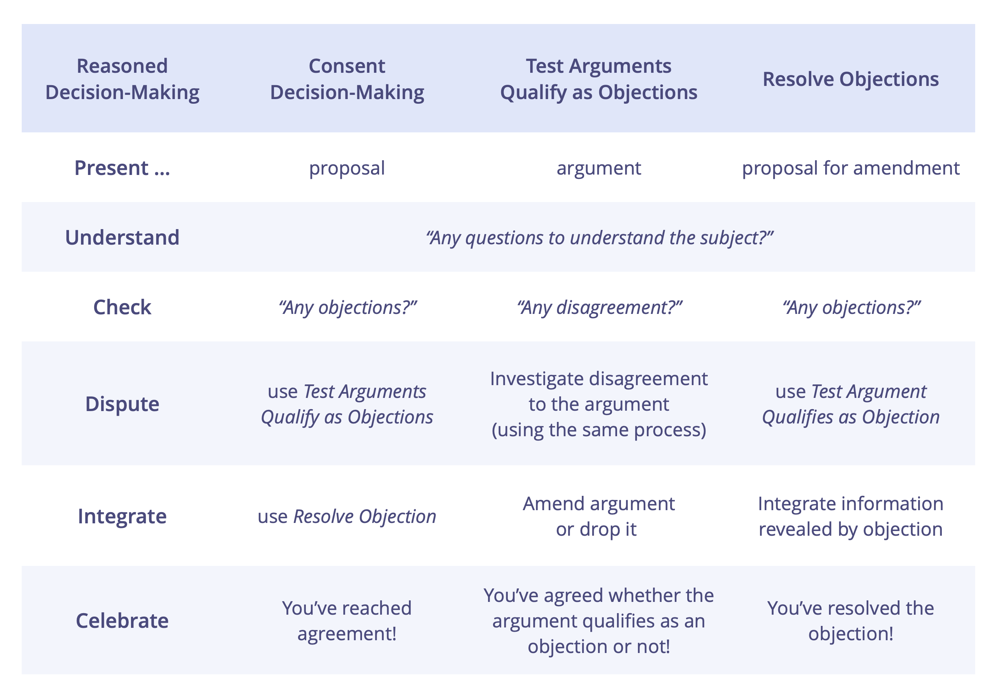

Engagera sig i en produktiv dialog genom att undersöka olika perspektiv och deltagarnas kunskaper för att nå samsyn om vad som betraktas som genomförbart, relevant, giltigt och empiriskt sant.

Det finns många vägar människor kan följa för att komma fram till ett beslut tillsammans med andra (majoritet, konsensus, auktoritativ, etc), men för varje tillvägagångssätt som använder resonemang som grund för denna samsyn så följer de vanligtvis ett mönster som liknar _Resonerande beslutsfattande_.

Resonerande beslutsfattande spänner upp den process som grupper använder när de applicerar resonemang för att pröva om ett förslag, existerande överenskommelse eller tillägg är tillräckligt bra eller om ett speciellt argument är relevant, giltigt eller empiriskt sant.

## Stegen i processen

**Steg 1: Presentera** ämnet för utredning (detta kan vara ett argument eller ett förslag om hur man går vidare).

**Steg 2: Förstå** ämnet (t.ex. genom klargörande frågor).

**Steg 3: Kontrollera** om någon inte håller med (vilket innebär att de ifrågasätter förslagets lämplighet eller giltigheten av argumentet), t.ex. genom att använda handsignaler. Eventuella meningsskiljaktigheter förklaras i steg 4. Om det inte finns några meningsskiljaktigheter, **gå vidare till steg 6** (Fira), annars hantera en oenighet åt gången och:

**Steg 4: Tvist:** Lyssna på resonemanget bakom oenigheten och avgör om argumentet som framförs har någon giltighet.

**Steg 5: Integrera** all information som framkommit i föregående steg för att förbättra ämnet, gå sedan tillbaka till steg 3.

**Steg 6: Fira** den uppnådda överenskommelse.

Hur människor tar sig igenom vart och en av dessa steg varierar och beror mycket på kultur, sammanhang, preferens, antalet inblandade personer och om huruvida de kommunicerar asynkront eller möts ansikte mot ansikte.

## Resonerande beslutsfattande i relation till andra mönster i S3

Resonerande beslutsfattande återspeglas i alla S3-mönster som stöder grupper att nå samsyn. Att förstå detta meta-mönster hjälper människor att mer effektivt tillämpa dem:

-   [Samtyckebeslut](consent-decision-making.html), för att pröva om ett förslag eller ett befintligt avtal är tillräckligt bra och tillräckligt säkert. Och inom detta, två nästlade mönster:
-   [Pröva om argument kvalificerar som invändningar](test-arguments-qualify-as-objections.html), för att kontrollera om argument kvalificerar sig som invändningar och endast agera på dem som gör det.
-   [Lös invändningar](resolve-objections.html), för att använda den information som uppenbarats av invändningar för att ingå och utveckla överenskommelser.

Var och en av de tre processerna fokuserar på utforskning av var sitt ämne:

-    I _samtyckesbeslut_ är ämnet ett **förslag**.
-    I _pröva om argument kvalificerar som invändning_ är ämnet ett **argument** som indikerar en möjlig invändning.
-    I _att lösa invändningar_ är ämnet ett **ändringsförslag**.

