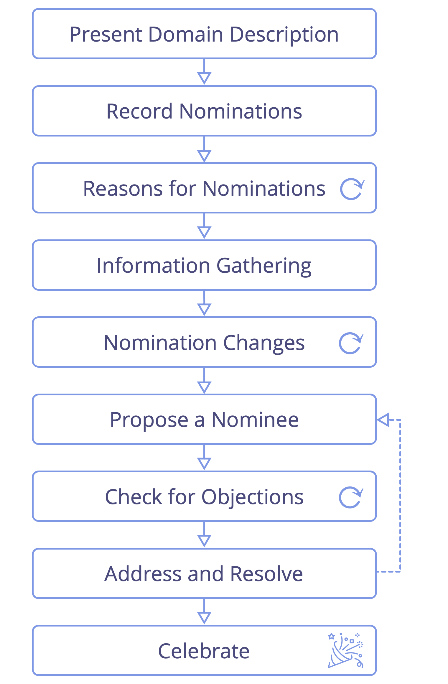

<strong>En (faciliterad) gruppprocess för att välja en person för en roll baserat på styrkan i argumenten.</strong>

Istället för att helt enkelt tilldela personer till [roller](role.html), eller göra ett val baserat på majoritet, använd processen för rollutnämning för att:

- utnyttja den kollektiva kunskapen genom att lyssna på och överlägga om argumenten för nomineringarna
- öka ägandeskapet över beslutet
- säkerställa stöd för rollinnehavaren från de påverkade.

En förutsättning för utnämningsprocessen är en [tydlig beskrivning](clarify-and-develop-domains.html) av rollens <a href="#" class="tooltip" title="Domän: A distinct area of influence, activity and decision making within an organization.">domän</a>.

## Rollutnämning - steg

1. **Presentera rollbeskrivningen:** Om möjligt, skicka ut domänbeskrivningen för rollen i förväg.
2. **Registrera nomineringar:** Deltagare skriver sina förslag på papper. Man kan föreslå sig själv, någon annan eller avstå.
3. **Argument för nomineringarna:** Varje person delar med sig av vem de nominerat och varför.
4. **Informationsinsamling:** Deltagarna delar eller begär information som kan stödja gruppen i att göra ett lämpligt val.
5. **Nomineringsändringar:** Kontrollera om någon vill ändra sin nominering på grund av de argument och den information som delats hittills, och lyssna på argumenten för ändringarna.
6. **Föreslå en kandidat** för rollen: Facilitatorn leder processen att identifiera en lämplig kandidat baserat på styrkan i de argument som presenterats, t.ex. genom att: 
    - själv föreslå en kandidat eller fråga en deltagare
    - bjuda in någon eller några kandidater att komma överens om vem som ska föreslås
    - bjuda in till gruppdialog för att uppdaga vem som är den starkaste kandidaten
7. **Kontrollera invändningar:** Be deltagarna (inklusive de föreslagna kandidaterna) att alla samtidigt signalera om de har en <a href="#" class="tooltip" title="Invändning: An argument relating to a (proposed) agreement or activity that reveals unintended consequences you’d rather avoid, or that demonstrates worthwhile ways to improve.">invändning</a>.
8. **Hantera och lös upp invändningar**, börja med eventuella invändningar från den föreslagna kandidaten. [Invändningar kan lösas upp](resolve-objections.html) på många olika sätt, inklusive att förändra rollens domänbeskrivning eller att föreslå någon annan. När alla invändningar har lösts upp, kontrollera med den (slutligiltigt) nominerade kandidaten att denne accepterar rollen.
9. **Fira:** Bekräfta att en överenskommelse har nåtts och tacka den person som nu kommer att inneha rollen.

För att undvika att påverka andra, avstå från att uttrycka personligt intresse eller personliga åsikter före en utnämning.

Ibland visar en rollutnämning på en brist i kapacitet, relevanta erfarenheter, egenskaper eller förmågor. En grupp kommer då att behöva överväga utomstående kandidater, ompröva prioriteringar eller hitta ett alternativt sätt att hantera domänen.

Detta mönster kan också användas i alla situationer där det finns ett behov av att välja mellan ett antal olika alternativ.

<a href="proposal-forming.html" title="Back to: Förslagsformulering">◀</a> <a href="co-creation-and-evolution.html" title="Up: Co-Creation and Evolution">▲</a> <a href="driver-mapping.html" title="Read next: Kartläggning av drivkrafter">▶ Read next: Kartläggning av drivkrafter</a>

