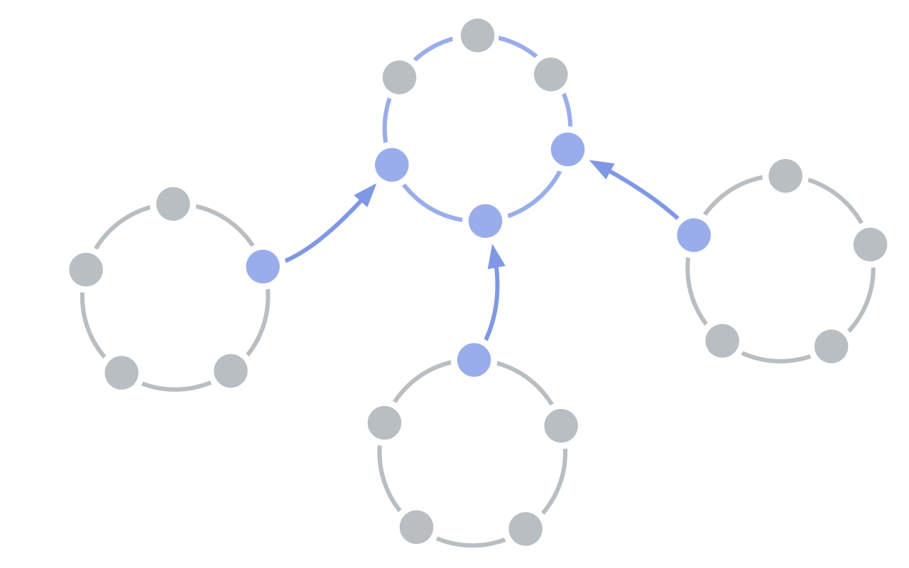

<strong>Flytta ut tjänster som behövs av två eller flera domäner.</strong>

En servicecirkel kan fyllas av medlemmar i de <a href="#" class="tooltip" title="Domän: A distinct area of influence, activity and decision making within an organization.">domäner</a> den tjänar och/eller andra personer.

<a href="organizational-structure.html" title="Up: Organisationsstruktur">▲</a> <a href="delegate-circle.html" title="Read next: Delegatscirkel">▶ Read next: Delegatscirkel</a>

