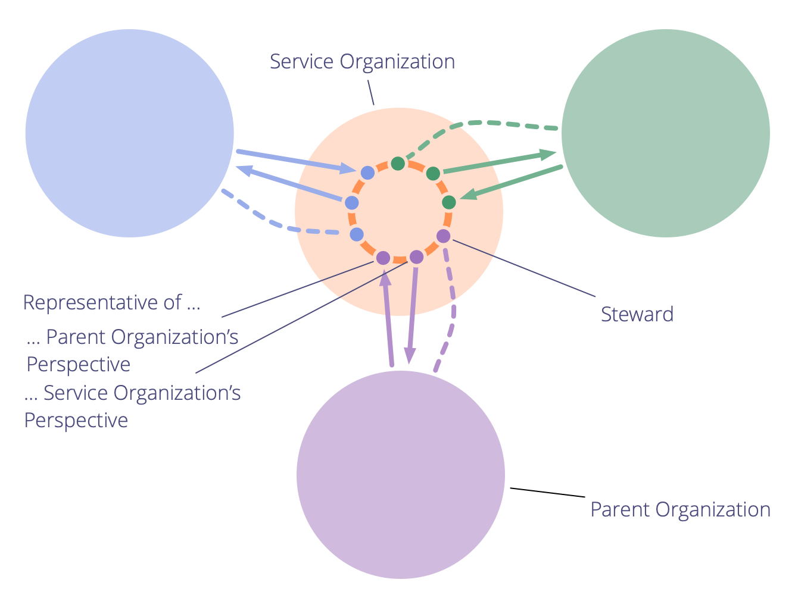

Samarbete med flera intressenter och gemensam inriktning mot en delad drivkraft (eller målbild).

- förbättrar möjligheten till likvärdighet mellan olika enheter
- ökar samstämmigheten mellan avdelningar och organisatoriska delar
- stödjer samarbete mellan avdelningar eller organisationsdelar med olika primära motiv, eller som befinner sig i konflikt
- lämplig för både enstaka projekt eller längre samarbeten

**Notera:** en serviceorganisation kallas ibland för **ryggradsorganisation**.

