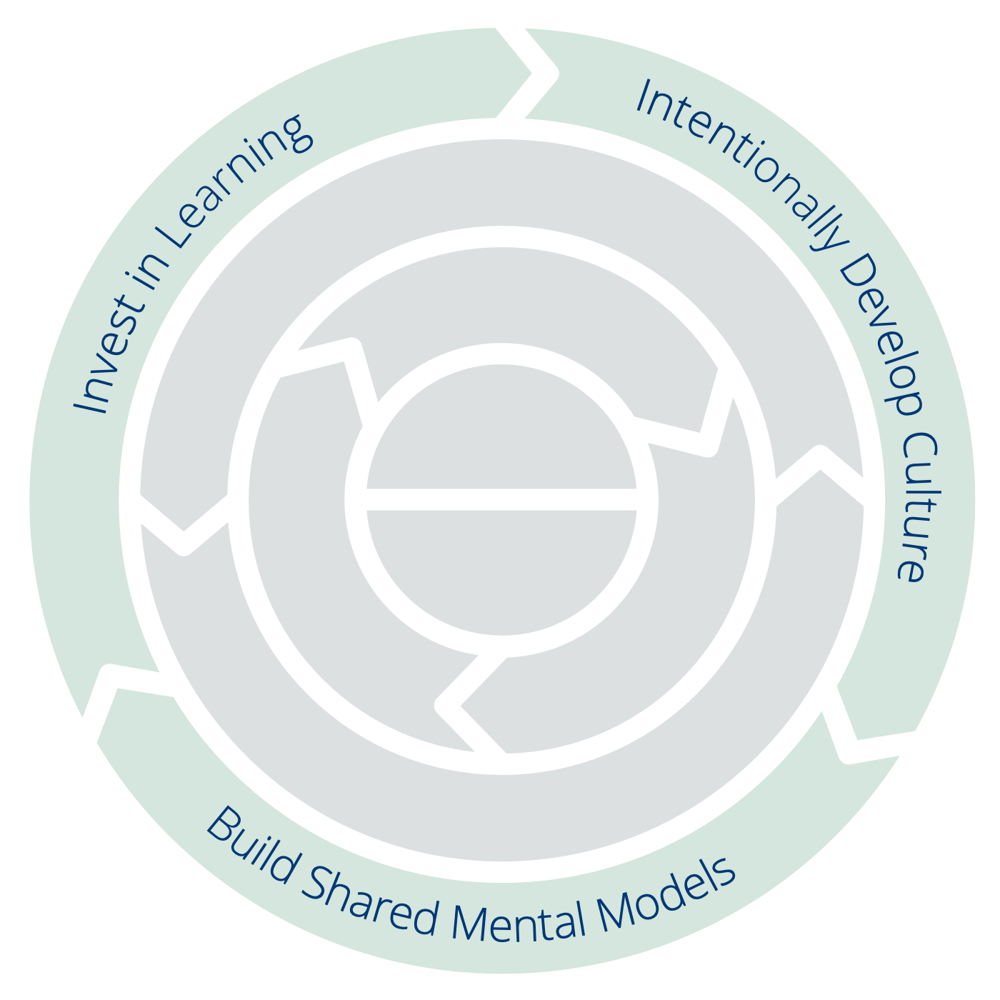

<a href="collaborate-on-dependencies.html" title="Tillbaka till: Princip 7 – Samarbeta vid beroenden">◀</a> <a href="csf.html" title="Upp: Ett ramverk för sunt förnuft i organisationer och team">▲</a> <a href="invest-in-learning.html" title="Läs vidare: Princip 8 – Satsa på lärande">▶ Läs vidare: Princip 8 – Satsa på lärande</a>

