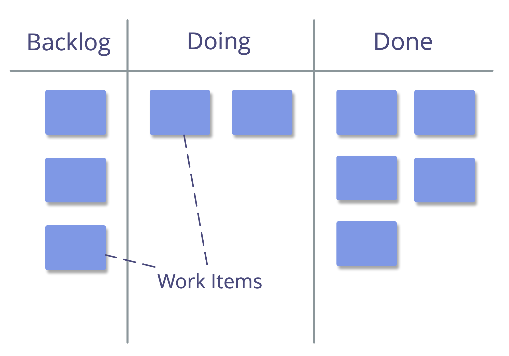

<strong>Använd ett system som gör att alla intressenter kan granska tillståndet för alla uppgifter som för närvarande väntar, pågår eller slutförts.</strong>

- värdefullt för <a href="#" class="tooltip" title="Self-Organization: Any activity or process through which people organize work. Self-organization happens within the constraints of a domain, but without the direct influence of  external agents. In any organization or team, self-organization co-exists with external influence (e.g. external objections or governance decisions that affect the domain).">självorganisation</a> och för att ta på sig arbete när det finns kapacitet
- systemet måste vara tillgängligt för alla som påverkas
- **analog:** postit-lappar på en vägg, indexkort, magneter och/eller whiteboard
- **digital:** [Trello](https://trello.com/), [Kanbanery](https://kanbanery.com/), [Leankit](https://leankit.com/), [Jira](https://www.atlassian.com/software/jira), [Google Kalkylark](https://www.google.com/sheets/about/), etc.

## Saker att synliggöra:

- **typer av uppgifter** (t.ex. kundbegäran, projektuppgifter, rapporteringsuppgifter, omarbetning)
- **startdatum** (och **förfallodatum** vid behov)
- **prioriteter**
- **stadier** av arbete (t.ex. "att göra", "pågår", "granska" och "gjort")
- hinder/blockeringar
- vem som arbetar på vad
- <a href="#" class="tooltip" title="Överenskommelse: An agreed upon guideline, process, protocol or policy designed to guide the flow of value.">överenskommelser</a> och förväntningar som väglededer arbetsflöde (t.ex. "Definiton of Done", checklistor, policy, kvalitetsstandarder)
- använd färger, symboler, markörer etc.

<a href="prioritize-backlogs.html" title="Back to: Ordna planeringslistor">◀</a> <a href="organizing-work.html" title="Up: Organisera arbete">▲</a> <a href="pull-system-for-work.html" title="Read next: Starta arbete vid ledig kapacitet">▶ Read next: Starta arbete vid ledig kapacitet</a>

