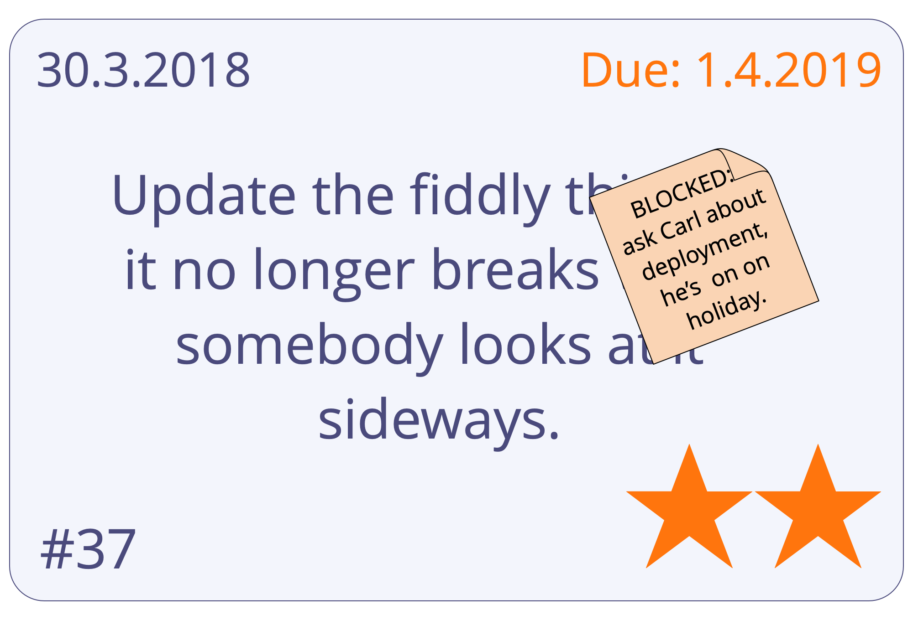

Använd ett system som gör att alla intressenter kan studera tillståndet för de uppgifter som för närvarande väntar, pågår eller slutförts.

- värdefullt för <a href="glossary.html#entry-self-organization" class="glossary-tooltip" data-toggle="tooltip" title="Självorganisering: Alla aktiviteter eller processer genom vilka människor organiserar arbete. Självorganisering sker inom begränsningarna av ett område, men utan direkt inflytande av externa agenter. I varje organisation eller grupp samexisterar självorganisation med externt inflytande (t.ex. externa invändningar eller styrningsbeslut som påverkar domänen).">självorganisering</a> och för att ta på sig arbete när det finns kapacitet
- systemet måste vara tillgängligt för alla som påverkas
- **analog:** postit-lappar på en vägg, indexkort, magneter och/eller whiteboard
- **digital:** [Trello](https://trello.com/), [Kanbanery](https://kanbanery.com/), [Leankit](https://leankit.com/), [Jira](https://www.atlassian.com/software/jira), [Google Kalkylark](https://www.google.com/sheets/about/), etc.

## Saker att synliggöra:

- **typer av uppgifter** (t.ex. kundbegäran, projektuppgifter, rapporteringsuppgifter, omarbetning)
- **startdatum** (och **förfallodatum** vid behov)
- **prioriteter**
- **stadier** av arbete (t.ex. "att göra", "pågår", "granska" och "gjort")
- hinder/blockeringar
- vem som arbetar på vad
- <a href="glossary.html#entry-agreement" class="glossary-tooltip" data-toggle="tooltip" title="Överenskommelse: En överenskommen inriktning, process, förhållningssätt eller policy som skapats för att vägleda värdeflödet.">överenskommelser</a> och förväntningar som väglededer arbetsflöde (t.ex. "Definiton of Done", checklistor, policy, kvalitetsstandarder)
- använd färger, symboler, markörer etc.

