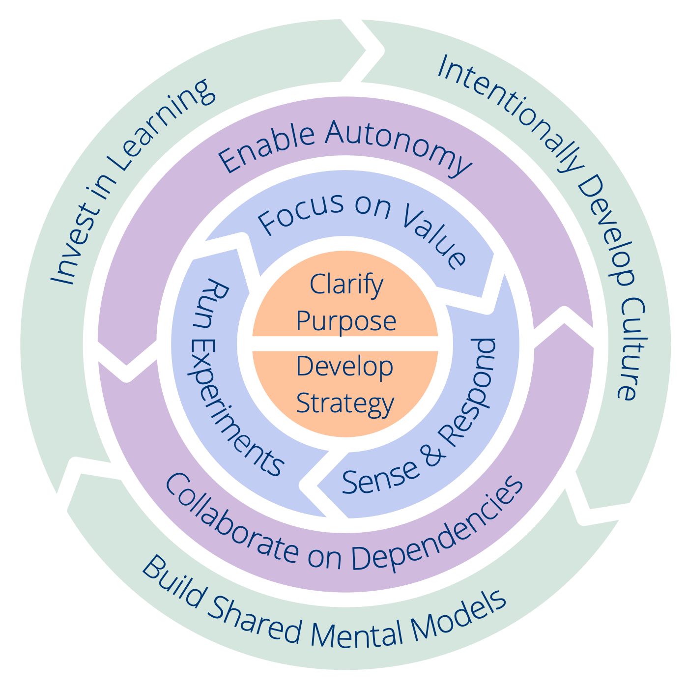

Each principle supports a specific outcome. To determine where to start in your organization or team, **take a look at the outcomes for each principle** (the text after “_so that_”) and reflect on where your greatest need lies at the moment. I vilket fall, **säkra först att organisationens eller teamets syfte och strategi är tillräckligt tydlig**.

I bilden nedan kan du se att några av principerna är mer nära besläktade än andra, det kan vara  ytterligare en hjälp till vad som är en lämplig startpunkt.

Med varje princip har vi inkluderat en lista med förslag på saker man kan prova. Förslagen är hämtade från [menyn av mönster i Sociokrati 3.0](http://patterns.sociocracy30.org). För närvarande har vi bara lagt till de viktigaste mönster som stöder varje princip, i framtida versioner av denna ram kommer vi att inkludera ännu fler mönster. 

<a href="shared-mental-models.html" title="Back to: Princip 10 – Bygg gemensamma mentala modeller">◀</a> <a href="csf.html" title="Up: A Common Sense Framework for Organizations and Teams">▲</a> <a href="appendix.html" title="Read next: Bilagor">▶ Read next: Bilagor</a>

